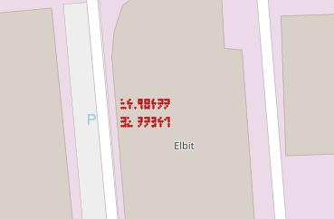

# Indiana Jones and the Coded Cave
Category: Miscellaneous

## Description
> Indiana Jones is conducting his postdoctoral research at the Technion Institute. 
> 
> Yesterday, on his way back home he bumped into a strange person who had given him a Disk On Key.
> 
> This person said to him - "The treasure is in the cave" - and vanished.
> 
> Your mission, as Dr. Jones assistants, is to help him find the treasure.
> 
> * Use Autonomos_Treasure_Hunder_ICD.docx and ATH_Tele.bin to solve this challenge
> * Use Open Street View maps (not Google maps)
> * The flag structure is cstechnion{Name_Of_The_Cave}, where Name_Of_The_Cave is the translation to English of the Hebrew name as written in Open Street View maps (for translation use google translate)

A `*.docx` and a binary file were attached.

### Specs

The document attached was an "ICD Specification" between an "Autonomous Treasure Hunter" system and a host.  According to the specs, the ATH is an unmanned platform which searches for treasures.

The specs included many redacted specifications, we'll just include what's needed to solve the challenge:

#### 3.2.2.1.2.	Message Structure
The message structure is defined in the following table and paragraphs:
| Field	| Value (Hex)	| Byte Number	| # of bytes |
|-------|---------------|---------------|------------|
| Sync	| 0xDD	        | 0	            |          1 |
|Identifier	| 0x1/0xXX/0xXX/0xXX	| 1	| 1 |
| Data		| 2-9	| 8 |
| Checksum	| See 3.2.3.1.2.3	| 10-11 |	2 |
| Total # Of Bytes	| 	| | 	12|

##### 3.2.2.1.2.1.	Synchronization Word
The beginning of each message starts with a 1 byte synchronization word identified as follows:
 * 0xDD when the message is transmitted from the ATH to the Host.
 * 0xEE when the message is transmitted from the Host to the ATH.
##### 3.2.2.1.2.2.	Identifier
The Identifier field is the sent message identifier. 
##### 3.2.2.1.2.3.	Checksum
Checksum algorithm shall be Fletcher-16. The checksum is calculated 
Both the ATH and Host shall ignore any message with a bad checksum.
The checksum is computed over the entire message, excluding the Checksum field itself
##### 3.2.2.1.2.4.	Endianess
Endianess is Least Significant Byte First as described in the following figure:


#### 3.2.2.3.	Messages Specification
| Short |	Type	| Size (Bytes) |	Comment	Min/Max	Resolution |
| --- | --- | --- | --- |
| U1	| Unsigned Char | 	1	| 	0..255	1 |
| I4	| Signed Long	| 4	| 2's complement |	-2'147'483'648..2'147'483'647 |	1 |

##### 3.2.2.3.1.	ATH_HST_01: COORDINATE_TELE
| Byte	| Name | 	Data Type	 | Value/ Units | 	Scaling |	Description | 
| --- | --- | --- | --- | --- | --- | 
| 0 |	Synchronization word	|U1	|-	|-|	0xDD |
|1|	Message ID|	U1|	-	|-	|0x01|
|2-5	|Longitude |	I4	|Deg	|1e-5|	N.E. (East = “+”) Decimal Degrees = Degrees + minutes/60 + seconds/3600
|6-9|	Latitude|	I4|	Deg	|1e-5|	N.E (North = “+”) Decimal Degrees = Degrees + minutes/60 + seconds/3600
|10-11	|Checksum|	U2|	-	|-|	

## Solution

Let's inspect the attached binary:

```console
root@kali:/media/sf_CTFs/technion/Indiana_Jones_and_the_Coded_Cave# xxd -g 1 ATH_Tele.bin | head
00000000: 05 03 06 06 00 23 8b 08 02 02 09 04 0f f1 dd 01  .....#..........
00000010: 73 58 35 00 e2 07 32 00 fb fd dd 08 4a 93 35 00  sX5...2.....J.5.
00000020: e0 ff 32 00 0c 75 dd 01 74 58 35 00 e2 07 32 00  ..2..u..tX5...2.
00000030: fc 06 dd 01 02 7a 36 00 27 0e 33 00 29 71 07 05  .....z6.'.3.)q..
00000040: 03 00 08 5e 06 dd 09 be af 36 00 d7 1e 33 00 b4  ...^.....6...3..
00000050: 25 dd 01 75 58 35 00 e2 07 32 00 fd 0e dd 0a 26  %..uX5...2.....&
00000060: 06 36 00 59 75 33 00 4c d1 dd 01 78 58 35 00 e2  .6.Yu3.L...xX5..
00000070: 07 32 00 01 26 01 02 09 04 06 51 55 dd 07 38 ef  .2..&.....QU..8.
00000080: 35 00 f5 90 32 00 fa 68 dd 01 b6 3c 36 00 16 69  5...2..h...<6..i
00000090: 33 00 f8 6b dd 01 5c c3 36 00 6a 56 33 00 79 7d  3..k..\.6.jV3.y}
```

We can see that it includes several locations which start with a `0xdd 0x01`, indicating a coordinate of type `COORDINATE_TELE` according to the specs. Other types were redacted in the document, so it's safe to assume that we need to concentrate on the coordinates.

We can parse the attached binary using the following code, which also queries an Open Street View API for coordinate details:

```python
import os
import mmap
import re
import requests
from ctypes import *

COORDINATE_TELE_PATTERN = re.compile(rb'\xdd\x01.{4}.{4}.{2}', re.DOTALL)

class coordinate_tele(LittleEndianStructure):
    _pack_ = 1
    _fields_ = [
        ('sync',           c_uint8),
        ('id',             c_uint8),
        ('_long',          c_uint32),
        ('_lat',           c_uint32),
        ('checksum',       c_uint16),
    ]

    scaling = 1e-5

    @property
    def longitude(self):
        return self._long * self.scaling

    @property
    def latitude(self):
        return self._lat * self.scaling

    def __str__(self):
        return f"CoordinateRecord({self.latitude:.6f}, {self.longitude:.6f})"

def memory_map(filename, access=mmap.ACCESS_READ):
    size = os.path.getsize(filename)
    fd = os.open(filename, os.O_RDONLY)
    return mmap.mmap(fd, size, access=access)

def get_coordinate_info(lat, long):
    r = requests.get(f"https://nominatim.openstreetmap.org/reverse?format=json&lat={lat}&lon={long}&addressdetails=1")
    return r.json()

with memory_map("ATH_Tele.bin") as b:
    for match in COORDINATE_TELE_PATTERN.findall(b):
        coordinate = coordinate_tele.from_buffer_copy(match)
        print(coordinate, end="")

        try:
            details = get_coordinate_info(coordinate.latitude, coordinate.longitude)
            if "error" in details:
                raise RuntimeError(details["error"])
            print(f" {details['display_name']} ({details['address'].get('country')})")
        except (KeyError, RuntimeError) as e:
            print (f" Unknown location ({str(e)})")
```

Output:
```console
root@kali:/media/sf_CTFs/technion/Indiana_Jones_and_the_Coded_Cave# python3 solve.py
CoordinateRecord(32.788, 34.961) Elbit, כביש חיפה רעננה, נאות פרס, חיפה, נפת חיפה, מחוז חיפה, no, ישראל (ישראל)
CoordinateRecord(32.788, 34.961) Elbit, כביש חיפה רעננה, נאות פרס, חיפה, נפת חיפה, מחוז חיפה, no, ישראל (ישראל)
CoordinateRecord(33.460, 35.702) قضاء البقاع الغربي, محافظة البقاع, 1704, لبنان (لبنان)
CoordinateRecord(32.788, 34.961) Elbit, כביש חיפה רעננה, נאות פרס, חיפה, נפת חיפה, מחוז חיפה, no, ישראל (ישראל)
CoordinateRecord(32.788, 34.961) Elbit, כביש חיפה רעננה, נאות פרס, חיפה, נפת חיפה, מחוז חיפה, no, ישראל (ישראל)
CoordinateRecord(33.692, 35.545) شواليق - دير القمر, قضاء الشوف, محافظة جبل لبنان, 1503, لبنان (لبنان)
CoordinateRecord(33.645, 35.890) حمارة, قضاء البقاع الغربي, محافظة البقاع, لبنان (لبنان)
CoordinateRecord(32.788, 34.961) Elbit, כביש חיפה רעננה, נאות פרס, חיפה, נפת חיפה, מחוז חיפה, no, ישראל (ישראל)
CoordinateRecord(33.649, 35.124) Unknown location (Unable to geocode)
CoordinateRecord(32.788, 34.961) Elbit, כביש חיפה רעננה, נאות פרס, חיפה, נפת חיפה, מחוז חיפה, no, ישראל (ישראל)
CoordinateRecord(32.788, 34.961) Elbit, כביש חיפה רעננה, נאות פרס, חיפה, נפת חיפה, מחוז חיפה, no, ישראל (ישראל)
CoordinateRecord(32.999, 35.674) מחנה צנובר, סער, בתרא, קצרין, נפת רמת הגולן, מחוז הצפון, no, ישראל (ישראל)
CoordinateRecord(32.788, 34.961) Elbit, כביש חיפה רעננה, נאות פרס, חיפה, נפת חיפה, מחוז חיפה, no, ישראל (ישראל)
CoordinateRecord(32.852, 35.246) רחוב גפן, שכניה, נפת עכו, מחוז הצפון, no, ישראל (ישראל)
CoordinateRecord(32.788, 34.961) Elbit, כביש חיפה רעננה, נאות פרס, חיפה, נפת חיפה, מחוז חיפה, no, ישראל (ישראל)
CoordinateRecord(32.788, 34.961) Elbit, כביש חיפה רעננה, נאות פרס, חיפה, נפת חיפה, מחוז חיפה, no, ישראל (ישראל)
CoordinateRecord(32.788, 34.961) Elbit, כביש חיפה רעננה, נאות פרס, חיפה, נפת חיפה, מחוז חיפה, no, ישראל (ישראל)
CoordinateRecord(32.788, 34.961) Elbit, כביש חיפה רעננה, נאות פרס, חיפה, נפת חיפה, מחוז חיפה, no, ישראל (ישראל)
CoordinateRecord(33.098, 35.959) مسحرة, ناحية خان ارنبة, منطقة القنيطرة, محافظة القنيطرة, سوريا (سوريا)
CoordinateRecord(33.408, 35.520) عرب صاليم, قضاء النبطية, محافظة النبطية, 6728, لبنان (لبنان)
CoordinateRecord(32.788, 34.961) Elbit, כביש חיפה רעננה, נאות פרס, חיפה, נפת חיפה, מחוז חיפה, no, ישראל (ישראל)
CoordinateRecord(33.508, 35.392) النواويس, عرنايا, قضاء صيدا, محافظة الجنوب, لبنان (لبنان)
CoordinateRecord(33.416, 35.021) لبنان (لبنان)
CoordinateRecord(32.849, 34.983) תחנת הכרמל, חיפה אל עתיקה, חיפה, נפת חיפה, מחוז חיפה, no, ישראל (ישראל)
CoordinateRecord(33.039, 35.924) كوم عين الباشا, ناحية الخشنية, منطقة القنيطرة, محافظة القنيطرة, سوريا (سوريا)
CoordinateRecord(33.011, 35.271) توفيق الحكيم, بنيم, بني بيتخا, מעלות תרשיחא, נפת עכו, מחוז הצפון, no, ישראל (ישראל)
CoordinateRecord(32.788, 34.961) Elbit, כביש חיפה רעננה, נאות פרס, חיפה, נפת חיפה, מחוז חיפה, no, ישראל (ישראל)
CoordinateRecord(32.788, 34.961) Elbit, כביש חיפה רעננה, נאות פרס, חיפה, נפת חיפה, מחוז חיפה, no, ישראל (ישראל)
CoordinateRecord(32.788, 34.961) Elbit, כביש חיפה רעננה, נאות פרס, חיפה, נפת חיפה, מחוז חיפה, no, ישראל (ישראל)
CoordinateRecord(32.788, 34.961) Elbit, כביש חיפה רעננה, נאות פרס, חיפה, נפת חיפה, מחוז חיפה, no, ישראל (ישראל)
CoordinateRecord(33.451, 35.797) عين حرشة, قضاء راشيا, محافظة البقاع, لبنان (لبنان)
CoordinateRecord(33.129, 35.250) شيحين, قضاء صور, محافظة الجنوب, لبنان (لبنان)
CoordinateRecord(32.788, 34.961) Elbit, כביש חיפה רעננה, נאות פרס, חיפה, נפת חיפה, מחוז חיפה, no, ישראל (ישראל)
CoordinateRecord(33.685, 35.884) دكوة, قضاء البقاع الغربي, محافظة البقاع, لبنان (لبنان)
CoordinateRecord(32.788, 34.961) Elbit, כביש חיפה רעננה, נאות פרס, חיפה, נפת חיפה, מחוז חיפה, no, ישראל (ישראל)
CoordinateRecord(33.533, 34.974) Unknown location (Unable to geocode)
CoordinateRecord(33.041, 35.302) מערת זוית, 8925, فسوطة, נפת עכו, מחוז הצפון, no, ישראל (ישראל)
CoordinateRecord(32.788, 34.961) Elbit, כביש חיפה רעננה, נאות פרס, חיפה, נפת חיפה, מחוז חיפה, no, ישראל (ישראל)
CoordinateRecord(32.959, 35.777) 122 א, ציר הנפט, מועצה אזורית גולן, נפת רמת הגולן, מחוז הצפון, no, ישראל (ישראל)
CoordinateRecord(32.788, 34.961) Elbit, כביש חיפה רעננה, נאות פרס, חיפה, נפת חיפה, מחוז חיפה, no, ישראל (ישראל)
CoordinateRecord(32.788, 34.961) Elbit, כביש חיפה רעננה, נאות פרס, חיפה, נפת חיפה, מחוז חיפה, no, ישראל (ישראל)
CoordinateRecord(32.788, 34.961) Elbit, כביש חיפה רעננה, נאות פרס, חיפה, נפת חיפה, מחוז חיפה, no, ישראל (ישראל)
CoordinateRecord(32.788, 34.961) Elbit, כביש חיפה רעננה, נאות פרס, חיפה, נפת חיפה, מחוז חיפה, no, ישראל (ישראל)
CoordinateRecord(33.261, 35.384) سلعا, قضاء صور, محافظة الجنوب, لبنان (لبنان)
CoordinateRecord(32.788, 34.961) Elbit, כביש חיפה רעננה, נאות פרס, חיפה, נפת חיפה, מחוז חיפה, no, ישראל (ישראל)
CoordinateRecord(32.788, 34.961) Elbit, כביש חיפה רעננה, נאות פרס, חיפה, נפת חיפה, מחוז חיפה, no, ישראל (ישראל)
CoordinateRecord(32.979, 35.321) פקיעין החדשה, מועצה אזורית מעלה יוסף, נפת עכו, מחוז הצפון, no, ישראל (ישראל)
CoordinateRecord(33.168, 35.743) 9799, מועצה אזורית גולן, נפת רמת הגולן, מחוז הצפון, no, ישראל (ישראל)
CoordinateRecord(32.788, 34.961) Elbit, כביש חיפה רעננה, נאות פרס, חיפה, נפת חיפה, מחוז חיפה, no, ישראל (ישראל)
CoordinateRecord(33.161, 35.392) حداثا, قضاء بنت جبيل, محافظة النبطية, 1702, لبنان (لبنان)
CoordinateRecord(32.788, 34.961) Elbit, כביש חיפה רעננה, נאות פרס, חיפה, נפת חיפה, מחוז חיפה, no, ישראל (ישראל)
CoordinateRecord(32.788, 34.961) Elbit, כביש חיפה רעננה, נאות פרס, חיפה, נפת חיפה, מחוז חיפה, no, ישראל (ישראל)
CoordinateRecord(33.581, 35.848) خربة روحا, قضاء راشيا, محافظة البقاع, لبنان (لبنان)
CoordinateRecord(33.352, 35.694) الهبارية, قضاء حاصبيا, محافظة النبطية, 1704, لبنان (لبنان)
CoordinateRecord(32.788, 34.961) Elbit, כביש חיפה רעננה, נאות פרס, חיפה, נפת חיפה, מחוז חיפה, no, ישראל (ישראל)
CoordinateRecord(32.788, 34.961) Elbit, כביש חיפה רעננה, נאות פרס, חיפה, נפת חיפה, מחוז חיפה, no, ישראל (ישראל)
CoordinateRecord(32.788, 34.961) Elbit, כביש חיפה רעננה, נאות פרס, חיפה, נפת חיפה, מחוז חיפה, no, ישראל (ישראל)
CoordinateRecord(32.788, 34.961) Elbit, כביש חיפה רעננה, נאות פרס, חיפה, נפת חיפה, מחוז חיפה, no, ישראל (ישראל)
CoordinateRecord(33.272, 35.478) عدشيت‎, قضاء مرجعيون, محافظة النبطية, لبنان (لبنان)
CoordinateRecord(32.937, 35.858) 98, מועצה אזורית גולן, נפת רמת הגולן, מחוז הצפון, no, ישראל (ישראל)
CoordinateRecord(33.084, 35.914) Zubaydah (East), ناحية القنيطرة, منطقة القنيطرة, محافظة القنيطرة, سوريا (سوريا)
CoordinateRecord(33.642, 35.374) صيدا, قضاء صيدا, محافظة الجنوب, 1600, لبنان (لبنان)
CoordinateRecord(33.006, 35.228) 8833, עין יעקב, נפת עכו, מחוז הצפון, no, ישראל (ישראל)
CoordinateRecord(32.788, 34.961) Elbit, כביש חיפה רעננה, נאות פרס, חיפה, נפת חיפה, מחוז חיפה, no, ישראל (ישראל)
CoordinateRecord(32.788, 34.961) Elbit, כביש חיפה רעננה, נאות פרס, חיפה, נפת חיפה, מחוז חיפה, no, ישראל (ישראל)
CoordinateRecord(33.509, 35.442) كفر حتى, قضاء صيدا, محافظة الجنوب, لبنان (لبنان)
CoordinateRecord(32.788, 34.961) Elbit, כביש חיפה רעננה, נאות פרס, חיפה, נפת חיפה, מחוז חיפה, no, ישראל (ישראל)
CoordinateRecord(32.788, 34.961) Elbit, כביש חיפה רעננה, נאות פרס, חיפה, נפת חיפה, מחוז חיפה, no, ישראל (ישראל)
CoordinateRecord(32.881, 35.047) ישראל (ישראל)
CoordinateRecord(32.788, 34.961) Elbit, כביש חיפה רעננה, נאות פרס, חיפה, נפת חיפה, מחוז חיפה, no, ישראל (ישראל)
CoordinateRecord(32.788, 34.961) Elbit, כביש חיפה רעננה, נאות פרס, חיפה, נפת חיפה, מחוז חיפה, no, ישראל (ישראל)
CoordinateRecord(33.675, 35.073) Unknown location (Unable to geocode)
CoordinateRecord(32.788, 34.961) Elbit, כביש חיפה רעננה, נאות פרס, חיפה, נפת חיפה, מחוז חיפה, no, ישראל (ישראל)
CoordinateRecord(33.594, 35.615) باتر, قضاء الشوف, محافظة جبل لبنان, لبنان (لبنان)
CoordinateRecord(33.282, 35.074) صور, قضاء صور, محافظة الجنوب, 1601, لبنان (لبنان)
CoordinateRecord(33.246, 35.608) מועצה אזורית גליל עליון, נפת צפת, מחוז הצפון, no, ישראל (ישראל)
CoordinateRecord(32.788, 34.961) Elbit, כביש חיפה רעננה, נאות פרס, חיפה, נפת חיפה, מחוז חיפה, no, ישראל (ישראל)
CoordinateRecord(33.147, 35.700) 123, 959, ברוכים, מועצה אזורית גולן, נפת רמת הגולן, מחוז הצפון, no, ישראל (ישראל)
CoordinateRecord(33.557, 35.208) لبنان (لبنان)
CoordinateRecord(32.788, 34.961) Elbit, כביש חיפה רעננה, נאות פרס, חיפה, נפת חיפה, מחוז חיפה, no, ישראל (ישראל)
CoordinateRecord(33.187, 35.107) صور, قضاء صور, محافظة الجنوب, 1601, لبنان (لبنان)
CoordinateRecord(33.765, 35.594) كفر عمي, قضاء عاليه, محافظة جبل لبنان, 1501, لبنان (لبنان)
CoordinateRecord(33.648, 35.260) صيدا, قضاء صيدا, محافظة الجنوب, 1600, لبنان (لبنان)
CoordinateRecord(32.788, 34.961) Elbit, כביש חיפה רעננה, נאות פרס, חיפה, נפת חיפה, מחוז חיפה, no, ישראל (ישראל)
CoordinateRecord(33.312, 35.453) علمان‎, قضاء النبطية, محافظة النبطية, لبنان (لبنان)
CoordinateRecord(33.232, 35.607) מעיין ברוך, מועצה אזורית גליל עליון, נפת צפת, מחוז הצפון, no, ישראל (ישראל)
CoordinateRecord(33.680, 35.920) الصويري, قضاء البقاع الغربي, محافظة البقاع, لبنان (لبنان)
CoordinateRecord(33.437, 35.383) مروانية, قضاء صيدا, محافظة الجنوب, لبنان (لبنان)
CoordinateRecord(32.791, 35.185) شفا عمرو, נפת עכו, מחוז הצפון, no, ישראל (ישראל)
CoordinateRecord(32.882, 35.305) 8056, מועצה אזורית משגב, נפת עכו, מחוז הצפון, no, ישראל (ישראל)
CoordinateRecord(33.380, 35.930) عين الشعرة, ناحية بيت جن, منطقة قطنا, محافظة ريف دمشق, سوريا (سوريا)
CoordinateRecord(32.989, 35.861) מועצה אזורית גולן, נפת רמת הגולן, מחוז הצפון, no, ישראל (ישראל)
CoordinateRecord(32.788, 34.961) Elbit, כביש חיפה רעננה, נאות פרס, חיפה, נפת חיפה, מחוז חיפה, no, ישראל (ישראל)
CoordinateRecord(32.788, 34.961) Elbit, כביש חיפה רעננה, נאות פרס, חיפה, נפת חיפה, מחוז חיפה, no, ישראל (ישראל)
CoordinateRecord(33.624, 35.695) عين زبدة, قضاء البقاع الغربي, محافظة البقاع, لبنان (لبنان)
CoordinateRecord(33.151, 35.884) صمدانية, ناحية القنيطرة, منطقة القنيطرة, محافظة القنيطرة, سوريا (سوريا)
CoordinateRecord(33.275, 35.348) باريش, قضاء صور, محافظة الجنوب, لبنان (لبنان)
CoordinateRecord(32.788, 34.961) Elbit, כביש חיפה רעננה, נאות פרס, חיפה, נפת חיפה, מחוז חיפה, no, ישראל (ישראל)
CoordinateRecord(32.966, 35.149) 70, أبو سنان, נפת עכו, מחוז הצפון, no, ישראל (ישראל)
CoordinateRecord(32.788, 34.961) Elbit, כביש חיפה רעננה, נאות פרס, חיפה, נפת חיפה, מחוז חיפה, no, ישראל (ישראל)
CoordinateRecord(32.788, 34.961) Elbit, כביש חיפה רעננה, נאות פרס, חיפה, נפת חיפה, מחוז חיפה, no, ישראל (ישראל)
CoordinateRecord(32.788, 34.961) Elbit, כביש חיפה רעננה, נאות פרס, חיפה, נפת חיפה, מחוז חיפה, no, ישראל (ישראל)
CoordinateRecord(32.788, 34.961) Elbit, כביש חיפה רעננה, נאות פרס, חיפה, נפת חיפה, מחוז חיפה, no, ישראל (ישראל)
CoordinateRecord(32.994, 35.775) 87, מועצה אזורית גולן, נפת רמת הגולן, מחוז הצפון, no, ישראל (ישראל)
CoordinateRecord(33.516, 35.425) طنبوريت, قضاء صيدا, محافظة الجنوب, لبنان (لبنان)
CoordinateRecord(32.788, 34.961) Elbit, כביש חיפה רעננה, נאות פרס, חיפה, נפת חיפה, מחוז חיפה, no, ישראל (ישראל)
CoordinateRecord(33.324, 35.892) بيت جن, ناحية بيت جن, منطقة قطنا, محافظة ريف دمشق, سوريا (سوريا)
CoordinateRecord(32.788, 34.961) Elbit, כביש חיפה רעננה, נאות פרס, חיפה, נפת חיפה, מחוז חיפה, no, ישראל (ישראל)
CoordinateRecord(33.308, 35.255) عين أبو عبد الله, قضاء صور, محافظة الجنوب, لبنان (لبنان)
CoordinateRecord(33.533, 35.001) Unknown location (Unable to geocode)
CoordinateRecord(32.892, 35.248) شعب‎, נפת עכו, מחוז הצפון, no, ישראל (ישראל)
CoordinateRecord(32.788, 34.961) Elbit, כביש חיפה רעננה, נאות פרס, חיפה, נפת חיפה, מחוז חיפה, no, ישראל (ישראל)
CoordinateRecord(33.768, 35.937) الفوعة, قضاء زحلة, محافظة البقاع, لبنان (لبنان)
CoordinateRecord(32.788, 34.961) Elbit, כביש חיפה רעננה, נאות פרס, חיפה, נפת חיפה, מחוז חיפה, no, ישראל (ישראל)
CoordinateRecord(33.148, 35.503) محيبيب, قضاء مرجعيون, محافظة النبطية, لبنان (لبنان)
CoordinateRecord(32.788, 34.961) Elbit, כביש חיפה רעננה, נאות פרס, חיפה, נפת חיפה, מחוז חיפה, no, ישראל (ישראל)
CoordinateRecord(32.788, 34.961) Elbit, כביש חיפה רעננה, נאות פרס, חיפה, נפת חיפה, מחוז חיפה, no, ישראל (ישראל)
CoordinateRecord(33.100, 35.054) אי תכלת, ישראל (ישראל)
CoordinateRecord(33.701, 35.636) كفر نبرخ‎, قضاء الشوف, محافظة جبل لبنان, 1503, لبنان (لبنان)
CoordinateRecord(32.788, 34.961) Elbit, כביש חיפה רעננה, נאות פרס, חיפה, נפת חיפה, מחוז חיפה, no, ישראל (ישראל)
CoordinateRecord(32.957, 35.240) 8533, يركا, נפת עכו, מחוז הצפון, no, ישראל (ישראל)
CoordinateRecord(32.788, 34.961) Elbit, כביש חיפה רעננה, נאות פרס, חיפה, נפת חיפה, מחוז חיפה, no, ישראל (ישראל)
CoordinateRecord(32.788, 34.961) Elbit, כביש חיפה רעננה, נאות פרס, חיפה, נפת חיפה, מחוז חיפה, no, ישראל (ישראל)
CoordinateRecord(33.307, 35.375) شحور, قضاء صور, محافظة الجنوب, لبنان (لبنان)
CoordinateRecord(32.788, 34.961) Elbit, כביש חיפה רעננה, נאות פרס, חיפה, נפת חיפה, מחוז חיפה, no, ישראל (ישראל)
CoordinateRecord(32.788, 34.961) Elbit, כביש חיפה רעננה, נאות פרס, חיפה, נפת חיפה, מחוז חיפה, no, ישראל (ישראל)
CoordinateRecord(33.363, 34.991) لبنان (لبنان)
CoordinateRecord(33.068, 35.448) מועצה אזורית גליל עליון, נפת צפת, מחוז הצפון, no, ישראל (ישראל)
CoordinateRecord(32.891, 35.872) ناحية الخشنية, منطقة القنيطرة, محافظة القنيطرة, سوريا (سوريا)
CoordinateRecord(33.303, 35.332) حلوسية, قضاء صور, محافظة الجنوب, لبنان (لبنان)
CoordinateRecord(32.788, 34.961) Elbit, כביש חיפה רעננה, נאות פרס, חיפה, נפת חיפה, מחוז חיפה, no, ישראל (ישראל)
CoordinateRecord(32.788, 34.961) Elbit, כביש חיפה רעננה, נאות פרס, חיפה, נפת חיפה, מחוז חיפה, no, ישראל (ישראל)
CoordinateRecord(33.709, 35.156) Unknown location (Unable to geocode)
CoordinateRecord(32.788, 34.961) Elbit, כביש חיפה רעננה, נאות פרס, חיפה, נפת חיפה, מחוז חיפה, no, ישראל (ישראל)
CoordinateRecord(32.788, 34.961) Elbit, כביש חיפה רעננה, נאות פרס, חיפה, נפת חיפה, מחוז חיפה, no, ישראל (ישראל)
CoordinateRecord(32.788, 34.961) Elbit, כביש חיפה רעננה, נאות פרס, חיפה, נפת חיפה, מחוז חיפה, no, ישראל (ישראל)
CoordinateRecord(32.788, 34.961) Elbit, כביש חיפה רעננה, נאות פרס, חיפה, נפת חיפה, מחוז חיפה, no, ישראל (ישראל)
CoordinateRecord(32.788, 34.961) Elbit, כביש חיפה רעננה, נאות פרס, חיפה, נפת חיפה, מחוז חיפה, no, ישראל (ישראל)
CoordinateRecord(32.788, 34.961) Elbit, כביש חיפה רעננה, נאות פרס, חיפה, נפת חיפה, מחוז חיפה, no, ישראל (ישראל)
CoordinateRecord(32.788, 34.961) Elbit, כביש חיפה רעננה, נאות פרס, חיפה, נפת חיפה, מחוז חיפה, no, ישראל (ישראל)
CoordinateRecord(32.788, 34.961) Elbit, כביש חיפה רעננה, נאות פרס, חיפה, נפת חיפה, מחוז חיפה, no, ישראל (ישראל)
CoordinateRecord(33.323, 35.403) كفر صير, قضاء النبطية, محافظة النبطية, لبنان (لبنان)
CoordinateRecord(32.788, 34.961) Elbit, כביש חיפה רעננה, נאות פרס, חיפה, נפת חיפה, מחוז חיפה, no, ישראל (ישראל)
CoordinateRecord(32.788, 34.961) Elbit, כביש חיפה רעננה, נאות פרס, חיפה, נפת חיפה, מחוז חיפה, no, ישראל (ישראל)
CoordinateRecord(32.788, 34.961) Elbit, כביש חיפה רעננה, נאות פרס, חיפה, נפת חיפה, מחוז חיפה, no, ישראל (ישראל)
CoordinateRecord(32.881, 35.727) מועצה אזורית גולן, נפת רמת הגולן, מחוז הצפון, ישראל (ישראל)
CoordinateRecord(32.934, 35.402) عين الأسد, מועצה אזורית מרום הגליל, נפת צפת, מחוז הצפון, no, ישראל (ישראל)
CoordinateRecord(33.294, 35.284) العباسية, قضاء صور, محافظة الجنوب, لبنان (لبنان)
CoordinateRecord(32.788, 34.961) Elbit, כביש חיפה רעננה, נאות פרס, חיפה, נפת חיפה, מחוז חיפה, no, ישראל (ישראל)
CoordinateRecord(32.788, 34.961) Elbit, כביש חיפה רעננה, נאות פרס, חיפה, נפת חיפה, מחוז חיפה, no, ישראל (ישראל)
CoordinateRecord(32.788, 34.961) Elbit, כביש חיפה רעננה, נאות פרס, חיפה, נפת חיפה, מחוז חיפה, no, ישראל (ישראל)
CoordinateRecord(32.788, 34.961) Elbit, כביש חיפה רעננה, נאות פרס, חיפה, נפת חיפה, מחוז חיפה, no, ישראל (ישראל)
CoordinateRecord(33.129, 35.693) 123, 959, ברוכים, מועצה אזורית גולן, נפת רמת הגולן, מחוז הצפון, no, ישראל (ישראל)
CoordinateRecord(33.755, 35.243) لبنان (لبنان)
CoordinateRecord(32.788, 34.961) Elbit, כביש חיפה רעננה, נאות פרס, חיפה, נפת חיפה, מחוז חיפה, no, ישראל (ישראל)
CoordinateRecord(33.406, 35.402) النبطية, قضاء النبطية, محافظة النبطية, 1700, لبنان (لبنان)
CoordinateRecord(33.219, 35.845) خان أرنبة, ناحية خان ارنبة, منطقة القنيطرة, محافظة القنيطرة, سوريا (سوريا)
CoordinateRecord(32.788, 34.961) Elbit, כביש חיפה רעננה, נאות פרס, חיפה, נפת חיפה, מחוז חיפה, no, ישראל (ישראל)
CoordinateRecord(33.089, 35.322) מועצה אזורית מעלה יוסף, נפת עכו, מחוז הצפון, no, ישראל (ישראל)
CoordinateRecord(33.161, 35.360) الغربية, صربين, قضاء بنت جبيل, محافظة النبطية, لبنان (لبنان)
CoordinateRecord(33.373, 35.836) ناحية خان ارنبة, منطقة القنيطرة, محافظة القنيطرة, سوريا (سوريا)
CoordinateRecord(32.788, 34.961) Elbit, כביש חיפה רעננה, נאות פרס, חיפה, נפת חיפה, מחוז חיפה, no, ישראל (ישראל)
CoordinateRecord(33.617, 35.698) Ain Zebdeh Main Road, عين زبدة, قضاء البقاع الغربي, محافظة البقاع, لبنان (لبنان)
CoordinateRecord(32.788, 34.961) Elbit, כביש חיפה רעננה, נאות פרס, חיפה, נפת חיפה, מחוז חיפה, no, ישראל (ישראל)
CoordinateRecord(32.788, 34.961) Elbit, כביש חיפה רעננה, נאות פרס, חיפה, נפת חיפה, מחוז חיפה, no, ישראל (ישראל)
CoordinateRecord(32.788, 34.961) Elbit, כביש חיפה רעננה, נאות פרס, חיפה, נפת חיפה, מחוז חיפה, no, ישראל (ישראל)
CoordinateRecord(32.873, 35.535) 90, טבח'ה, מועצה אזורית עמק הירדן, נפת כנרת, מחוז הצפון, no, ישראל (ישראל)
CoordinateRecord(32.990, 35.489) 886, מועצה אזורית מרום הגליל, נפת צפת, מחוז הצפון, no, ישראל (ישראל)
CoordinateRecord(33.557, 35.316) صيدا, قضاء صيدا, محافظة الجنوب, 1600, لبنان (لبنان)
CoordinateRecord(32.788, 34.961) Elbit, כביש חיפה רעננה, נאות פרס, חיפה, נפת חיפה, מחוז חיפה, no, ישראל (ישראל)
CoordinateRecord(32.788, 34.961) Elbit, כביש חיפה רעננה, נאות פרס, חיפה, נפת חיפה, מחוז חיפה, no, ישראל (ישראל)
CoordinateRecord(32.848, 35.164) 70, طمرة‎, נפת עכו, מחוז הצפון, no, ישראל (ישראל)
CoordinateRecord(32.788, 34.961) Elbit, כביש חיפה רעננה, נאות פרס, חיפה, נפת חיפה, מחוז חיפה, no, ישראל (ישראל)
CoordinateRecord(32.899, 35.301) עבירות קשה, מועצה אזורית משגב, נפת עכו, מחוז הצפון, no, ישראל (ישראל)
CoordinateRecord(32.964, 35.570) الزنغرية, طوبا الزنغرية, נפת צפת, מחוז הצפון, no, ישראל (ישראל)
CoordinateRecord(32.788, 34.961) Elbit, כביש חיפה רעננה, נאות פרס, חיפה, נפת חיפה, מחוז חיפה, no, ישראל (ישראל)
CoordinateRecord(33.606, 35.183) لبنان (لبنان)
CoordinateRecord(32.788, 34.961) Elbit, כביש חיפה רעננה, נאות פרס, חיפה, נפת חיפה, מחוז חיפה, no, ישראל (ישראל)
CoordinateRecord(33.520, 35.300) قضاء صيدا, العدوسية, قضاء صيدا, محافظة الجنوب, لبنان (لبنان)
CoordinateRecord(33.316, 35.068) صور, قضاء صور, محافظة الجنوب, 1601, لبنان (لبنان)
CoordinateRecord(32.788, 34.961) Elbit, כביש חיפה רעננה, נאות פרס, חיפה, נפת חיפה, מחוז חיפה, no, ישראל (ישראל)
CoordinateRecord(33.624, 35.949) ينطا, قضاء راشيا, محافظة البقاع, لبنان (لبنان)
CoordinateRecord(32.799, 35.252) 784, كفر مندا, נפת יזרעאל, מחוז הצפון, no, ישראל (ישראל)
CoordinateRecord(33.139, 35.696) ברוכים, מועצה אזורית גולן, נפת רמת הגולן, מחוז הצפון, ישראל (ישראל)
CoordinateRecord(32.898, 35.346) الكمانة الشرقية, الكمانة, מועצה אזורית משגב, נפת עכו, מחוז הצפון, no, ישראל (ישראל)
CoordinateRecord(33.513, 35.280) صيدا, قضاء صيدا, محافظة الجنوب, 1600, لبنان (لبنان)
CoordinateRecord(33.657, 35.884) farooj al-asayle, مصنع - طريق راشيا, المصنع, مجدل عنجر, قضاء البقاع الغربي, محافظة البقاع, لبنان (لبنان)
CoordinateRecord(32.854, 35.358) عرابة, נפת כנרת, מחוז הצפון, ישראל (ישראל)
CoordinateRecord(32.788, 34.961) Elbit, כביש חיפה רעננה, נאות פרס, חיפה, נפת חיפה, מחוז חיפה, no, ישראל (ישראל)
CoordinateRecord(32.788, 34.961) Elbit, כביש חיפה רעננה, נאות פרס, חיפה, נפת חיפה, מחוז חיפה, no, ישראל (ישראל)
CoordinateRecord(32.887, 35.864) صيدا - الجولان, ناحية الخشنية, منطقة القنيطرة, محافظة القنيطرة, سوريا (سوريا)
CoordinateRecord(33.013, 35.711) מועצה אזורית גולן, נפת רמת הגולן, מחוז הצפון, ישראל (ישראל)
CoordinateRecord(33.475, 35.465) صربا, قضاء النبطية, محافظة النبطية, 1600, لبنان (لبنان)
CoordinateRecord(32.835, 35.349) הבקעה, אבטליון, נפת עכו, מחוז הצפון, no, ישראל (ישראל)
CoordinateRecord(32.788, 34.961) Elbit, כביש חיפה רעננה, נאות פרס, חיפה, נפת חיפה, מחוז חיפה, no, ישראל (ישראל)
CoordinateRecord(32.832, 35.333) 7955, מועצה אזורית משגב, נפת עכו, מחוז הצפון, no, ישראל (ישראל)
CoordinateRecord(33.709, 35.706) Fraidis, قضاء الشوف, محافظة جبل لبنان, لبنان (لبنان)
CoordinateRecord(32.926, 35.845) חאן אורחה - חאן ג'וּחָאדֶר, 98, מועצה אזורית גולן, נפת רמת הגולן, מחוז הצפון, no, ישראל (ישראל)
CoordinateRecord(33.489, 35.224) لبنان (لبنان)
CoordinateRecord(33.215, 35.482) مجدل سلم, قضاء مرجعيون, محافظة النبطية, لبنان (لبنان)
CoordinateRecord(32.788, 34.961) Elbit, כביש חיפה רעננה, נאות פרס, חיפה, נפת חיפה, מחוז חיפה, no, ישראל (ישראל)
CoordinateRecord(33.694, 35.830) Chebreqiyet Aammiq, قضاء البقاع الغربي, محافظة البقاع, لبنان (لبنان)
CoordinateRecord(33.462, 35.043) لبنان (لبنان)
CoordinateRecord(32.794, 35.923) Sahem el Jaulan, سحم الجولان, ناحية الشجرة, منطقة درعا, محافظة درعا, سوريا (سوريا)
CoordinateRecord(32.788, 34.961) Elbit, כביש חיפה רעננה, נאות פרס, חיפה, נפת חיפה, מחוז חיפה, no, ישראל (ישראל)
CoordinateRecord(32.788, 34.961) Elbit, כביש חיפה רעננה, נאות פרס, חיפה, נפת חיפה, מחוז חיפה, no, ישראל (ישראל)
CoordinateRecord(32.788, 34.961) Elbit, כביש חיפה רעננה, נאות פרס, חיפה, נפת חיפה, מחוז חיפה, no, ישראל (ישראל)
CoordinateRecord(32.788, 34.961) Elbit, כביש חיפה רעננה, נאות פרס, חיפה, נפת חיפה, מחוז חיפה, no, ישראל (ישראל)
CoordinateRecord(32.926, 35.940) غدير البستان, ناحية الخشنية, منطقة القنيطرة, محافظة القنيطرة, سوريا (سوريا)
CoordinateRecord(32.788, 34.961) Elbit, כביש חיפה רעננה, נאות פרס, חיפה, נפת חיפה, מחוז חיפה, no, ישראל (ישראל)
CoordinateRecord(32.788, 34.961) Elbit, כביש חיפה רעננה, נאות פרס, חיפה, נפת חיפה, מחוז חיפה, no, ישראל (ישראל)
CoordinateRecord(32.788, 34.961) Elbit, כביש חיפה רעננה, נאות פרס, חיפה, נפת חיפה, מחוז חיפה, no, ישראל (ישראל)
CoordinateRecord(32.788, 34.961) Elbit, כביש חיפה רעננה, נאות פרס, חיפה, נפת חיפה, מחוז חיפה, no, ישראל (ישראל)
CoordinateRecord(32.788, 34.961) Elbit, כביש חיפה רעננה, נאות פרס, חיפה, נפת חיפה, מחוז חיפה, no, ישראל (ישראל)
CoordinateRecord(32.788, 34.961) Elbit, כביש חיפה רעננה, נאות פרס, חיפה, נפת חיפה, מחוז חיפה, no, ישראל (ישראל)
CoordinateRecord(32.788, 34.961) Elbit, כביש חיפה רעננה, נאות פרס, חיפה, נפת חיפה, מחוז חיפה, no, ישראל (ישראל)
CoordinateRecord(33.215, 35.077) صور, قضاء صور, محافظة الجنوب, 1601, لبنان (لبنان)
CoordinateRecord(32.788, 34.961) Elbit, כביש חיפה רעננה, נאות פרס, חיפה, נפת חיפה, מחוז חיפה, no, ישראל (ישראל)
CoordinateRecord(32.788, 34.961) Elbit, כביש חיפה רעננה, נאות פרס, חיפה, נפת חיפה, מחוז חיפה, no, ישראל (ישראל)
CoordinateRecord(32.788, 34.961) Elbit, כביש חיפה רעננה, נאות פרס, חיפה, נפת חיפה, מחוז חיפה, no, ישראל (ישראל)
CoordinateRecord(33.284, 35.440) القصير, قضاء مرجعيون, محافظة النبطية, لبنان (لبنان)
CoordinateRecord(32.788, 34.961) Elbit, כביש חיפה רעננה, נאות פרס, חיפה, נפת חיפה, מחוז חיפה, no, ישראל (ישראל)
CoordinateRecord(33.634, 35.800) جب جنين, قضاء البقاع الغربي, محافظة البقاع, لبنان (لبنان)
CoordinateRecord(32.788, 34.961) Elbit, כביש חיפה רעננה, נאות פרס, חיפה, נפת חיפה, מחוז חיפה, no, ישראל (ישראל)
CoordinateRecord(32.788, 34.961) Elbit, כביש חיפה רעננה, נאות פרס, חיפה, נפת חיפה, מחוז חיפה, no, ישראל (ישראל)
CoordinateRecord(32.788, 34.961) Elbit, כביש חיפה רעננה, נאות פרס, חיפה, נפת חיפה, מחוז חיפה, no, ישראל (ישראל)
CoordinateRecord(32.788, 34.961) Elbit, כביש חיפה רעננה, נאות פרס, חיפה, נפת חיפה, מחוז חיפה, no, ישראל (ישראל)
CoordinateRecord(33.337, 35.836) ناحية خان ارنبة, منطقة القنيطرة, محافظة القنيطرة, سوريا (سوريا)
CoordinateRecord(32.999, 34.989) איי שוניות אכזיב, 22100, ישראל (ישראל)
CoordinateRecord(33.299, 34.998) لبنان (لبنان)
CoordinateRecord(32.788, 34.961) Elbit, כביש חיפה רעננה, נאות פרס, חיפה, נפת חיפה, מחוז חיפה, no, ישראל (ישראל)
CoordinateRecord(33.648, 35.761) Kefraya - Jeb Jannine Road, كفريا, قضاء البقاع الغربي, محافظة البقاع, لبنان (لبنان)
CoordinateRecord(33.747, 35.365) لبنان (لبنان)
CoordinateRecord(33.735, 35.325) لبنان (لبنان)
CoordinateRecord(33.448, 35.419) عزة, قضاء النبطية, محافظة النبطية, لبنان (لبنان)
CoordinateRecord(33.283, 35.578) עיון, מטולה, נפת צפת, מחוז הצפון, no, ישראל (ישראל)
CoordinateRecord(33.619, 35.452) كترمايا, قضاء الشوف, محافظة جبل لبنان, لبنان (لبنان)
CoordinateRecord(32.788, 34.961) Elbit, כביש חיפה רעננה, נאות פרס, חיפה, נפת חיפה, מחוז חיפה, no, ישראל (ישראל)
CoordinateRecord(32.788, 34.961) Elbit, כביש חיפה רעננה, נאות פרס, חיפה, נפת חיפה, מחוז חיפה, no, ישראל (ישראל)
CoordinateRecord(33.228, 34.962) لبنان (لبنان)
CoordinateRecord(32.788, 34.961) Elbit, כביש חיפה רעננה, נאות פרס, חיפה, נפת חיפה, מחוז חיפה, no, ישראל (ישראל)
CoordinateRecord(32.852, 35.304) مرسان, سخنين, נפת עכו, מחוז הצפון, no, ישראל (ישראל)
CoordinateRecord(33.325, 35.324) قضاء صور, محافظة الجنوب, لبنان (لبنان)
CoordinateRecord(33.709, 35.018) Unknown location (Unable to geocode)
CoordinateRecord(32.788, 34.961) Elbit, כביש חיפה רעננה, נאות פרס, חיפה, נפת חיפה, מחוז חיפה, no, ישראל (ישראל)
CoordinateRecord(32.788, 34.961) Elbit, כביש חיפה רעננה, נאות פרס, חיפה, נפת חיפה, מחוז חיפה, no, ישראל (ישראל)
CoordinateRecord(33.763, 35.578) مجدليا, قضاء عاليه, محافظة جبل لبنان, لبنان (لبنان)
CoordinateRecord(32.788, 34.961) Elbit, כביש חיפה רעננה, נאות פרס, חיפה, נפת חיפה, מחוז חיפה, no, ישראל (ישראל)
CoordinateRecord(32.788, 34.961) Elbit, כביש חיפה רעננה, נאות פרס, חיפה, נפת חיפה, מחוז חיפה, no, ישראל (ישראל)
CoordinateRecord(33.484, 35.889) ايحه, قضاء راشيا, محافظة البقاع, لبنان (لبنان)
CoordinateRecord(32.788, 34.961) Elbit, כביש חיפה רעננה, נאות פרס, חיפה, נפת חיפה, מחוז חיפה, no, ישראל (ישראל)
CoordinateRecord(32.788, 34.961) Elbit, כביש חיפה רעננה, נאות פרס, חיפה, נפת חיפה, מחוז חיפה, no, ישראל (ישראל)
CoordinateRecord(32.788, 34.961) Elbit, כביש חיפה רעננה, נאות פרס, חיפה, נפת חיפה, מחוז חיפה, no, ישראל (ישראל)
CoordinateRecord(33.672, 35.832) غزة, قضاء البقاع الغربي, محافظة البقاع, لبنان (لبنان)
CoordinateRecord(33.768, 35.246) لبنان (لبنان)
CoordinateRecord(32.788, 34.961) Elbit, כביש חיפה רעננה, נאות פרס, חיפה, נפת חיפה, מחוז חיפה, no, ישראל (ישראל)
CoordinateRecord(32.788, 34.961) Elbit, כביש חיפה רעננה, נאות פרס, חיפה, נפת חיפה, מחוז חיפה, no, ישראל (ישראל)
CoordinateRecord(33.508, 35.174) لبنان (لبنان)
CoordinateRecord(33.377, 35.334) قضاء النبطية, محافظة النبطية, لبنان (لبنان)
CoordinateRecord(32.788, 34.961) Elbit, כביש חיפה רעננה, נאות פרס, חיפה, נפת חיפה, מחוז חיפה, no, ישראל (ישראל)
CoordinateRecord(32.788, 34.961) Elbit, כביש חיפה רעננה, נאות פרס, חיפה, נפת חיפה, מחוז חיפה, no, ישראל (ישראל)
CoordinateRecord(32.788, 34.961) Elbit, כביש חיפה רעננה, נאות פרס, חיפה, נפת חיפה, מחוז חיפה, no, ישראל (ישראל)
CoordinateRecord(32.788, 34.961) Elbit, כביש חיפה רעננה, נאות פרס, חיפה, נפת חיפה, מחוז חיפה, no, ישראל (ישראל)
CoordinateRecord(32.788, 34.961) Elbit, כביש חיפה רעננה, נאות פרס, חיפה, נפת חיפה, מחוז חיפה, no, ישראל (ישראל)
```

We can see many coordinates pointing to Elbit - which is a good sign since this challenge was written by Elbit. We also see the following record:

```
CoordinateRecord(33.041, 35.302) מערת זוית, 8925, فسوطة, נפת עכו, מחוז הצפון, no, ישראל (ישראל)
```

This is a name of a cave, but it wasn't accepted as the flag. We'll have to keep on looking.

One strange thing in the coordinates is that every once in a while we see a coordinate which seems unrelated - from Lebanon or Syria. That's a bit odd.

Checking the specs again, they mention a checksum:

> Checksum algorithm shall be Fletcher-16. The checksum is calculated Both the ATH and Host shall ignore any message with a bad checksum.

Let's filter out messages that have a bad checksum. Fletcher checksum implementation taken from [here](https://github.com/njaladan/hashpy/blob/master/hashpy/fletcherNbit.py).

We add a method to `coordinate_tele`:

```python
def is_checksum_valid(self):
    f16 = fletcher.Fletcher16()
    b = bytes(self)[:coordinate_tele.checksum.offset]
    f16.update(b)
    return f16.hexdigest() == hex(self.checksum)
```

And we skip and coordinate that isn't valid:

```python
if not coordinate.is_checksum_valid():
    continue 
```


Now the results that we get are:

```console
root@kali:/media/sf_CTFs/technion/Indiana_Jones_and_the_Coded_Cave# python3 solve.py
CoordinateRecord(32.788180, 34.960510) Elbit, כביש חיפה רעננה, נאות פרס, חיפה, נפת חיפה, מחוז חיפה, no, ישראל (ישראל)
CoordinateRecord(32.788180, 34.960560) Elbit, כביש חיפה רעננה, נאות פרס, חיפה, נפת חיפה, מחוז חיפה, no, ישראל (ישראל)
CoordinateRecord(32.788180, 34.960610) Elbit, כביש חיפה רעננה, נאות פרס, חיפה, נפת חיפה, מחוז חיפה, no, ישראל (ישראל)
CoordinateRecord(32.788180, 34.960620) Elbit, כביש חיפה רעננה, נאות פרס, חיפה, נפת חיפה, מחוז חיפה, no, ישראל (ישראל)
CoordinateRecord(32.788180, 34.960630) Elbit, כביש חיפה רעננה, נאות פרס, חיפה, נפת חיפה, מחוז חיפה, no, ישראל (ישראל)
CoordinateRecord(32.788180, 34.960650) Elbit, כביש חיפה רעננה, נאות פרס, חיפה, נפת חיפה, מחוז חיפה, no, ישראל (ישראל)
CoordinateRecord(32.788180, 34.960660) Elbit, כביש חיפה רעננה, נאות פרס, חיפה, נפת חיפה, מחוז חיפה, no, ישראל (ישראל)
CoordinateRecord(32.788180, 34.960670) Elbit, כביש חיפה רעננה, נאות פרס, חיפה, נפת חיפה, מחוז חיפה, no, ישראל (ישראל)
CoordinateRecord(32.788180, 34.960700) Elbit, כביש חיפה רעננה, נאות פרס, חיפה, נפת חיפה, מחוז חיפה, no, ישראל (ישראל)
CoordinateRecord(32.788180, 34.960730) Elbit, כביש חיפה רעננה, נאות פרס, חיפה, נפת חיפה, מחוז חיפה, no, ישראל (ישראל)
CoordinateRecord(32.788180, 34.960740) Elbit, כביש חיפה רעננה, נאות פרס, חיפה, נפת חיפה, מחוז חיפה, no, ישראל (ישראל)
CoordinateRecord(32.788180, 34.960750) Elbit, כביש חיפה רעננה, נאות פרס, חיפה, נפת חיפה, מחוז חיפה, no, ישראל (ישראל)
CoordinateRecord(32.788180, 34.960770) Elbit, כביש חיפה רעננה, נאות פרס, חיפה, נפת חיפה, מחוז חיפה, no, ישראל (ישראל)
CoordinateRecord(32.788180, 34.960780) Elbit, כביש חיפה רעננה, נאות פרס, חיפה, נפת חיפה, מחוז חיפה, no, ישראל (ישראל)
CoordinateRecord(32.788180, 34.960790) Elbit, כביש חיפה רעננה, נאות פרס, חיפה, נפת חיפה, מחוז חיפה, no, ישראל (ישראל)
CoordinateRecord(32.788170, 34.960550) Elbit, כביש חיפה רעננה, נאות פרס, חיפה, נפת חיפה, מחוז חיפה, no, ישראל (ישראל)
CoordinateRecord(32.788170, 34.960610) Elbit, כביש חיפה רעננה, נאות פרס, חיפה, נפת חיפה, מחוז חיפה, no, ישראל (ישראל)
CoordinateRecord(32.788170, 34.960630) Elbit, כביש חיפה רעננה, נאות פרס, חיפה, נפת חיפה, מחוז חיפה, no, ישראל (ישראל)
CoordinateRecord(32.788170, 34.960650) Elbit, כביש חיפה רעננה, נאות פרס, חיפה, נפת חיפה, מחוז חיפה, no, ישראל (ישראל)
CoordinateRecord(32.788170, 34.960670) Elbit, כביש חיפה רעננה, נאות פרס, חיפה, נפת חיפה, מחוז חיפה, no, ישראל (ישראל)
CoordinateRecord(32.788170, 34.960690) Elbit, כביש חיפה רעננה, נאות פרס, חיפה, נפת חיפה, מחוז חיפה, no, ישראל (ישראל)
CoordinateRecord(32.788170, 34.960750) Elbit, כביש חיפה רעננה, נאות פרס, חיפה, נפת חיפה, מחוז חיפה, no, ישראל (ישראל)
CoordinateRecord(32.788170, 34.960790) Elbit, כביש חיפה רעננה, נאות פרס, חיפה, נפת חיפה, מחוז חיפה, no, ישראל (ישראל)
CoordinateRecord(32.788160, 34.960510) Elbit, כביש חיפה רעננה, נאות פרס, חיפה, נפת חיפה, מחוז חיפה, no, ישראל (ישראל)
CoordinateRecord(32.788160, 34.960520) Elbit, כביש חיפה רעננה, נאות פרס, חיפה, נפת חיפה, מחוז חיפה, no, ישראל (ישראל)
CoordinateRecord(32.788160, 34.960550) Elbit, כביש חיפה רעננה, נאות פרס, חיפה, נפת חיפה, מחוז חיפה, no, ישראל (ישראל)
CoordinateRecord(32.788160, 34.960560) Elbit, כביש חיפה רעננה, נאות פרס, חיפה, נפת חיפה, מחוז חיפה, no, ישראל (ישראל)
CoordinateRecord(32.788160, 34.960570) Elbit, כביש חיפה רעננה, נאות פרס, חיפה, נפת חיפה, מחוז חיפה, no, ישראל (ישראל)
CoordinateRecord(32.788160, 34.960610) Elbit, כביש חיפה רעננה, נאות פרס, חיפה, נפת חיפה, מחוז חיפה, no, ישראל (ישראל)
CoordinateRecord(32.788160, 34.960620) Elbit, כביש חיפה רעננה, נאות פרס, חיפה, נפת חיפה, מחוז חיפה, no, ישראל (ישראל)
CoordinateRecord(32.788160, 34.960630) Elbit, כביש חיפה רעננה, נאות פרס, חיפה, נפת חיפה, מחוז חיפה, no, ישראל (ישראל)
CoordinateRecord(32.788160, 34.960650) Elbit, כביש חיפה רעננה, נאות פרס, חיפה, נפת חיפה, מחוז חיפה, no, ישראל (ישראל)
CoordinateRecord(32.788160, 34.960660) Elbit, כביש חיפה רעננה, נאות פרס, חיפה, נפת חיפה, מחוז חיפה, no, ישראל (ישראל)
CoordinateRecord(32.788160, 34.960670) Elbit, כביש חיפה רעננה, נאות פרס, חיפה, נפת חיפה, מחוז חיפה, no, ישראל (ישראל)
CoordinateRecord(32.788160, 34.960690) Elbit, כביש חיפה רעננה, נאות פרס, חיפה, נפת חיפה, מחוז חיפה, no, ישראל (ישראל)
CoordinateRecord(32.788160, 34.960700) Elbit, כביש חיפה רעננה, נאות פרס, חיפה, נפת חיפה, מחוז חיפה, no, ישראל (ישראל)
CoordinateRecord(32.788160, 34.960710) Elbit, כביש חיפה רעננה, נאות פרס, חיפה, נפת חיפה, מחוז חיפה, no, ישראל (ישראל)
CoordinateRecord(32.788160, 34.960730) Elbit, כביש חיפה רעננה, נאות פרס, חיפה, נפת חיפה, מחוז חיפה, no, ישראל (ישראל)
CoordinateRecord(32.788160, 34.960740) Elbit, כביש חיפה רעננה, נאות פרס, חיפה, נפת חיפה, מחוז חיפה, no, ישראל (ישראל)
CoordinateRecord(32.788160, 34.960750) Elbit, כביש חיפה רעננה, נאות פרס, חיפה, נפת חיפה, מחוז חיפה, no, ישראל (ישראל)
CoordinateRecord(32.788160, 34.960770) Elbit, כביש חיפה רעננה, נאות פרס, חיפה, נפת חיפה, מחוז חיפה, no, ישראל (ישראל)
CoordinateRecord(32.788160, 34.960780) Elbit, כביש חיפה רעננה, נאות פרס, חיפה, נפת חיפה, מחוז חיפה, no, ישראל (ישראל)
CoordinateRecord(32.788160, 34.960790) Elbit, כביש חיפה רעננה, נאות פרס, חיפה, נפת חיפה, מחוז חיפה, no, ישראל (ישראל)
CoordinateRecord(32.788150, 34.960560) Elbit, כביש חיפה רעננה, נאות פרס, חיפה, נפת חיפה, מחוז חיפה, no, ישראל (ישראל)
CoordinateRecord(32.788150, 34.960630) Elbit, כביש חיפה רעננה, נאות פרס, חיפה, נפת חיפה, מחוז חיפה, no, ישראל (ישראל)
CoordinateRecord(32.788150, 34.960650) Elbit, כביש חיפה רעננה, נאות פרס, חיפה, נפת חיפה, מחוז חיפה, no, ישראל (ישראל)
CoordinateRecord(32.788150, 34.960670) Elbit, כביש חיפה רעננה, נאות פרס, חיפה, נפת חיפה, מחוז חיפה, no, ישראל (ישראל)
CoordinateRecord(32.788150, 34.960700) Elbit, כביש חיפה רעננה, נאות פרס, חיפה, נפת חיפה, מחוז חיפה, no, ישראל (ישראל)
CoordinateRecord(32.788150, 34.960740) Elbit, כביש חיפה רעננה, נאות פרס, חיפה, נפת חיפה, מחוז חיפה, no, ישראל (ישראל)
CoordinateRecord(32.788150, 34.960780) Elbit, כביש חיפה רעננה, נאות פרס, חיפה, נפת חיפה, מחוז חיפה, no, ישראל (ישראל)
CoordinateRecord(32.788140, 34.960510) Elbit, כביש חיפה רעננה, נאות פרס, חיפה, נפת חיפה, מחוז חיפה, no, ישראל (ישראל)
CoordinateRecord(32.788140, 34.960520) Elbit, כביש חיפה רעננה, נאות פרס, חיפה, נפת חיפה, מחוז חיפה, no, ישראל (ישראל)
CoordinateRecord(32.788140, 34.960530) Elbit, כביש חיפה רעננה, נאות פרס, חיפה, נפת חיפה, מחוז חיפה, no, ישראל (ישראל)
CoordinateRecord(32.788140, 34.960560) Elbit, כביש חיפה רעננה, נאות פרס, חיפה, נפת חיפה, מחוז חיפה, no, ישראל (ישראל)
CoordinateRecord(32.788140, 34.960590) Elbit, כביש חיפה רעננה, נאות פרס, חיפה, נפת חיפה, מחוז חיפה, no, ישראל (ישראל)
CoordinateRecord(32.788140, 34.960630) Elbit, כביש חיפה רעננה, נאות פרס, חיפה, נפת חיפה, מחוז חיפה, no, ישראל (ישראל)
CoordinateRecord(32.788140, 34.960650) Elbit, כביש חיפה רעננה, נאות פרס, חיפה, נפת חיפה, מחוז חיפה, no, ישראל (ישראל)
CoordinateRecord(32.788140, 34.960660) Elbit, כביש חיפה רעננה, נאות פרס, חיפה, נפת חיפה, מחוז חיפה, no, ישראל (ישראל)
CoordinateRecord(32.788140, 34.960670) Elbit, כביש חיפה רעננה, נאות פרס, חיפה, נפת חיפה, מחוז חיפה, no, ישראל (ישראל)
CoordinateRecord(32.788140, 34.960700) Elbit, כביש חיפה רעננה, נאות פרס, חיפה, נפת חיפה, מחוז חיפה, no, ישראל (ישראל)
CoordinateRecord(32.788140, 34.960730) Elbit, כביש חיפה רעננה, נאות פרס, חיפה, נפת חיפה, מחוז חיפה, no, ישראל (ישראל)
CoordinateRecord(32.788140, 34.960770) Elbit, כביש חיפה רעננה, נאות פרס, חיפה, נפת חיפה, מחוז חיפה, no, ישראל (ישראל)
CoordinateRecord(32.788090, 34.960510) Elbit, כביש חיפה רעננה, נאות פרס, חיפה, נפת חיפה, מחוז חיפה, no, ישראל (ישראל)
CoordinateRecord(32.788090, 34.960520) Elbit, כביש חיפה רעננה, נאות פרס, חיפה, נפת חיפה, מחוז חיפה, no, ישראל (ישראל)
CoordinateRecord(32.788090, 34.960530) Elbit, כביש חיפה רעננה, נאות פרס, חיפה, נפת חיפה, מחוז חיפה, no, ישראל (ישראל)
CoordinateRecord(32.788090, 34.960550) Elbit, כביש חיפה רעננה, נאות פרס, חיפה, נפת חיפה, מחוז חיפה, no, ישראל (ישראל)
CoordinateRecord(32.788090, 34.960610) Elbit, כביש חיפה רעננה, נאות פרס, חיפה, נפת חיפה, מחוז חיפה, no, ישראל (ישראל)
CoordinateRecord(32.788090, 34.960620) Elbit, כביש חיפה רעננה, נאות פרס, חיפה, נפת חיפה, מחוז חיפה, no, ישראל (ישראל)
CoordinateRecord(32.788090, 34.960630) Elbit, כביש חיפה רעננה, נאות פרס, חיפה, נפת חיפה, מחוז חיפה, no, ישראל (ישראל)
CoordinateRecord(32.788090, 34.960650) Elbit, כביש חיפה רעננה, נאות פרס, חיפה, נפת חיפה, מחוז חיפה, no, ישראל (ישראל)
CoordinateRecord(32.788090, 34.960660) Elbit, כביש חיפה רעננה, נאות פרס, חיפה, נפת חיפה, מחוז חיפה, no, ישראל (ישראל)
CoordinateRecord(32.788090, 34.960670) Elbit, כביש חיפה רעננה, נאות פרס, חיפה, נפת חיפה, מחוז חיפה, no, ישראל (ישראל)
CoordinateRecord(32.788090, 34.960690) Elbit, כביש חיפה רעננה, נאות פרס, חיפה, נפת חיפה, מחוז חיפה, no, ישראל (ישראל)
CoordinateRecord(32.788090, 34.960700) Elbit, כביש חיפה רעננה, נאות פרס, חיפה, נפת חיפה, מחוז חיפה, no, ישראל (ישראל)
CoordinateRecord(32.788090, 34.960710) Elbit, כביש חיפה רעננה, נאות פרס, חיפה, נפת חיפה, מחוז חיפה, no, ישראל (ישראל)
CoordinateRecord(32.788090, 34.960740) Elbit, כביש חיפה רעננה, נאות פרס, חיפה, נפת חיפה, מחוז חיפה, no, ישראל (ישראל)
CoordinateRecord(32.788090, 34.960780) Elbit, כביש חיפה רעננה, נאות פרס, חיפה, נפת חיפה, מחוז חיפה, no, ישראל (ישראל)
CoordinateRecord(32.788090, 34.960790) Elbit, כביש חיפה רעננה, נאות פרס, חיפה, נפת חיפה, מחוז חיפה, no, ישראל (ישראל)
CoordinateRecord(32.788080, 34.960530) Elbit, כביש חיפה רעננה, נאות פרס, חיפה, נפת חיפה, מחוז חיפה, no, ישראל (ישראל)
CoordinateRecord(32.788080, 34.960630) Elbit, כביש חיפה רעננה, נאות פרס, חיפה, נפת חיפה, מחוז חיפה, no, ישראל (ישראל)
CoordinateRecord(32.788080, 34.960670) Elbit, כביש חיפה רעננה, נאות פרס, חיפה, נפת חיפה, מחוז חיפה, no, ישראל (ישראל)
CoordinateRecord(32.788080, 34.960710) Elbit, כביש חיפה רעננה, נאות פרס, חיפה, נפת חיפה, מחוז חיפה, no, ישראל (ישראל)
CoordinateRecord(32.788080, 34.960730) Elbit, כביש חיפה רעננה, נאות פרס, חיפה, נפת חיפה, מחוז חיפה, no, ישראל (ישראל)
CoordinateRecord(32.788080, 34.960770) Elbit, כביש חיפה רעננה, נאות פרס, חיפה, נפת חיפה, מחוז חיפה, no, ישראל (ישראל)
CoordinateRecord(32.788080, 34.960790) Elbit, כביש חיפה רעננה, נאות פרס, חיפה, נפת חיפה, מחוז חיפה, no, ישראל (ישראל)
CoordinateRecord(32.788070, 34.960510) Elbit, כביש חיפה רעננה, נאות פרס, חיפה, נפת חיפה, מחוז חיפה, no, ישראל (ישראל)
CoordinateRecord(32.788070, 34.960520) Elbit, כביש חיפה רעננה, נאות פרס, חיפה, נפת חיפה, מחוז חיפה, no, ישראל (ישראל)
CoordinateRecord(32.788070, 34.960530) Elbit, כביש חיפה רעננה, נאות פרס, חיפה, נפת חיפה, מחוז חיפה, no, ישראל (ישראל)
CoordinateRecord(32.788070, 34.960560) Elbit, כביש חיפה רעננה, נאות פרס, חיפה, נפת חיפה, מחוז חיפה, no, ישראל (ישראל)
CoordinateRecord(32.788070, 34.960610) Elbit, כביש חיפה רעננה, נאות פרס, חיפה, נפת חיפה, מחוז חיפה, no, ישראל (ישראל)
CoordinateRecord(32.788070, 34.960620) Elbit, כביש חיפה רעננה, נאות פרס, חיפה, נפת חיפה, מחוז חיפה, no, ישראל (ישראל)
CoordinateRecord(32.788070, 34.960630) Elbit, כביש חיפה רעננה, נאות פרס, חיפה, נפת חיפה, מחוז חיפה, no, ישראל (ישראל)
CoordinateRecord(32.788070, 34.960650) Elbit, כביש חיפה רעננה, נאות פרס, חיפה, נפת חיפה, מחוז חיפה, no, ישראל (ישראל)
CoordinateRecord(32.788070, 34.960660) Elbit, כביש חיפה רעננה, נאות פרס, חיפה, נפת חיפה, מחוז חיפה, no, ישראל (ישראל)
CoordinateRecord(32.788070, 34.960670) Elbit, כביש חיפה רעננה, נאות פרס, חיפה, נפת חיפה, מחוז חיפה, no, ישראל (ישראל)
CoordinateRecord(32.788070, 34.960690) Elbit, כביש חיפה רעננה, נאות פרס, חיפה, נפת חיפה, מחוז חיפה, no, ישראל (ישראל)
CoordinateRecord(32.788070, 34.960700) Elbit, כביש חיפה רעננה, נאות פרס, חיפה, נפת חיפה, מחוז חיפה, no, ישראל (ישראל)
CoordinateRecord(32.788070, 34.960710) Elbit, כביש חיפה רעננה, נאות פרס, חיפה, נפת חיפה, מחוז חיפה, no, ישראל (ישראל)
CoordinateRecord(32.788070, 34.960730) Elbit, כביש חיפה רעננה, נאות פרס, חיפה, נפת חיפה, מחוז חיפה, no, ישראל (ישראל)
CoordinateRecord(32.788070, 34.960740) Elbit, כביש חיפה רעננה, נאות פרס, חיפה, נפת חיפה, מחוז חיפה, no, ישראל (ישראל)
CoordinateRecord(32.788070, 34.960750) Elbit, כביש חיפה רעננה, נאות פרס, חיפה, נפת חיפה, מחוז חיפה, no, ישראל (ישראל)
CoordinateRecord(32.788070, 34.960790) Elbit, כביש חיפה רעננה, נאות פרס, חיפה, נפת חיפה, מחוז חיפה, no, ישראל (ישראל)
CoordinateRecord(32.788060, 34.960530) Elbit, כביש חיפה רעננה, נאות פרס, חיפה, נפת חיפה, מחוז חיפה, no, ישראל (ישראל)
CoordinateRecord(32.788060, 34.960550) Elbit, כביש חיפה רעננה, נאות פרס, חיפה, נפת חיפה, מחוז חיפה, no, ישראל (ישראל)
CoordinateRecord(32.788060, 34.960620) Elbit, כביש חיפה רעננה, נאות פרס, חיפה, נפת חיפה, מחוז חיפה, no, ישראל (ישראל)
CoordinateRecord(32.788060, 34.960660) Elbit, כביש חיפה רעננה, נאות פרס, חיפה, נפת חיפה, מחוז חיפה, no, ישראל (ישראל)
CoordinateRecord(32.788060, 34.960710) Elbit, כביש חיפה רעננה, נאות פרס, חיפה, נפת חיפה, מחוז חיפה, no, ישראל (ישראל)
CoordinateRecord(32.788060, 34.960740) Elbit, כביש חיפה רעננה, נאות פרס, חיפה, נפת חיפה, מחוז חיפה, no, ישראל (ישראל)
CoordinateRecord(32.788060, 34.960790) Elbit, כביש חיפה רעננה, נאות פרס, חיפה, נפת חיפה, מחוז חיפה, no, ישראל (ישראל)
CoordinateRecord(32.788050, 34.960510) Elbit, כביש חיפה רעננה, נאות פרס, חיפה, נפת חיפה, מחוז חיפה, no, ישראל (ישראל)
CoordinateRecord(32.788050, 34.960520) Elbit, כביש חיפה רעננה, נאות פרס, חיפה, נפת חיפה, מחוז חיפה, no, ישראל (ישראל)
CoordinateRecord(32.788050, 34.960530) Elbit, כביש חיפה רעננה, נאות פרס, חיפה, נפת חיפה, מחוז חיפה, no, ישראל (ישראל)
CoordinateRecord(32.788050, 34.960550) Elbit, כביש חיפה רעננה, נאות פרס, חיפה, נפת חיפה, מחוז חיפה, no, ישראל (ישראל)
CoordinateRecord(32.788050, 34.960560) Elbit, כביש חיפה רעננה, נאות פרס, חיפה, נפת חיפה, מחוז חיפה, no, ישראל (ישראל)
CoordinateRecord(32.788050, 34.960570) Elbit, כביש חיפה רעננה, נאות פרס, חיפה, נפת חיפה, מחוז חיפה, no, ישראל (ישראל)
CoordinateRecord(32.788050, 34.960610) Elbit, כביש חיפה רעננה, נאות פרס, חיפה, נפת חיפה, מחוז חיפה, no, ישראל (ישראל)
CoordinateRecord(32.788050, 34.960650) Elbit, כביש חיפה רעננה, נאות פרס, חיפה, נפת חיפה, מחוז חיפה, no, ישראל (ישראל)
CoordinateRecord(32.788050, 34.960690) Elbit, כביש חיפה רעננה, נאות פרס, חיפה, נפת חיפה, מחוז חיפה, no, ישראל (ישראל)
CoordinateRecord(32.788050, 34.960700) Elbit, כביש חיפה רעננה, נאות פרס, חיפה, נפת חיפה, מחוז חיפה, no, ישראל (ישראל)
CoordinateRecord(32.788050, 34.960710) Elbit, כביש חיפה רעננה, נאות פרס, חיפה, נפת חיפה, מחוז חיפה, no, ישראל (ישראל)
CoordinateRecord(32.788050, 34.960740) Elbit, כביש חיפה רעננה, נאות פרס, חיפה, נפת חיפה, מחוז חיפה, no, ישראל (ישראל)
CoordinateRecord(32.788050, 34.960790) Elbit, כביש חיפה רעננה, נאות פרס, חיפה, נפת חיפה, מחוז חיפה, no, ישראל (ישראל)
```

Now all the coordinates are in the Elbit building, and we got rid of all the weird records. But where is the cave?

These are coordinates, so let's try to plot them on a map and see if we have any new insights.

It's possible to use an online service such as [uMap](http://umap.openstreetmap.fr), but we'll use the OpenStreet Javascript API directly ([OpenLayers](https://openlayers.org/)). First, we'll export the coordinates from our Python script to a Javascript array:

```python
with memory_map("ATH_Tele.bin") as b, open("coordinates.js", "w") as o:
    o.write("const coords = [\n")
    for match in COORDINATE_TELE_PATTERN.findall(b):
        coordinate = coordinate_tele.from_buffer_copy(match)

        if not coordinate.is_checksum_valid():
            continue 

        o.write(f"    [{coordinate.latitude}, {coordinate.longitude}], \n")
    o.write("];\n")
```

Now, we display the coordinates on a map:
```html
<html lang="en">
<head>
  <meta charset="utf-8">
  <title>Indiana Jones and the Coded Cave</title>
</head>
<body>
  <div id="mapdiv"></div>
  <script src="http://www.openlayers.org/api/OpenLayers.js"></script>
  <script src="coordinates.js"></script>
  <script>

    const createLonLat = (map, lat, lon) =>
    {
        return new OpenLayers.LonLat( lon, lat )
          .transform(
            new OpenLayers.Projection("EPSG:4326"), // transform from WGS 1984
            map.getProjectionObject() // to Spherical Mercator Projection
          );
    }
    
    const map = new OpenLayers.Map("mapdiv");
    map.addLayer(new OpenLayers.Layer.OSM());
         
    const markers = new OpenLayers.Layer.Markers( "Markers" );
    map.addLayer(markers);
    
    const icon = OpenLayers.Marker.defaultIcon();
    icon.setSize(new OpenLayers.Size(3, 3));

    coords.forEach(element => markers.addMarker(new OpenLayers.Marker(createLonLat(map, element[0], element[1]), icon.clone())));
    
    const zoom = 16;
    map.setCenter (markers.markers[0].lonlat, zoom);
  </script>
</body>
</html>
```


If we look closely, we can see that the coordinates outline something that looks like digits on the Elbit building:



In fact, these look like coordinates themselves:

```console
root@kali:/media/sf_CTFs/technion/Indiana_Jones_and_the_Coded_Cave# curl "https://nominatim.openstreetmap.org/reverse?format=json&lat=32.77341&lon=34.98477&addressdetails=1" -s
{"place_id":54099115,"licence":"Data © OpenStreetMap contributors, ODbL 1.0. https://osm.org/copyright","osm_type":"node","osm_id":4597845554,"lat":"32.7735245","lon":"34.9845078","display_name":"מערת הצבועים, שביל הפסגה, הוד הכרמל, נאות פרס, חיפה, נפת חיפה, מחוז חיפה, no, ישראל","address":{"natural":"מערת הצבועים","road":"שביל הפסגה","suburb":"נאות פרס","city":"חיפה","county":"נפת חיפה","state":"מחוז חיפה","postcode":"no","country":"ישראל","country_code":"il"},"boundingbox":["32.7734745","32.7735745","34.9844578","34.9845578"]}
```

This is a cave! Google translates it to "Cave of the Hypocrites", although the real translation should probably be "Cave of the Hyenas". Anyway, the flag is `cstechnion{Cave_of_the_Hypocrites}`.