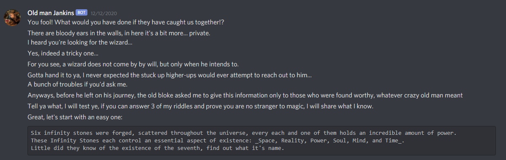
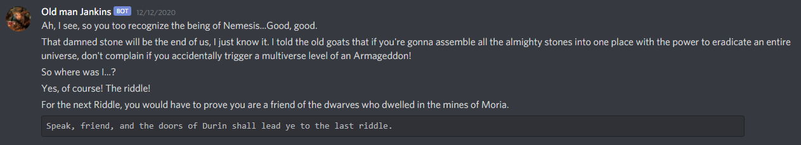
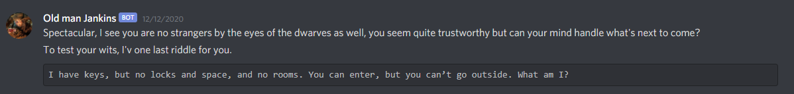
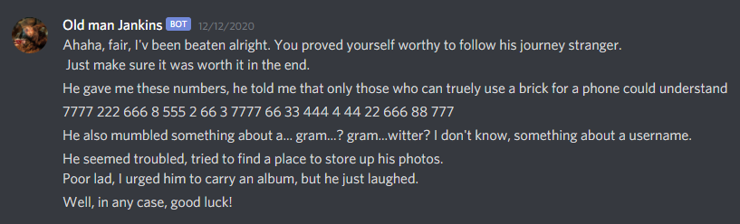
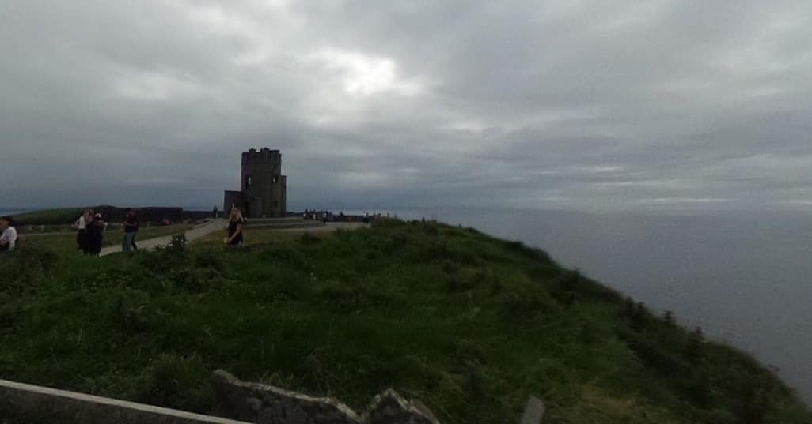

# The Great Journey
Category: OSINT

## Description
> 
> We need to find somebody, a friend, a wizard (as surprising as it is, his name is not Merlin).
> 
> The wizard likes the life of solitude. You wouldn't find anything about his great deeds on papers. He likes to do his work in the shadows. This what makes him the best for our work.
> 
> The last thing we know is that he went out on a journey of photography, never to be heard of again... Times are dire, we need him back ASAP before it will be too late, please find him!
> 
> We heard that there is one person in Discord that knows where to find him. His name is old man Jankins, he usually resides in his lounge. Make sure to ping him there. https://discord.gg/VsGVvVFBHH
> 
> If all hope seems lost, try to scout even the social medias. See what you can gather of him.
> 
> To submit this flag please write the flag as following cstechnion{<country>_<name of place>} replace all spaces with underscore and remove < > The flag is case insensitive.
> 
> Small note: please make sure that in Discord everyone is able to send you DMs (through settings).
> 
> **Also, we're looking for a very specific location, narrow it down.**


## Solution

We start our journey by pinging Old Man Jankins on the Discord server. Seconds later, we get a private DM from him:



[Wikipedia](https://en.wikipedia.org/wiki/Infinity_Gems) claims that the answer is "Ego", and we proceed to the next riddle:



According to [Tolkien Gateway](http://tolkiengateway.net/wiki/Doors_of_Durin) the answer is "Mellon".



According to [Riddles.com](https://www.riddles.com/206) the answer is "A computer keyboard".



The numbers (`7777 222 666 8 555 2 66 3 7777 66 33 444 4 44 22 666 88 777`) are obviously decoded using a [Telephone keypad](https://en.wikipedia.org/wiki/Telephone_keypad). We can use the following short script to decode the message:

```python
keypad = {
    "2": "abc",
    "3": "def",
    "4": "ghi",
    "5": "jkl",
    "6": "mno",
    "7": "pqrs",
    "8": "tuv",
    "9": "wzyz"
}

input = "7777 222 666 8 555 2 66 3 7777 66 33 444 4 44 22 666 88 777"

for chunk in input.split(" "):
    print(keypad[chunk[0]][len(chunk) - 1], end="")
print("")
```

Output:
```console
root@kali:/media/sf_CTFs/technion/The_Great_Journey# python3 keypad.py
scotlandsneighbour
```

"gram...? gram...witter?" must be a reference to Instagram and Twitter. So let's search for Instagram and Twitter users called "scotlandsneighbour".

Twitter has no such username, but Instagram has a promising match:


We can see a wizard in the profile picture, and a QR code in one of the images.

Let's extract the QR and decode it:

```console
root@kali:/media/sf_CTFs/technion/The_Great_Journey# zbarimg qr.png
QR-Code:https://qrgo.page.link/KRHsk
scanned 1 barcode symbols from 1 images in 0.01 seconds
```

The link takes us to a Dropbox containing a zip file called "The big secret". However, all it contains is a video greeting us with "Congratulations, you've been distracted". Back to the Instagram account, then.

Browsing through the images, one of them is captioned as "My final destination":



Using Google's reverse image search, this place is identified as the "Cliffs of Moher" in Ireland. The tower we see is called "O'Brien's_Tower".

The flag: `cstechnion{Ireland_O'Brien's_Tower}`.