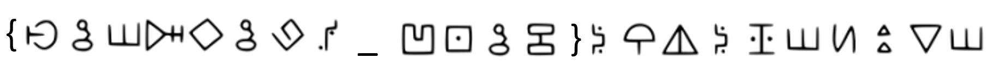
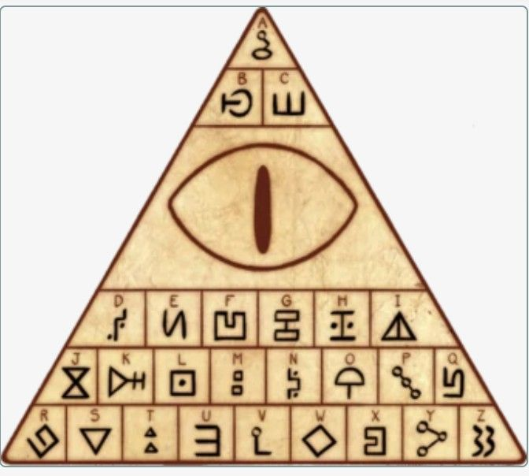

# The all-seeing eye
Category: Cryptography

## Description
> Remember - reality is an illusion

An image was attached.

## Solution

The attached image looks like some kind of substitution cipher:

We obviously know that the prefix is `cstechnion`. We can see that the `ש` stand for `'c'` and matches the expected locations in `cstechnion`. However, how do we proceed from here?

Searching Google for some kind of ancient hieroglyphs didn't help much, and a reverse image search of the symbols wasn't helpful either.

Finally, searching for the sentence in the description gave a lead: "Remember - reality is an illusion" is a quote from the animated TV show "Gravity Falls" said by no other than a character called "Bill Cipher":

> "Remember: reality is an illusion. The universe is a hologram. Buy gold. Bye!".

Investigating this lead further reveals the following key ([source](https://www.pinterest.com/pin/426575395956010392/)):

Using it, we can decrypt the flag to `cstechnion{galf_drawkcab}`.