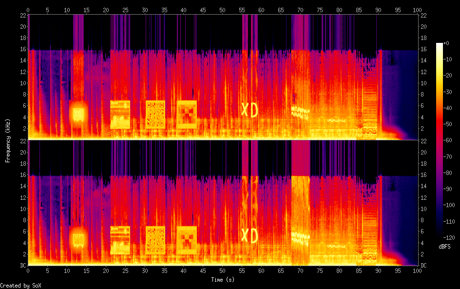
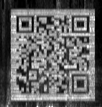
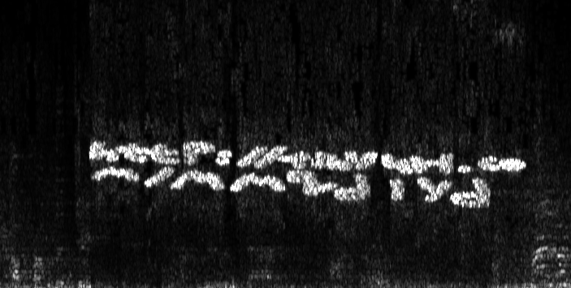

# timbre
Category: Steganography

## Description
> Seek the KEY, save the world. Find it in the very not suspicious [playlist](https://www.youtube.com/playlist?list=PLQHSEXRhc1RgfdFWMHyAclXWMc9a98RoH).
> 
> The flag is in the format KEY: (FLAG), all uppercase.
> 
> Please convert it to the format cstechnion{FLAG} and change all spaces to lowercase - "_" .

## Solution

This challenge was evil. I solved it with some hints. 

We get a YouTube playlist of 68 Rock and Metal songs. Nothing in the title, performers, duration, date of release or lyrics seem to hint towards the correct direction. It turned out that there was one particular video that we should have concentrated on: "[Ayreon - March Of The Machines](https://www.youtube.com/watch?v=2pUtgNQw_eY&list=PLQHSEXRhc1RgfdFWMHyAclXWMc9a98RoH&index=27)". It was the only video uploaded recently (Oct 16, 2020) by a nearly-anonymous uploader ("A prorsus non suspectum channel"), and it was their only upload ever. 

The video for the clip was composed of a still cover image, so let's inspect the audio. We start by downloading it from YouTube with `youtube-dl`:

```console
root@kali:/media/sf_CTFs/technion/timbre# youtube-dl --extract-audio --audio-format wav --audio-quality 0 https://www.youtube.com/watch?v=2pUtgNQw_eY
[youtube] 2pUtgNQw_eY: Downloading webpage
[youtube] 2pUtgNQw_eY: Downloading MPD manifest
[dashsegments] Total fragments: 12
[download] Destination: Ayreon - March Of The Machines-2pUtgNQw_eY.m4a
[download] 100% of 1.54MiB in 00:06
[ffmpeg] Correcting container in "Ayreon - March Of The Machines-2pUtgNQw_eY.m4a"
[ffmpeg] Destination: Ayreon - March Of The Machines-2pUtgNQw_eY.wav
Deleting original file Ayreon - March Of The Machines-2pUtgNQw_eY.m4a (pass -k to keep)
```

When listening to the audio, we can hear someone saying "zero" and "one" every now and then, but it turns out that it's part of the original "song". The audio spectrogram, on the other hand, was definitely tampered with:

```console
root@kali:/media/sf_CTFs/technion/timbre# sox Ayreon\ -\ March\ Of\ The\ Machines-2pUtgNQw_eY.wav  -n spectrogram
```



We can see a QR code, some text and a few icons. It should be possible to fine-tune the spectrogram using `Sonic Visualizer` to get a clearer look:

The QR seems the most tempting, and after some tweaks it's possible to get a scannable image:



But... it's a Rick Roll.

The text is worth a try too:



But it's a `tinyurl` Rick Roll as well.

At last, a collection of dashes and dots barely visible proved to contain the flag when interpreted as morse:


Let's decode it with CyberChef:

```javascript
> const chef = require("cyberchef");
undefined
> chef.fromMorseCode("-.- . -.-- ---... ..-. --- .-. . ...- . .-. .-- .- ... .... . .-. .");
KEY:FOREVERWASHERE
```

The flag: `cstechnion{FOREVER_WAS_HERE}`