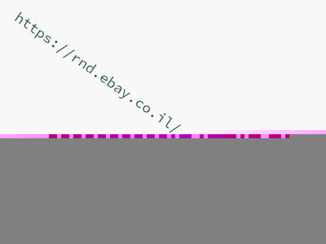

# Stage 2

## Description

> This image is intentionally distorted. 
> 
> Fix it to have the key to the next stage.
> 
> Hint: Once the first step is clear, 1f8b.



## Solution

This is a JPG image:

```console
root@kali:/media/sf_CTFs/ebay/2# file index.jpg
index.jpg: JPEG image data, JFIF standard 1.01, resolution (DPI), density 72x72, segment length 16, baseline, precision 8, 640x480, components 3
```

`jpeginfo` confirms that it's corrupted:
```console
root@kali:/media/sf_CTFs/ebay/2# jpeginfo -c index.jpg
index.jpg  640 x 480  24bit JFIF  N    6850  Corrupt JPEG data: premature end of data segment  [WARNING]
```

If we open the file with a hex-editor and scroll through it, we eventually see this:

```console
root@kali:/media/sf_CTFs/ebay/2# xxd -g 1 -s 0x12d0 -l 352 index.jpg
000012d0: 00 00 00 00 00 00 00 00 0a 79 14 da f1 15 ca f1  .........y......
000012e0: 48 9f d5 6e bb 98 fd 84 ae e1 c7 cf 8f 5e a9 1e  H..n.........^..
000012f0: 73 eb 69 f3 99 fd e4 24 c5 93 31 11 dc fa 40 af  s.i....$..1...@.
00001300: 52 45 4d 4f 56 45 5f 4d 45 5f 52 45 4d 4f 56 45  REMOVE_ME_REMOVE
00001310: 5f 4d 45 5f 52 45 4d 4f 56 45 5f 4d 45 5f 52 45  _ME_REMOVE_ME_RE
00001320: 4d 4f 56 45 5f 4d 45 5f 52 45 4d 4f 56 45 5f 4d  MOVE_ME_REMOVE_M
00001330: 45 5f 52 45 4d 4f 56 45 5f 4d 45 5f 52 45 4d 4f  E_REMOVE_ME_REMO
00001340: 56 45 5f 4d 45 5f 52 45 4d 4f 56 45 5f 4d 45 5f  VE_ME_REMOVE_ME_
00001350: 52 45 4d 4f 56 45 5f 4d 45 5f 52 45 4d 4f 56 45  REMOVE_ME_REMOVE
00001360: 5f 4d 45 5f 52 45 4d 4f 56 45 5f 4d 45 5f 52 45  _ME_REMOVE_ME_RE
00001370: 4d 4f 56 45 5f 4d 45 5f 52 45 4d 4f 56 45 5f 4d  MOVE_ME_REMOVE_M
00001380: 45 5f 52 45 4d 4f 56 45 5f 4d 45 5f 52 45 4d 4f  E_REMOVE_ME_REMO
00001390: 56 45 5f 4d 45 5f 52 45 4d 4f 56 45 5f 4d 45 5f  VE_ME_REMOVE_ME_
000013a0: 52 45 4d 4f 56 45 5f 4d 45 5f 52 45 4d 4f 56 45  REMOVE_ME_REMOVE
000013b0: 5f 4d 45 5f 52 45 4d 4f 56 45 5f 4d 45 5f 52 45  _ME_REMOVE_ME_RE
000013c0: 4d 4f 56 45 5f 4d 45 5f 52 45 4d 4f 56 45 5f 4d  MOVE_ME_REMOVE_M
000013d0: 45 5f 52 45 4d 4f 56 45 5f 4d 45 5f 52 45 4d 4f  E_REMOVE_ME_REMO
000013e0: 56 45 5f 4d 45 5f 52 45 4d 4f 56 45 5f 4d 45 5f  VE_ME_REMOVE_ME_
000013f0: 52 45 4d 4f 56 45 5f 4d 45 5f 52 45 4d 4f 56 45  REMOVE_ME_REMOVE
00001400: 1f 8b 08 00 bb d0 85 5f 00 03 e5 d2 fd 57 92 69  ......._.....W.i
00001410: 1a c0 71 b2 da 71 76 aa 1d c7 b1 52 1b dd 23 e7  ..q..qv....R..#.
00001420: 48 4a e6 b8 e6 1b 22 cc 96 99 a3 29 b3 96 68 38  HJ...."....)..h8
```

So, as the description says, the first step is clear: We remove the section that requests to be removed:

```console
root@kali:/media/sf_CTFs/ebay/2# { head --bytes $((0x1300)) index.jpg; tail --bytes +$((0x1401)) index.jpg; } > out.jpg
root@kali:/media/sf_CTFs/ebay/2# xxd -g 1 -s 0x12d0 -l 352 out.jpg
000012d0: 00 00 00 00 00 00 00 00 0a 79 14 da f1 15 ca f1  .........y......
000012e0: 48 9f d5 6e bb 98 fd 84 ae e1 c7 cf 8f 5e a9 1e  H..n.........^..
000012f0: 73 eb 69 f3 99 fd e4 24 c5 93 31 11 dc fa 40 af  s.i....$..1...@.
00001300: 1f 8b 08 00 bb d0 85 5f 00 03 e5 d2 fd 57 92 69  ......._.....W.i
00001310: 1a c0 71 b2 da 71 76 aa 1d c7 b1 52 1b dd 23 e7  ..q..qv....R..#.
00001320: 48 4a e6 b8 e6 1b 22 cc 96 99 a3 29 b3 96 68 38  HJ...."....)..h8
00001330: 61 47 57 91 58 e5 28 92 2f 09 d4 6a a6 96 fb ac  aGW.X.(./..j....
00001340: 53 2a 8c 20 4d 4a b4 85 52 47 04 9d 7c d9 d9 04  S*. MJ..RG..|...
00001350: 1c c7 b4 41 7d 28 32 51 d1 50 9e 55 42 64 14 42  ...A}(2Q.P.UBd.B
00001360: dd ff e1 f9 75 af 3f e0 fe 7c af eb dc b8 2e 45  ....u.?..|.....E
00001370: e8 1d 6f ca ec ed ae d5 00 83 79 8c 5d ee 09 c5  ..o.......y.]...
00001380: 91 8a 90 74 f1 00 93 cb 5d 0d 26 10 20 17 87 26  ...t....].&. ..&
00001390: f0 c7 7c c1 7a 37 ba b4 25 0d 44 be 3a 88 80 39  ..|.z7..%.D.:..9
000013a0: e8 85 1c 9b 45 ce a0 4a 32 c0 4b 81 e7 45 8c f6  ....E..J2.K..E..
000013b0: 94 a7 53 59 98 9a 3d d7 2b 9b 23 e6 f4 d0 62 99  ..SY..=.+.#...b.
000013c0: 8c fc 36 39 5c 78 e1 43 c5 3e 7d cc e5 f1 63 50  ..69\x.C.>}...cP
000013d0: 19 d8 ab a4 97 3a 27 56 4f c8 e0 9a 88 23 3c 53  .....:'VO....#<S
000013e0: b4 f0 52 96 21 d6 1a e5 ab 24 e3 9f 4b 9b 52 85  ..R.!....$..K.R.
000013f0: db 2a ca 40 e7 c2 1a 74 03 e2 a7 e8 68 f4 84 f3  .*.@...t....h...
00001400: 19 85 a3 bd 44 79 43 eb ab 37 de 67 4b c8 c6 1e  ....DyC..7.gK...
00001410: a1 c9 cb e8 cd 8a f2 9e 99 32 7d 29 5d 04 82 a7  .........2})]...
00001420: f0 7f 9c 3c 0a b7 60 f7 1f 7c 1f 6d 23 7f 76 b4  ...<..`..|.m#.v.
```

However, the image is still corrupted:
```console
root@kali:/media/sf_CTFs/ebay/2# jpeginfo -c out.jpg
out.jpg  640 x 480  24bit JFIF  N    6594  Corrupt JPEG data: bad Huffman code  [WARNING]
```

The hint says "Once the first step is clear, 1f8b". `1f8b` is the signature for `gzip` files, and is also what we see immediately after the "REMOVE_ME" section (offset `0x1300` in the new file). Let's see if `binwalk` identifies a gzip file too:

```console
root@kali:/media/sf_CTFs/ebay/2# binwalk out.jpg

DECIMAL       HEXADECIMAL     DESCRIPTION
--------------------------------------------------------------------------------
0             0x0             JPEG image data, JFIF standard 1.01
4864          0x1300          gzip compressed data, from Unix, last modified: 2020-10-13 16:07:23
```

We can ask `binwalk` to extract it:

```console
root@kali:/media/sf_CTFs/ebay/2# binwalk -e out.jpg

DECIMAL       HEXADECIMAL     DESCRIPTION
--------------------------------------------------------------------------------
0             0x0             JPEG image data, JFIF standard 1.01
4864          0x1300          gzip compressed data, from Unix, last modified: 2020-10-13 16:07:23
```

The extracted `gzip` file is just binary data:
```console
root@kali:/media/sf_CTFs/ebay/2# file _out.jpg.extracted/1300
_out.jpg.extracted/1300: data
```

However, it ends with `ff d9`, which is the `EOI` (end of image) marker for JPEG files:
```console
root@kali:/media/sf_CTFs/ebay/2# xxd -g 1 _out.jpg.extracted/1300 | tail
00000bb0: 00 00 00 00 00 00 00 00 00 00 00 00 00 00 00 00  ................
00000bc0: 00 00 00 00 00 00 00 00 00 00 00 00 00 00 00 00  ................
00000bd0: 00 00 00 00 00 00 00 00 00 00 00 00 00 00 00 00  ................
00000be0: 00 00 00 00 00 00 00 00 00 00 00 00 00 00 00 00  ................
00000bf0: 00 00 00 00 00 00 00 00 00 00 00 00 00 00 00 00  ................
00000c00: 00 00 00 00 00 00 00 00 00 00 00 00 00 00 00 00  ................
00000c10: 00 00 00 00 00 00 00 00 00 00 00 00 00 00 00 00  ................
00000c20: 00 00 00 00 00 00 00 00 00 00 00 00 00 00 00 00  ................
00000c30: 00 00 00 00 00 00 00 00 00 00 00 00 00 00 00 00  ................
00000c40: 00 00 00 00 00 3f ff d9                          .....?..
```

So, what if we concatenate the beginning of our original image (just up to where we removed the "REMOVE_ME" section) with the output of the gzip file?

```console
root@kali:/media/sf_CTFs/ebay/2# { head --bytes $((0x1300)) index.jpg; cat _out.jpg.extracted/1300; } > concat.jpg
```

We get a good JPEG file:
```console
root@kali:/media/sf_CTFs/ebay/2# jpeginfo -c concat.jpg
concat.jpg  640 x 480  24bit JFIF  N    8008  [OK]
```

The image contains the link to the next level. We can rotate it a bit and use an OCR to extract the link (or just type it):

```console
root@kali:/media/sf_CTFs/ebay/2# convert -rotate "-35" concat.jpg rotated.jpg
root@kali:/media/sf_CTFs/ebay/2# tesseract rotated.jpg -
https://rnd.ebay.co.il/riddle/xtdavqsrfo/
```