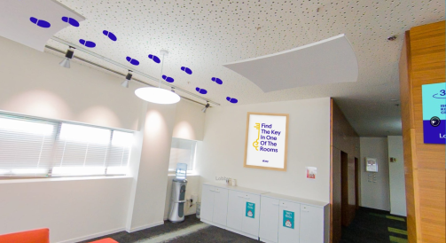

# Stage 3

## Description

> The final key is:
> 
> `https://rnd.ebay.co.il/riddle/{max N}/`
> 
> Where N:
> - is eBay product Id
> - is prime
> - starts and ends with the same digit
> 
> Hint 1: eBay product URLs look like `https://www.ebay.com/p/227447`
> where 227447 is the product id.
> 
> Hint 2: do not to get blocked

## Solution

Well, since eBay product IDs have an upper bound, and since the list of primes with a matching first and last digit under that limit is known, it should be theoretically possible to just try all possibilities. However, eBay product IDs can be quite large (the largest one I found had 11 digits) and brute-forcing doesn't make much sense (certainly not in the context of a recruitment campaign riddle) and is probably what the second hint is trying to tell us not to do. So, how to we get the list of eBay product IDs to analyze offline?

eBay offers an API, but it requires registration and authentication so that's probably not the direction. I also tried using Google's "advanced search" to somehow find the upper bound for product IDs, without success. However - Google does know the list of eBay pages! It might be indexing the pages by crawling from one page to another, but for a site as large as eBay they are probably using something much more efficient: A sitemap! 

I found a few sitemaps listed in eBay's `robots.txt` page:

```
# PRP Sitemaps
Sitemap: https://www.ebay.com/lst/PRP-0-index.xml

# VIS Sitemaps
Sitemap: https://www.ebay.com/lst/VIS-0-index.xml

# CLP Sitemaps
Sitemap: https://www.ebay.com/lst/CLP-0-index.xml

# NGS Sitemaps
Sitemap: https://www.ebay.com/lst/NGS-0-index.xml

# BROWSE Sitemaps
Sitemap: https://www.ebay.com/lst/BROWSE-0-index.xml
```

The PRP sitemap turned out to be exactly what we're looking for.

This is an XML file which lists multiple `gzip` files:
```console
root@kali:/media/sf_CTFs/ebay/3# curl -s https://www.ebay.com/lst/PRP-0-index.xml | head
<?xml version="1.0" encoding="UTF-8" standalone="no"?><sitemapindex xmlns="http://www.sitemaps.org/schemas/sitemap/0.9">
<sitemap>
<loc>https://www.ebay.com/lst/PRP-0-1.xml.gz</loc>
<lastmod>2020-11-04</lastmod>
</sitemap>
<sitemap>
<loc>https://www.ebay.com/lst/PRP-0-10.xml.gz</loc>
<lastmod>2020-11-04</lastmod>
</sitemap>
<sitemap>
```

Each `gzip` file archives another XML file, which lists a subset of the products:

```console
root@kali:/media/sf_CTFs/ebay/3# cat PRP/PRP-0-1.xml | head
<?xml version="1.0" encoding="UTF-8" standalone="no"?><urlset xmlns="http://www.sitemaps.org/schemas/sitemap/0.9" xmlns:image="http://www.google.com/schemas/sitemap-image/1.1">
<url>
<loc>https://www.ebay.com/p/2084604414</loc>
<changefreq>weekly</changefreq>
<priority>0.5</priority>
</url>
<url>
<loc>https://www.ebay.com/p/2087560130</loc>
<changefreq>weekly</changefreq>
<priority>0.5</priority>
```

So, let's download the whole sitemap:

```console
root@kali:/media/sf_CTFs/ebay/3/PRP# curl -s https://www.ebay.com/lst/PRP-0-index.xml | grep -Po '(?<=<loc>)([^<]+)(?=</loc>)' > files.txt
root@kali:/media/sf_CTFs/ebay/3/PRP# wget -i files.txt
```

Unzip everything:

```console
root@kali:/media/sf_CTFs/ebay/3/PRP# gunzip *.gz
```

Extract only product IDs:
```console
root@kali:/media/sf_CTFs/ebay/3/PRP# grep -Poh '(?<=https://www.ebay.com/p/)([0-9]+)' *.xml > products.txt
```

And sort in descending order:
```console
root@kali:/media/sf_CTFs/ebay/3/PRP# sort -rn -o sorted.txt products.txt
root@kali:/media/sf_CTFs/ebay/3/PRP# head sorted.txt
28041889902
28041884861
28041855040
28041849651
28041848915
28041842644
28041840417
28041817830
28041817744
28041817274
root@kali:/media/sf_CTFs/ebay/3/PRP# tail sorted.txt
1013
1012
1011
1009
1008
1007
1005
1003
1002
1001
```

Now we have a list of sorted product IDs. We are looking for the largest product ID which is a prime number that has an identical first and last digit. We see that the top product IDs start with a 2, and therefore we can immediately disqualify these numbers (since a prime number can't end with a 2). Let's remove them:

```console
root@kali:/media/sf_CTFs/ebay/3/PRP# sed -i '/^2/d' sorted.txt
root@kali:/media/sf_CTFs/ebay/3/PRP# head sorted.txt
19041893444
19041856803
19041848880
19041847560
19041841349
19041837822
19041818020
19041815706
19041814615
19041813898
```

Now we can use a small Python script to find a our candidate:
```python
import argparse
import gmpy2

def main(input_file, num_results):
    results = []

    for line in input_file:
        line = line.strip()
        if line == "":
            continue

        if line[0] != line[-1]:
            continue

        number = int(line)
        if gmpy2.is_prime(number):
            results.append(number)
            if len(results) == num_results:
                break

    return results

if __name__ == "__main__":
    parser = argparse.ArgumentParser()
    parser.add_argument("-i", "--input", help = "Sorted input file", type = argparse.FileType('r'), required = True)
    parser.add_argument("-n", "--num_results", help = "Number of results to return", type = int, default = 1, action = "store")
    args = parser.parse_args()
    results = main(args.input, args.num_results)
    print("\n".join(str(x) for x in results))
```

Output:
```console
root@kali:/media/sf_CTFs/ebay/3# python3 solve.py -i PRP/sorted.txt
19041588331
```

However, trying to access `https://rnd.ebay.co.il/riddle/19041588331/` resulted in a 404 error! 

After double checking the calculations (and verifying that `19041588331` is indeed a valid product ID - a *Squishmallow Kellytoy 16" Tie Dye Octopus Opal Super Soft Cuddly Plush Pillow*, if you've wondered), I tried producing a longer list of results:

```console
root@kali:/media/sf_CTFs/ebay/3# python3 solve.py -i PRP/sorted.txt -n 5
19041588331
19041450971
19041375131
19041288221
19041283411
```

The result that worked was `https://rnd.ebay.co.il/riddle/19041288221/` (representing a *2020 Rechargable Plasma Pen for Eyelid Lift Fibroblast Wrinkle/spot Removal*):


(I reported the error to the creators and it was fixed the next day, allowing access to the next level also by visiting `https://rnd.ebay.co.il/riddle/19041588331/`).

Anyway, we can follow the footsteps and arrive to the following sign:



The key itself was in the game room:


And we're done:

