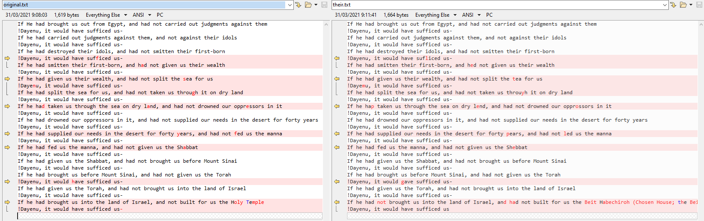
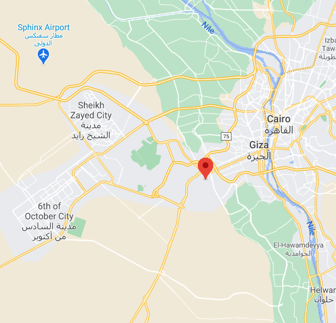

<div dir="rtl">
<h1>חידת אמ"ן - פסח התשפ"א</h1>
<p>
לרגל חג הפסח פרסם אגף המודיעין חידה קצרה. נראה כאן את הפתרון שלה.
</p>

<h2>חלק ראשון</h2>
<h3>תיאור</h3>
<p>
ביקשנו ממיטב המוחות של אמ"ן לאתגר אותנו עם חידה מורכבת לכבוד הפסח. עברתם את כל השלבים? קיבלתם את המידע והצלחתם לפתור? כנראה שאתם כבר יודעים לאיזה מייל לשלוח לנו את התשובה...

מערכת אתר צה"ל | 25.03.2021
</p>


<pre dir="ltr" style="text-align: left">
If He had brought us out from Egypt, and had not carried out judgments against them

!Dayenu, it would have sufficed us-

If he had carried out judgments against them, and not against their idols


!Dayenu, it would have sufficed us-

If he had destroyed their idols, and had not smitten their first-born


!Dayenu, it would have sufliced us-

If he had smitten their first-born, and hed not given us their wealth


!Dayenu, it would have sufficed us-

If he had given us their wealth, and had not split the tea for us


!Dayemu, it would have sufficed us-

If he had split the sea for us,  and had not taken us throuyh it on dry land


!Dayenu, it would have sufficed us-

If he hap taken us through the sea on dry lend, and had not drowned our opprossors in it


!Dayenu, it would have sufficed us-

If he had drowned our oppressors in it, and had not supplied our needs in the desert for forty years


!Dayenu, it would have sufficed us-

If he had supplied our needs in the desert for forty pears, and had not led us the manna


!Dayenu, it would have sufficed us-

If he had fed us the manna, and had not given us the Shebbat


!Dayenu, it would have sufficed us-

If he had given us the Shabbat, and had not brought us before Mount Sinai


!Dayenu, it would have sufficed us-

If he had brought us before Mount Sinai, and had not given us the Torah

!Dayenu, it would gave sufficed us-

If he had given us the Torah, and had not brought us into the land of Israel


!Dayenu, it would have sufficed us-

If he had not brought us into the land of Israel, and had not built for us the Beit Habechiroh (Chosen House; the Beit Hamikdash)

!Dayenu, it would have sufficed us-

Who said + __________? = 
www.idf.il/_____/י/
</pre>


<p>
*שימו לב: יש להעתיק מכאן את הקישור לאחר שהזנתם את התשובה. התשובה היא בעברית
</p>

<h3>פתרון</h3>

<p>
ניתן לזהות בקלות שמדובר כאן במילות שיר הפסח "דיינו" בתרגום לאנגלית, אלא שעיון מדוקדק יותר מגלה מספר שינויים קלים בשיר:
</p>

<ul dir="ltr">
<li>If he had given us their wealth, and had not split the <span style="color: red">t</span>ea for us</li>
<li>If he had supplied our needs in the desert for forty <span style="color: red">p</span>ears, and had not led us the manna</li>
</ul>

<p>
נוכל לקחת את הטקסט המקורי מ<a href="https://en.wikipedia.org/wiki/Dayenu">ויקיפדיה</a> ולהשוות.
</p>

<p>
בטקסט שלקחנו מויקיפדיה נבצע מספר התאמות קלות על מנת להקל על ההשוואה. בשורת "דיינו", נשנה את "He" ל-"he", ונמיר בנוסף את סימן הקריאה בסוף המשפט ל-"us-" כמו הנוסח שבחרו באמ"ן. השינויים האלו לא נדרשים אבל הם יקלו על זיהוי ההבדלים המהותיים.
</p>

<p>
נשווה ונקבל:
</p>



<p>
נוכל לקבל את ההבדלים באמצעות הפקודה הבאה:
</p>

<pre style="text-align: left" dir="ltr">
root@kali:/media/sf_CTFs/aman/1# cmp -l their.txt original.txt  | gawk '{printf "%c", strtonum(0$2)}' && echo
cmp: EOF on original.txt after byte 1619
letmypeoplegnot brought us intothe land of Israel,andhad not built for us th Beit Habechiroh (Chosen House; the Beit Ham
</pre>

<p>
ניתן לראות שהשורה האחרונה שונה באופן מהותי, מה ש"מלכלך" את ההשוואה, אבל לפני כן אפשר לראות בבירור את הביטוי "letmypeoplego", או בעברית "שלח את עמי".
</p>

<p>
הביטוי נאמר על ידי משה, נמלא שם זה בקישור ונעבור לשלב הבא:
</p>

`https://www.idf.il/%D7%9E%D7%A9%D7%94/%D7%99/`

<h2>חלק שני</h2>
<h3>תיאור</h3>
<div>
יש מי שחושב שסיפור יציאת מצרים הוא פנטזיה, אך תוך כדי ויכוח טוב, תוכלו להראות את העובדה הבאה ולהוכיח, שאין זו...

"בט.טזחובד, גא.____טו"

בסמוך תמצאו עיר שמסמלת ניצחון כואב

יודעים במה מדובר? כנראה שאתם מספיק חדים כדי לדעת לאן לשלוח את התשובה
</div>

<h3>פתרון</h3>
<p>
נראה סביר מאוד שמדובר בצופן החלפה כלשהו. אחרי בדיקת צפנים בסיסיים כגון אתב"ש, נשים לב שהחידה כוללת אותיות בין א' ל-ט' בלבד. נראה הגיוני להחליף את האותיות בספרות. החידה כוללת גם קטע שעלינו להשלים בעצמנו. לפי קטע הפתיחה, הגיוני להשלים את המילה "אגדה" שמסתדרת עם המשך הביטוי "אין זו..." וגם עם ההקשר.
</p>

<p>
אם כך:
</p>

```
בט.טזחובד, גא.____טו
-->
בט.טזחובד, גא.אגדהטו
-->
695431.13 ,426879.92
```

<p>
אם נהפוך את סדר התווים, נקבל קוארדינטות:
</p>

```
29.978624, 31.134596
```

נכניס לגוגל מפות ונראה:



<p>
בסמוך לקוארדינטות שוכנת העיר "השישה באוקטובר", הקרויה על שם תאריך הפתיחה של מלחמת יום הכיפורים. זהו ה"ניצחון הכואב" שעליו תיאור האתגר מדבר.
</p>

<h2>חלק שלישי</h2>
<h3>תיאור</h3>
<p>
כעת כל שנותר לנו הוא למצוא את כתובת המייל אליה יש לשלוח את התשובה.
</p>

<h3>פתרון</h3>

<p>
זהו הבאנר של האתגר באתר צה"ל:
</p>


<p>
בתחתית הבאנר ניתן לראות קוד מורס
</p>

```
.... .. -.. .- .-.-.- .. -.. ..-. .-.-.- .- -- .- -. .--.-. --. -- .- .. .-.. .-.-.- -.-. --- --
```

נפענח את הקוד ונקבל את כתובת המייל.

<h2>קישורים</h2>
<ul>
    <li><a href="https://www.idf.il/129495/">החידה באתר צה"ל</a></li>
    <li><a href="https://www.ynet.co.il/news/article/SJQbUBqEO">כתבה ב-YNet</a>
</ul>

</div>