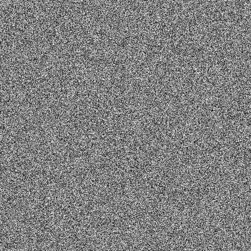

# Beat the map
Category: Programming, 200 Points

## Description

>  We got these images with a secret message from one of our agents, but we have no clue where the flag is hiding.
> 
> Can you assist?

A zip file was attached.

## Solution

Let's check the attached file:

```console
┌──(user@kali)-[/media/sf_CTFs/checkpoint/Beat_the_map]
└─$ unzip beat_the_map.zip
Archive:  beat_the_map.zip
  inflating: challenge.bmp
  inflating: first_hint.bmp
  inflating: second_hint.bmp
```

We get three images:

`challenge.bmp`:


`first_hint.bmp`:


`second_hint.bmp`:



The first image is the famous [*Lena*](https://en.wikipedia.org/wiki/Lenna) image - a standard test image widely used in the field of image processing since 1973 (although for the past two decades it has received more and more [criticism](https://en.wikipedia.org/wiki/Lenna#Criticism) and perhaps next time we'll get an image of [peppers](https://links.uwaterloo.ca/Repository.Thumbs/pepperscolorthumb.gif) instead).

The other two are hints, let's try to decode them.

For the first hint, we can use [StegOnline](https://stegonline.georgeom.net/image) or `stegsolve` to review the different bit planes and find a hidden message in the bit planes: `IN_SECOND_HINT_MAKE_ODD_0_AND_EVEN_255`. Let's do that:

```python
from PIL import Image

img = Image.open('second_hint.bmp')
width, height = img.size

new = Image.new(mode="RGB", size=img.size)

for w in range(width):
    for h in range(height):
        p = img.getpixel((w, h))
        new.putpixel((w, h), 0 if p % 2 != 0 else 255)

new.save("hint1_decoded.bmp")
```

We get an image containing the following text: `LSBIT_STEGANOGRAPHY_OVER_TRIANGULAR_SERIES`. The [triangular series](https://en.wikipedia.org/wiki/Triangular_number) is a series representing the number of dots in each triangular pattern: `0, 1, 3, 6, 10, 15` (check the link for a visual example). There's a formula to calculate the n-th member of the series: `f(n) = (n * (n - 1)) / 2`.

We'll use a generator to iterate the series:

```python
from itertools import count

def triangular_series(start = 0):
    for i in count(start):
        res = (i*(i+1))//2
        yield res
```

What's left to do is to iterate the matching pixels and extract the LSB from each, constructing a byte from every eight bits extracted. For some reason, that didn't quite work when using a high-level library such as PIL. What worked was opening the file as a binary, skipping the BMP header and extracting the data from the raw indices:

```python
import os
import mmap

BMP_HEADER_SIZE = 0x436
BITS_PER_BYTE = 8

def memory_map(filename, access=mmap.ACCESS_READ):
    size = os.path.getsize(filename)
    fd = os.open(filename, os.O_RDONLY)
    return mmap.mmap(fd, size, access=access)

with memory_map('challenge.bmp') as b:
    series = triangular_series()
    while True:
        try:
            new_byte = 0
            for i in range(BITS_PER_BYTE):
                new_byte |= (b[BMP_HEADER_SIZE + next(series)] & 0x01) << (BITS_PER_BYTE - i - 1)
            print(chr(new_byte), end='')
        except IndexError:
            break
```

Output:

```console
┌──(user@kali)-[/media/sf_CTFs/checkpoint/Beat_the_map]
└─$ python3 solve.py
>>>>>CSA{lEn4_Y0u_aLm0st_fO0l3d_mE}<<<<<>>>>>CSA{lEn4_Y0u_aLm0st_fO0l3d_mE}<<<<<>>>>>CSA{l
```


