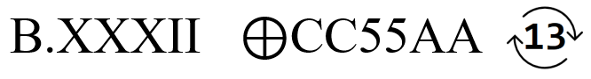

# D3c0d3M3
Category: Crypto, 100 Points

## Description

> WFKZLTABVKWVLXGMASVPYVP2ZRTKVHKV6XGBJKVEKX44YCVKXBK4XTBDVKSVL2WMACVLOVPEZQJ2VHCV 
> 
> 
>
> Can you get to the flag? :) 


## Solution

This is a pretty simple decoding challenge. We need to decode `WFKZLTABVKWVLXGMASVPYVP2ZRTKVHKV6XGBJKVEKX44YCVKXBK4XTBDVKSVL2WMACVLOVPEZQJ2VHCV` according to the instructions we've received.

First, we need to understand what `B.XXXII` means. `XXXII` looks like a number written in the Roman numeral system: `32`. So this becomes `B.32`, which hints that the string is encoded in base32.

Then we have the XOR sign (`⊕`), so we should probably XOR the result with `0xCC 0x55 0xAA`. Finally, we have a symbol that looks like it represents ROT13. Putting it all together, we get:

```console
┌──(user@kali)-[/media/sf_CTFs/checkpoint/D3c0d3M3]
└─$ node
> const chef = require("/home/user/utils/CyberChef/");
undefined
> chef.bake("WFKZLTABVKWVLXGMASVPYVP2ZRTKVHKV6XGBJKVEKX44YCVKXBK4XTBDVKSVL2WMACVLOVPEZQJ2VHCV", [
... {op: chef.fromBase32},
... {op: chef.XOR, args: {"key": "CC 55 AA"}},
... {op: chef.ROT13}
... ]);
}?GniD0C3D_NuF_gniv@H{ASC
```

This looks like the flag, only reversed. So we throw in another ingredient to the recipe:

```console
> chef.bake("WFKZLTABVKWVLXGMASVPYVP2ZRTKVHKV6XGBJKVEKX44YCVKXBK4XTBDVKSVL2WMACVLOVPEZQJ2VHCV", [
... {op: chef.fromBase32},
... {op: chef.XOR, args: {"key": "CC 55 AA"}},
... {op: chef.ROT13},
... {op: chef.reverse}
... ]);
CSA{H@ving_FuN_D3C0DinG?}
```

