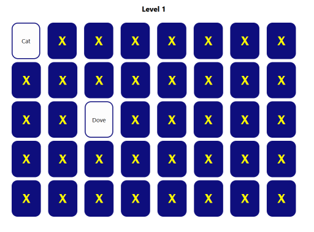

# Memento
Category: Programming, 200 Points

## Description

> My good friend Leonard created this game.
> Leonard told me he hid a flag inside, but doesn’t remember exactly how.
> 
> He also gave me the code of the server, so you can take a look.
> 
> The flag is in the format CSA{...}
> 
> The only possible characters inside {} are lowercase english letters and _ (no numbers, no uppercase, no special characters).
> 
> You have only 5 attempts for submitting the flag.

A Python file with the server implementation was attached:

```python
import flag, shortest_path
import random, json, base64

def verify_game(board, level):
    card_number = random.randint(1, 20)
    board_obj = base64.b64decode(json.loads(board))
    indexes = []
    for i in range(5):
        for j in range(8):
            if board_obj[i][j] == card_number:
                indexes.append([i, j])
    
    shortest = shortest_path(indexes[0], indexes[1], board, "UP|DOWN|LEFT|RIGHT")
    shortest = shortest.length - 1
    result = 0
    if shortest == (flag[level] % 9) + 1:
        result = 1
    return result
```

## Solution

We visit the attached website and get a simple 8x5 memory game:



Digging into the Javascript sources, we find the following implementation:

```javascript
import React, { useEffect, useState } from 'react';
import './index.css';


const Game = () => {
    const [board, setBoard] = useState(null);
    const [openCount, setOpenCount] = useState(0);
    const [disableClick, setDisableClick] = useState(false);
    const [game, setGame] = useState(null);
    const [boardRevealed, setBoardRevealed] = useState([
        [false, false, false, false, false],
        [false, false, false, false, false],
        [false, false, false, false, false],
        [false, false, false, false, false],
        [false, false, false, false, false],
        [false, false, false, false, false],
        [false, false, false, false, false],
        [false, false, false, false, false],
    ])
    const [level, setLevel] = useState(0);
    const words = ['Cow', 'Rabbit', 'Duck', 'Pig', 'Lion', 'Goat', 'Crab', 'Deer', 'Bee', 'Sheep', 'Fish', 'Dove', 'Chicken', 'Horse', 'Dog', 'Cat', 'Mouse', 'Turtle', 'Monkey', 'Elephant']


    const create_game = async (level) => {
        let result = '0'
        let game = [
            [],
            [],
            [],
            [],
            [],
        ]
        while (result !== '1') {
            const pool = [1, 1, 2, 2, 3, 3, 4, 4, 5, 5, 6, 6, 7, 7, 8, 8, 9, 9, 10, 10, 11, 11, 12, 12, 13, 13, 14, 14, 15, 15, 16, 16, 17, 17, 18, 18, 19, 19, 20, 20]
            game = [
                [],
                [],
                [],
                [],
                [],
            ]
            for (var i = 0; i < 5; i++) {
                for (var j = 0; j < 8; j++) {
                    var choose_number = Math.floor(Math.random() * pool.length);
                    game[i].push(pool[choose_number]);
                    pool.splice(choose_number, 1);
                }
            }
            const res = await fetch('http://' + window.location.hostname + ':7777/verifygame?level=' + level + '&board=' + Buffer.from(JSON.stringify(game)).toString('base64'));
            result = await res.text();
        }
        setBoard(game)
    }

    useEffect(() => {
        if (level < 26) {
            create_game(level)
        }
    }, [level]);

    useEffect(() => {
        const oldOpenCount = openCount;
        const newOpenCount = checkOpenCardsCount(boardRevealed, true);
        setOpenCount(newOpenCount)
        if (newOpenCount !== 0 && newOpenCount > oldOpenCount) {
            if (newOpenCount % 2 === 0) {
                const openCards = getOpenCards();
                let matchedCards = [];
                openCards.forEach((card1) => {
                    openCards.forEach((card2) => {
                        if (card1 !== card2 &&
                            board[card1[1]][card1[0]] === board[card2[1]][card2[0]]
                            // && checkIfMatchedAlready(matchedCards, [card2, card1])) {
                        ) {
                            matchedCards.push([card1, card2]);
                        }
                    })
                })
                matchedCards = removeOppositeDuplicates(matchedCards);
                const unMatchedCards = []
                openCards.forEach((card) => {
                    const isMatched = checkIfCardMatched(matchedCards, card);
                    if (!isMatched) unMatchedCards.push(card);
                });

                if (unMatchedCards.length > 0) {
                    setDisableClick(true);
                    setTimeout(() => {
                        setDisableClick(false);
                        setCardsUnrevealed(unMatchedCards);
                    }, 1500);
                }
            }
            if (newOpenCount === words.length * 2) {
                setLevel(level + 1)
                setGame(null);
            }
        }
    }, [boardRevealed])

    useEffect(() => {
        setGame(renderGame());
        setAllCardsUnrevealed();
    }, [board])

    const removeOppositeDuplicates = (matchedCards) => {
        const newMatchedCards = [];
        matchedCards.forEach((pair1) => {
            let found = false;
            newMatchedCards.forEach((pair2) => {
                if (
                    (pair1[0][0] === pair2[0][0] && pair1[0][1] === pair2[0][1] && pair1[1][0] === pair2[1][0] && pair1[1][1] === pair2[1][1]) ||
                    (pair1[0][0] === pair2[1][0] && pair1[0][1] === pair2[1][1] && pair1[1][0] === pair2[0][0] && pair1[1][1] === pair2[0][1])
                ) {
                    found = true;
                }
            });
            if (!found) newMatchedCards.push(pair1)
        })
        return newMatchedCards;
    }

    const checkIfCardMatched = (matchedCards, card) => {
        let isMatched = false;
        matchedCards.forEach((mCard) => {
            mCard.forEach((index) => {
                if (index[0] === card[0] && index[1] === card[1]) isMatched = true;
            })
        })
        return isMatched;
    }


    const getOpenCards = () => {
        const openCards = []
        for (var i = 0; i < boardRevealed.length; i++) {
            for (var j = 0; j < boardRevealed[i].length; j++) {
                if (boardRevealed[i][j]) openCards.push([j, i]);
            }
        }
        return openCards;
    }


    const checkOpenCardsCount = (arr, query) => {
        let count = 0;
        for (let i = 0; i < arr.length; i++) {
            if (arr[i] === query) {
                count++;
                continue;
            };
            if (Array.isArray(arr[i])) {
                count += checkOpenCardsCount(arr[i], query);
            }
        };
        return count;
    }

    const setCardRevealed = (i, j) => {
        if (!disableClick) {
            const boardRevealedTemp = [...boardRevealed];
            boardRevealedTemp[i][j] = true;
            setBoardRevealed(boardRevealedTemp);
        }
    }

    const setCardsUnrevealed = (cards) => {
        const boardRevealedTemp = [...boardRevealed];
        cards.forEach((card) => {
            boardRevealedTemp[card[1]][card[0]] = false;
        })
        setBoardRevealed(boardRevealedTemp);
    }

    const setAllCardsUnrevealed = () => {
        const cardsArr = []
        for(var i = 0; i < 8; i++) {
            for (var j = 0; j < 5; j++) {
                cardsArr.push([i, j]);
            }
        }
        setCardsUnrevealed(cardsArr);
    }

    const renderBackwardCard = (i, j) => {
        return (<div className='backward-card' key={i + '-' + j} id={i + '-' + j} onClick={() => {
            setCardRevealed(i, j)
        }}><span className='backward-card-x'>x</span></div>)
    }

    const renderRevealedCard = (i, j) => {
        return (<div className='revealed-card' key={i + '-' + j} id={i + '-' + j}><span className='revealed-card-text'>{words[board[i][j] - 1]}</span></div>)
    }

    const renderGame = () => {
        const renderedGame = []
        for (var j = 0; j < 5; j++) {
            const renderedCards = []
            for (var i = 0; i < 8; i++) {
                renderedCards.push(boardRevealed[j][i] ? renderRevealedCard(j, i) : renderBackwardCard(j, i));
            }
            renderedGame.push(<div className='cards-row' key={'row-' + j}>{renderedCards}</div>);
        }
        return <div className='board-game'>{renderedGame}</div>
    }


    return game === null ? 
    level < 26 ? <div className='page'>Loading game...</div> : <div className='page'>You win!<br />Now try and get the flag...</div> 
    : <div className='page'><h2>Level {level + 1}</h2>{renderGame()}</div>;

}


export default Game;
```

The interesting part is this one, as it interacts with the server-side logic we got:

```javascript
const create_game = async (level) => {
        let result = '0'
        let game = [
            [],
            [],
            [],
            [],
            [],
        ]
        while (result !== '1') {
            const pool = [1, 1, 2, 2, 3, 3, 4, 4, 5, 5, 6, 6, 7, 7, 8, 8, 9, 9, 10, 10, 11, 11, 12, 12, 13, 13, 14, 14, 15, 15, 16, 16, 17, 17, 18, 18, 19, 19, 20, 20]
            game = [
                [],
                [],
                [],
                [],
                [],
            ]
            for (var i = 0; i < 5; i++) {
                for (var j = 0; j < 8; j++) {
                    var choose_number = Math.floor(Math.random() * pool.length);
                    game[i].push(pool[choose_number]);
                    pool.splice(choose_number, 1);
                }
            }
            const res = await fetch('http://' + window.location.hostname + ':7777/verifygame?level=' + level + '&board=' + Buffer.from(JSON.stringify(game)).toString('base64'));
            result = await res.text();
        }
        setBoard(game)
    }
```

It takes an array of 8x5 elements containing pairs of numbers (1-20), shuffles it and keeps sending it to `verify_game` until receiving a response of `1`.

`verify_game` take the shuffled array, chooses a random number between 1 and 20, and calculates the shortest distance between the location of these two numbers on the board. Now, if the distance a certain constraint related to a letter from the flag (`shortest == (flag[level] % 9) + 1`), the result of `1` is returned.

We control `level` as part of the input to `verify_call`, we can send any board that we want and we can call `verify_game` as many times as we want. How do we use this to leak the flag?

Our main problem is that we don't control which random number the server will choose for calculating the shortest distance. Therefore, even if we get a response of `1`, how do we know for what value the distance was calculated? Luckily, we control the board layout, so we can provide a board where all (or at least most) of the pairs have the same distance from each other. This way, it doesn't really matter what the server randomly chooses, we can be sure (or at least relatively sure) what is the distance that the calculation has produces.

For example, it's pretty easy to manually create a board where all shortest distances are `1`:

```
+----+----+---+---+----+----+----+----+
| 20 | 20 | 5 | 5 | 10 | 10 | 15 | 15 |
+----+----+---+---+----+----+----+----+
| 1  | 1  | 6 | 6 | 11 | 11 | 16 | 16 |
+----+----+---+---+----+----+----+----+
| 2  | 2  | 7 | 7 | 12 | 12 | 17 | 17 |
+----+----+---+---+----+----+----+----+
| 3  | 3  | 8 | 8 | 13 | 13 | 18 | 18 |
+----+----+---+---+----+----+----+----+
| 4  | 4  | 9 | 9 | 14 | 14 | 19 | 19 |
+----+----+---+---+----+----+----+----+
```

Or `2`:

```
+----+---+----+---+----+----+----+----+
| 20 | 5 | 20 | 5 | 10 | 15 | 10 | 15 |
+----+---+----+---+----+----+----+----+
| 1  | 6 | 1  | 6 | 11 | 16 | 11 | 16 |
+----+---+----+---+----+----+----+----+
| 2  | 7 | 2  | 7 | 12 | 17 | 12 | 17 |
+----+---+----+---+----+----+----+----+
| 3  | 8 | 3  | 8 | 13 | 18 | 13 | 18 |
+----+---+----+---+----+----+----+----+
| 4  | 9 | 4  | 9 | 14 | 19 | 14 | 19 |
+----+---+----+---+----+----+----+----+
```

Or even `3`, `4`, `5`. 

For `6-9` it becomes a bit more complex (at least manually) so there are two choices:

* Create the tables programmatically and find the ordering for the optimal number of same-distance pairs
* Spend a short period creating the tables manually and settle for a (probably) non-optimal number of same-distance pairs

Since we're able to call `verify_game` as much as we want, the ROI of the second option seems higher. Creating a table with a good number of same-distance pairs (let's say - at least half) is pretty trivial and takes just a minute or two, compared to implementing, running and verifying an automated solution.

To compensate for our non-optimal tables, we'll just make the request a few times and accept it only if the result came back as `1` enough times.

For example, let's take a table for `6`:

```
+----+----+----+----+----+----+----+----+
| 20 | 1  | 2  | 3  | 4  | 5  | 6  | 9  |
+----+----+----+----+----+----+----+----+
| 14 | 16 | 11 | 8  | 7  | 15 | 14 | 10 |
+----+----+----+----+----+----+----+----+
| 15 | 17 | 10 | 19 | 19 | 13 | 18 | 11 |
+----+----+----+----+----+----+----+----+
| 13 | 12 | 18 | 6  | 9  | 16 | 17 | 12 |
+----+----+----+----+----+----+----+----+
| 8  | 7  | 20 | 1  | 2  | 3  | 6  | 5  |
+----+----+----+----+----+----+----+----+
```

In this table, most of the numbers have a distance of `6`, while `18` and `19` have a distance of `5` and `1` respectively. So, we'll call `verify_game` for a few times (e.g. `10`). 

* Suppose we get a response of `1` 8 times, and a response of `0` twice: In this case we can be relatively sure that `(flag[level] % 9) + 1 == 6`.
* Suppose we get a response of `1` 3 times, and a response of `0` 7 times: In this case we can be relatively sure that `(flag[level] % 9) + 1 != 6`.


We'll use the following script to leak the flag:

```python
import json
import requests
import base64
import string
from collections import defaultdict

# All pairs have distance of 1
arr_1 = [
    [20, 20,  5,  5,  10, 10, 15, 15],
    [ 1,  1,  6,  6,  11, 11, 16, 16],
    [ 2,  2,  7,  7,  12, 12, 17, 17],
    [ 3,  3,  8,  8,  13, 13, 18, 18],
    [ 4,  4,  9,  9,  14, 14, 19, 19]
]

# All pairs have distance of 2
arr_2 = [
    [20,  5, 20,  5, 10, 15, 10, 15],
    [ 1,  6,  1,  6, 11, 16, 11, 16],
    [ 2,  7,  2,  7, 12, 17, 12, 17],
    [ 3,  8,  3,  8, 13, 18, 13, 18],
    [ 4,  9,  4,  9, 14, 19, 14, 19]
]

# All pairs have distance of 3
arr_3 = [
    [20,  5, 10, 20,  5, 10, 15, 16],
    [ 1,  6, 11,  1,  6, 11, 19, 18],
    [ 2,  7, 12,  2,  7, 12, 17, 15],
    [ 3,  8, 13,  3,  8, 13, 18, 16],
    [ 4,  9, 14,  4,  9, 14, 19, 17]
]

# All pairs have distance of 4
arr_4 = [
    [20,  5, 10, 15, 20,  5, 10, 15],
    [ 1,  6, 11, 16,  1,  6, 11, 16],
    [ 2,  7, 12, 17,  2,  7, 12, 17],
    [ 3,  8, 13, 18,  3,  8, 13, 18],
    [ 4,  9, 14, 19,  4,  9, 14, 19],
]

# All pairs have distance of 5
arr_5 = [
    [20,  5, 18, 15, 16, 20, 19, 10],
    [ 1,  6, 11, 10, 14,  1,  6, 11],
    [ 2,  7, 12, 19, 17,  2,  7, 12],
    [ 3,  8, 13,  5, 18,  3,  8, 13],
    [ 4,  9, 14, 16, 15,  4,  9, 17],
]

# Pairs have distance of 6, except for 18-19
arr_6 = [
    [20,  1,  2,  3,  4,  5,  6,  9],
    [14, 16, 11,  8,  7, 15, 14, 10],
    [15, 17, 10, 19, 19, 13, 18, 11],
    [13, 12, 18,  6,  9, 16, 17, 12],
    [ 8, 7,  20,  1,  2,  3,  6,  5],
]

# Pairs have distance of 7, except for 13-19
arr_7 = [
    [20,  5, 11, 18, 18, 10, 12, 20],
    [ 1,  6, 13, 16, 17,  8,  7,  1],
    [ 2,  9, 19, 15, 19, 14,  5,  2],
    [ 3,  7, 12, 17, 16, 15,  6,  3],
    [ 4,  8, 10, 14, 13, 11,  9,  4],
]

# Pairs have distance of 8, except for 12-19
arr_8 = [
    [20,  5, 12, 14,  4,  3,  8,  7],
    [ 1,  6, 10, 16, 17, 15, 13, 11],
    [ 2,  7, 17, 18, 18, 16, 12,  9],
    [ 3,  8, 13, 19, 19, 14,  5,  6],
    [ 4,  9, 11, 15, 20,  1,  2, 10]
]

# Pairs have distance of 9, except for 8-19
arr_9 = [
    [20,  5, 19, 19, 18, 12,  7,  2],
    [ 1,  6, 13, 16, 14, 11,  8,  3],
    [ 2,  9, 12, 15, 18, 13, 10,  4],
    [ 3,  8, 11, 17, 16, 15,  9,  5],
    [ 4,  7, 10, 14, 17, 20,  1,  6],
]

arrays         = [arr_1, arr_2, arr_3, arr_4, arr_5, arr_6, arr_7, arr_8, arr_9]
requires_retry = [False, False, False, False, False, True , True , True , True]
RETRY_NUM = 10
NUM_LEVELS = 24 # Game source says 26, value received from runtime
FLAG_PREFIX = "CSA{"

def verify_game(level, arr):
    url = f"http://memento.csa-challenge.com:7777/verifygame?level={level}&board={base64.b64encode(json.dumps(arr).encode('ascii')).decode('ascii')}"
    r = requests.get(url)
    return r.text == "1"

flag = [None] * NUM_LEVELS

def get_best_guess(level):
    result = defaultdict(int)
    for i in range(len(arrays)):
        if requires_retry[i] == False:
            if verify_game(level, arrays[i]):
                result[i+1] += 1
                break
        else:
            for _ in range(RETRY_NUM):
                if verify_game(level, arrays[i]):
                    result[i+1] += 1
    best_guess = max(result.items(), key=lambda x: x[1])[0]
    
    return best_guess, result

def build_mapping(alphabet):
    res = defaultdict(list)
    for c in alphabet:
        res[(ord(c) % 9) + 1].append(c)    
    return res

flag_wrapper_mapping = build_mapping(string.ascii_uppercase + '{' + '}')
flag_internal_mapping = build_mapping(string.ascii_lowercase + '_')

for level in range(len(flag)):
    best_guess, raw_result = get_best_guess(level)
    print(f"Level: {level}, Result: {raw_result}, Best guess = {best_guess}")
    if ( (level < len(FLAG_PREFIX)) or level == NUM_LEVELS - 1):
        print(flag_wrapper_mapping[best_guess])
    else:
        print(flag_internal_mapping[best_guess])
```

Output:

```console
┌──(user@kali)-[/media/sf_CTFs/checkpoint/Memento]
└─$ python3 solve.py
Level: 0, Result: defaultdict(<class 'int'>, {5: 1}), Best guess = 5
['C', 'L', 'U']
Level: 1, Result: defaultdict(<class 'int'>, {3: 1}), Best guess = 3
['A', 'J', 'S']
Level: 2, Result: defaultdict(<class 'int'>, {3: 1}), Best guess = 3
['A', 'J', 'S']
Level: 3, Result: defaultdict(<class 'int'>, {7: 5, 9: 1}), Best guess = 7
['E', 'N', 'W', '{']
Level: 4, Result: defaultdict(<class 'int'>, {3: 1}), Best guess = 3
['e', 'n', 'w']
Level: 5, Result: defaultdict(<class 'int'>, {3: 1}), Best guess = 3
['e', 'n', 'w']
Level: 6, Result: defaultdict(<class 'int'>, {6: 9, 8: 2}), Best guess = 6
['h', 'q', 'z', '_']
Level: 7, Result: defaultdict(<class 'int'>, {8: 8}), Best guess = 8
['a', 'j', 's']
Level: 8, Result: defaultdict(<class 'int'>, {1: 1}), Best guess = 1
['c', 'l', 'u']
Level: 9, Result: defaultdict(<class 'int'>, {1: 1}), Best guess = 1
['c', 'l', 'u']
Level: 10, Result: defaultdict(<class 'int'>, {6: 8, 8: 3, 9: 2}), Best guess = 6
['h', 'q', 'z', '_']
Level: 11, Result: defaultdict(<class 'int'>, {3: 1}), Best guess = 3
['e', 'n', 'w']
Level: 12, Result: defaultdict(<class 'int'>, {3: 1}), Best guess = 3
['e', 'n', 'w']
Level: 13, Result: defaultdict(<class 'int'>, {3: 1}), Best guess = 3
['e', 'n', 'w']
Level: 14, Result: defaultdict(<class 'int'>, {2: 1}), Best guess = 2
['d', 'm', 'v']
Level: 15, Result: defaultdict(<class 'int'>, {6: 10, 8: 4, 9: 1}), Best guess = 6
['h', 'q', 'z', '_']
Level: 16, Result: defaultdict(<class 'int'>, {2: 1}), Best guess = 2
['d', 'm', 'v']
Level: 17, Result: defaultdict(<class 'int'>, {7: 5, 9: 1}), Best guess = 7
['i', 'r']
Level: 18, Result: defaultdict(<class 'int'>, {7: 4, 9: 1}), Best guess = 7
['i', 'r']
Level: 19, Result: defaultdict(<class 'int'>, {7: 5}), Best guess = 7
['i', 'r']
Level: 20, Result: defaultdict(<class 'int'>, {4: 1}), Best guess = 4
['f', 'o', 'x']
Level: 21, Result: defaultdict(<class 'int'>, {7: 9}), Best guess = 7
['i', 'r']
Level: 22, Result: defaultdict(<class 'int'>, {8: 7}), Best guess = 8
['a', 'j', 's']
Level: 23, Result: defaultdict(<class 'int'>, {9: 6}), Best guess = 9
['G', 'P', 'Y', '}']
```

It's relatively easy to construct the flag from the responses: `CSA{we_all_need_mirrors}`, which happens to be a famous quote from `Memento`.