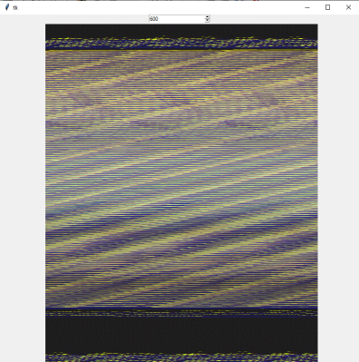
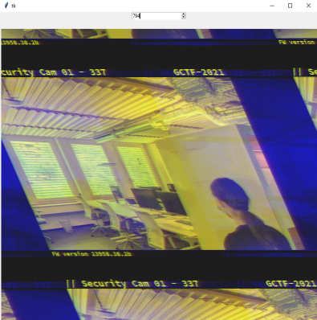
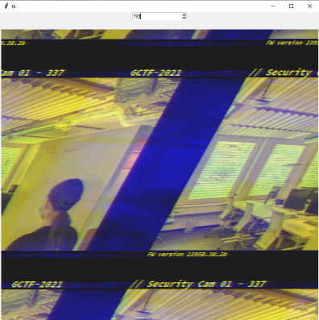
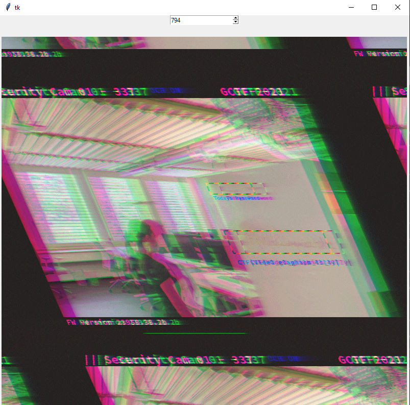
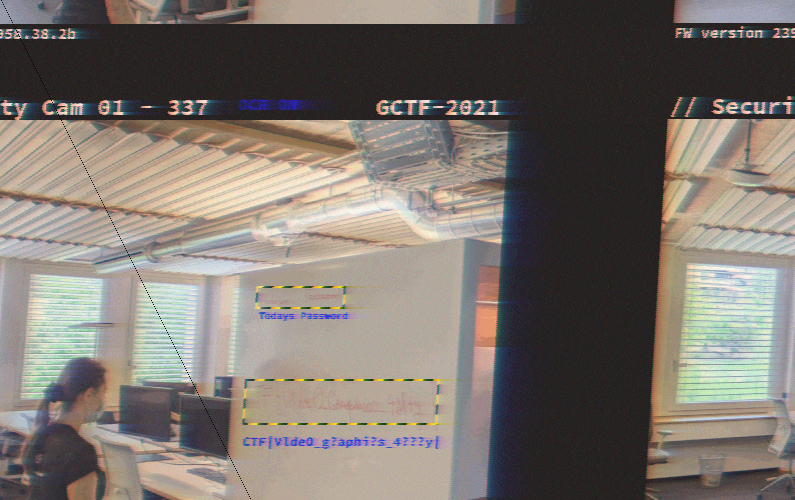

# New York - Office Complex
Category: Hardware

## Description

> New York is hot, and you are on your way to the office complex. It seems like it is well guarded, even though you are expected under the alias of the assassin, perhaps it will be a better idea to sneak inside the building, unseen? You climb through a window on the side of the building. Inside you spot more guards, quick, hide behind a desk. Now you have to sneak past the guards into the main office.
> 
> Challenge: Spycam (hardware)
> 
> You manage to find some exposed wires and quickly hook them up to your portable terminal. It seems to be a live feed of the internal CCTV system. If you can manage to decode the signal you might find something interesting, maybe a code or a password to get past the locked door.

Seven CSV files were attached.

## Solution

We have seven pretty long CSV files, all similar to the following sample:

```console
┌──(user@kali)-[/media/sf_CTFs/google/10_New_York_-_Office_Complex/download]
└─$ head 1.csv
-0.0018051198211097765,4.25,-0.05,-0.05,-0.18
-0.001805079821043734,4.25,-0.05,-0.08,-0.18
-0.0018050398209776917,4.3,-0.05,-0.08,-0.18
-0.0018049998209116493,4.3,-0.05,-0.08,-0.18
-0.0018049598208456068,4.25,-0.05,-0.08,-0.2
-0.0018049198207795644,4.25,-0.05,-0.05,-0.18
-0.001804879820713522,4.25,-0.05,-0.05,-0.18
-0.0018048398206474796,4.25,-0.05,-0.08,-0.18
-0.001804799820581439,4.25,-0.05,-0.05,-0.18
-0.0018047598205153965,4.25,-0.05,-0.08,-0.18

┌──(user@kali)-[/media/sf_CTFs/google/10_New_York_-_Office_Complex/download]
└─$ tail 1.csv
0.022204759820515396,4.25,0.2,0.15,-0.05
0.022204799820581433,4.25,0.2,0.18,-0.05
0.022204839820647478,4.25,0.22,0.2,-0.05
0.02220487982071352,4.25,0.15,0.15,-0.05
0.022204919820779566,4.3,0.15,0.12,-0.05
0.022204959820845603,4.25,0.15,0.12,-0.03
0.022204999820911647,4.25,0.15,0.12,0.0
0.02220503982097769,4.25,0.15,0.12,-0.03
0.022205079821043736,4.3,0.15,0.12,-0.03
0.022205119821109773,4.25,0.15,0.1,0.0
```

All files have the same number of lines (600256):

```console
┌──(user@kali)-[/media/sf_CTFs/google/10_New_York_-_Office_Complex/download]
└─$ wc -l *
   600255 1.csv
   600255 2.csv
   600255 3.csv
   600255 4.csv
   600255 5.csv
   600255 6.csv
   600255 7.csv
  4201785 total
```

According to the description, this is a signal from a CCTV system. The first field seems to be some sort of timestamp, monotonically increasing. The other fields are not so obvious, let's try to understand the different values they have.

For the second column:

```console
┌──(user@kali)-[/media/sf_CTFs/google/10_New_York_-_Office_Complex/download]
└─$ awk -F "\"*,\"*" '{print $2}' 1.csv 2.csv 3.csv 4.csv 5.csv 6.csv 7.csv | sort -n | uniq -c
      1 -0.35
      1 -0.25
      1 0.0
      1 0.15
      5 0.25
      4 0.3
     70 0.35
  20929 0.4
   1219 0.45
      6 0.5
      4 0.55
      1 0.65
      2 0.7
      1 2.4
      1 3.8
      1 3.9
      2 4.0
     50 4.05
   9521 4.1
 585528 4.15
   6828 4.2
1682059 4.25
1891914 4.3
   3608 4.35
     29 4.4
      1 4.45
      1 4.55
      1 4.6
      2 4.8
      1 4.85
```

Most of the time it's somewhere between `4.1` and `4.35`.

The third, forth and fifth columns have similar values:

```console
┌──(user@kali)-[/media/sf_CTFs/google/10_New_York_-_Office_Complex/download]
└─$ awk -F "\"*,\"*" '{print $3}' 1.csv 2.csv 3.csv 4.csv 5.csv 6.csv 7.csv | sort -n | uniq -c
      1 -0.43
     29 -0.4
   6887 -0.38
 847487 -0.35
 347941 -0.33
 162801 -0.3
  87018 -0.28
  95876 -0.25
 119090 -0.23
 118939 -0.2
 115742 -0.18
 114644 -0.15
 110851 -0.12
 131846 -0.1
 164781 -0.08
 178459 -0.05
 209401 -0.03
 185681 0.0
 194934 0.02
 215792 0.05
 246449 0.07
 182451 0.1
 118482 0.12
  82814 0.15
  55192 0.18
  37134 0.2
  28723 0.22
  33381 0.25
   8950 0.28
     16 0.3

┌──(user@kali)-[/media/sf_CTFs/google/10_New_York_-_Office_Complex/download]
└─$ awk -F "\"*,\"*" '{print $4}' 1.csv 2.csv 3.csv 4.csv 5.csv 6.csv 7.csv | sort -n | uniq -c
      1 -0.43
     25 -0.4
   5817 -0.38
1123880 -0.35
 404883 -0.33
  76778 -0.3
  83864 -0.28
  82483 -0.25
  83930 -0.23
  81728 -0.2
  84418 -0.18
  97265 -0.15
 104083 -0.12
 102893 -0.1
 116198 -0.08
 169758 -0.05
 167962 -0.03
 205561 0.0
 237296 0.02
 286013 0.05
 217471 0.07
 117686 0.1
  80445 0.12
  79577 0.15
  61124 0.18
  46113 0.2
  51954 0.22
  30402 0.25
   2184 0.28

┌──(user@kali)-[/media/sf_CTFs/google/10_New_York_-_Office_Complex/download]
└─$ awk -F "\"*,\"*" '{print $5}' 1.csv 2.csv 3.csv 4.csv 5.csv 6.csv 7.csv | sort -n | uniq -c
      3 -0.43
     78 -0.4
   2197 -0.38
1100074 -0.35
 370897 -0.33
  84785 -0.3
  96129 -0.28
 106790 -0.25
 103673 -0.23
 107795 -0.2
 120931 -0.18
 127820 -0.15
 123381 -0.12
 170637 -0.1
 192303 -0.08
 192984 -0.05
 220724 -0.03
 247015 0.0
 271701 0.02
 162702 0.05
  97705 0.07
  78207 0.1
  59063 0.12
  55315 0.15
  38419 0.18
  26835 0.2
  19510 0.22
  20604 0.25
   3515 0.28
```

So, without knowing much about video processing or signals, we're just going to take a wild guess and hope that these are RGB values. Our first step would be to try and extract the first frame from the video stream, by translating the last three columns to RBG values between `0` and `255` and saving the result as a still image. However, before doing that we need to understand what's the width of the image. There might be some standard or a way to extract this from the signals, but we're just going to play around with different widths until we find something that looks good. For that, we hack up the following utility:

```python
import tkinter
from PIL import Image, ImageTk
import csv
import sys

MAX_WIDTH = 1024

class WidthSelector():
    def __init__(self, path) -> None:
        self.pixels = []
        with open(path) as csv_file:
            csv_reader = csv.reader(csv_file, delimiter=',')
            for row in csv_reader:
                self.pixels.append(tuple(map(lambda x: self.convert(float(x)), row[2:5])))
        
        self.root = tkinter.Tk()
        self.root.geometry('1024x768')
        width_var = tkinter.StringVar(self.root)
        width_var.set(600)
        self.spinner = tkinter.Spinbox(self.root, from_ = 1, to = MAX_WIDTH, command = self.spinbox_callback, textvariable = width_var)
        self.spinner.bind('<Return>', self.spinbox_callback)
        self.spinner.pack()
        self.canvas = tkinter.Canvas(self.root, width = MAX_WIDTH, height = MAX_WIDTH)
        self.canvas.pack()
        self.spinbox_callback()
        
    def run(self):
        self.root.mainloop()

    def convert(self, original_value):
        old_min = -0.43
        old_max = 0.3
        new_max = 255
        new_min = 0
        return int((((original_value - old_min) * (new_max - new_min)) / (old_max - old_min)) + new_min)

    def spinbox_callback(self, event = None):
        width = int(self.spinner.get())
        height = len(self.pixels) // width
        newImage = Image.new("RGB", (width, height))
        newImage.putdata(self.pixels[:width * height])
        self.image = ImageTk.PhotoImage(newImage)
        self.canvas.create_image(400, 400, image = self.image)

if __name__ == "__main__":
    ws = WidthSelector(sys.argv[1])
    ws.run()
```

Running it on the first CSV, with the initial width of `600`, we get:



However, increasing to `794`, we get a reasonable image:



Moving to `795` produces the following:



So we can't seem to get a straight image, but let's see if we can work with what we have. The next thing we'd want to do is extract more frames. However, notice how we're using up (almost) all of the pixels just to draw this image. This means that there are no more frames. 

Repeating the procedure for the other CSVs, we observe someone approaching a whiteboard and writing something on it. The last CSV gives us the most information, since it also contains the output of an OCR:



It says:

```
Today's password:
CTF|V1de0_g?aphi?s_4???y|
```

So, we're close, but we need to identify the missing letters. However, it's pretty hard given the image. Notice how the red, green and blue pixels don't seem to overlap in the image we've received. Again, there probably is a better way of fixing this, but with more trial and error I was able to get a better quality image by manually applying offsets to align all colors:

```python
import csv
from PIL import Image

def convert(original_value):
    old_min = -0.43
    old_max = 0.3
    new_max = 255
    new_min = 0
    return int((((original_value - old_min) * (new_max - new_min)) / (old_max - old_min)) + new_min)

with open('download/7.csv') as csv_file:
    values = []
    csv_reader = csv.reader(csv_file, delimiter=',')
    for i, row in enumerate(csv_reader):
        values.append(tuple(map(lambda x: convert(float(x)), row[2:5])))
    
    size = (795, 500)
    img = Image.new("RGB", size)
    pixels = []
    counter = 0
    for i, row in enumerate(values):
        if len(pixels) == size[0] * size[1]:
            img.putdata(pixels)
            img.save(f"out.png")
            break

        pixels.append((values[i][0],values[i+25][1], values[i+1][2]))
    
        if i % (795*2) == 0:
            pixels.append((0,0,0))
```

This produces:



The text still isn't very clear, but we can see that the `g` in `g?aphi?s` is a capital, and that the character before the last one looks like `4`. From here, it's just plain old guessing: `CTF{V1de0_Graphics_4rr4y}`.