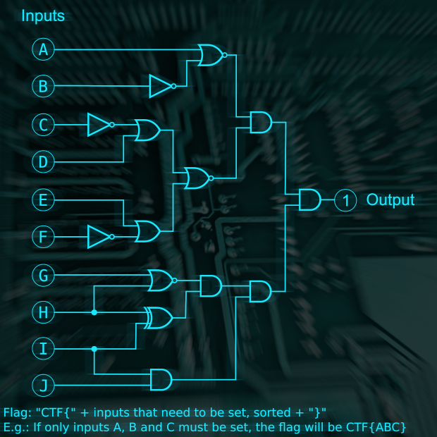

# Moscow - Apartment 
Category: Misc.

## Description

> It’s a cold day, and the snow is falling horizontally. It pierces your sight. You better use those extra pairs of socks that you were strangely given by the driver. Someone is waving on the other side of the street. You walk over to her. "Hi AGENT, I’m AGENT X, we’ve found the apartment of a person that we suspect got something to do with the mission. Come along!."
> 
> Challenge: Logic Lock (misc)
> 
> It turned out suspect's appartment has an electronic lock. After analyzing the PCB and looking up the chips you come to the conclusion that it's just a set of logic gates!



## Solution

We need to find the input that will produce the expected output of `1`. We'll just implement the circuit in Python and try all possibilities:

```python
import itertools

def AND (a, b):
    return a and b

def OR(a, b):
    return a or b

def XOR (a, b):
    return a ^ b

def NOT(a):
    return not a

def NOR(a, b):
    return not (a or b)

def circuit(inputs):
    return AND(
            AND(
                NOR(
                    inputs['A'],
                    NOT(inputs['B'])
                ),
                NOR(
                    OR(
                        NOT(inputs['C']),
                        inputs['D']
                    ),
                    OR(
                        inputs['E'],
                        NOT(inputs['F'])
                    )
                )
            ),
            
            AND(
                AND(
                    NOR(
                        inputs['G'],
                        inputs['H']
                    ),
                    XOR(
                        inputs['H'],
                        inputs['I']
                    )
                ),
                AND(
                    inputs['I'],
                    inputs['J']
                )
            )
        )

letters = "ABCDEFGHIJ"

for combination in itertools.product([0, 1], repeat = len(letters)):
    inputs = {letter: value for letter, value in zip(letters, combination)}
    if circuit(inputs) == 1:
        print (inputs)
        print("CTF{{{}}}".format("".join(sorted(c for c, v in inputs.items() if v == 1))))
```

Output:

```console
┌──(user@kali)-[/media/sf_CTFs/google/2_Moscow_-_Apartment]
└─$ python3 solve.py
{'A': 0, 'B': 1, 'C': 1, 'D': 0, 'E': 0, 'F': 1, 'G': 0, 'H': 0, 'I': 1, 'J': 1}
CTF{BCFIJ}
```