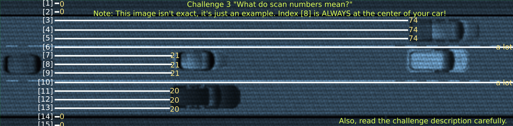
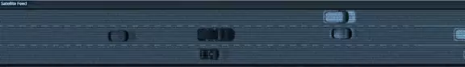

# Moscow - Streets
Category: Misc.

## Description

> The person drives into a narrow back alley and despite the danger you try to continue on and give chase. It is impossible to see who they are, clothed all in black and a helmet covering the face. You need to intercept them somehow.
> 
> Challenge: High Speed Chase (misc)
> 
> You chase them through city streets until you reach the high way. The traffic is pretty rough for a car and you see them gaining ground - should have hotwired a motorbike as well! Too late for that. You look around your car to spot anything useful, and you notice this is actually one of the new self driving cars. You turn on the autopilot, pull out your laptop, connect it to the system, and enter the not-so-hidden developer's mode. It's time to re-program the autopilot to be a bit more useful in a chase! To make it easier, you replace the in-car LiDAR feed with a feed from an overhead sattelite - you also display it on the the entertainment system. Now all that's left to do, is to write a better controlCar function!

## Solution

Visiting the attached website, we receive an interface for a self-driving car and the following explanation:

> #### Car Self-Driving Interface
> 
> You need to re-implement the `controlCar` function.
> 
> To implement it in JavaScript use the editor on the left.
> 
> When implemented, `controlCar` function will be called several times per second during the chase to allow for course corrections.
> 
> The `controlCar` function takes a single parameter – `scanArray` – which is an array containing 17 integers denoting distance from your car to the nearest obstacle:
> 
> * [indexes 0-7]: on the left side of the car (index 7 is the measurement at the left headlight)
> * [index 8]: at the center of the car
> * [indexes 9-16]: on the right side of the car (index 9 is the measurement at the right headlight)
> 
> See also this image (it's not precise, but will give you an idea what you are looking at):
> 
> 
> 
> All measurements are parallel to each other.
> 
> A negative measurement might appear if the obstacle is very close behind our car.
> 
> The `controlCar` must return an integer denoting where the car should drive:
> 
> * `-1`: (or any other negative value): drive more to the left,
> * `0`: continue straight / straighten up the car,
> * `1`: (or any other positive value): drive more to the right.

We receive the ability to implement the body of:

```javascript
function controlCar(scanArray) {

}
```


Let's start with a very naive implementation: Just logging what we get:

```javascript
function controlCar(scanArray) {
    console.log(scanArray);
}
```

The animation shows the car drives forward, breaking a split second before hitting the car in front of it. We get:

```
Array(17) [ 0, 0, 0, 0, 9.25, 9.25, 9.25, 9, 9, 9, … ]
​0: 0
​1: 0
​2: 0
​3: 0
​4: 9.25
​5: 9.25
​6: 9.25
​7: 9
​8: 9
​9: 9
​10: 37.25
​11: 37.25
​12: 37.25
​13: 0
​14: 0
​15: 0
​16: 0
​length: 17
​<prototype>: Array []
line 874 > Function:3:9
Array(17) [ 0, 0, 0, 0, 8.25, 8.25, 8.25, 8, 8, 8, … ]
line 874 > Function:3:9
Array(17) [ 0, 0, 0, 0, 7.25, 7.25, 7.25, 7, 7, 7, … ]
line 874 > Function:3:9
Array(17) [ 0, 0, 0, 0, 6.25, 6.25, 6.25, 6, 6, 6, … ]
line 874 > Function:3:9
Array(17) [ 0, 0, 0, 0, 5.25, 5.25, 5.25, 5, 5, 5, … ]
line 874 > Function:3:9
Array(17) [ 0, 0, 0, 0, 4.25, 4.25, 4.25, 4, 4, 4, … ]
line 874 > Function:3:9
Array(17) [ 0, 0, 0, 0, 3.25, 3.25, 3.25, 3, 3, 3, … ]
​0: 0
​1: 0
​2: 0
​3: 0
​4: 3.25
​5: 3.25
​6: 3.25
​7: 3
​8: 3
​9: 3
​10: 31.25
​11: 31.25
​12: 31.25
​13: 0
​14: 0
​15: 0
​16: 0
​length: 17
​<prototype>: Array []
line 874 > Function:3:9
Emergency Abort! Car would crash!
```

So we can see that indices `7-9` started with a distance of `9`, and as we approached the car in front of us, decreased until `3`.

Let's try another naive implementation by always returning `LEFT`:

```javascript
function controlCar(scanArray) {
    console.log(scanArray);
    return -1;
}
```

Output:

```
Array(17) [ 0, 0, 0, 0, 9.25, 9.25, 9.25, 9, 9, 9, … ]
line 874 > Function:3:9
Array(17) [ 0, 0, 0, 0, 0, 8.25, 8.25, 8.25, 8, 8, … ]
line 874 > Function:3:9
Array(17) [ 0, 0, 0, 0, 0, 7.25, 7.25, 7.25, 7, 7, … ]
line 874 > Function:3:9
Array(17) [ 0, 0, 0, 0, 0, 0, 6.25, 6.25, 6.25, 6, … ]
line 874 > Function:3:9
Array(17) [ 0, 0, 0, 0, 0, 0, 0, 5.25, 5.25, 5.25, … ]
line 874 > Function:3:9
Emergency Abort! Would hit curb!
```

Here we can see that the left indicators decreased until all were zeroes, and we (almost) hit the curb.

Now, let's see an implementation that avoids all obstacles:

```javascript
function controlCar(scanArray) {
    const GO_LEFT = -1;
    const GO_RIGHT = 1;
    const GO_STREIGHT = 0;

    const SENSOR_LEFT_MIN_INDEX = 0;
    const SENSOR_LEFT_MAX_INDEX = 7;
    const SENSOR_RIGHT_MIN_INDEX = 9;
    const SENSOR_RIGHT_MAX_INDEX = 16;

    const MIN_DISTANCE = 12;

    console.log(scanArray);

    const isObstacleAhead = function(){
        for (let i = SENSOR_LEFT_MAX_INDEX ; i <= SENSOR_RIGHT_MIN_INDEX ; i++) {
            if (scanArray[i] - MIN_DISTANCE < 0) {
                return true;
            }
        }
        return false;
    };

    const avgDist = function(start, end){
        let sum = 0;
        let nonZero = 0;
        for (let i = start; i <= end; i++) {
            sum += scanArray[i];
            if (scanArray[i] != 0) {
                nonZero += 1;
            }
        }
        if (nonZero == 0) {
            return 0;
        }
        return sum / nonZero;
    };

    const getDistLeft  = function(){ return avgDist(SENSOR_LEFT_MIN_INDEX , SENSOR_LEFT_MAX_INDEX - 1);  };
    const getDistRight = function(){ return avgDist(SENSOR_RIGHT_MIN_INDEX + 1, SENSOR_RIGHT_MAX_INDEX); };

    let res = null;
    let distLeft, distRight;

    let obstacleAhead = isObstacleAhead();
    if (!obstacleAhead) {
        res = GO_STREIGHT;
    }
    else {
        distLeft = getDistLeft();
        distRight = getDistRight();
        if (distLeft > distRight) {
            res = GO_LEFT;
        }
        else {
            res = GO_RIGHT;
        }
    }
    console.log(obstacleAhead, distLeft, distRight, res);
    return res;
}
```

The implementation keeps driving ahead as long as there's no obstacle closer than `MIN_DISTANCE`. Otherwise, it takes a turn to the side that has the furthest obstacle ahead.



The animation is pretty cool, and after a short drive we get the flag: `CTF{cbe138a2cd7bd97ab726ebd67e3b7126707f3e7f}`