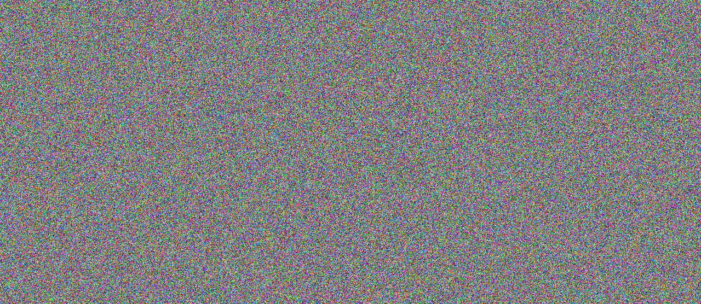
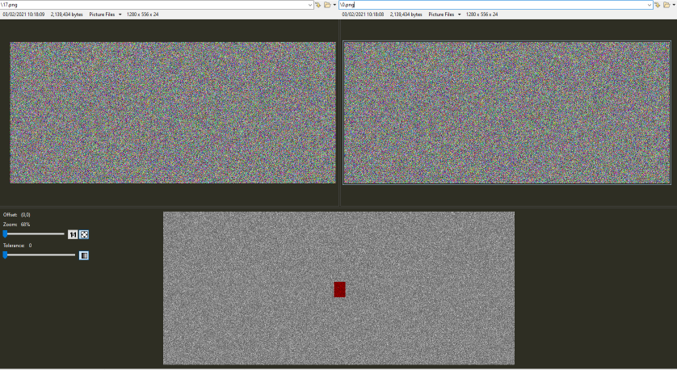
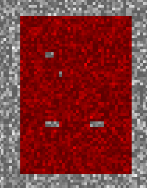
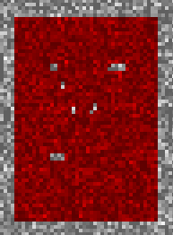
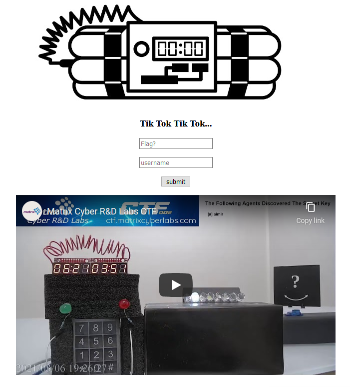
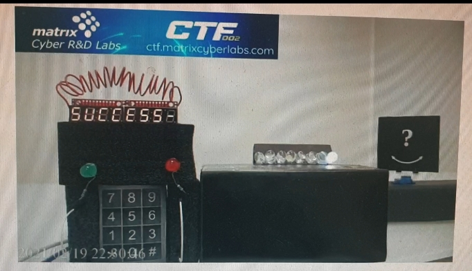

# Exclusive Bomb
Category: Special, 250 Points

## Description

> 
> Agent! Your special skills are required once more.
> 
> A bomb threatens the agency's main facility and stakes are high. We need you to determine which of the wires to cut, either the red or the green. But never both!
> 
> Try and defuse the bomb in (LINK) using your new knowledge !


A zip file was attached.

## Solution

This is the last challenge of the CTF and it was unlocked only after all the other challenges were solved.

The zip file contained the following files:

```console
root@kali:/media/sf_CTFs/matrix/Exclusive_Bomb# ls Exclusive_Bomb
0.png   13.png  17.png  20.png  24.png  28.png  31.png  35.png  39.png  42.png  6.png  final.png
10.png  14.png  18.png  21.png  25.png  29.png  32.png  36.png  3.png   43.png  7.png
11.png  15.png  19.png  22.png  26.png  2.png   33.png  37.png  40.png  4.png   8.png
12.png  16.png  1.png   23.png  27.png  30.png  34.png  38.png  41.png  5.png   9.png
```

All files were 1280x556 and they all were composed of what looked like random pixels, e.g.:



However, when comparing any two random images (except for `final.png`), we noticed that only a small rectangle in the center of the image was actually different (the different pixels are marked in red in the bottom view):



Now, the challenge title and description strongly hint towards the need to use the XOR operation for the solution, but at first we couldn't figure out how it fits in and solved the challenge without XORing. In short, we noticed that in many cases, if we take a closer look at the "different" area of two random images, we find at least some identical pixels. 

For example:



Or:



Of course, this is theoretically possible for random data, but chances are low that we'd see so many identical pixels. So, what we did at first was to compare each image to all the other images (except for `final.png` which didn't match the pattern) and mark in a new (output) image all the identical pixels:

```python
from PIL import Image
from PIL import ImageChops
import os

if not os.path.isdir("Eq"):
   os.mkdir("Eq")

file_names = [f"{x}.png" for x in range(44)] + ["final.png"]
cropped_images = []
for file_name in file_names:
   img = Image.open(f'Exclusive_Bomb/{file_name}')
   imc = img.crop((623, 254, 623+40, 254+57)) 
   cropped_images.append(imc)

for base_img_index, img in enumerate(cropped_images[:-1]):
   in_pixels = list(img.getdata())
   out_pixels = [(0, 0, 0) for i in range(len(in_pixels))]
   for img_index, img in enumerate(cropped_images[:-1]):
      if base_img_index != img_index:
         in_pixels2 = list(img.getdata())

         for i in range(len(in_pixels)):
            r , g , b  = in_pixels[i]
            r2, g2, b2 = in_pixels2[i]
            if r == r2 and g == g2 and b == b2:
               out_pixels[i] = (255, 255, 255)

   out_img = Image.new(cropped_images[0].mode, cropped_images[0].size)
   out_img.putdata(out_pixels)
   out_img.save(f"Eq/{base_img_index}.png", "PNG")
```

This gave us the flag, but wasn't the intended solution. We later went back and solved it with XOR as intended:

```python
from PIL import Image
import numpy as np
import os

OUT_PATH = "out"
NUM_IMAGES = 44

if not os.path.isdir(OUT_PATH):
   os.mkdir(OUT_PATH)

file_names = [f"{x}.png" for x in range(NUM_IMAGES)] + ["final.png"]
img_data = [np.asarray(Image.open(f'Exclusive_Bomb/{name}')) for name in file_names]

all_data_xored = img_data[0].copy()
for data in img_data[1:]:
    all_data_xored ^= data

for i in range(NUM_IMAGES):
    new_image = Image.fromarray(all_data_xored ^ img_data[i])
    new_image.save(os.path.join(OUT_PATH, f"{i}.png"), "PNG")
```

The trick was to XOR all the images together (including `final.png`) except for one each time - revealing a single letter of the flag. For example, for the second letter, we need to XOR:

```
0.png ^ 2.png ^ 3.png ^ ... ^ 43.png ^ final.png
```

For the third:

```
0.png ^ 1.png ^ 3.png ^ ... ^ 43.png ^ final.png
```

And so on.

We accomplished that by first XORing all the images:

```
0.png ^ 1.png ^ 2.png ^ ... ^ 43.png ^ final.png
```

Then each time "canceling" one image by XORing it again (using the fact that `x ^ x = 0`):

```
(0.png ^ 1.png ^ 2.png ^ ... ^ 43.png ^ final.png) ^ 1.png = 
0.png ^ (1.png ^ 1.png) ^ 2.png ^ ... ^ 43.png ^ final.png = 
0.png ^ (0) ^ 2.png ^ ... ^ 43.png ^ final.png = 
0.png ^ 2.png ^ ... ^ 43.png ^ final.png
```

This gave us 44 images such as:


Which spelled out the flag: `MCL{Y0U_D3F1nitely_N33D_TO_Cu7_Th3_Red_0NE!}`.

We entered the flag in the CTF Room:



And defused the bomb!

