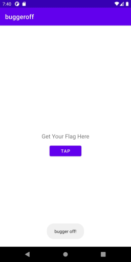

# Oh, Bugger
Category: Mobile, 300 Points

## Description

> 
> Hello agent,
> 
> Our field operatives managed to get their hands on a mobile device thought to belong to an important asset.
> 
> The R&D department has narrowed their research down to a specific app, which they believe contains important information.
> 
> Now it’s up to you to find a way to retrieve it.
> 
> Good luck!

An apk was attached.

## Solution

Let's extract the APK:

```console
root@kali:/media/sf_CTFs/matrix/Oh_Bugger# ~/utils/jadx/build/jadx/bin/jadx -d output buggeroff.apk
INFO  - loading ...
INFO  - processing ...
ERROR - finished with errors, count: 1
```

We get lots of files, but the interesting ones are here:
```console
root@kali:/media/sf_CTFs/matrix/Oh_Bugger/output/sources/com/w# tree -r
.
└── buggeroff
    ├── R.java
    ├── MainActivity.java
    ├── GenerateKeys.java
    └── BuildConfig.java

1 directory, 4 files
```

`MainActivity.java` contains:

```java
package com.w.buggeroff;

import android.content.Context;
import android.os.Bundle;
import android.util.Base64;
import android.view.View;
import android.widget.Button;
import android.widget.TextView;
import android.widget.Toast;
import androidx.appcompat.app.AppCompatActivity;
import java.security.InvalidAlgorithmParameterException;
import java.security.InvalidKeyException;
import java.security.NoSuchAlgorithmException;
import java.util.Arrays;
import javax.crypto.BadPaddingException;
import javax.crypto.Cipher;
import javax.crypto.IllegalBlockSizeException;
import javax.crypto.NoSuchPaddingException;
import javax.crypto.spec.IvParameterSpec;
import javax.crypto.spec.SecretKeySpec;
public class MainActivity extends AppCompatActivity {
    String alg = "AES_256/CBC/PKCS7Padding";
    Button b;
    Cipher cipher;
    TextView t;

    public static boolean setOperation(int i) {
        return i == 1;
    }

    /* access modifiers changed from: protected */
    @Override // androidx.appcompat.app.AppCompatActivity, androidx.fragment.app.FragmentActivity, androidx.activity.ComponentActivity, androidx.core.app.ComponentActivity, android.app.Activity
    public void onCreate(Bundle bundle) {
        super.onCreate(bundle);
        setContentView(R.layout.activity_main);
        TextView textView = (TextView) findViewById(R.id.textView);
        this.t = textView;
        textView.setText(R.string.flagTextView);
        Button button = (Button) findViewById(R.id.button);
        this.b = button;
        button.setText(R.string.flagButton);
        this.b.setOnClickListener(new View.OnClickListener(getApplicationContext()) { // from class: com.w.buggeroff.-$$Lambda$MainActivity$CVSqxdPSN7ok2Dz-simIOyQFWxU
            public final /* synthetic */ Context f$1;

            {
                this.f$1 = r2;
            }

            @Override // android.view.View.OnClickListener
            public final void onClick(View view) {
                MainActivity.this.lambda$onCreate$0$MainActivity(this.f$1, view);
            }
        });
    }

    public /* synthetic */ void lambda$onCreate$0$MainActivity(Context context, View view) {
        if (!setOperation(0)) {
            Toast.makeText(context, "bugger off!", 0).show();
            return;
        }
        try {
            this.cipher = Cipher.getInstance(this.alg);
            byte[] key = GenerateKeys.getKey(context);
            this.cipher.init(2, new SecretKeySpec(Arrays.copyOfRange(key, 0, 32), this.alg), new IvParameterSpec(Arrays.copyOfRange(key, 48, 64)));
            this.cipher.doFinal(Base64.decode("iGWkBaxepj8l7BrKpeIntuEjRqHv3Tt41hRw7w+UwwcXTrlb/l9tELh9RflIpyDT", 0));
        } catch (InvalidAlgorithmParameterException | InvalidKeyException | NoSuchAlgorithmException | BadPaddingException | IllegalBlockSizeException | NoSuchPaddingException e) {
            e.printStackTrace();
        }
    }
}
```

`GenerateKey.java` contains:

```java
package com.w.buggeroff;

import android.content.Context;
import android.content.pm.PackageManager;
import android.content.pm.Signature;
import android.util.Base64;
import java.security.MessageDigest;
import java.security.NoSuchAlgorithmException;
public class GenerateKeys {
    public static byte[] getKey(Context context) {
        String str = "";
        try {
            Signature[] apkContentsSigners = context.getPackageManager().getPackageInfo(BuildConfig.APPLICATION_ID, 134217728).signingInfo.getApkContentsSigners();
            for (Signature signature : apkContentsSigners) {
                MessageDigest instance = MessageDigest.getInstance("SHA-384");
                instance.update(signature.toByteArray());
                str = Base64.encodeToString(instance.digest(), 0, instance.getDigestLength(), 2);
            }
        } catch (PackageManager.NameNotFoundException | NoSuchAlgorithmException e) {
            e.printStackTrace();
        }
        return str.getBytes();
    }
}
```

We can see that the main activity creates a button, labels it with the text from `R.string.flagButton` and performs some action when it is clicked:

```java
if (!setOperation(0)) {
    Toast.makeText(context, "bugger off!", 0).show();
    return;
}
try {
    this.cipher = Cipher.getInstance(this.alg);
    byte[] key = GenerateKeys.getKey(context);
    this.cipher.init(2, new SecretKeySpec(Arrays.copyOfRange(key, 0, 32), this.alg), new IvParameterSpec(Arrays.copyOfRange(key, 48, 64)));
    this.cipher.doFinal(Base64.decode("iGWkBaxepj8l7BrKpeIntuEjRqHv3Tt41hRw7w+UwwcXTrlb/l9tELh9RflIpyDT", 0));
} catch (InvalidAlgorithmParameterException | InvalidKeyException | NoSuchAlgorithmException | BadPaddingException | IllegalBlockSizeException | NoSuchPaddingException e) {
    e.printStackTrace();
}
```

The first condition seems to be impossible to bypass natively, due to the implementation of `setOperation`:

```java
public static boolean setOperation(int i) {
    return i == 1;
}
```

Since the function is called with the parameter of `0`, it will return false, causing the application to pop-up a "bugger off!" message.

We can see this when running the application with the emulator:



Since we'd like to change the runtime behavior of the application in order to bypass this condition, we should probably turn to [Frida](https://frida.re/) - a "Dynamic instrumentation toolkit for developers, reverse-engineers, and security researchers".

> Inject your own scripts into black box processes. Hook any function, spy on crypto APIs or trace private application code, no source code needed. Edit, hit save, and instantly see the results. All without compilation steps or program restarts.

Frida scripts are written in Javascript. Let's start by presenting just the code needed to bypass our problematic condition. At the end, we'll show the boilerplate code as well.

```javascript
// Function to hook is defined here
  var ma = Java.use('com.w.buggeroff.MainActivity');

  ma.setOperation.overload('int').implementation = function (a) {
    console.log('[*] Intercepted setOperation !');
    return true;
  };  
```

Here we're replacing the `setOperation` with an alternative implementation that always returns `true` (after logging some debug message to the console).

Assuming this will allow us to move forward, how do we get the flag? We can see that the flag is the product of some cryptographic operation, so we chose to simply hook the cryptographic function and print its result to the log:

```javascript
var c = Java.use("javax.crypto.Cipher");
  c.doFinal.overload('[B').implementation = function (x) { // replace original implementation
    var value = this.doFinal(x); // call original implementation

    var androidBase64 = Java.use('android.util.Base64')
    var bytesInJava = androidBase64.encodeToString(value, 0)

    console.log(bytesInJava);

    // then do what you want with the returned value HERE
    // and finally return it so you don't break the app
    return value;
};
```

This should log to the console the result of the decryption (base64-encoded) by hooking `doFinal`.

Adding the Firda boilerplate code (which is actually in Python), we get:

```python
import frida, sys
import time
def on_message(message, data):
    if message['type'] == 'send':
        print("[*] {0}".format(message['payload']))
    else:
        print(message)

jscode = """
Java.perform(function () {
  // Function to hook is defined here
  var ma = Java.use('com.w.buggeroff.MainActivity');

  ma.setOperation.overload('int').implementation = function (a) {
    console.log('[*] Intercepted setOperation !');
    return true;
  };  

  var c = Java.use("javax.crypto.Cipher");
  c.doFinal.overload('[B').implementation = function (x) { // replace original implementation
    var value = this.doFinal(x); // call original implementation

    var androidBase64 = Java.use('android.util.Base64')
    var bytesInJava = androidBase64.encodeToString(value, 0)

    console.log(bytesInJava);

    // then do what you want with the returned value HERE
    // and finally return it so you don't break the app
    return value;
  };
});
"""

device = frida.get_usb_device()
pid = device.spawn(["com.w.buggeroff"])
session = device.attach(pid)
script = session.create_script(jscode)
script.on('message', on_message)
print('[*] Running CTF')
script.load()
time.sleep(1)
device.resume(pid)
sys.stdin.read()
```

To run it, we first run:

```
adb root
adb push frida-server /data/local/tmp/
adb shell "chmod 777 /data/local/tmp/frida-server"
adb shell "/data/local/tmp/frida-server &"
```

The we run the Python file, followed by pressing "tap" in the application:

```console
$ python3 bugger.py
[*] Running CTF
[*] Intercepted setOperation !
TUNMezBCZnU1Q2E3aW45XzRuRHJvMURfTm9fNXRSMU5nNV9BN3Q0Y2gzZH0=
```

And we get the base64-encoded flag.

Let's decode it:
```console
$ echo TUNMezBCZnU1Q2E3aW45XzRuRHJvMURfTm9fNXRSMU5nNV9BN3Q0Y2gzZH0= | base64 -d
MCL{0Bfu5Ca7in9_4nDro1D_No_5tR1Ng5_A7t4ch3d}
```
