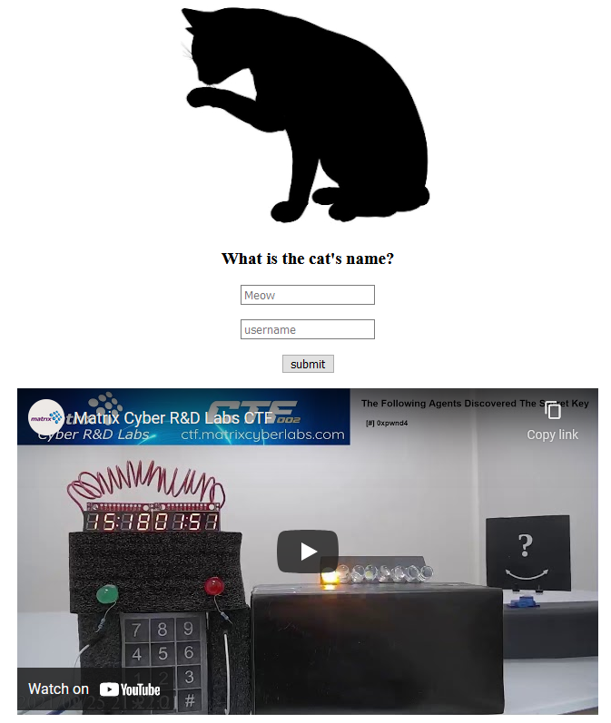

# Royal Cat
Category: Reversing, 400 Points

## Description
> Hello agent!
> 
> The Queen's royal cat is missing from the grounds.
> Your mission is to find and bring him home safely.
> 
> Hint : You should have a look in the ctfroom.
> 

A binary file was attached.

## Solution

Let's run the attached binary:

```console
root@kali:/media/sf_CTFs/matrix/Royal_Cat# ./Meow
Meow Meow...
Error opening file: No such file or directory
```

So it's trying to open a file. Which file is that? Perhaps `strace` can help us find out:

```console
root@kali:/media/sf_CTFs/matrix/Royal_Cat# strace ./Meow
execve("./Meow", ["./Meow"], 0x7ffcac392040 /* 21 vars */) = 0
open("/proc/self/exe", O_RDONLY)        = 3
mmap(NULL, 967990, PROT_READ|PROT_WRITE, MAP_PRIVATE|MAP_ANONYMOUS, -1, 0) = 0x7fb65d57e000
mmap(0x7fb65d57e000, 967592, PROT_READ|PROT_WRITE, MAP_PRIVATE|MAP_FIXED, 3, 0) = 0x7fb65d57e000
mprotect(0x7fb65d669000, 5430, PROT_READ|PROT_EXEC) = 0
readlink("/proc/self/exe", "/media/sf_CTFs/matrix/Royal_Cat/"..., 4095) = 36
mmap(0x7fb65d66b000, 2105344, PROT_NONE, MAP_PRIVATE|MAP_FIXED|MAP_ANONYMOUS, -1, 0) = 0x7fb65d66b000
mmap(0x7fb65d66b000, 1888, PROT_READ|PROT_WRITE, MAP_PRIVATE|MAP_FIXED|MAP_ANONYMOUS, -1, 0) = 0x7fb65d66b000
mprotect(0x7fb65d66b000, 1888, PROT_READ) = 0
mmap(0x7fb65d66c000, 2088045, PROT_READ|PROT_WRITE|PROT_EXEC, MAP_PRIVATE|MAP_FIXED|MAP_ANONYMOUS, -1, 0x1000) = 0x7fb65d66c000
mprotect(0x7fb65d66c000, 2088045, PROT_READ|PROT_EXEC) = 0
mmap(0x7fb65d86a000, 568, PROT_READ|PROT_WRITE, MAP_PRIVATE|MAP_FIXED|MAP_ANONYMOUS, -1, 0x1ff000) = 0x7fb65d86a000
mprotect(0x7fb65d86a000, 568, PROT_READ) = 0
mmap(0x7fb65d86b000, 4216, PROT_READ|PROT_WRITE, MAP_PRIVATE|MAP_FIXED|MAP_ANONYMOUS, -1, 0x1ff000) = 0x7fb65d86b000
mprotect(0x7fb65d86b000, 4216, PROT_READ|PROT_WRITE) = 0
open("/lib64/ld-linux-x86-64.so.2", O_RDONLY) = 4
read(4, "\177ELF\2\1\1\0\0\0\0\0\0\0\0\0\3\0>\0\1\0\0\0\220\20\0\0\0\0\0\0"..., 1024) = 1024
mmap(NULL, 184320, PROT_NONE, MAP_PRIVATE|MAP_ANONYMOUS, -1, 0) = 0x7fb65d551000
mmap(0x7fb65d551000, 3944, PROT_READ, MAP_PRIVATE|MAP_FIXED, 4, 0) = 0x7fb65d551000
mmap(0x7fb65d552000, 127056, PROT_READ|PROT_EXEC, MAP_PRIVATE|MAP_FIXED, 4, 0x1000) = 0x7fb65d552000
mmap(0x7fb65d572000, 31556, PROT_READ, MAP_PRIVATE|MAP_FIXED, 4, 0x21000) = 0x7fb65d572000
mmap(0x7fb65d57b000, 8192, PROT_READ|PROT_WRITE, MAP_PRIVATE|MAP_FIXED, 4, 0x29000) = 0x7fb65d57b000
mmap(0x7fb65d57d000, 376, PROT_READ|PROT_WRITE, MAP_PRIVATE|MAP_FIXED|MAP_ANONYMOUS, -1, 0) = 0x7fb65d57d000
close(4)                                = 0
mmap(NULL, 4096, PROT_READ, MAP_PRIVATE, 3, 0) = 0x7fb65d550000
close(3)                                = 0
munmap(0x7fb65d57e000, 967990)          = 0
brk(NULL)                               = 0x7fb65e356000
access("/etc/ld.so.preload", R_OK)      = -1 ENOENT (No such file or directory)
openat(AT_FDCWD, "/etc/ld.so.cache", O_RDONLY|O_CLOEXEC) = 3
fstat(3, {st_mode=S_IFREG|0644, st_size=101561, ...}) = 0
mmap(NULL, 101561, PROT_READ, MAP_PRIVATE, 3, 0) = 0x7fb65d652000
close(3)                                = 0
openat(AT_FDCWD, "/lib/x86_64-linux-gnu/libc.so.6", O_RDONLY|O_CLOEXEC) = 3
read(3, "\177ELF\2\1\1\3\0\0\0\0\0\0\0\0\3\0>\0\1\0\0\0\0n\2\0\0\0\0\0"..., 832) = 832
fstat(3, {st_mode=S_IFREG|0755, st_size=1839792, ...}) = 0
mmap(NULL, 8192, PROT_READ|PROT_WRITE, MAP_PRIVATE|MAP_ANONYMOUS, -1, 0) = 0x7fb65d650000
mmap(NULL, 1852680, PROT_READ, MAP_PRIVATE|MAP_DENYWRITE, 3, 0) = 0x7fb65d38b000
mprotect(0x7fb65d3b0000, 1662976, PROT_NONE) = 0
mmap(0x7fb65d3b0000, 1355776, PROT_READ|PROT_EXEC, MAP_PRIVATE|MAP_FIXED|MAP_DENYWRITE, 3, 0x25000) = 0x7fb65d3b0000
mmap(0x7fb65d4fb000, 303104, PROT_READ, MAP_PRIVATE|MAP_FIXED|MAP_DENYWRITE, 3, 0x170000) = 0x7fb65d4fb000
mmap(0x7fb65d546000, 24576, PROT_READ|PROT_WRITE, MAP_PRIVATE|MAP_FIXED|MAP_DENYWRITE, 3, 0x1ba000) = 0x7fb65d546000
mmap(0x7fb65d54c000, 13576, PROT_READ|PROT_WRITE, MAP_PRIVATE|MAP_FIXED|MAP_ANONYMOUS, -1, 0) = 0x7fb65d54c000
close(3)                                = 0
arch_prctl(ARCH_SET_FS, 0x7fb65d651540) = 0
mprotect(0x7fb65d546000, 12288, PROT_READ) = 0
mprotect(0x7fb65d86b000, 4096, PROT_READ) = 0
mprotect(0x7fb65d57b000, 4096, PROT_READ) = 0
munmap(0x7fb65d652000, 101561)          = 0
ptrace(PTRACE_TRACEME)                  = -1 EPERM (Operation not permitted)
fstat(1, {st_mode=S_IFCHR|0600, st_rdev=makedev(0x88, 0), ...}) = 0
brk(NULL)                               = 0x7fb65e356000
brk(0x7fb65e377000)                     = 0x7fb65e377000
write(1, "I'm being debugged!\n", 20I'm being debugged!
)   = 20
exit_group(1)                           = ?
+++ exited with 1 +++
```

Looks like it has some basic anti-debug mechanism which uses `ptrace` and aborts when it detects a debugger.

Perhaps `strings`?

```console
root@kali:/media/sf_CTFs/matrix/Royal_Cat# strings ./Meow | head
UPX!
m@/P
 G&8
/lib64
nux-x86-
.so.
v+_8/
fopen
y{rror
telluts
```

Well, no useful filename found there, but notice how the first string is "UPX!". This is usually the signature of executables packed with [UPX](https://en.wikipedia.org/wiki/UPX) - an open source executable packer. In order to investigate the executable we probably want to decompress it first:

```console
root@kali:/media/sf_CTFs/matrix/Royal_Cat# upx -d ./Meow
                       Ultimate Packer for eXecutables
                          Copyright (C) 1996 - 2020
UPX 3.96        Markus Oberhumer, Laszlo Molnar & John Reiser   Jan 23rd 2020

        File size         Ratio      Format      Name
   --------------------   ------   -----------   -----------
   2101968 <-    969180   46.11%   linux/amd64   Meow

Unpacked 1 file.
```

The `strings` look much better now:

```console
root@kali:/media/sf_CTFs/matrix/Royal_Cat# strings ./Meow
/lib64/ld-linux-x86-64.so.2
fopen
perror
ftell
puts
feof
fgetc
memset
fseek
fclose
ptrace
__cxa_finalize
__libc_start_main
libc.so.6
GLIBC_2.2.5
_ITM_deregisterTMCloneTable
__gmon_start__
_ITM_registerTMCloneTable
u/UH
[]A\A]A^A_
I'm being debugged!
Meow Meow...
RoyalCat
Error opening file
It seems you have got an interesting file...
Maybe you should look at the CTFRoom !
I think you are missing something.
;*3$"
GCC: (Debian 9.3.0-15) 9.3.0
crtstuff.c
deregister_tm_clones
__do_global_dtors_aux
completed.7452
__do_global_dtors_aux_fini_array_entry
frame_dummy
__frame_dummy_init_array_entry
final.c
__FRAME_END__
__init_array_end
_DYNAMIC
__init_array_start
__GNU_EH_FRAME_HDR
_GLOBAL_OFFSET_TABLE_
__libc_csu_fini
_ITM_deregisterTMCloneTable
puts@@GLIBC_2.2.5
_edata
fclose@@GLIBC_2.2.5
memset@@GLIBC_2.2.5
fgetc@@GLIBC_2.2.5
__libc_start_main@@GLIBC_2.2.5
__data_start
ftell@@GLIBC_2.2.5
feof@@GLIBC_2.2.5
__gmon_start__
__dso_handle
_IO_stdin_used
__libc_csu_init
fseek@@GLIBC_2.2.5
validate
ptrace@@GLIBC_2.2.5
__bss_start
main
fopen@@GLIBC_2.2.5
perror@@GLIBC_2.2.5
__TMC_END__
_ITM_registerTMCloneTable
__cxa_finalize@@GLIBC_2.2.5
.symtab
.strtab
.shstrtab
.interp
.note.gnu.build-id
.note.ABI-tag
.gnu.hash
.dynsym
.dynstr
.gnu.version
.gnu.version_r
.rela.dyn
.rela.plt
.init
.plt.got
.text
.fini
.rodata
.eh_frame_hdr
.eh_frame
.init_array
.fini_array
.dynamic
.got.plt
.data
.bss
.comment
```

Let's proceed to view the binary in a disassembler. Note that due to excessive usage of the stack in the main function, Ghidra fails to open the binary unless we uncheck the "stack" analysis option. This means that we can't view the `C` decompilation output for the main function.


```assembly
                             **************************************************************
                             *                          FUNCTION                          *
                             **************************************************************
                             undefined main()
             undefined         AL:1           <RETURN>
                             main                                            XREF[4]:     Entry Point(*), 
                                                                                          _start:5555555550fd(*), 
                                                                                          5555557530f0, 5555557531b8(*)  
    555555555296 55              PUSH       RBP
    555555555297 48 89 e5        MOV        RBP,RSP
    55555555529a 48 81 ec        SUB        RSP,0xcbb00
                 00 bb 0c 00
    5555555552a1 b9 00 00        MOV        ECX,0x0
                 00 00
    5555555552a6 ba 01 00        MOV        EDX,0x1
                 00 00
    5555555552ab be 00 00        MOV        ESI,0x0
                 00 00
    5555555552b0 bf 00 00        MOV        EDI,0x0
                 00 00
    5555555552b5 b8 00 00        MOV        EAX,0x0
                 00 00
    5555555552ba e8 e1 fd        CALL       ptrace                                           long ptrace(__ptrace_request __r
                 ff ff
    5555555552bf 48 83 f8 ff     CMP        RAX,-0x1
    5555555552c3 75 16           JNZ        LAB_5555555552db
    5555555552c5 48 8d 3d        LEA        RDI,[s_I'm_being_debugged!_555555753008]         = "I'm being debugged!"
                 3c dd 1f 00
    5555555552cc e8 5f fd        CALL       puts                                             int puts(char * __s)
                 ff ff
    5555555552d1 b8 01 00        MOV        EAX,0x1
                 00 00
    5555555552d6 e9 16 d9        JMP        LAB_555555752bf1
                 1f 00
                             LAB_5555555552db                                XREF[1]:     5555555552c3(j)  
    5555555552db 48 8d 3d        LEA        RDI,[s_Meow_Meow..._55555575301c]                = "Meow Meow..."
                 3a dd 1f 00
    5555555552e2 e8 49 fd        CALL       puts                                             int puts(char * __s)
                 ff ff
    5555555552e7 c7 45 f8        MOV        dword ptr [RBP + -0x8],0x0
                 00 00 00 00
    5555555552ee 48 8d 35        LEA        RSI,[DAT_555555753029]                           = 72h    r
                 34 dd 1f 00
    5555555552f5 48 8d 3d        LEA        RDI,[s_RoyalCat_55555575302b]                    = "RoyalCat"
                 2f dd 1f 00
    5555555552fc e8 af fd        CALL       fopen                                            FILE * fopen(char * __filename, 
                 ff ff
    555555555301 48 89 45 f0     MOV        qword ptr [RBP + -0x10],RAX
    555555555305 48 83 7d        CMP        qword ptr [RBP + -0x10],0x0
                 f0 00
    55555555530a 75 16           JNZ        LAB_555555555322
    55555555530c 48 8d 3d        LEA        RDI,[s_Error_opening_file_555555753034]          = "Error opening file"
                 21 dd 1f 00
    555555555313 e8 a8 fd        CALL       perror                                           void perror(char * __s)
                 ff ff
    555555555318 b8 ff ff        MOV        EAX,0xffffffff
                 ff ff
    55555555531d e9 cf d8        JMP        LAB_555555752bf1
                 1f 00
                             LAB_555555555322                                XREF[1]:     55555555530a(j)  
    555555555322 83 7d f8 00     CMP        dword ptr [RBP + -0x8],0x0
    555555555326 0f 84 c0        JZ         LAB_555555752bec
                 d8 1f 00
    55555555532c 48 8b 45 f0     MOV        RAX,qword ptr [RBP + -0x10]
    555555555330 ba 02 00        MOV        EDX,0x2
                 00 00
    555555555335 be 00 00        MOV        ESI,0x0
                 00 00
    55555555533a 48 89 c7        MOV        RDI,RAX
    55555555533d e8 4e fd        CALL       fseek                                            int fseek(FILE * __stream, long 
                 ff ff
    555555555342 48 8b 45 f0     MOV        RAX,qword ptr [RBP + -0x10]
    555555555346 48 89 c7        MOV        RDI,RAX
    555555555349 e8 22 fd        CALL       ftell                                            long ftell(FILE * __stream)
                 ff ff
    55555555534e 89 45 ec        MOV        dword ptr [RBP + -0x14],EAX
    555555555351 48 8b 45 f0     MOV        RAX,qword ptr [RBP + -0x10]
    555555555355 ba 00 00        MOV        EDX,0x0
                 00 00
    55555555535a be 00 00        MOV        ESI,0x0
                 00 00
    55555555535f 48 89 c7        MOV        RDI,RAX
    555555555362 e8 29 fd        CALL       fseek                                            int fseek(FILE * __stream, long 
                 ff ff
    555555555367 48 8d 85        LEA        RAX,[RBP + -0xcbb00]
                 00 45 f3 ff
    55555555536e ba e0 ba        MOV        EDX,0xcbae0
                 0c 00
    555555555373 be 00 00        MOV        ESI,0x0
                 00 00
    555555555378 48 89 c7        MOV        RDI,RAX
    55555555537b e8 d0 fc        CALL       memset                                           void * memset(void * __s, int __
                 ff ff
    555555555380 c7 85 00        MOV        dword ptr [RBP + -0xcbb00],0x238
                 45 f3 ff 
                 38 02 00 00
    55555555538a c7 85 04        MOV        dword ptr [RBP + -0xcbafc],0x1d4
                 45 f3 ff 
                 d4 01 00 00
    555555555394 c7 85 08        MOV        dword ptr [RBP + -0xcbaf8],0x2b8
                 45 f3 ff 
                 b8 02 00 00
    
    ; ... many more MOV instructions ...

    5555557522aa c7 85 44        MOV        dword ptr [RBP + -0x1bc],0x8e
                 fe ff ff 
                 8e 00 00 00
    5555557522b4 c7 85 48        MOV        dword ptr [RBP + -0x1b8],0x2ec
                 fe ff ff 
                 ec 02 00 00
    5555557522be c7 85 4c        MOV        dword ptr [RBP + -0x1b4],0x1ca
                 fe ff ff 
                 ca 01 00 00
    5555557522c8 c7 45 fc        MOV        dword ptr [RBP + -0x4],0x32e54
                 54 2e 03 00
    5555557522cf e9 c0 08        JMP        LAB_555555752b94
                 00 00

```

We can try to reconstruct our own decompilation from the assembly:

```c
void main()
{
    uint32_t    counter;        // RBP + -0x4
    uint32_t    dummy;          // RBP + -0x8
    FILE*       p_file;         // RBP + -0x10
    uint32_t    file_size;      // RBP + -0x14
    uint32_t    array[208568];  // RBP + -0xcbb00

    if (ptrace(PTRACE_TRACEME, 0, 1, 0) == -1)
    {
        puts("I'm being debugged!");
        return 1;
    }

    puts("Meow Meow...");

    dummy = 0;

    p_file = fopen("RoyalCat", 'r');
    if (p_file == NULL)
    {
        perror("Error opening file");
        return -1;
    }

    if (dummy == 0)
    {
        return 0;
    }

    fseek(p_file, 0, SEEK_END);

    file_size = ftell(p_file);

    fseek(p_file, 0, SEEK_SET);

    memset(array, 0, sizeof(array));

    array[0] = 0x238;
    array[1] = 0x1d4;
    array[2] = 0x2b8;
    // ... many more assignments
    array[208465] = 0x8e;
    array[208466] = 0x2ec;
    array[208467] = 0x1ca;

    counter = 208468;
}
```

So what we see here is:

 * A simple anti-debug trick with `ptrace`
 * Another anti-debug anti-anything trick with `dummy`? Looks like we'll need to patch the program to bypass this
 * An attempt to open a file named `RoyalCat` and identify its size
 * Filling an array with many different values up to a certain point
 * Initializing a counter to the number of values filled in the array

Let's continue analyzing what happens when we jump to `LAB_555555752b94`:

```assembly
                             LAB_555555752b94                                XREF[1]:     5555557522cf(j)  
    555555752b94 8b 45 fc        MOV        EAX,dword ptr [RBP + -0x4]
    555555752b97 3b 45 ec        CMP        EAX,dword ptr [RBP + -0x14]
    555555752b9a 0f 8c 34        JL         middle_label
                 f7 ff ff
```

Well, over here we check if `counter < file_size` and jump to `middle_label` if so.

```assembly
                             middle_label                                    XREF[1]:     555555752b9a(j)  
    5555557522d4 81 7d fc        CMP        dword ptr [RBP + -0x4],0x32e53
                 53 2e 03 00
    5555557522db 0f 8e 9d        JLE        LAB_555555752b7e
                 08 00 00
    5555557522e1 81 7d fc        CMP        dword ptr [RBP + -0x4],0x32e54
                 54 2e 03 00
    5555557522e8 0f 8e 89        JLE        LAB_555555752b77
                 08 00 00
    5555557522ee 81 7d fc        CMP        dword ptr [RBP + -0x4],0x32e55
                 55 2e 03 00
    5555557522f5 0f 8e 75        JLE        LAB_555555752b70
                 08 00 00
    
    ; This continues ...

    5555557527b1 81 7d fc        CMP        dword ptr [RBP + -0x4],0x32eb4
                 b4 2e 03 00
    5555557527b8 7e 30           JLE        LAB_5555557527ea
    5555557527ba 81 7d fc        CMP        dword ptr [RBP + -0x4],0x32eb5
                 b5 2e 03 00
    5555557527c1 7e 1d           JLE        LAB_5555557527e0
    5555557527c3 81 7d fc        CMP        dword ptr [RBP + -0x4],0x32eb6
                 b6 2e 03 00
    5555557527ca 7e 0a           JLE        LAB_5555557527d6
    5555557527cc b8 96 00        MOV        EAX,0x96
                 00 00
    5555557527d1 e9 ad 03        JMP        end_label
                 00 00
                             LAB_5555557527d6                                XREF[1]:     5555557527ca(j)  
    5555557527d6 b8 40 01        MOV        EAX,0x140
                 00 00
    5555557527db e9 a3 03        JMP        end_label
                 00 00
                             LAB_5555557527e0                                XREF[1]:     5555557527c1(j)  
    5555557527e0 b8 9c 00        MOV        EAX,0x9c
                 00 00
    5555557527e5 e9 99 03        JMP        end_label
                 00 00

    ; This continues ...

                             LAB_555555752b70                                XREF[1]:     5555557522f5(j)  
    555555752b70 b8 de 02        MOV        EAX,0x2de
                 00 00
    555555752b75 eb 0c           JMP        end_label
                             LAB_555555752b77                                XREF[1]:     5555557522e8(j)  
    555555752b77 b8 cc 01        MOV        EAX,0x1cc
                 00 00
    555555752b7c eb 05           JMP        end_label
                             LAB_555555752b7e                                XREF[1]:     5555557522db(j)  
    555555752b7e b8 00 00        MOV        EAX,0x0
                 00 00
                             end_label                                       XREF[100]:   5555557527d1(j), 5555557527db(j), 
                                                                                          5555557527e5(j), 5555557527ef(j), 
                                                                                          5555557527f9(j), 555555752803(j), 
                                                                                          55555575280d(j), 555555752817(j), 
                                                                                          555555752821(j), 55555575282b(j), 
                                                                                          555555752835(j), 55555575283f(j), 
                                                                                          555555752849(j), 555555752853(j), 
                                                                                          55555575285d(j), 555555752867(j), 
                                                                                          555555752871(j), 55555575287b(j), 
                                                                                          555555752885(j), 55555575288f(j), 
                                                                                          [more]
    555555752b83 8b 55 fc        MOV        EDX,dword ptr [RBP + -0x4]
    555555752b86 48 63 d2        MOVSXD     RDX,EDX
    555555752b89 89 84 95        MOV        dword ptr [RBP + RDX*0x4 + -0xcbb00],EAX
                 00 45 f3 ff
    555555752b90 83 45 fc 01     ADD        dword ptr [RBP + -0x4],0x1
                             LAB_555555752b94                                XREF[1]:     5555557522cf(j)  
    555555752b94 8b 45 fc        MOV        EAX,dword ptr [RBP + -0x4]
    555555752b97 3b 45 ec        CMP        EAX,dword ptr [RBP + -0x14]
    555555752b9a 0f 8c 34        JL         middle_label
                 f7 ff ff

```

So this is some kind of loop initializing some more array members:

```c
while (counter < file_size)
{
    switch(counter)
    {
        case 0x32e53: array[counter] = 0x0;     break;
        case 0x32e54: array[counter] = 0x1cc;   break;
        case 0x32e55: array[counter] = 0x2de;   break;

        // Many more ...

        case 0x32eb5: array[counter] = 0x9c;    break;
        case 0x32eb6: array[counter] = 0x140;   break;
        case 0x32eb7: array[counter] = 0x96;    break;
    }

    counter += 1;
}
```

So what we have until now is that the array gets automatically initialized up to index `208468`, and if the input file size is larger than `208468` bytes, the `file_size - 208468` remaining array members get initializes via the loop, up to a file size of `208568` (which is `0x32eb7 + 1`). But what is the array used for?

the remaining part of the function is:

```assembly
    555555752ba0 48 8d 95        LEA        RDX,[RBP + -0xcbb00]
                 00 45 f3 ff
    555555752ba7 48 8b 45 f0     MOV        RAX,qword ptr [RBP + -0x10]
    555555752bab 48 89 d6        MOV        RSI,RDX
    555555752bae 48 89 c7        MOV        RDI,RAX
    555555752bb1 e8 0f 26        CALL       validate                                         undefined validate()
                 e0 ff
    555555752bb6 85 c0           TEST       EAX,EAX
    555555752bb8 74 1f           JZ         LAB_555555752bd9
    555555752bba 48 8d 3d        LEA        RDI,[s_It_seems_you_have_got_an_interes_555555   = "It seems you have got an inte
                 87 04 00 00
    555555752bc1 e8 6a 24        CALL       puts                                             int puts(char * __s)
                 e0 ff
    555555752bc6 48 8d 3d        LEA        RDI,[s_Maybe_you_should_look_at_the_CTF_555555   = "Maybe you should look at the 
                 ab 04 00 00
    555555752bcd e8 5e 24        CALL       puts                                             int puts(char * __s)
                 e0 ff
    555555752bd2 b8 00 00        MOV        EAX,0x0
                 00 00
    555555752bd7 eb 18           JMP        LAB_555555752bf1
                             LAB_555555752bd9                                XREF[1]:     555555752bb8(j)  
    555555752bd9 48 8d 3d        LEA        RDI,[s_I_think_you_are_missing_somethin_555555   = "I think you are missing somet
                 c0 04 00 00
    555555752be0 e8 4b 24        CALL       puts                                             int puts(char * __s)
                 e0 ff
    555555752be5 b8 00 00        MOV        EAX,0x0
                 00 00
    555555752bea eb 05           JMP        LAB_555555752bf1
                             LAB_555555752bec                                XREF[1]:     555555555326(j)  
    555555752bec b8 00 00        MOV        EAX,0x0
                 00 00
                             LAB_555555752bf1                                XREF[4]:     5555555552d6(j), 55555555531d(j), 
                                                                                          555555752bd7(j), 555555752bea(j)  
    555555752bf1 c9              LEAVE
    555555752bf2 c3              RET

```

Which translated to `C` is something like:

```c
if (validate(p_file, array) != 0)
{
    puts("It seems you have got an interesting file...");
    puts("Maybe you should look at the CTFRoom !");
}
else
{
    puts("I think you are missing something.");

}

return 0;
```

Fortunately, Ghidra is able to decompile `validate` successfully so we don't need to do it manually:

```c
undefined8 validate(FILE *p_file,int *p_array)
{
  int iVar1;
  int iVar2;
  uint uStack12;
  
  uStack12 = 0;
  while( true ) {
    iVar1 = fgetc(p_file);
    iVar2 = feof(p_file);
    if (iVar2 != 0) {
      fclose(p_file);
      return 1;
    }
    if (((uStack12 & 1) == 0) && (((iVar1 + 0x45) * 4 ^ 100U) != p_array[(int)uStack12])) break;
    if (((uStack12 - ((int)uStack12 >> 0x1f) & 1) + ((int)uStack12 >> 0x1f) == 1) &&
       (((iVar1 + 0x62) * 2 ^ 0x52U) != p_array[(int)uStack12])) {
      return 0;
    }
    uStack12 = uStack12 + 1;
  }
  return 0;
}
```

So what this function does is read the file byte by byte, perform some manipulation on each byte and compare it to the matching array member, and if no mismatch is found up to the end of the file, return success. Since the function runs just up to the end of the file, we can apparently get it to print success by providing it an empty file. But first, we have to patch the program in order to get it past this logic:

```assembly
    5555555552e7 c7 45 f8        MOV        dword ptr [RBP + -0x8],0x0
                 00 00 00 00
    ; ...

    555555555322 83 7d f8 00     CMP        dword ptr [RBP + -0x8],0x0
    555555555326 0f 84 c0        JZ         LAB_555555752bec 

    ; ...

                                LAB_555555752bec                                XREF[1]:     555555555326(j)  
    555555752bec b8 00 00        MOV        EAX,0x0
                 00 00
                             LAB_555555752bf1                                XREF[4]:     5555555552d6(j), 55555555531d(j), 
                                                                                          555555752bd7(j), 555555752bea(j)  
    555555752bf1 c9              LEAVE
    555555752bf2 c3              RET 
```

We'll patch it by setting `[RBP + -0x8]` to `0x1` instead of `0x0`. To do so, we change `c7 45 f8 00 00 00 00` to ``c7 45 f8 00 00 00 01`.

```console
root@kali:/media/sf_CTFs/matrix/Royal_Cat# ./Meow
Meow Meow...
Error opening file: No such file or directory
root@kali:/media/sf_CTFs/matrix/Royal_Cat# touch RoyalCat
root@kali:/media/sf_CTFs/matrix/Royal_Cat# ./Meow
Meow Meow...
root@kali:/media/sf_CTFs/matrix/Royal_Cat# cp Meow MeowPatched
root@kali:/media/sf_CTFs/matrix/Royal_Cat# printf '\x01' | dd conv=notrunc of=MeowPatched bs=1 seek=$((0x12ED))
1+0 records in
1+0 records out
1 byte copied, 0.00130419 s, 0.8 kB/s
root@kali:/media/sf_CTFs/matrix/Royal_Cat# ./MeowPatched
Meow Meow...
It seems you have got an interesting file...
Maybe you should look at the CTFRoom !
```

Of course, this is just an empty file we've provided, nothing interesting there. Let's see if we can get the same output for a file of length 1. But first, what happens if we get it wrong?

```console
root@kali:/media/sf_CTFs/matrix/Royal_Cat# printf '\xff' > RoyalCat
root@kali:/media/sf_CTFs/matrix/Royal_Cat# ./MeowPatched
Meow Meow...
I think you are missing something.
```

Now, can we get it right? We have two different expected values based on the index of the current byte:
```c
    if (((uStack12 & 1) == 0) && (((iVar1 + 0x45) * 4 ^ 100U) != p_array[(int)uStack12])) break;
    if (((uStack12 - ((int)uStack12 >> 0x1f) & 1) + ((int)uStack12 >> 0x1f) == 1) &&
       (((iVar1 + 0x62) * 2 ^ 0x52U) != p_array[(int)uStack12])) {
      return 0;
    }
```

If the index is even (`((uStack12 & 1) == 0)`) then the expected value is `((iVar1 + 0x45) * 4 ^ 100U)`.
If the index satisfies the condition `((uStack12 - ((int)uStack12 >> 0x1f) & 1) + ((int)uStack12 >> 0x1f) == 1)` then the expected value is `((iVar1 + 0x62) * 2 ^ 0x52U)`. But what is this condition? 

```python
>>> for uStack12 in range(10):
...     print(((uStack12 - (uStack12 >> 0x1f) & 1) + (uStack12 >> 0x1f) == 1))
...
False
True
False
True
False
True
False
True
False
True
>>> for uStack12 in range(0x32eb7 + 1):
...     assert(((uStack12 - (uStack12 >> 0x1f) & 1) + (uStack12 >> 0x1f) == 1) == ( (uStack12 & 1) == 1))
...
>>>
```

So for our case, we can just consider this a fancy way to check if the index is odd.

The first index is `0` so we need to use the even case condition. We saw before that `array[0] = 0x238;`. Now we need to find a value so that `((value + 0x45) * 4 ^ 100U) == 0x238`.

```python
>>> reverse_even = lambda x: hex(((x ^ 100)//4)-0x45)
>>> reverse_even(0x238)
'0x52'
```

Let's try it:

```console
root@kali:/media/sf_CTFs/matrix/Royal_Cat# printf '\x52' > RoyalCat
root@kali:/media/sf_CTFs/matrix/Royal_Cat# ./MeowPatched
Meow Meow...
It seems you have got an interesting file...
Maybe you should look at the CTFRoom !
```

Luckily, we got it and didn't hit any overflow / division issues. Let's try one odd index. We know that `array[1] = 0x1d4;`.

```python
>>> reverse_odd = lambda x: hex(((x ^ 0x52)//2)-0x62)
>>> reverse_odd(0x1d4)
'0x61'
```

Let's try it:

```console
root@kali:/media/sf_CTFs/matrix/Royal_Cat# printf '\x52\x61' > RoyalCat
root@kali:/media/sf_CTFs/matrix/Royal_Cat# ./MeowPatched
Meow Meow...
It seems you have got an interesting file...
Maybe you should look at the CTFRoom !
```

Ok, great. So we understand the mechanism. Now, we need to automate this so that the full file gets reconstructed. We could try brute forcing the file byte-by-byte with a script like this:

```python
from subprocess import check_output
from pwn import *

royal_cat_bytes = bytearray()

with log.progress('Brute forcing RoyalCat') as p:
    while True:
        p.status(f"Searching for byte #{len(royal_cat_bytes)}")
        royal_cat_bytes.append(0)
        found = False
        for b in range(256):
            royal_cat_bytes[-1] = b
            with open("RoyalCat", "wb") as f:
                f.write(royal_cat_bytes)
            out = check_output(["./MeowPatched"])
            if b"It seems you have got an interesting file" in out:
                found = True
                break
        if not found:
            break

with open("RoyalCat", "wb") as f:
    f.write(royal_cat_bytes[:-1])
```

But that would take ages, since for each byte we'd need to run the program 256 times in the worst case. Instead, we'll dump the `array` from memory and use that to reconstruct the file just like we did in the manual examples. To ensure that the array is fully initialized, we need to provide any file of `0x32eb7+1` bytes. 

```console
root@kali:/media/sf_CTFs/matrix/Royal_Cat# python -c "print (b'\xff' * (0x32eb7+1))" > RoyalCat
```

We also need to bypass the `ptrace` anti-debug method. Instead of patching again, we'll do that with [this trick](https://dev.to/nuculabs_dev/bypassing-ptrace-calls-with-ldpreload-on-linux-12jl):

```console
root@kali:/media/sf_CTFs/matrix/Royal_Cat# nano ptrace.c
root@kali:/media/sf_CTFs/matrix/Royal_Cat# cat ptrace.c
long ptrace(int request, int pid, void *addr, void *data) {
    return 0;
}

root@kali:/media/sf_CTFs/matrix/Royal_Cat# gcc -shared ptrace.c -o ptrace.so
```

Now we can run the program in the debugger and set a breakpoint at `validate`:

```console
root@kali:/media/sf_CTFs/matrix/Royal_Cat# gdb -ex 'set environment LD_PRELOAD=./ptrace.so' -n ./MeowPatched
GNU gdb (Debian 8.3.1-1) 8.3.1
Copyright (C) 2019 Free Software Foundation, Inc.
License GPLv3+: GNU GPL version 3 or later <http://gnu.org/licenses/gpl.html>
This is free software: you are free to change and redistribute it.
There is NO WARRANTY, to the extent permitted by law.
Type "show copying" and "show warranty" for details.
This GDB was configured as "x86_64-linux-gnu".
Type "show configuration" for configuration details.
For bug reporting instructions, please see:
<http://www.gnu.org/software/gdb/bugs/>.
Find the GDB manual and other documentation resources online at:
    <http://www.gnu.org/software/gdb/documentation/>.

For help, type "help".
Type "apropos word" to search for commands related to "word"...
Reading symbols from ./MeowPatched...
(No debugging symbols found in ./MeowPatched)
(gdb) b validate
Breakpoint 1 at 0x11c9
(gdb) r
Starting program: /media/sf_CTFs/matrix/Royal_Cat/MeowPatched
Meow Meow...

Breakpoint 1, 0x00005555555551c9 in validate ()
(gdb)
```

We want to dump `array` which is the second parameter to `validate`. 

```
(gdb) set disassembly-flavor intel
(gdb) disas validate, +20
Dump of assembler code from 0x5555555551c5 to 0x5555555551d9:
   0x00005555555551c5 <validate+0>:     push   rbp
   0x00005555555551c6 <validate+1>:     mov    rbp,rsp
=> 0x00005555555551c9 <validate+4>:     sub    rsp,0x20
   0x00005555555551cd <validate+8>:     mov    QWORD PTR [rbp-0x18],rdi
   0x00005555555551d1 <validate+12>:    mov    QWORD PTR [rbp-0x20],rsi
   0x00005555555551d5 <validate+16>:    mov    DWORD PTR [rbp-0x4],0x0
End of assembler dump.
(gdb) p/x $rsi
$1 = 0x7ffffff32780
```

We want to dump the array to a file:

```
(gdb) p/x ( ($rsi) + ((0x32eb7+1)*4) )
$2 = 0x7fffffffe260
(gdb) dump binary memory array.bin 0x7ffffff32780 0x7fffffffe260
```

Let's double check the values we got with the expected values we saw earlier:

```console
root@kali:/media/sf_CTFs/matrix/Royal_Cat# xxd -g 4 -e array.bin | head -n 1
00000000: 00000238 000001d4 000002b8 00000154  8...........T...
root@kali:/media/sf_CTFs/matrix/Royal_Cat# xxd -g 4 -e array.bin | tail -n 1
000cbad0: 00000144 0000009c 00000140 00000096  D.......@.......
```

Looks good. Now, let's use the values to recreate the file:

```python

reverse_even = lambda x: bytes([((x ^ 100) // 4) - 0x45])
reverse_odd  = lambda x: bytes([((x ^ 0x52) // 2) - 0x62])

with open("array.bin", "rb") as f, open("RoyalCat", "wb") as o:
    index = 0
    while (dword := f.read(4)) != b"":
        value = int.from_bytes(dword, byteorder='little')
        b = reverse_even(value) if (index % 2 == 0) else reverse_odd(value)
        o.write(b)
        index += 1
```

And what do we get?

```console
root@kali:/media/sf_CTFs/matrix/Royal_Cat# python3 solve.py
root@kali:/media/sf_CTFs/matrix/Royal_Cat# ./MeowPatched
Meow Meow...
It seems you have got an interesting file...
Maybe you should look at the CTFRoom !
root@kali:/media/sf_CTFs/matrix/Royal_Cat# file RoyalCat
RoyalCat: RAR archive data, v5
```


A RAR file! let's extract it:

```console
root@kali:/media/sf_CTFs/matrix/Royal_Cat# unrar l RoyalCat

UNRAR 5.91 freeware      Copyright (c) 1993-2020 Alexander Roshal

Archive: RoyalCat
Details: RAR 5

 Attributes      Size     Date    Time   Name
----------- ---------  ---------- -----  ----
*   ..A....    220164  2021-02-02 13:53  Meow.jpeg
----------- ---------  ---------- -----  ----
               220164                    1

root@kali:/media/sf_CTFs/matrix/Royal_Cat# unrar x RoyalCat

UNRAR 5.91 freeware      Copyright (c) 1993-2020 Alexander Roshal


Extracting from RoyalCat

Enter password (will not be echoed) for Meow.jpeg:
```

Looks like this file is password protected, and we don't know the password. Time to visit the CTF Room as suggested. It contains a live stream of a ticking bomb together with some LEDs and a servo. 



We are requested to enter the cat's name in order to proceed. We tried everything here. We searched every bit in the binary for a cat's name. We tried to submit common cat names, and tried them too as the RAR password. We tried to crack the RAR with `rockyou.txt`, or with a general brute force attack. We also tried searching for the cat name in other challenges (this was the last challenge we had left in order to unlock "Exclusive Bomb"). We reverse-searched the image. We searched for real-life royal cats in Google. We tried the Cheshire Cat from "Alice in Wonderland", since there's another reversing challenge named "Hatter" and since the arrow under the question mark in the CTF room reminded us of his famous grin.
We spent hours on this. Eventually, while thinking about additional ways to brute force the RAR, it occurred to us to try `hashcat`... and it worked!


At some point the creators changed the logo in the CTF room from the cat image above to the [hashcat](https://hashcat.net/hashcat/) logo, making it pretty much trivial to pass this part.

Anyway, after entering the correct name, the servo in the background displayed the following string: `A?l?d!D3?u?l9`. This is a `hashcat` pattern for brute-forcing the RAR password. We can follow [this guide](https://miloserdov.org/?p=5426) to crack the password.

```console
root@kali:/media/sf_CTFs/matrix/Royal_Cat# ~/utils/john/run/rar2john RoyalCat > rar.john
root@kali:/media/sf_CTFs/matrix/Royal_Cat# cat rar.john
RoyalCat:$rar5$16$dd0d97236c58b730c8fd7c4d85c653f2$15$6af89efb4eb5dab620c901e4e8f2141b$8$907d86ab9b525ba2
root@kali:/media/sf_CTFs/matrix/Royal_Cat#  cat rar.john  | grep -E -o '(\$RAR3\$[^:]+)|(\$rar5\$.*)' > rar.hash
root@kali:/media/sf_CTFs/matrix/Royal_Cat#  cat rar.hash
$rar5$16$dd0d97236c58b730c8fd7c4d85c653f2$15$6af89efb4eb5dab620c901e4e8f2141b$8$907d86ab9b525ba2
root@kali:/media/sf_CTFs/matrix/Royal_Cat# hashcat -m 13000  -a 3 rar.hash 'A?l?d!D3?u?l9' --force
hashcat (v5.1.0) starting...

OpenCL Platform #1: The pocl project
====================================
* Device #1: pthread-Intel(R) Core(TM)2 Duo CPU     T8100  @ 2.10GHz, 512/1483 MB allocatable, 2MCU

Hashes: 1 digests; 1 unique digests, 1 unique salts
Bitmaps: 16 bits, 65536 entries, 0x0000ffff mask, 262144 bytes, 5/13 rotates

Applicable optimizers:
* Zero-Byte
* Single-Hash
* Single-Salt
* Brute-Force
* Slow-Hash-SIMD-LOOP

Minimum password length supported by kernel: 0
Maximum password length supported by kernel: 256

Watchdog: Hardware monitoring interface not found on your system.
Watchdog: Temperature abort trigger disabled.

* Device #1: build_opts '-cl-std=CL1.2 -I OpenCL -I /usr/share/hashcat/OpenCL -D LOCAL_MEM_TYPE=2 -D VENDOR_ID=64 -D CUDA_ARCH=0 -D AMD_ROCM=0 -D VECT_SIZE=4 -D DEVICE_TYPE=2 -D DGST_R0=0 -D DGST_R1=1 -D DGST_R2=2 -D DGST_R3=3 -D DGST_ELEM=4 -D KERN_TYPE=13000 -D _unroll'
* Device #1: Kernel m13000-pure.750cfacb.kernel not found in cache! Building may take a while...
* Device #1: Kernel markov_le.92f06ff5.kernel not found in cache! Building may take a while...
* Device #1: Kernel amp_a3.92f06ff5.kernel not found in cache! Building may take a while...
[s]tatus [p]ause [b]ypass [c]heckpoint [q]uit => 

$rar5$16$dd0d97236c58b730c8fd7c4d85c653f2$15$6af89efb4eb5dab620c901e4e8f2141b$8$907d86ab9b525ba2:An7!D3Bu9

Session..........: hashcat
Status...........: Cracked
Hash.Type........: RAR5
Hash.Target......: $rar5$16$dd0d97236c58b730c8fd7c4d85c653f2$15$6af89e...525ba2
Time.Started.....: Fri Feb 19 09:55:17 2021 (4 mins, 0 secs)
Time.Estimated...: Fri Feb 19 09:59:17 2021 (0 secs)
Guess.Mask.......: A?l?d!D3?u?l9 [9]
Guess.Queue......: 1/1 (100.00%)
Speed.#1.........:      122 H/s (7.93ms) @ Accel:256 Loops:64 Thr:1 Vec:4
Recovered........: 1/1 (100.00%) Digests, 1/1 (100.00%) Salts
Progress.........: 29184/175760 (16.60%)
Rejected.........: 0/29184 (0.00%)
Restore.Point....: 28672/175760 (16.31%)
Restore.Sub.#1...: Salt:0 Amplifier:0-1 Iteration:32768-32799
Candidates.#1....: Av0!D3Jr9 -> Ay3!D3Ng9

Started: Fri Feb 19 09:54:39 2021
Stopped: Fri Feb 19 09:59:18 2021
```

The password found by `hashcat` is `An7!D3Bu9`:

```console
root@kali:/media/sf_CTFs/matrix/Royal_Cat# unrar x -pAn7\!D3Bu9 RoyalCat

UNRAR 5.91 freeware      Copyright (c) 1993-2020 Alexander Roshal


Extracting from RoyalCat

Extracting  Meow.jpeg                                                 OK
All OK
```

The flag was in the image: `MCL{Ar3_Y0U_Look1n9_FoR_M3?}`