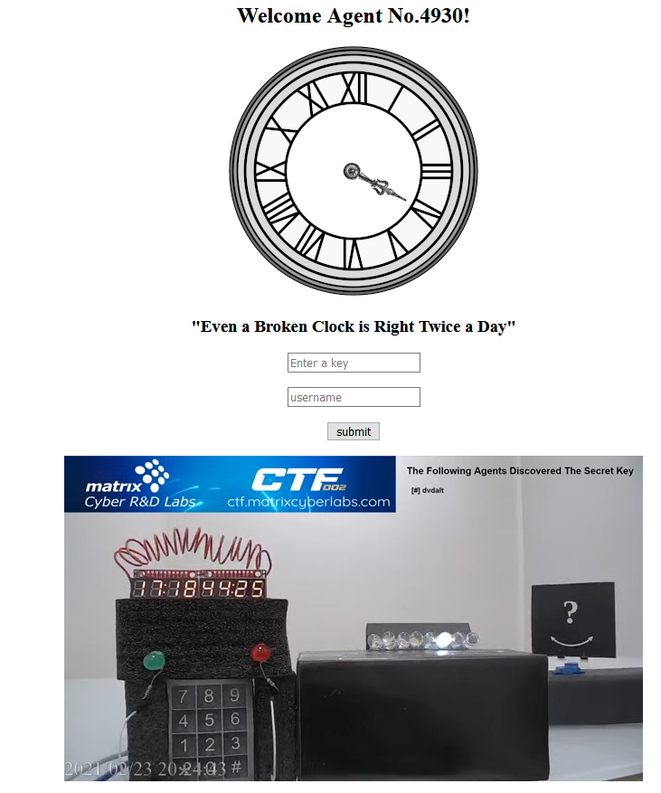
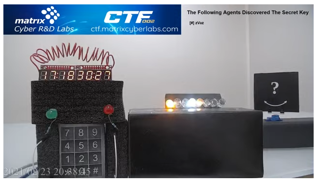

# Secret Key
Category: Crypto, 300 Points

## Description
> Our intelligence intercepted an encrypted message.
> 
> Put your skills to use, retrieve the secret key and decrypt the message. We know the secret key had been divided amongst five entities. The original key can only be recovered, when at least three of the entities get together.
> 
> Entity_1: 9362e50f3be0a411a75b55086b9b34f796dbeef58c498edcc185e3a3dc0bf905
> 
> Entity_2: c58c3821a12d58e854922d0b3856ebf01692bbca7b9637cebb4e2cc6934859c
> 
> Entity_3: 6ae19b589a96947699c96958d7bead57315fecd84cec3c3a4958a316b263575b
> 
> Entity_4: aefd6c92bd6be0c9e4dc28a0d846f0c026c032487be21914da712482b7986d19
> 
> Entity_5: d8ac37308292ba88668160a8b51e38f9e189fc0d349afa0c9efe671078d3c6d6
> 
> Hint : You should have a look in the ctfroom.

A binary file was attached.

## Solution

The description is a clear reference to a [Secret Sharing](https://en.wikipedia.org/wiki/Secret_sharing) method:

> Secret sharing (also called secret splitting) refers to methods for distributing a secret among a group of participants, each of whom is allocated a share of the secret. The secret can be reconstructed only when a sufficient number, of possibly different types, of shares are combined together; individual shares are of no use on their own. 

So, we just need to find the correct scheme that was used.

One of the most known schemes is [Shamir's Secret Sharing](https://en.wikipedia.org/wiki/Shamir%27s_Secret_Sharing):

> Shamir's Secret Sharing is an algorithm in cryptography created by Adi Shamir. It is a form of secret sharing, where a secret is divided into parts, giving each participant its own unique part.
> 
> To reconstruct the original secret, a minimum number of parts is required. In the threshold scheme this number is less than the total number of parts. Otherwise all participants are needed to reconstruct the original secret. 

We won't dive into the mathematical details for this one, as they are explained clearly in the Wikipedia page. Instead, we'll use a [library](https://github.com/shea256/secret-sharing) that implements SSS in order to retrieve the secret.

Simply enough, we just need to feed the library with at least three of the partial secrets in order to get the key:

```python
>>> entity_1 = "1-9362e50f3be0a411a75b55086b9b34f796dbeef58c498edcc185e3a3dc0bf905"
>>> entity_2 = "2-c58c3821a12d58e854922d0b3856ebf01692bbca7b9637cebb4e2cc6934859c"
>>> entity_3 = "3-6ae19b589a96947699c96958d7bead57315fecd84cec3c3a4958a316b263575b"
>>> entity_4 = "4-aefd6c92bd6be0c9e4dc28a0d846f0c026c032487be21914da712482b7986d19"
>>> entity_5 = "5-d8ac37308292ba88668160a8b51e38f9e189fc0d349afa0c9efe671078d3c6d6"
>>> 
>>> from secretsharing import SecretSharer
>>> SecretSharer.recover_secret([entity_1, entity_2, entity_3])
'f1b83682fa9cbe59cacba59d0ae9af44'
>>> SecretSharer.recover_secret([entity_3, entity_4, entity_5])
'f1b83682fa9cbe59cacba59d0ae9af44'
>>> SecretSharer.recover_secret([entity_1, entity_2, entity_4, entity_5])
'f1b83682fa9cbe59cacba59d0ae9af44'
>>> SecretSharer.recover_secret([entity_1, entity_2, entity_3, entity_4, entity_5])
'f1b83682fa9cbe59cacba59d0ae9af44'
```

As you can see, different combinations still produce the same secret, which is a 16-byte array: `f1b83682fa9cbe59cacba59d0ae9af44`. 

What do we do with this byte array? Well, we got a binary file as part of the challenge:

```console
root@kali:/media/sf_CTFs/matrix/Secret_Key# xxd -g 1 enc.txt
00000000: 7b 13 4f d9 a7 6c 50 92 da f3 ad d4 64 27 69 fd  {.O..lP.....d'i.
00000010: bb 3f 61 98 03 e8 18 3c 04 d6 fa 51 e9 7e f9 0b  .?a....<...Q.~..
```

We can try to use the byte array as a key in an attempt to decrypt the file. However, it doesn't seem to work. Therefore, our next stop is the link in the hint - the CTF room!

The CTF room link leads us to a webpage containing a live stream of a room in the Matrix headquarters: 



In the room there's a bomb with a timer counting down, together with a set of eight LEDs blinking in a wave pattern. Above the live stream was a form requesting a key (and a freetext username field for the hall of fame). After entering the secret key we've retrieved earlier, the LEDs started blinking together in a different pattern, for example:



There are eight LEDs altogether, so it makes sense to interpret as binary with zeroes/ones as off/on LEDs. We get:

```
10011000
01010010
01000110
11110001
01001000
00000001
00110100
11110110
00001110
11101110
10111001
11101000
11000010
11010000
10001001
00010000
```

Converted to hex, we get another 16-byte array: `985246f1480134f60eeeb9e8c2d08910`. The answer is received from the wall-clock in the CTF room, pointing at 4, also known as `IV` which in the context of cryptography is an acronym for "Initialization Vector".

So, all that's left is to go over various encryption algorithms and try to decrypt the ciphertext with the key and IV. The one that worked was AES-128-CBC:

```console
root@kali:/media/sf_CTFs/matrix/Secret_Key# openssl enc -in enc.txt -d -K f1b83682fa9cbe59cacba59d0ae9af44 -iv 985246f1480134f60eeeb9e8c2d08910 -aes-128-cbc -nopad
MCL{Sh4m1r's_S3c73t_Sh4r1n9_$$$}
```