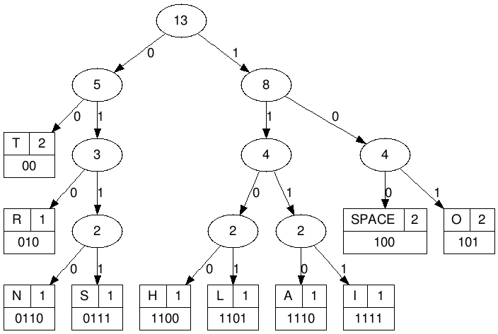
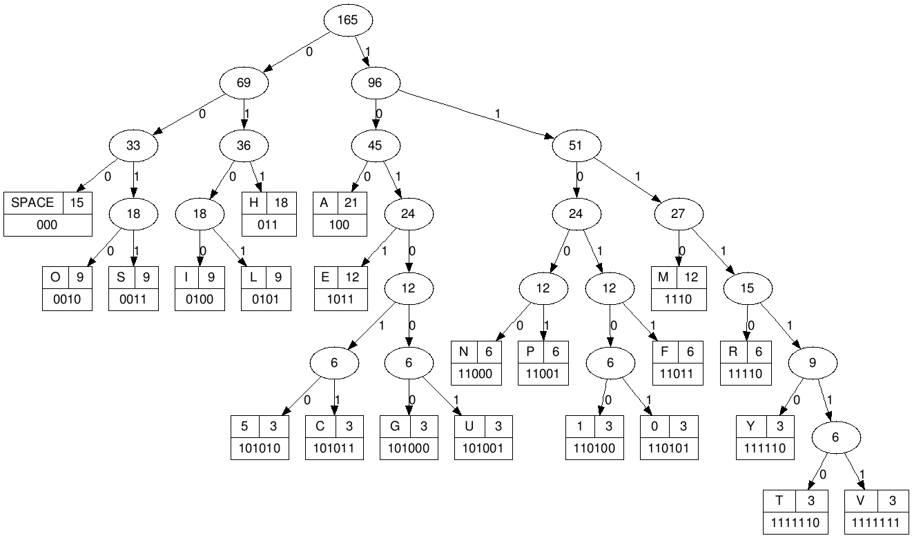

# 2021 Matzov New Year Challenge | חידת הסייבר של מצו"ב - ראש השנה תשפ"ב

[Matzov](https://en.wikipedia.org/wiki/Matzov) (The IDF's Center of Encryption and Information Security) published a [short cyber riddle](https://www.idf.il/137729/) for the Hebrew New Year. Worked on it with nofart and Canlex.

## Description

>
> 
> 
> 0101010111110010001101010010000111011111101
> 
> ==
> 
> rosh not tail
> 
> ~
> 
> lo  olhottnisatnr ioohtrsltoi nh  arsat
> 
> 1011111010001000101000011100110011100111111011110001000110110111000011011100110001000111010101101001101011010001110100010001011010110010111000001000000101001011111111011000011101001110111101111101001100000011111101111010111011
> 
> ==
> 
> ?
> 
> ~
> 
> ilos1s1m vfpupemihyahlaal mahaaearllmhnsmv rhsf gua5na ptmiee  imphhi  sfor5feaaaa 5h ngtamcaiippimvhr0gha0hil raoeoteooahn hh cosm mafneyyosfealr0ush1hcolmneehalhes


## Solution

So, apparently, there is some relationship between `rosh not tail`, `lo  olhottnisatnr ioohtrsltoi nh  arsat` and `0101010111110010001101010010000111011111101` in the first trio, and we need to fill in `?` to maintain the same relationship in the second trio.

Let's start by inspecting the first trio.

```python
>>> a_bin = "0101010111110010001101010010000111011111101"
>>> a_short = "rosh not tail"
>>> a_long = "lo  olhottnisatnr ioohtrsltoi nh  arsat"
```

First we'll take a look at the lengths:

```python
>>> len(a_bin)
43
>>> len(a_short)
13
>>> len(a_long)
39
```

We notice a few interesting things:

 * The binary sequence has a length of `43`, which is prime. This is great since it rules out many things, such as a trivial mapping of the strings to equal-length chunks in the binary.
 * The length of the long string is exactly three times the length of the short string.

If we further inspect the relationship between the strings, we see that:

```python
>>> set(a_short)
{' ', 'a', 'l', 's', 't', 'r', 'i', 'h', 'o', 'n'}
>>> set(a_long)
{' ', 'a', 'l', 't', 's', 'i', 'r', 'h', 'o', 'n'}
>>> set(a_short) == set(a_long)
True
>>> from collections import Counter
>>> Counter(a_short)
Counter({'o': 2, ' ': 2, 't': 2, 'r': 1, 's': 1, 'h': 1, 'n': 1, 'a': 1, 'i': 1, 'l': 1})
>>> Counter(a_long)
Counter({'o': 6, ' ': 6, 't': 6, 'l': 3, 'h': 3, 'n': 3, 'i': 3, 's': 3, 'a': 3, 'r': 3})
```

We can see that the short and long strings are composed of the same characters, and moreover, each character in the short string appears three times in the long string.

At this stage, it's very tempting to try and build a tree from the short string, and traverse it in some *Triple Order* so that every node is visited exactly three times to produce the long string. There's even a picture of a tree to further hint that we're in the right direction. However, this turns out to be non-trivial, and anyway, how does the binary sequence fit in anyway? Is it a set of instructions to visit the left or right child? Print or skip nodes? None of this seems to fit since the sequence is quite long and the tree is quite short.

There is one tree, though, that can fit a binary sequence of a prime length: A [Huffman Tree](https://en.wikipedia.org/wiki/Huffman_coding):

> In computer science and information theory, a Huffman code is a particular type of optimal prefix code that is commonly used for lossless data compression.
> 
> The output from Huffman's algorithm can be viewed as a variable-length code table for encoding a source symbol (such as a character in a file). The algorithm derives this table from the estimated probability or frequency of occurrence (weight) for each possible value of the source symbol. As in other entropy encoding methods, more common symbols are generally represented using fewer bits than less common symbols.

If the binary string was encoded via Huffman, it would produce an output where different encoded characters have different bit lengths, and putting them all together in a sequence results in a sequence length that does not need to be dividable by any common chunk length. 

The problem with Huffman coding is that when we have a few characters which have the same frequency, the actual encoding values they get are implementation specific. For example, if `h` and `r` have the same frequency, the encoding process might assign `010` to `h` and `101` to `r` or vice versa, there's really no way to predict it.

So, we can either reverse the binary sequence we have to assign the values to the different characters, or get lucky and use the same [online service](http://huffman.ooz.ie/?text=rosh%20not%20tail) (or implementation) used by the challenge creators to create the Huffman dictionary:



Let's test it:

```python
huffman_dict = {
    '00'  : 't',    '010' : 'r',    '0110': 'n',
    '0111': 's',    '1100': 'h',    '1101': 'l',
    '1110': 'a',    '1111': 'i',    '100' : ' ',
    '101' : 'o'
}

def huffman_decode(dictionary, text):
    res = ""
    while text:
        for k in dictionary:
            if text.startswith(k):
                res += dictionary[k]
                text = text[len(k):]
    return res

print(huffman_decode(huffman_dict, '0101010111110010001101010010000111011111101'))
```

This outputs `rosh not tail` as expected. Note that since the short and long strings have the same character frequency, they both should produce the same dictionary given a single implementation. 

Now we can try the same procedure for the second trio. First, we [build the dictionary](http://huffman.ooz.ie/?text=ilos1s1m%20vfpupemihyahlaal%20mahaaearllmhnsmv%20rhsf%20gua5na%20ptmiee%20%20imphhi%20%20sfor5feaaaa%205h%20ngtamcaiippimvhr0gha0hil%20raoeoteooahn%20hh%20cosm%20mafneyyosfealr0ush1hcolmneehalhes):



Then, we use it to decode the binary sequence:

```python
huffman_dict = {
    '000'    : ' ',    '0010'  : 'o',     '0011'   : 's', 
    '0100'   : 'i',    '0101'  : 'l',     '011'    : 'h', 
    '100'    : 'a',    '1011'  : 'e',     '101010' : '5', 
    '101011' : 'c',    '101000': 'g',     '101001' : 'u', 
    '11000'  : 'n',    '11001' : 'p',     '110100' : '1', 
    '110101' : '0',    '1110'  : 'm',     '11011'  : 'f', 
    '11110'  : 'r',    '111110': 'y',     '1111110': 't', 
    '1111111': 'v'
}

print(huffman_decode(huffman_dict, '1011111010001000101000011100110011100111111011110001000110110111000011011100110001000111010101101001101011010001110100010001011010110010111000001000000101001011111111011000011101001110111101111101001100000011111101111010111011'))
```

This outputs: `email happyroshhashanah510gmailcom i love huffman tree`. 

Those who sent an email to the address above, received a follow-up challenge which included a Visual Studio project and the following code:

```cpp
#include <iostream>
#include <Windows.h>

void mal()
{
	printf("Success!\n");
	ExitProcess(0);
}

void swap(int* a, int* b)
{
	int temp = *a;
	*a = *b;
	*b = temp;
}

int main()
{
	int a = 5;
	int b = 7;
	int* a_ptr = &a;
	int* b_ptr = &b;

	printf("%d, %d\n", *a_ptr, *b_ptr);

	try
	{
		// Scope 1:
		{
			// Write your code here.
			// Your goal is to cause mal() to execute when the code within scope 2 happens.
			// You are not allowed to change any line of code, only to add code within this scope. 
			// This only needs to work in debug x86.
		}

		// When this scope executes mal() should be called.
		// Don't change the code here!
		// Scope 2:
		{
			swap(a_ptr, b_ptr);
			printf("%d, %d\n", *a_ptr, *b_ptr);
		}
	}
	catch (...) {
		printf("Failure :("); // If this executes you fail
	}
}


```

The instructions are inlined in the `cpp` file. 

Two different approaches to solve the challenge:

#### Patching the Code During Runtime:

We can replace the runtime code for `swap` with a call to `mal` during runtime, based on [this reference](https://stackoverflow.com/questions/20716479/how-to-call-original-function-after-hotpatch).

```cpp
    std::uint8_t* OrigFunc = (std::uint8_t*)swap;
    std::uint8_t* HookFunc = (std::uint8_t*)mal;
    DWORD dwProtect = 0;
    const static std::uint8_t jmp[] = { 0xB8, 0x00, 0x00, 0x00, 0x00, 0xFF, 0xE0 };
    const static std::int8_t jmp_size = sizeof(jmp) / sizeof(std::uint8_t);
    static std::uint8_t HookJump[jmp_size + 1] = { jmp_size };
    VirtualProtect(OrigFunc, jmp_size, PAGE_EXECUTE_READWRITE, &dwProtect);
    memcpy(&HookJump[1], OrigFunc, jmp_size);
    memcpy(OrigFunc, jmp, jmp_size);
    memcpy(OrigFunc + 1, &HookFunc, sizeof(void*));
    VirtualProtect(OrigFunc, jmp_size, dwProtect, &dwProtect);
```

#### Utilizing the Exception Mechanism:

We can register an exception handler to run before the default exception handler, then trigger an exception:

```cpp
    #define CALL_FIRST 1  
    a_ptr = NULL;
    AddVectoredExceptionHandler(CALL_FIRST, (PVECTORED_EXCEPTION_HANDLER)mal);
```

Happy new year!