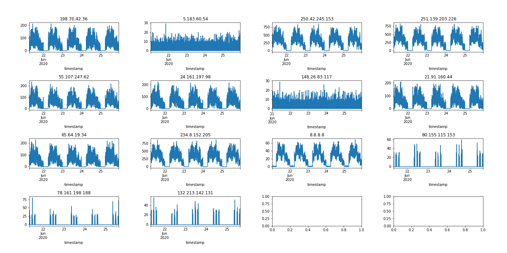

# Data Science 4
Category: Data Science, 300 points


## Description

See [Data Science 1](Data_Science_1.md).

## Solution:

We probably stumbled upon this flag in an unintended manner. We were looking for connections with a periodic callbacks to the external C&C, such as every 30 minutes, every 15 minutes, etc.

We tried the following query to get hosts that send an external request every minute:

```python
df[df['src_int'] & ~df['dst_int']]\
  .drop_duplicates(['dst_ip', 'minute'])\
  .groupby('dst_ip').size()\
  .pipe(lambda x: x[(x == 60)])
```

Output

```
dst_ip
198.70.42.36       60
5.183.60.54        60
250.42.245.153     60
251.139.203.226    60
55.107.247.62      60
24.161.197.98      60
148.26.83.117      60
21.91.160.44       60
65.64.19.34        60
234.8.152.205      60
8.8.8.8            60
80.155.115.153     60
78.161.198.188     60
132.213.142.131    60
dtype: int64
```

We then plotted the result:

```python
import itertools

suspecious_ips = df[df['src_int'] & ~df['dst_int']]\
  .drop_duplicates(['dst_ip', 'minute'])\
  .groupby('dst_ip').size()\
  .pipe(lambda x: x[(x == 60)])\
  .index.tolist()

numl_cols = 4
num_rows = (len(suspecious_ips) // numl_cols) + 1

fig, axs = plt.subplots(ncols = numl_cols, nrows = num_rows, figsize=(20, 10))
fig.tight_layout(pad=6.0)
for ax, ip in zip(itertools.chain(*axs), suspecious_ips):
    df[df['dst_ip']==ip]\
        .set_index('timestamp')\
        .resample('Min').size()\
        .plot(title = ip, ax = ax)
```



The last three IPs seemed to have a suspicious pattern, with three bursts of requests per day. It wasn't the periodic callback pattern we were expecting, but seems worth chasing.

Let's get the internal hosts that talk to these IPs:

```python
df[(df.dst_ip.isin(['80.155.115.153', '78.161.198.188', '132.213.142.131']))].drop_duplicates('src_ip')["src_ip"]
```

Output:

```


503796    120.18.201.129
504115       120.18.2.84
515835    120.18.146.190
542064     120.18.216.16
567744       120.18.54.9
582629     120.18.102.12
623570    120.18.248.164
635570    120.18.123.205
647223    120.18.205.249
654354     120.18.138.14
658088    120.18.132.113
662042    120.18.188.217
666483     120.18.12.170
668357     120.18.202.49
689205     120.18.136.32
693631     120.18.219.23
717801    120.18.180.110
739725     120.18.240.47
747601    120.18.168.231
751304     120.18.36.143
757815    120.18.216.159
768456    120.18.184.225
771843    120.18.224.201
805606    120.18.102.141
817697    120.18.185.238
852189     120.18.162.99
Name: src_ip, dtype: category
Categories (5497, object): ['24.133.117.23', '138.62.106.170', '92.150.22.192', '209.69.254.129', ..., '173.119.192.16', '177.66.191.51', '178.195.62.138', '120.121.209.92']
```

Save as CSV:

```python
df[(df.dst_ip.isin(['80.155.115.153', '78.161.198.188', '132.213.142.131']))].drop_duplicates('src_ip')["src_ip"].to_csv("flag_d.csv", index = False, header = ["ip"])
```

Output:

```
ip
120.18.201.129
120.18.2.84
120.18.146.190
120.18.216.16
120.18.54.9
120.18.102.12
120.18.248.164
120.18.123.205
120.18.205.249
120.18.138.14
120.18.132.113
120.18.188.217
120.18.12.170
120.18.202.49
120.18.136.32
120.18.219.23
120.18.180.110
120.18.240.47
120.18.168.231
120.18.36.143
120.18.216.159
120.18.184.225
120.18.224.201
120.18.102.141
120.18.185.238
120.18.162.99
```

And we get the last flag:

```
Congratulations! You achieved the goal. Here is your flag: 

flag{!#fdfsd^&dfsdsds*sds(sajh336}
```