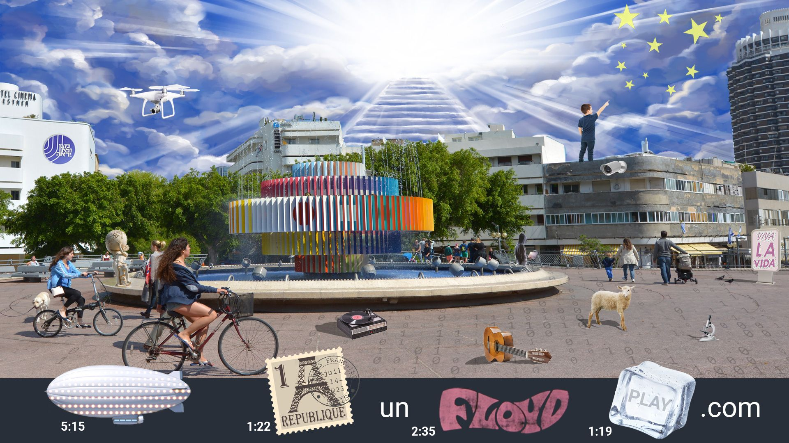

# Intro

## Description

## Solution:

As in previous years, before being able to start working on the challenges themselves, we need to solve a riddle which will take us to the challenges.

In this year's riddle, we get a single image. We have many details in the image, but it makes sense to start working from the lower bar. We can immediately recognize a zeppelin, and upon closer inspection it seems to be covered with LEDs. Also, we see the word "Floyd" colored pink. This should immediately hint that we're talking about bands: Led Zeppelin and Pink Floyd. After understanding that, we can also identify "OneRepublic" and the rapper Ice Cube(??). No, wait, that must be "Coldplay". 

Next to each band we have a timestamp. But for which songs? This is where we should reinspect the image. We can see a stairway to the sun, a kid on the roof counting stars and a sign saying "Viva la Vida". These are all clear references. There's one song left which isn't as obvious, but not so hard to identify from the remaining objects in the image: Sheep.

The next step is to listen to the songs and identify the words at each timestamp:

| Band | Song | Time | Words |
| ---- | ---- | ---- | ----- |
| Led Zeppelin | [Stairway to Heaven](https://youtu.be/iXQUu5Dti4g?t=315) | 5:15 | to join him |
| OneRepublic | [Counting Stars](https://youtu.be/hT_nvWreIhg?t=82) | 1:22 | about the things | 
| Pink Floyd | [Sheep](https://youtu.be/3-oJt_5JvV4?t=155) | 2:35 | Jordan and I have seen | 
| Coldplay | [Viva la Vida](https://youtu.be/dvgZkm1xWPE?t=79) | 1:19 | sword and shield |

Notice also, there's an "un" between OneRepublic and Pink Floyd. So, putting it all together to a phrase that makes sense in the context, we get "Join the Unseen Shield", which is a reference to the ISA's motto - "מגן ולא יראה" - "The Unseen Shield".

The challenges were available at `https://www.jointheunseenshield.com/`.

