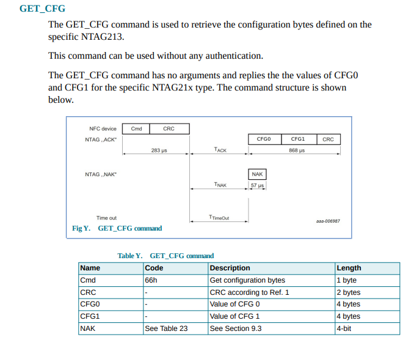
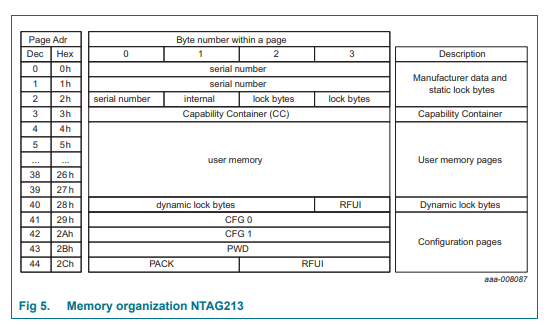
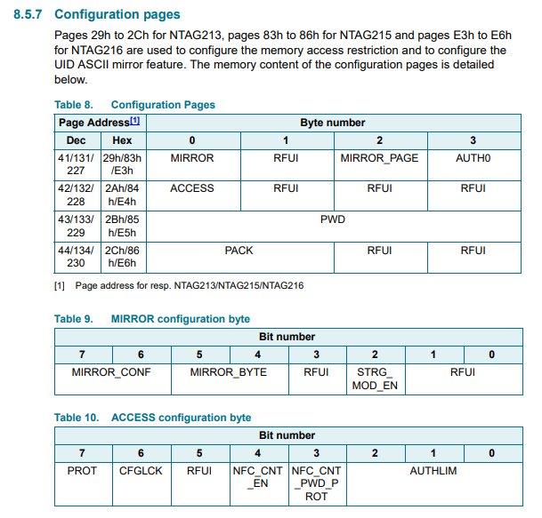
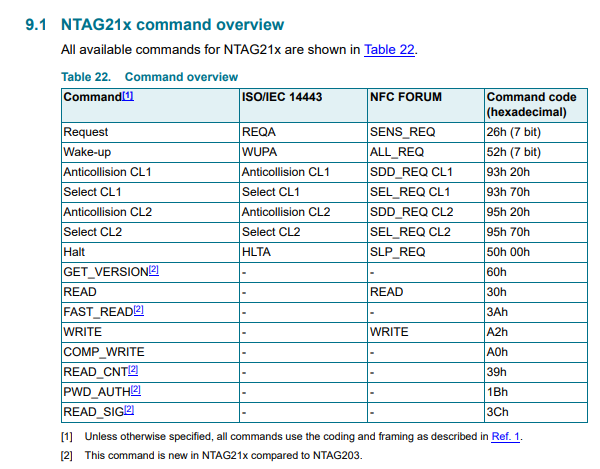
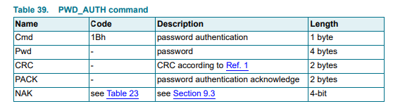

# NFC
Category: Reversing, 200 points


## Description

> Our target adopted a new way to keep sensitive information! They use secure NFC tags to keep secure and confidential information inside them.
> 
> We managed to place a strong NFC reader near our target’s secret NFC tag. Now we want to communicate with the that tag and extract the secret information from it.
> 
> In order to connect to our reader and send commands to the tag, you just need to open a TCP socket to:
> 
> nfc.shieldchallenges.com 80
> 
> Each message you send on this socket will be transferred to the NFC tag, and the response from the tag will be sent back to you on that same socket.
> 
> In addition, our sources equipped us with some information that may help you to communicate with the tag and extract the secret information from it:
> 
> 1. A secret document from our target (attached).
> 
> 2. An authentic message sent to the NFC tag. Due to a low signal, we managed to extract only 5 bytes from the message. The message is presented below (X stands for an unknown nibble).
> 
>                1BXXXXBEAF4930
> 
> 3. The secret information you need to extract is located somewhere in the memory space of the tag, and its size is 16 characters.
> 
> Good luck! We trust you!

A [PDF File](nfc_specification_details.pdf) titled "Security NFC Tag Specification" was attached.

## Solution:

We'll start with what we think is the intended solution, then summarize what we did during the CTF.

### Intended Solution(?)

The spec gives us a new command which can be run without authentication:



This command returns the value of `CFG0` and `CFG1`, which are the first two DWORDs in the configuration pages range (Page addresses `0x29`, `0x2A`):




They are interpreted as:



Let's start by reading them:

```python
from pwn import *

import pydtn_pydtn_encoding_crc as crc # https://git.ifne.eu/space-public/pyDTN/-/blob/master/pydtn/pydtn/encoding/crc.py
import ctypes
import textwrap

crc16_a = crc.CRC(16, 0x1021, 0x6363 , 0x0000, True, True)

class Struct_Base(ctypes.LittleEndianStructure):
    INDENT =  "|- "
    def __str__(self):
        res = self.__class__.__name__ + "\n"
        for field in self._fields_:
            field_name = field[0]
            field_type = field[1]
            if hasattr(field_type, '_fields_'):
                res += f"{self.INDENT}{field_name}: " + textwrap.indent(str(getattr(self, field_name)), "   ").lstrip()
            else:
                res += f"{self.INDENT}{field_name}: {getattr(self, field_name)}\n"
        return res

class NAK(Struct_Base):
   _pack_ = 1
   _fields_ = [
      ("value", ctypes.c_uint8, 4),
      ("reserved", ctypes.c_uint8, 4)
   ]

   _values = {
       0x0: "Invalid Argument",
       0x1: "CRC Error",
       0x4: "Authentication count overflow",
       0x5: "EEPROM write error",
       0x6: "Unsupported command"
   }

   def __str__(self):
       return "NAK({})".format(self._values.get(self.value, f"Unknown value {self.value}"))

class NFC_Base(Struct_Base):
    def is_checksum_valid(self):
        b = bytes(self)[:self.__class__.crc.offset]
        return (crc16_a(b) == self.crc)

    def update_checksum(self):
        b = bytes(self)[:self.__class__.crc.offset]
        self.crc = crc16_a(b)

class GET_CFG_Request(NFC_Base):
   _pack_ = 1
   _fields_ = [
      ("cmd", ctypes.c_uint8),
      ("crc", ctypes.c_uint16)
   ]

   def __init__(self):
       self.cmd = 0x66
       self.update_checksum()

class CFG0_Mirror(Struct_Base):
   _pack_ = 1
   _fields_ = [
      ("RFUI1",        ctypes.c_uint8, 2),
      ("STRG_MOD_EN",  ctypes.c_uint8, 1),
      ("RFUI2",        ctypes.c_uint8, 1),
      ("MIRROR_BYTE",  ctypes.c_uint8, 2),
      ("MIRROR_CONF",  ctypes.c_uint8, 2),
   ] 

class CFG0(Struct_Base):
   _pack_ = 1
   _fields_ = [
      ("MIRROR",      CFG0_Mirror),
      ("RFUI1",       ctypes.c_uint8),
      ("MIRROR_PAGE", ctypes.c_uint8),
      ("AUTH0",       ctypes.c_uint8),
   ] 

class CFG1_Access(Struct_Base):
   _pack_ = 1
   _fields_ = [
      ("AUTHLIM",           ctypes.c_uint8, 3),
      ("NFC_CNT_PWD_PROT",  ctypes.c_uint8, 1),
      ("NFC_CNT_EN",        ctypes.c_uint8, 1),
      ("RFUI1",             ctypes.c_uint8, 1),
      ("CFGLCK",            ctypes.c_uint8, 1),
      ("PROT",              ctypes.c_uint8, 1),
   ]  

class CFG1(Struct_Base):
   _pack_ = 1
   _fields_ = [
      ("ACCESS",      CFG1_Access),
      ("RFUI1",       ctypes.c_uint8),
      ("RFUI2",       ctypes.c_uint8),
      ("RFUI3",       ctypes.c_uint8),
   ] 

class GET_CFG_Response(NFC_Base):
   _pack_ = 1
   _fields_ = [
      ("cfg0", CFG0),
      ("cfg1", CFG1),
      ("crc",  ctypes.c_uint16)
   ]


def get_cfg(r):
    cfg_req = GET_CFG_Request()
    r.send(bytes(cfg_req))
    raw_response = r.recv(ctypes.sizeof(GET_CFG_Response))
    response = GET_CFG_Response.from_buffer_copy(raw_response)
    if not response.is_checksum_valid():
        raise Exception("Invalid CRC for GET_CFG response")
    
    return (response.cfg0, response.cfg1)

if __name__ == "__main__":
    r = remote("nfc.shieldchallenges.com", 80)
    
    cfg0, cfg1 = get_cfg(r)
    print(cfg0)
    print(cfg1)

```

Output: 

```console
root@kali:/media/sf_CTFs/shabak/NFC# python3 solve.py
[+] Opening connection to nfc.shieldchallenges.com on port 80: Done
CFG0
|- MIRROR: CFG0_Mirror
   |- RFUI1: 0
   |- STRG_MOD_EN: 1
   |- RFUI2: 0
   |- MIRROR_BYTE: 0
   |- MIRROR_CONF: 0
|- RFUI1: 0
|- MIRROR_PAGE: 0
|- AUTH0: 36

CFG1
|- ACCESS: CFG1_Access
   |- AUTHLIM: 0
   |- NFC_CNT_PWD_PROT: 0
   |- NFC_CNT_EN: 0
   |- RFUI1: 0
   |- CFGLCK: 1
   |- PROT: 1
|- RFUI1: 5
|- RFUI2: 0
|- RFUI3: 0
```

From here we can learn a few things about the system:

1. `AUTH0: 36`
   1. `AUTH0` defines the page address from which the password verification is required. 
   2. As we saw in the memory layout diagram, user memory is between pages 3 and 39. So, we should be able to read pages 4-36 without authentication. We should try that.
2. `CFGLCK: 1`
   1.  User configuration permanently locked against write access, except PWD and
PACK
3. `PROT: 1`
   1. Read and write access is protected by the password verification

So, let's go ahead and try to read pages 4-36:

```python

# ...

class READ_Request(NFC_Base):
   _pack_ = 1
   _fields_ = [
      ("cmd", ctypes.c_uint8),
      ("addr", ctypes.c_uint8),
      ("crc", ctypes.c_uint16)
   ]

   def __init__(self, address):
       self.cmd = 0x30
       self.addr = address
       self.update_checksum()

class READ_Response(NFC_Base):
   _pack_ = 1
   _fields_ = [
      ("data", ctypes.c_uint8 * 16),
      ("crc", ctypes.c_uint16)
   ]

# ...

def read(r, address):
    read_req = READ_Request(address)
    r.send(bytes(read_req))
    raw_response = r.recv(ctypes.sizeof(READ_Response))
    if len(raw_response) == ctypes.sizeof(NAK):
        response = NAK.from_buffer_copy(raw_response)
        raise Exception(f"Got NAK while reading address {hex(address)}: {str(response)}")
    elif len(raw_response) == ctypes.sizeof(READ_Response):
        response = READ_Response.from_buffer_copy(raw_response)
        if not response.is_checksum_valid():
            raise Exception("Invalid CRC for READ response")
        return bytes(response.data)

    raise Exception(f"Could not read data for address {hex(address)}")

# ...

if __name__ == "__main__":
    r = remote("nfc.shieldchallenges.com", 80)
    
    for page_address in range(0x4, 0x28):
        data = read(r, page_address)
        print(f"{page_address:02d}: {enhex(data)} -> {data}")
```

Output:

```console
root@kali:/media/sf_CTFs/shabak/NFC# python3 solve.py
[+] Opening connection to nfc.shieldchallenges.com on port 80: Done
04: 0103a00c340300fe0000000000000000 -> b'\x01\x03\xa0\x0c4\x03\x00\xfe\x00\x00\x00\x00\x00\x00\x00\x00'
05: 340300fe000000000000000000000000 -> b'4\x03\x00\xfe\x00\x00\x00\x00\x00\x00\x00\x00\x00\x00\x00\x00'
06: 00000000000000000000000000000000 -> b'\x00\x00\x00\x00\x00\x00\x00\x00\x00\x00\x00\x00\x00\x00\x00\x00'
07: 00000000000000000000000000000000 -> b'\x00\x00\x00\x00\x00\x00\x00\x00\x00\x00\x00\x00\x00\x00\x00\x00'
08: 00000000000000000000000000000000 -> b'\x00\x00\x00\x00\x00\x00\x00\x00\x00\x00\x00\x00\x00\x00\x00\x00'
09: 00000000000000000000000000000000 -> b'\x00\x00\x00\x00\x00\x00\x00\x00\x00\x00\x00\x00\x00\x00\x00\x00'
10: 00000000000000000000000000000000 -> b'\x00\x00\x00\x00\x00\x00\x00\x00\x00\x00\x00\x00\x00\x00\x00\x00'
11: 00000000000000000000000000000000 -> b'\x00\x00\x00\x00\x00\x00\x00\x00\x00\x00\x00\x00\x00\x00\x00\x00'
12: 00000000000000000000000000000000 -> b'\x00\x00\x00\x00\x00\x00\x00\x00\x00\x00\x00\x00\x00\x00\x00\x00'
13: 00000000000000000000000000000000 -> b'\x00\x00\x00\x00\x00\x00\x00\x00\x00\x00\x00\x00\x00\x00\x00\x00'
14: 00000000000000000000000000000000 -> b'\x00\x00\x00\x00\x00\x00\x00\x00\x00\x00\x00\x00\x00\x00\x00\x00'
15: 00000000000000000000000000000000 -> b'\x00\x00\x00\x00\x00\x00\x00\x00\x00\x00\x00\x00\x00\x00\x00\x00'
16: 00000000000000000000000000000000 -> b'\x00\x00\x00\x00\x00\x00\x00\x00\x00\x00\x00\x00\x00\x00\x00\x00'
17: 00000000000000000000000000000000 -> b'\x00\x00\x00\x00\x00\x00\x00\x00\x00\x00\x00\x00\x00\x00\x00\x00'
18: 00000000000000000000000000000000 -> b'\x00\x00\x00\x00\x00\x00\x00\x00\x00\x00\x00\x00\x00\x00\x00\x00'
19: 00000000000000000000000000000000 -> b'\x00\x00\x00\x00\x00\x00\x00\x00\x00\x00\x00\x00\x00\x00\x00\x00'
20: 00000000000000000000000000000000 -> b'\x00\x00\x00\x00\x00\x00\x00\x00\x00\x00\x00\x00\x00\x00\x00\x00'
21: 00000000000000000000000000000000 -> b'\x00\x00\x00\x00\x00\x00\x00\x00\x00\x00\x00\x00\x00\x00\x00\x00'
22: 00000000000000000000000000000000 -> b'\x00\x00\x00\x00\x00\x00\x00\x00\x00\x00\x00\x00\x00\x00\x00\x00'
23: 00000000000000000000000000000000 -> b'\x00\x00\x00\x00\x00\x00\x00\x00\x00\x00\x00\x00\x00\x00\x00\x00'
24: 00000000000000000000000000000000 -> b'\x00\x00\x00\x00\x00\x00\x00\x00\x00\x00\x00\x00\x00\x00\x00\x00'
25: 00000000000000000000000000000000 -> b'\x00\x00\x00\x00\x00\x00\x00\x00\x00\x00\x00\x00\x00\x00\x00\x00'
26: 00000000000000000000000000000000 -> b'\x00\x00\x00\x00\x00\x00\x00\x00\x00\x00\x00\x00\x00\x00\x00\x00'
27: 00000000000000000000000000000000 -> b'\x00\x00\x00\x00\x00\x00\x00\x00\x00\x00\x00\x00\x00\x00\x00\x00'
28: 00000000000000000000000000000000 -> b'\x00\x00\x00\x00\x00\x00\x00\x00\x00\x00\x00\x00\x00\x00\x00\x00'
29: 00000000000000000000000000546865 -> b'\x00\x00\x00\x00\x00\x00\x00\x00\x00\x00\x00\x00\x00The'
30: 00000000000000000054686520736563 -> b'\x00\x00\x00\x00\x00\x00\x00\x00\x00The sec'
31: 00000000005468652073656372657420 -> b'\x00\x00\x00\x00\x00The secret '
32: 00546865207365637265742069733a20 -> b'\x00The secret is: '
33: 207365637265742069733a2004ea6503 -> b' secret is: \x04\xeae\x03'
34: 7265742069733a2004ea6503122a6280 -> b'ret is: \x04\xeae\x03\x12*b\x80'
35: 69733a2004ea6503122a6280da480000 -> b'is: \x04\xeae\x03\x12*b\x80\xdaH\x00\x00'
Traceback (most recent call last):
  File "solve.py", line 202, in <module>
    data = read(r, page_address)
  File "solve.py", line 181, in read
    raise Exception(f"Got NAK while reading address {hex(address)}: {str(response)}")
Exception: Got NAK while reading address 0x24: NAK(Authentication count overflow)
```

We're almost there! We read a page from user memory stating that "The secret is" but we couldn't get to the secret itself. It must be located in the password protected area. But how will we know the password?

This is where the partial command we've received comes in: `1BXXXXBEAF4930`. 

According to the spec, each command starts with a command code, and the original NFC spec lists all the supported commands:



Note: To this list we need to add the new command detailed in the "Security NFC Tag Specification" spec we've received.

We can see that the command that starts with `1B` is called `"PWD_AUTH"`, so let's check its details:

> A protected memory area can be accessed only after a successful password verification
using the PWD_AUTH command. The AUTH0 configuration byte defines the protected
area. It specifies the first page that the password mechanism protects. The level of
protection can be configured using the PROT bit either for write protection or read/write
protection. The PWD_AUTH command takes the password as parameter and, if
successful, returns the password authentication acknowledge, PACK. By setting the
AUTHLIM configuration bits to a value larger than 000b, the number of unsuccessful
password verifications can be limited. Each unsuccessful authentication is then counted in
a counter featuring anti-tearing support. After reaching the limit of unsuccessful attempts,
the memory access specified in PROT, is no longer possible. The PWD_AUTH command
is shown in Figure 22 and Table 39.



This is a password authentication command, and unfortunately the missing bytes are part of the password itself! Luckily, we have the CRC value and therefore can brute force the password by trying all options until we hit a valid CRC value. When we do, we try to login using this password in order to verify that we didn't get a CRC collision.

```python

 # ...

class PWD_AUTH_Request(NFC_Base):
   _pack_ = 1
   _fields_ = [
      ("cmd", ctypes.c_uint8),
      ("pwd", ctypes.c_uint32),
      ("crc", ctypes.c_uint16)
   ]

class PWD_AUTH_Response(NFC_Base):
   _pack_ = 1
   _fields_ = [
      ("pack", ctypes.c_uint16),
      ("crc", ctypes.c_uint16)
   ]

# ...

def login(r, pwd_auth_req):
    r.send(bytes(pwd_auth_req))
    raw_response = r.recv(1024)
    if len(raw_response) == ctypes.sizeof(NAK):
        response = NAK.from_buffer_copy(raw_response)
        log.info(f"Received NAK: {str(response.value)}")
        return False
    elif len(raw_response) == ctypes.sizeof(PWD_AUTH_Response):
        response = PWD_AUTH_Response.from_buffer_copy(raw_response)
        return (response.is_checksum_valid())

def brute_force_password(r):
    for i in range(0x10000):
        p = PWD_AUTH_Request.from_buffer_copy(bytes.fromhex("1B0000BEAF4930"))
        p.pwd |= i
        if p.is_checksum_valid():
            log.info("Potential password suffix: {}".format(hex(i)))
            if login(r, p):
                log.info("Login successful")
                return

    raise Exception("Can't find password")

# ...

if __name__ == "__main__":
    r = remote("nfc.shieldchallenges.com", 80)
    brute_force_password(r)
```

The output is:
```console
root@kali:/media/sf_CTFs/shabak/NFC# python3 solve.py
[+] Opening connection to nfc.shieldchallenges.com on port 80: Done
[*] Potential password suffix: 0x6824
[*] Login successful
```

This means that we found the password. Let's try reading the memory again:

```python
if __name__ == "__main__":
    r = remote("nfc.shieldchallenges.com", 80)

    brute_force_password(r)
    
    for page_address in range(0x4, 0x28):
        data = read(r, page_address)
        print(f"{page_address:02d}: {enhex(data)} -> {data}")
```

Output:

```console
root@kali:/media/sf_CTFs/shabak/NFC# python3 solve.py
[+] Opening connection to nfc.shieldchallenges.com on port 80: Done
[*] Potential password suffix: 0x6824
[*] Login successful
04: 0103a00c340300fe0000000000000000 -> b'\x01\x03\xa0\x0c4\x03\x00\xfe\x00\x00\x00\x00\x00\x00\x00\x00'
05: 340300fe000000000000000000000000 -> b'4\x03\x00\xfe\x00\x00\x00\x00\x00\x00\x00\x00\x00\x00\x00\x00'
06: 00000000000000000000000000000000 -> b'\x00\x00\x00\x00\x00\x00\x00\x00\x00\x00\x00\x00\x00\x00\x00\x00'
07: 00000000000000000000000000000000 -> b'\x00\x00\x00\x00\x00\x00\x00\x00\x00\x00\x00\x00\x00\x00\x00\x00'
08: 00000000000000000000000000000000 -> b'\x00\x00\x00\x00\x00\x00\x00\x00\x00\x00\x00\x00\x00\x00\x00\x00'
09: 00000000000000000000000000000000 -> b'\x00\x00\x00\x00\x00\x00\x00\x00\x00\x00\x00\x00\x00\x00\x00\x00'
10: 00000000000000000000000000000000 -> b'\x00\x00\x00\x00\x00\x00\x00\x00\x00\x00\x00\x00\x00\x00\x00\x00'
11: 00000000000000000000000000000000 -> b'\x00\x00\x00\x00\x00\x00\x00\x00\x00\x00\x00\x00\x00\x00\x00\x00'
12: 00000000000000000000000000000000 -> b'\x00\x00\x00\x00\x00\x00\x00\x00\x00\x00\x00\x00\x00\x00\x00\x00'
13: 00000000000000000000000000000000 -> b'\x00\x00\x00\x00\x00\x00\x00\x00\x00\x00\x00\x00\x00\x00\x00\x00'
14: 00000000000000000000000000000000 -> b'\x00\x00\x00\x00\x00\x00\x00\x00\x00\x00\x00\x00\x00\x00\x00\x00'
15: 00000000000000000000000000000000 -> b'\x00\x00\x00\x00\x00\x00\x00\x00\x00\x00\x00\x00\x00\x00\x00\x00'
16: 00000000000000000000000000000000 -> b'\x00\x00\x00\x00\x00\x00\x00\x00\x00\x00\x00\x00\x00\x00\x00\x00'
17: 00000000000000000000000000000000 -> b'\x00\x00\x00\x00\x00\x00\x00\x00\x00\x00\x00\x00\x00\x00\x00\x00'
18: 00000000000000000000000000000000 -> b'\x00\x00\x00\x00\x00\x00\x00\x00\x00\x00\x00\x00\x00\x00\x00\x00'
19: 00000000000000000000000000000000 -> b'\x00\x00\x00\x00\x00\x00\x00\x00\x00\x00\x00\x00\x00\x00\x00\x00'
20: 00000000000000000000000000000000 -> b'\x00\x00\x00\x00\x00\x00\x00\x00\x00\x00\x00\x00\x00\x00\x00\x00'
21: 00000000000000000000000000000000 -> b'\x00\x00\x00\x00\x00\x00\x00\x00\x00\x00\x00\x00\x00\x00\x00\x00'
22: 00000000000000000000000000000000 -> b'\x00\x00\x00\x00\x00\x00\x00\x00\x00\x00\x00\x00\x00\x00\x00\x00'
23: 00000000000000000000000000000000 -> b'\x00\x00\x00\x00\x00\x00\x00\x00\x00\x00\x00\x00\x00\x00\x00\x00'
24: 00000000000000000000000000000000 -> b'\x00\x00\x00\x00\x00\x00\x00\x00\x00\x00\x00\x00\x00\x00\x00\x00'
25: 00000000000000000000000000000000 -> b'\x00\x00\x00\x00\x00\x00\x00\x00\x00\x00\x00\x00\x00\x00\x00\x00'
26: 00000000000000000000000000000000 -> b'\x00\x00\x00\x00\x00\x00\x00\x00\x00\x00\x00\x00\x00\x00\x00\x00'
27: 00000000000000000000000000000000 -> b'\x00\x00\x00\x00\x00\x00\x00\x00\x00\x00\x00\x00\x00\x00\x00\x00'
28: 00000000000000000000000000000000 -> b'\x00\x00\x00\x00\x00\x00\x00\x00\x00\x00\x00\x00\x00\x00\x00\x00'
29: 00000000000000000000000000546865 -> b'\x00\x00\x00\x00\x00\x00\x00\x00\x00\x00\x00\x00\x00The'
30: 00000000000000000054686520736563 -> b'\x00\x00\x00\x00\x00\x00\x00\x00\x00The sec'
31: 00000000005468652073656372657420 -> b'\x00\x00\x00\x00\x00The secret '
32: 00546865207365637265742069733a20 -> b'\x00The secret is: '
33: 207365637265742069733a20666c6167 -> b' secret is: flag'
34: 7265742069733a20666c61677b47305f -> b'ret is: flag{G0_'
35: 69733a20666c61677b47305f4d316e31 -> b'is: flag{G0_M1n1'
36: 666c61677b47305f4d316e316f6e247d -> b'flag{G0_M1n1on$}'
37: 7b47305f4d316e316f6e247d000000bd -> b'{G0_M1n1on$}\x00\x00\x00\xbd'
38: 4d316e316f6e247d000000bd04000024 -> b'M1n1on$}\x00\x00\x00\xbd\x04\x00\x00$'
39: 6f6e247d000000bd04000024c0050000 -> b'on$}\x00\x00\x00\xbd\x04\x00\x00$\xc0\x05\x00\x00'
```

We got the flag: `flag{G0_M1n1on$}`

### Alternative Solution

In short, we'll show the steps we followed to solve the challenge initially:

1. Brute force the missing part of the password against the server by trying all options between `0x0` and `0xFFFF` until we don't receive a NAK
2. Use the full command to find the correct CRC implementation
3. Dump all memory using `READ` commands

The `GET_CFG` command wasn't needed.
