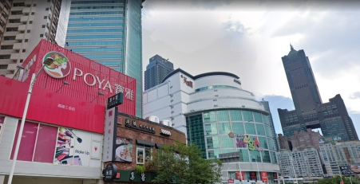

# Finding Ducky - Part 1
Category: OSINT, 50 points

## Description

> Ducky is missing! A few days ago ducky tweeted that he is on to something big..and then yesterday he tweeted a cryptic messaged, Any attemp of contacting him didn't work and we believe he might have been kidnapped. We think he might have contacted his sister before he disappeared, the last thing she posted was this image, she if you can figure out where she is.
> 
> Note: The flag is `cstechnion{<name of city>}`.

An image was attached.

## Solution

Using Google's image search engine, we search for the attached image. Google identifies it as:

> 85 Sky Tower, formerly known as the T & C Tower or Tuntex Sky Tower, is an 85-story skyscraper in Lingya District, Kaohsiung, Taiwan.

Therefore, the flag is `cstechnion{Kaohsiung}`.

