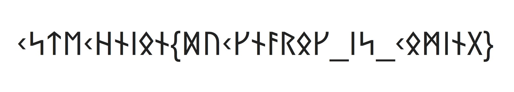
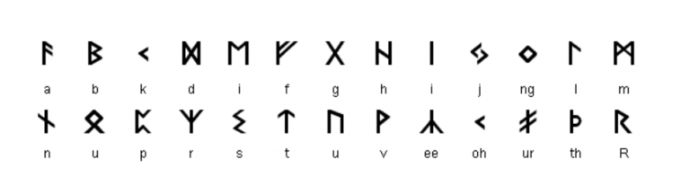

# Outsiders
Category: Cryptography, 100 points

## Description

> While searching abroad for ducky, we found this code etched to a stone, can you figure out what it is?



## Solution

We know that the flag format is `cstechnion{}`. The `<` character in the ciphertext seems to match the `c` of the flag format. Using the flag format, we can decipher the following:

```
cstechnion{??c?n??o?_i?_co?in?}
```

We might be able to guess a few more letters based on common sense (does in end with "is coming"?), and maybe a few more if we notice that some of the characters have a slight resemblance to the latin alphabet, but the easiest way to crack the code is to use Google Image search and find the [key](https://thehistoricallinguistchannel.com/runes/):



Using this key, we can decipher the text:

```
cstechnion{ducknarok_is_coming}
```