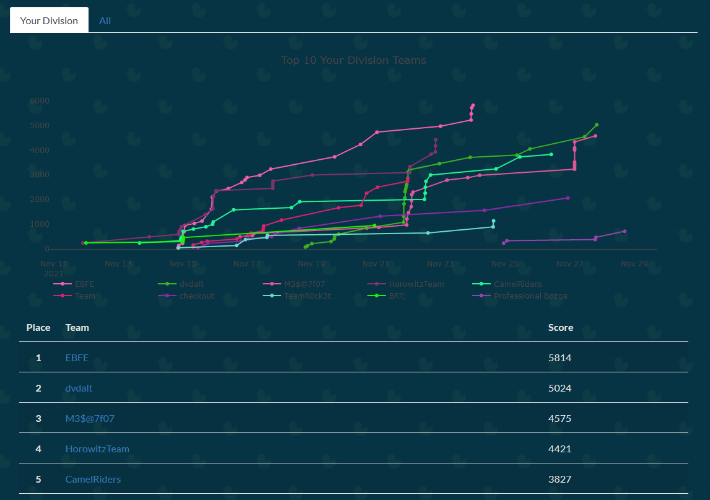
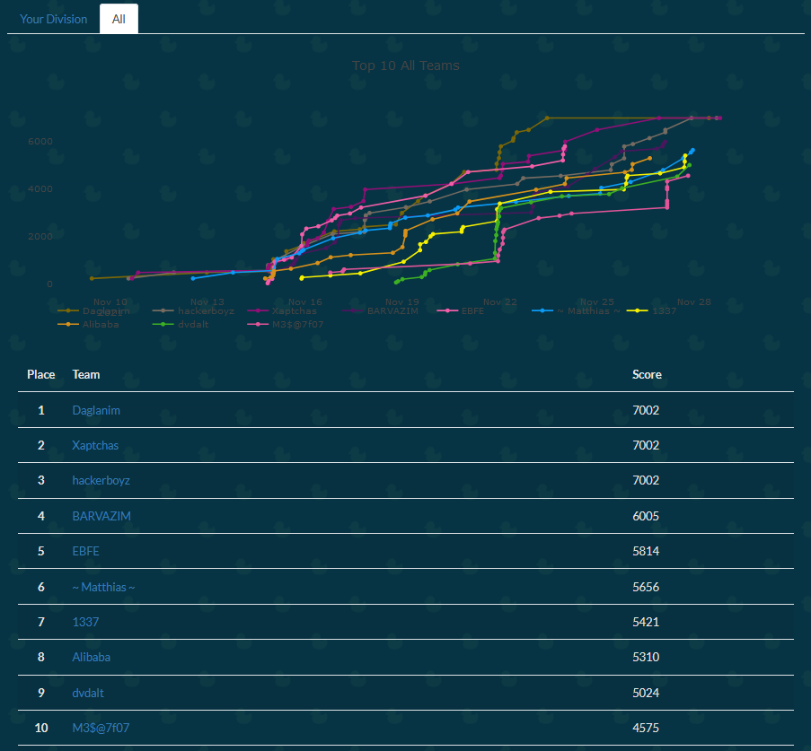

# CS Technion CTF

Writeups for the 2021 [CS Technion CTF](http://ctf.cs.technion.ac.il/).

The participants were divided into four divisions:

 1. Students in CS department up to the fourth semester of 1st degree.
 2. Students in CS department from the fifth semester of 1st degree and up, this includes students in their 2nd and 3rd degrees.
 3. Students from other departments, Alumni and faculty members.
 4. Participants from outside of the Technion

Finished 2nd in the forth division and 9th altogether:

