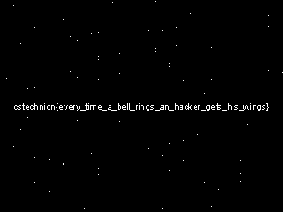

# Static Scripting 4
Category: Steganography, 500 points

## Description

> We know you all waited for it...and now it's back!
> 
> The new installment in our (in)famous series, Static Scripting 4 - Saved by the BEL.

## Solution

Opening a `netcat` connection to the attached server, we hear several "rings" before the connection gets closed. This must be the infamous [BEL](https://en.wikipedia.org/wiki/Bell_character) character!

We can capture the output via standard shell redirection:

```console
┌──(user@kali)-[/media/sf_CTFs/technion/Static_Scripting_4]
└─$ nc ctf.cs.technion.ac.il 4221 > output.txt
```

Then inspect it with a hex editor, e.g.:

```console
┌──(user@kali)-[/media/sf_CTFs/technion/Static_Scripting_4]
└─$ xxd -g 1 --skip 38096 --length 96 output.txt
000094d0: 00 07 07 00 00 07 07 07 00 07 07 07 00 00 07 07  ................
000094e0: 00 00 00 07 07 00 00 07 07 07 00 00 00 07 07 07  ................
000094f0: 00 00 07 00 00 00 07 07 00 00 07 07 07 00 00 00  ................
00009500: 07 00 00 00 07 07 00 00 07 00 00 00 07 00 00 07  ................
00009510: 07 00 00 07 07 00 07 00 00 00 07 00 00 00 00 00  ................
00009520: 07 07 07 00 07 00 07 07 07 07 07 07 00 00 00 00  ................
```

We can double check that there are only two unique characters in the file:

```console
┌──(user@kali)-[/media/sf_CTFs/technion/Static_Scripting_4]
└─$ hexdump -v -e '/1 "%02x\n"' output.txt | sort | uniq
00
07
```

Usually, when we get a file with two unique values, there are two things to try:

 1. Interpret as binary
 2. Interpret as pixels in an image


Since the former did yield anything, let's try the latter:

```python
import math
from PIL import Image

# https://stackoverflow.com/questions/44061928/
def multipliers(m):
    yield (m, 1)

    finalVal = int(math.sqrt(m))
    increment = 2 if m % 2 != 0 else 1
    i = 3 if  m % 2 != 0 else 2

    while (i <= finalVal):
        if (m % i == 0):
            yield (m // i, i)

        i += increment

pixels = []

with open("output.txt", "rb") as f:
    byte = f.read(1)
    while byte != b"":
        pixels.append((0, 0, 0) if byte == b'\x00' else (255, 255, 255))
        byte = f.read(1)

for dim in multipliers(len(pixels)):
    im= Image.new('RGB', dim)
    im.putdata(pixels)
    im.save(f'out_{dim[0]}_{dim[1]}.png')
```

Since we don't know the width and hight, we use `multipliers` to try all legal possibilities.

The 320x240 image gave:

