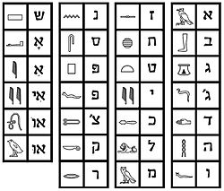

<h1>חידת אמ"ן - פסח התשפ"ב</h1>

לרגל חג הפסח פרסם אגף המודיעין חידה קצרה. נראה כאן את הפתרון שלה. על החידה עבדתי יחד עם zVaz וקבוצה נוספת של גולשים בטלגרם. החידה קצת מפוזרת, תחזיקו חזק.

<h2>תיאור</h2>

אחרי שבשנה שעברה יותר מ-200,000 אנשים נענו לאתגר - באגף המודיעין מפרסמים את החידה השנתית החדשה שלהם, רק שהפעם - מדובר בריבוע שחור לגמרי. הוא יוביל אתכם לשלוש תחנות אוטובוס ברחבי הארץ ולכתובת מייל אחת. שיהיה בהצלחה - אתם תזדקקו לזה.

מערכת אתר צה"ל | 14.04.22 

קישור להורדת התמונות באיכות המלאה: <a href="https://www.idf.il/media/il2jhotv/letmypeoplego.png?optimize=false">התמונה השחורה</a>, <a href="https://www.idf.il/media/t45dusgz/letmypeoplego.png">התמונה בכותרת</a>.

<pre dir="ltr" style="text-align: left">
www.idf.il/_____/
</pre>

*את החידה חיבר מדור טכנולוגיות למידה במערך ההדרכה למודיעין ולסייבר של אמ"ן. המדור אחראי על הפיכת ההכשרות של האגף לדיגיטליות ומתקדמות תוך שילוב לומדות, משחקי למידה וסימולטורים אשר תפקידם להטמיע את הידע בצורה טובה וחוויתית יותר.

<h2>פתרון</h2>

<h3>התמונה בכותרת</h3>

לפני שאנחנו צוללים אל התמונה השחורה והתחנות השונות, יש לנו המון נתונים בתמונה שבכותרת. נעבור על הכל בזריזות.

<ul>
    <li>לאורך הגבול הימני של התמונה, הכיתוב "1956"</li>
    <li>מימין, תמונה של משה דיין, ומסביבה פסוק אודות שאול המלך מתוך התנ"ך</li>
    <li>קטע בינארי מודגש בירוק בתוך התמונה של משה דיין: 00110010 00111001 00110001 00110000 00110001 00111001 00110101 00110110, מתורגם ל-29101956, כלומר, 29-10-1956, תאריך הפתיחה של מבצע קדש. משה דיין היה רמטכ"ל מבצע קדש.</li>
    <li>תמונה של אופירה נבון, אשתו של הנשיא החמישי יצחק נבון. מסביב לתמונה שמות של נשיאי ישראל, ויצחק נבון מודגש</li>
    <li>תמונה של אוניית המעפילים "אקסודוס"</li>
    <li>הסמל של חיל המודיעין, מוקף ברצף הבינארי 01101100 01100101 01110100 00100000 01101101 01111001 00100000 01110000 01100101 01101111 01110000 01101100 01100101 00100000 01100111, אשר מתפרש כ-let my people g (ללא o בסוף)</li>
    <li>כתב מראה: Let my people go = Dead end</li>
    <li>מספר סמלילים: האות y, סרט מדידה, פנס, תקליטון, והלוגו של ג'ימייל</li>
</ul>

<h3>תחנה ראשונה</h3>

עבור התחנה הראשונה נבצע את הפעולה הסטנדרטית עבור תמונה עם צבע אחיד ב-CTF. נעביר אותה דרך שירות כמו <a href="https://stegonline.georgeom.net/">StegOnline</a> ונבדוק אם קיים מידע נסתר ב-Colour & Bit Planes. לחלופין, ניתן לשחק עם הערכים של בהירות התמונה. כצפוי, נקבל:

זה נראה כמו כתב חרטומים. נפענח באמצעות המפתח הבא שאפשר למצוא בקלות בגוגל:

לאחר הפענוח נקבל את הרצף "בינהמילימ", כלומר "בין המילים". נספור את מספר העיגולים בין האותיות ונקבל 59983179. המספר הזה מוביל אותנו לדף חדש באתר צה"ל: https://www.idf.il/59983179/. בדף זה נמצא וידאו מוטמע מתוך יוטיוב: <a href="https://www.youtube.com/watch?v=SP5EfwBWgg0">Louis Armstrong-Go Down Moses</a>, יחד עם קוד מורס:

<pre>
.--- -.. .. # / .--- -... .-. .. - / -... .-.. .. / ... .-.. . # / -- .- ... .-. / ... .-.. . # / -... .-.. .. / .--- -... .-. .. -
</pre>

בנוסף, מופיע בדף הכיתוב הבא:

<pre>
מספר התחנה: ______ (מסתיים ב-9)
</pre>

באמצעות <a href="https://stwww1.weizmann.ac.il/communication/?p=132">טבלת סימני מורס בעברית</a> נפענח את קוד המורס ונקבל: "עדי# עברית בלי שלו# מאשר שלו# בלי עברית". נשמע שהכוונה למשפט: "עדיף עברית בלי שלום מאשר שלום בלי עברית", פרפרזה על ציטוט מפורסם של משה דיין בהקשר של האפשרות לפינוי חצי האי סיני תמורת שלום עם מצרים: "טוב שארם א-שייח' בלי שלום מאשר שלום בלי שארם א-שייח'".  אם כך, החליפו את שארם א-שייח' ב"עברית" (ואת האותיות הסופיות בסולמיות?). מסתבר שבשארם א-שייח' שכן יישוב ישראלי בשם "אופירה". נשמע מוכר? בתמונת הכותרת ראינו את אופירה נבון. 

מה לגבי הסרטון? הסרטון מפנה לשיר בשם Go Down Moses, שבו ביטוי חוזר: Let my people go. Moses הוא משה, כמו משה דיין.

מתוך זה אנחנו אמורים למצוא מספר תחנה, ואנחנו יודעים שהמספר מסתיים ב-9. נסמן לעצמנו שתי תחנות אפשריות על סמך הנתונים שמצאנו: תחנת פארק אופירה / נשיאי ישראל בכרמיאל (מספר תחנה: 50729) ותחנת דרך משה דיין / דרך השלום (מספר תחנה: 25749).

<h3>תחנה שנייה</h3>

עבור התחנה השנייה נצטרך למדוד את מימדי התמונה השחורה. אורך: 1294, רוחב: 1501. נכפיל את שניהם ונקבל את התוצאה 1942294, מה שמוביל אותנו לדף חדש באתר צה"ל: https://www.idf.il/1942294/. הדף הזה מכיל תמונה של בובספוג עם קוד QR על השרוול:

הערת ביניים: ביקור בכתובת https://www.idf.il/letmypeoplego/ הוביל לדף עם אותה תמונה של בובספוג רק ללא קוד ה-QR על השרוול. לא היה ניתן להמשיך משם. אולי זאת הייתה הכוונה ב-Dead end שבתמונת הכותרת. עוד אופציה היא שהכוונה ב-Dead end היא לסמל אמ"ן והכיתוב סביבו שגם הם לא סייעו בפתרון החידה.

קוד ה-QR הוביל לתמונה הבאה:

זוהי תמונה של משתתפי הקונגרס הציוני הראשון, רק שבמרכז התמונה, במקום הרצל, עומדת לה שרה אהרונסון, גיבורת ניל"י, ומתחתיה הכיתוב "נצח ישראל לא ישקר" (ניל"י).

בנוסף, הדף הכיל את הכיתוב: "מספר התחנה: ______" (הפעם בלי הספרה האחרונה), והתמונה של בובספוג קישרה ל<a href="https://ibb.co/album/N1dz7q">אלבום תמונות נעול בסיסמא</a>. הסיסמא לאלבום הייתה "let my people go" והוא הכיל תמונה בודדת, זהה לתמונה שה-QR הוביל אותנו אליה.

נסמן לעצמנו שתי תחנות אפשריות על סמך הנתונים שמצאנו: תחנת שרה אהרונסון / שדרות הציונות (מספר תחנה: 15125) ותחנת שדרות ניל"י / הרצל (מספר תחנה: 40341). התחנה של שרה אהרונסון / שדרות הציונות באשקלון נמצאת בסמיכות רבה לרחוב אופירה נבון ושדרות קדש.

<h3>תחנה שלישית</h3>

עבור התחנה השלישית נבדוק את השם של קובץ התמונה השחור: shemot11071947. חומש "שמות" נקרא בלעז "אקסודוס", והתאריך 11-07-1947 הוא תאריך היציאה של אוניית המעפילים אקסודוס. לכן, נבקר בכתובת https://www.idf.il/אקסודוס/ ונקבל חידה:

<pre>
הים שנחצה ל-2
ונותר ללא מאגר מים
מותיר ערימת תרמילים ותעלות
</pre>

הים שנחצה ל-2 הוא ים סוף. אם נחפש תחנות אוטובוס שעוברות ברחוב ים סוף, נקבל:

<ul>
    <li>ים סוף / מעגלי הרי"ם לוין (מספר תחנה: 1626)</li>
    <li>ים סוף / צלמונה (מספרי תחנה: 1430 ו-3815)</li>
    <li>ים סוף / שאול המלך (מספרי תחנה: 1428 ו-2006)</li>
</ul>

כל התחנות נמצאות ברחוב ים סוף בירושלים, באזור של גבעת התחמושת (ערימת תרמילים ותעלות?). "צלמונה" היא אחת מתחנות בני ישראל במדבר שבה לפי הפרשנות התלוננו שאין להם מים. 
בסמוך לאזור ישנם רחובות בשם "אופירה", "מדבר פארן" ו-"מעבר המתלה". 

<h3>כתובת המייל</h3>

נחבר הכל יחדיו לכתובת מייל. בתמונת הכותרת ראינו את הלוגו של ג'ימייל, לצד האות y ומספר סמלילים נוספים. נסביר מה המשמעות שלהם:

<ul>
    <li>סרט מדידה - התחנה שאליה הגענו באמצעות מדידת האורך והרוחב של התמונה השחורה</li>
    <li>פנס - התחנה שאליה הגענו באמצעות "הארת" התמונה השחורה</li>
    <li>תקליטון - התחנה שאליה הגענו באמצעות שמירת התמונה ובדיקת השם שלה</li>
</ul>

אם כך, כאשר נסדר את מספרי התחנות אחד אחרי השני לפי הסדר הזה, ולפני התחנה הראשונה נציב את האות y, נייצר בעצם כתובת מייל בג'ימייל. נצטרך לבדוק את כל הכתובות שניתן לייצר עבור כל אחד מהאופציות שסימנו קודם, כלומר, כתובת מהתבנית הבאה:

<pre dir="ltr">
y{50729|25749}{15125|40341}{1626|1430|3815|1428|2006}@gmail.com
</pre>

ניתן להשתמש בממשק של ג'ימייל לרישום על מנת לבדוק במהירות את הכתובות השונות - ברגע שנמצא כתובת תפוסה, נוכל לסמן אותה בתור אופציה לתשובה. לאחר מעבר על כל הקומבינציות, למזלנו, רק כתובת אחת מסומנת כתפוסה: y40341.50729.2006@gmail.com, כלומר, התחנות הן:

<ul>
    <li>40341 - הרצל / שדרות ניל"י</li>
    <li>50729 - פארק אופירה / נשיאי ישראל</li>
    <li>2006 - ים סוף / שאול המלך</li>
</ul>

שליחת מייל לכתובת הזו זכתה למענה בדמות ריבוע שחור נוסף עם מסר נסתר של "כל הכבוד".

<h2>אחרית דבר</h2>

החידה השנה הייתה קצת מפוזרת, היא הצריכה יותר מדי ניחושים והכילה נתונים כפולים/מיותרים (לכאורה). אולם, הקטע הבעייתי ביותר היה העובדה שכל אחד היה יכול להרשם לג'ימייל עם כתובת מייל שמורכבת מתחנות אחרות ובכך לקלקל לאחרים את האתגר, או אפילו להתחזות במידה מסויימת לאמ"ן. ואף על פי כן, טוב לראות שאמ"ן ממשיכים עם המסורת של חידות לקראת פסח. חג שמח ומועדים לשמחה!

<h2>קישורים</h2>
<ul>
    <li><a href="https://www.idf.il/56783/">החידה באתר צה"ל</a></li>
    <li><a href="https://www.ynet.co.il/news/article/by5l11112n5">כתבה ב-YNet</a>
    <li><a href="https://www.idf.il/%D7%90%D7%AA%D7%A8%D7%99-%D7%99%D7%97%D7%99%D7%93%D7%95%D7%AA/%D7%90%D7%92%D7%A3-%D7%94%D7%9E%D7%95%D7%93%D7%99%D7%A2%D7%99%D7%9F/%D7%9B%D7%9C-%D7%94%D7%9B%D7%AA%D7%91%D7%95%D7%AA/2022/%D7%97%D7%99%D7%93%D7%AA-%D7%90%D7%9E%D7%9F-%D7%90%D7%9E-%D7%9F-%D7%A4%D7%AA%D7%A8%D7%95%D7%9F-%D7%A7%D7%A9%D7%94-%D7%94%D7%9B%D7%99-%D7%97%D7%9B%D7%9E%D7%99%D7%9D-%D7%A8%D7%9E%D7%96-2022-%D7%A8%D7%99%D7%91%D7%95%D7%A2-%D7%A9%D7%97%D7%95%D7%A8-%D7%A4%D7%A1%D7%97-%D7%9E%D7%95%D7%93%D7%99%D7%A2%D7%99%D7%9F/">הפתרון הרשמי</a>
</ul>

