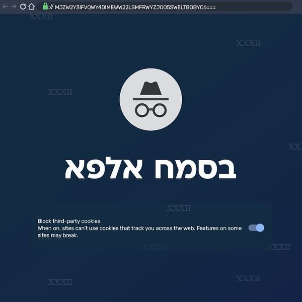
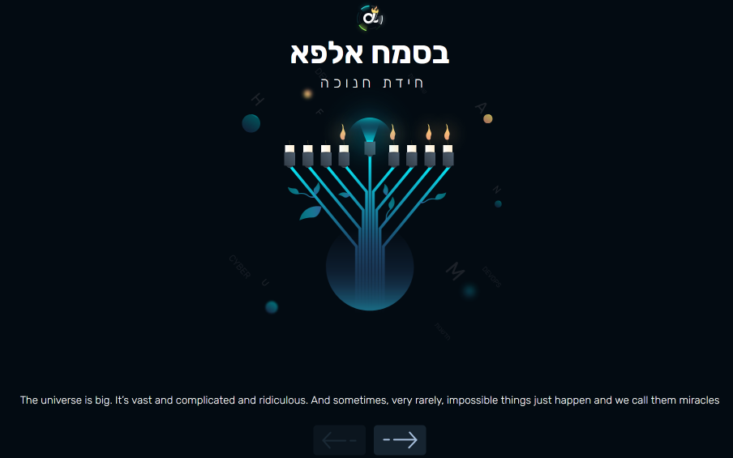
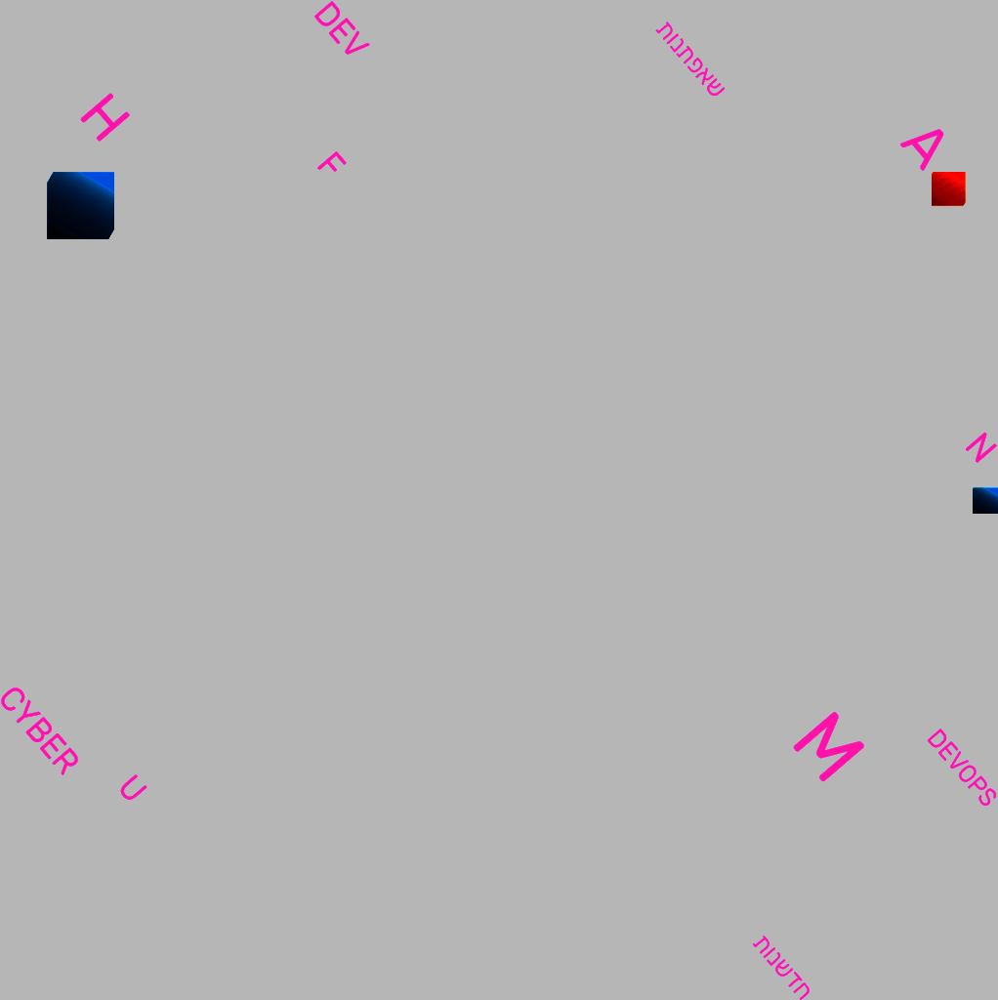
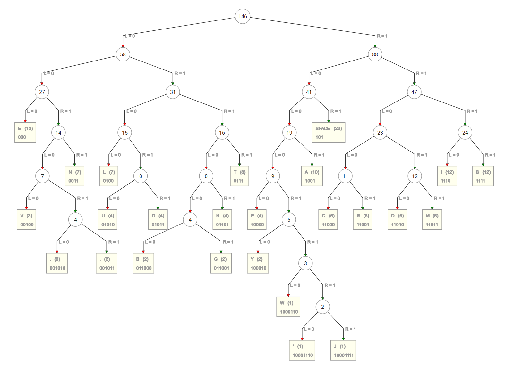

# Bashmach Alpha Hanukkah Riddle - חידת בסמ"ח אלפא לחנוכה

## Riddle

Basmach Alpha released a short [riddle](https://www.instagram.com/p/CmWifi8NINp/?igshid=YWJhMjlhZTc%3D) for Hanukkah in their [Instagram channel](https://www.instagram.com/bsmch.alpha/).



## Solution

The address bar in the image says: `MJZW2Y3IFVQWY4DIMEWW22LSMFRWYZJOO5SWELTBOBYC6===`. The image also contains many `XXXII` strings, which in Roman Numerals means `32`. 
So let's decode the text as base32:

```console
┌──(user@kali)-[/media/sf_CTFs/basmach]
└─$ echo MJZW2Y3IFVQWY4DIMEWW22LSMFRWYZJOO5SWELTBOBYC6=== | base32 -d
bsmch-alpha-miracle.web.app/
```

We visit the website and see a Hanukia with 8 candles, some lit and some not. 



This immediately looks like binary, where if a candle it lit we translate it to `1` and otherwise `0`. Each Hanukia is a byte!
We can click the arrow button to get additional Hanukias with different candles. 
However, the last Hanukia contains just six candles, which is odd if it should resemble a byte:


The raw values are:

```
00011011
10011110
01001010
11000111
11101111
00001101
00101001
10111101
10100101
10111
```

It's a bit hard to see, but the background contains some random letters and words. Here's a clearer version:



The letters are "H, F, A, U, M, N" which can spell out "HUFFMAN"! Can this be a Huffman-encoded message? (Hopefully not, since there are multiple ways to build a Huffman tree).

Anyway, we can take the sentence from below and try to build a Huffman tree, just like we did [here](https://github.com/Dvd848/CTFs/blob/master/2021_Matzov_NewYear/README.md).

```
The universe is big. It’s vast and complicated and ridiculous. And sometimes, very rarely, impossible things just happen and we call them miracles
```

If we use the [same service](https://huffman.ooz.ie/?text=The+universe+is+big.+It%E2%80%99s+vast+and+complicated+and+ridiculous.+And+sometimes,+very+rarely,+impossible+things+just+happen+and+we+call+them+miracles), we get:



Now we can use the tree to translate our message:

```python
huffman_dict = {
    '000': 'E',    '101': ' ',     '0011': 'N',
    '0100': 'L',   '0111': 'T',    '1001': 'A',
    '1110': 'I',   '1111': 'S',    '00100': 'V',
    '01010': 'U',  '01101': 'H',   '01011': 'O',
    '10000': 'P',  '11000': 'C',   '11001': 'R',
    '11010': 'D',  '11011': 'M',   '001010': '.',
    '001011': ',', '011000': 'B',  '011001': 'G',
    '100010': 'Y', '1000110': 'W', '10001110': '\'',
    '10001111': 'J'
}

def huffman_decode(dictionary, text):
    res = ""
    while text:
        for k in dictionary:
            if text.startswith(k):
                res += dictionary[k]
                text = text[len(k):]
    return res

print(huffman_decode(huffman_dict, '00011011100111100100101011000111111011110000110100101001101111011010010110111'))
```

Output:

```console
┌──(user@kali)-[/media/sf_CTFs/basmach]
└─$ python3 solve.py
EMAIL BSMCH.HIDOT
```