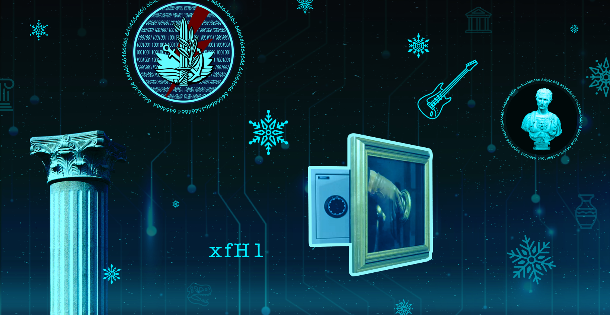
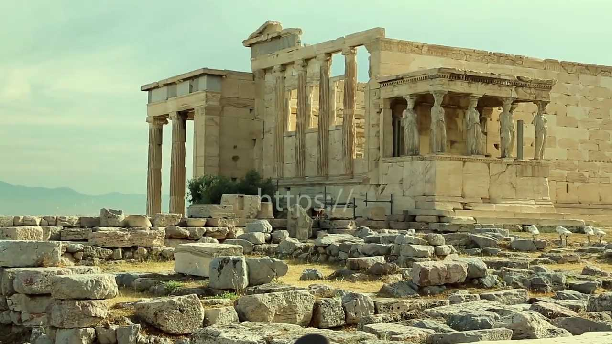
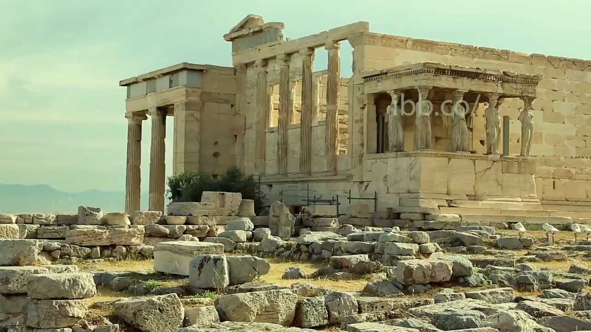
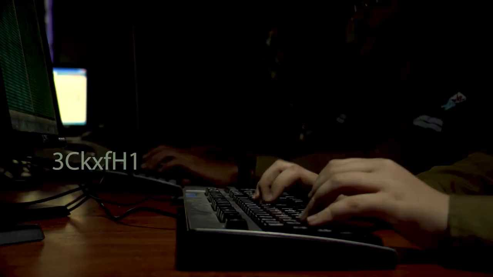
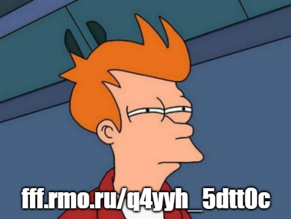

<div dir="rtl">
<h1>חידת אגף התקשוב וההגנה בסייבר - סוכות התשפ"ג</h1>
<p>
לרגל חג הסוכות פרסם אגף התקשוב וההגנה בסייבר חידה קצרה. נראה כאן את הפתרון שלה. על החידה עבדתי יחד עם קבוצה של גולשים בדיסקורד. 
</p>

<h2>תיאור</h2>
<p>
 כדי לקבל את הרמז הבא - אל תמצמצו לרגע:
<br/>
מאחורי 15 השניות האלו מסתתרת אחת החידות הקשות בצה"ל
<br/>
מה הקשר בין המספר 64, דובי ופרתנון? בבית הספר למקצועות המחשב בנו חידה מיוחדת שתאתגר את המוחות היצירתיים ביותר. קל זה לא יהיה - טוב שיש לכם 7 ימים לשבת על זה בסוכה
<br/>
<br/>
מערכת אתר צה"ל | 06.10.22
</p>

[](https://www.youtube.com/watch?v=iHkJE0vxdbI)

<p>
כותרת הדף הכילה את התמונה הבאה:
</p>




<h2>פתרון</h2>

<h3>התמונה בכותרת</h3>

<p>
לפני שאנחנו צוללים אל הסרטון, יש לנו המון נתונים בתמונה שבכותרת. נעבור על הכל בזריזות.
</p>

<ul>
    <li>תמונה של פסל של יוליוס קיסר, מוקפת בטקסט שמורכב אך ורק מהספרות 6 ו-4</li>
    <li>הלוגו של אגף התקשוב וההגנה בסייבר, גם הוא מוקף בטקסט דומה</li>
    <li>גיטרה</li>
    <li>כספת מסתתרת מאחורי תמונה (של כספת)</li>
    <li>הטקסט xfHl</li>
    <li>עמוד בסגנון יווני</li>
</ul>


<h3>הסרטון</h3>

<p>
נצפה בסרטון. הוא מכיל, בגדול, את הדברים הבאים:
</p>

<ul>
    <li>חיילים בסביבה ממוחשבת</li>
    <li>שרידי מבנים מיוון העתיקה</li>
    <li>קטעים מתוך סדרת הטלוויזיה "מראה שחורה"</li>
    <li>כספת מסתתרת מאחורי תמונה (של כספת)</li>
    <li>גיטריסט מנגן את Hail Caesar של ACDC</li>
    <li>מישהי שמסמנת "שקט"</li>
</ul>

<p>
בזמן הצפייה בסרטון, אפשר לראות הבזק של הכיתוב https. הרמז אמר לא למצמץ לרגע, לכן כדאי לעבור על הסרטון פריים-אחרי-פריים ולחפש מסרים נסתרים נוספים. אפשר לחלץ את הפריימים של הסרטון באמצעות הפקודות הבאות:
</p>

<pre dir="ltr">
$ youtube-dl -F https://www.youtube.com/watch?v=iHkJE0vxdbI
[youtube] iHkJE0vxdbI: Downloading webpage
[youtube] iHkJE0vxdbI: Downloading MPD manifest
[info] Available formats for iHkJE0vxdbI:
format code  extension  resolution note
...
22           mp4        1280x720   720p 1880k , avc1.64001F, 25fps, mp4a.40.2 (44100Hz) (best)

$ youtube-dl -f 22 https://www.youtube.com/watch?v=iHkJE0vxdbI
[youtube] iHkJE0vxdbI: Downloading webpage
[youtube] iHkJE0vxdbI: Downloading MPD manifest
[download] Destination: iHkJE0vxdbI.mp4
[download] 100% of 3.52MiB in 00:45

$ ffmpeg -i iHkJE0vxdbI.mp4  '%04d.png'
...
</pre>

<p>
נעבור על הפריימים ונמצא את הכיתובים הבאים:
</p>





<p>
יחד, הם מפנים לכתובת הבאה:
</p>

<pre>
https://ibb.co/3CkxfH1
</pre>

<h3>ה-Meme</h3>

<p>
נבקר בכתובת ונקבל את התמונה הבאה:
</p>



<p>
התמונה מכילה את הכיתוב:
</p>

<pre>
fff.rmo.ru/q4yyh_5dtt0c
</pre>

נפעיל על כך את צופן קיסר (ROT13) עם היסט של 17 ונקבל:

<pre>
www.idf.il/h4ppy_5ukk0t
</pre>

<h3>המסך הכחול</h3>

<p>
הגענו לדף חדש:
</p>


```
<div class=image-slider-wrap>
    <div class=image-slider>
        <div class=item-slide>
            <a href="/media/ymrg0k5j/bluescreenoflife-2.png?optimize=false" target=_blank download class=download-image>
                
            </a>
            <a href="/media/ymrg0k5j/bluescreenoflife-2.png" class=image-link>
                
            </a>
        </div>
    </div>
</div>
<div class=text-wrapper>
    <p><strong>ז וכרים את החידה הקודמת?</strong></p>
    <p><strong>י פה, מכאן, עליכם לחשוב על הקנקן.</strong></p>
    <p><strong>פ ה עליכם להסתכל על מה שבתוכו.</strong></p>
</div>
```


<p>
הדף הכיל את התמונה הבאה:
</p>


<p>
שימו לב כיצד האות הראשונה של כל משפט מופרדת משאר המשפט על מנת ליצור את המילה "זיפ". מעיון בקוד המקור של הדף, אפשר לראות שישנן מספר כתובות המקשרות אל התמונה. אם משלבים ביניהן וניגשים ל-https://www.idf.il/media/ymrg0k5j/bluescreenoflife-2.png?optimize=false&rnd=133092824826500000 מקבלים קובץ שמכיל הפתעה:
</p>

<pre dir="ltr">
$ binwalk bluescreenoflife-2.png

DECIMAL       HEXADECIMAL     DESCRIPTION
--------------------------------------------------------------------------------
0             0x0             JPEG image data, JFIF standard 1.01
13467         0x349B          Zip archive data, at least v2.0 to extract, compressed size: 498799, uncompressed size: 546086, name: secret/QR.png
512309        0x7D135         Zip archive data, at least v2.0 to extract, compressed size: 110, uncompressed size: 172, name: secret/riddle.txt
512588        0x7D24C         End of Zip archive, footer length: 22
</pre>

<h3>קובץ ה-Zip</h3>
<p>
קובץ ה-Zip הכיל שני קבצים. הראשון, חידה:
</p>

<pre>
חג מולד לבן, מוזיאון שחור. 
היוונים כבר הענישו בצורה הזאת. 
איך אומר הזר שצריך לדמיין את הגיבור?
</pre>

<p>
השני, קובץ QR:
</p>


<p>
קוד ה-QR הכיל טקסט מקודד ב-Base64 עם איחולים וכתובת מייל. מה לגבי החידה?
</p>


<p>
ובכן, "חג מולד לבן" ו"מוזיאון שחור" הם רפרנסים לפרקים של "מראה שחורה" שגם הופיעו בסרטון:
</p>

<ul>
    <li><a href="https://en.wikipedia.org/wiki/White_Christmas_(Black_Mirror)">White Christmas</a></li>
    <li><a href="https://en.wikipedia.org/wiki/Black_Museum_(Black_Mirror)">Black Museum</a></li>
</ul>

<p>
לפי הקטעים בסרטון, בשני המקרים מדובר על תודעה של בני אדם שמועברת בצורה דיגיטלית לעצם כלשהו. ב"חג מולד לבן" מדובר בשיבוט דיגיטלי של מישהי שנאלצת לשמש בתור "עוזרת אישית" של הבעלים שלה, וב"מוזיאון שחור" במישהי שתודעתה מועברת לבובת קוף שמסוגל להביע אך ורק שני רגשות. ישנם לא מעט עונשים במיתולוגיה היוונית, אך אולי הכוונה לסיזיפוס שנאלץ לגלגל סלע ענק במעלה הר, רק כדי לצפות בו מתגלגל חזרה מטה. אחת היצירות המפורסמות אודות סיזיפוס נקראת "המיתוס של סיזיפוס", מאת הסופר אלבר קאמי שפרסם גם רומן בשם "הזר". את הפרק האחרון של הספר הוא מסיים במשפט "יש לחשוב על סיזיפוס שמח" ("One must imagine Sisyphus happy"). ומצד שני, קצת מלנכולי בשביל חידת סוכות, לא?
</p>

<h3>חזרה לתמונת הכותרת</h3>

<p>
ננסה לסכם את הרמזים בתמונת הכותרת.
</p>

<ul>
    <li>תמונה של פסל של יוליוס קיסר, מוקפת בטקסט שמורכב אך ורק מהספרות 6 ו-4 - השתמשנו בצופן קיסר ובקידוד Base64 (לא היה שימוש בטקסט עצמו?)</li>
    <li>הלוגו של אגף התקשוב וההגנה בסייבר, גם הוא מוקף בטקסט דומה</li>
    <li>גיטרה - השיר של ACDC</li>
    <li>כספת מסתתרת מאחורי תמונה (של כספת) - קובץ ה-Zip שהסתתר בתמונה הכחולה</li>
    <li>הטקסט xfHl - הסיפא של הכתובת של ה-Meme</li>
    <li>עמוד בסגנון יווני - החלק בסרטון שהתחיל את הכתובת של ה-Meme</li>
</ul>

<h2>תודות</h2>

<p>
תודה לחברי הקבוצה בדיסקורד שהשתתפו בפתרון החידה: StormZ, nat, Shibolet, Omer Esco, SpOOky_L, Floyd1337, NoamS, IMaestro, nktfh100, ariel5912, Bobo, bonfire.
</p>


<h2>קישורים</h2>
<ul>
    <li><a href="https://www.idf.il/%D7%90%D7%AA%D7%A8%D7%99-%D7%99%D7%97%D7%99%D7%93%D7%95%D7%AA/%D7%90%D7%92%D7%A3-%D7%94%D7%AA%D7%A7%D7%A9%D7%95%D7%91-%D7%95%D7%94%D7%94%D7%92%D7%A0%D7%94-%D7%91%D7%A1%D7%91-%D7%A8/%D7%9B%D7%9C-%D7%94%D7%9B%D7%AA%D7%91%D7%95%D7%AA/2022/%D7%97%D7%99%D7%93%D7%AA-%D7%AA%D7%A7%D7%A9%D7%95%D7%91-%D7%A1%D7%A8%D7%98%D7%95%D7%9F-%D7%90%D7%A1%D7%A7%D7%99%D7%99%D7%A4-%D7%A8%D7%95%D7%9D-%D7%91%D7%A1%D7%9E%D7%97-%D7%9E%D7%97%D7%A9%D7%91-%D7%A6%D7%95%D7%A4%D7%9F-%D7%A7%D7%95%D7%93-%D7%A1%D7%95%D7%9B%D7%95%D7%AA/">החידה באתר צה"ל</a></li>
    <li><a href="https://www.ynet.co.il/news/article/skdki8nzj">כתבה ב-YNet</a></li>
    <li><a href="https://www.idf.il/%D7%90%D7%AA%D7%A8%D7%99-%D7%99%D7%97%D7%99%D7%93%D7%95%D7%AA/%D7%90%D7%92%D7%A3-%D7%94%D7%AA%D7%A7%D7%A9%D7%95%D7%91-%D7%95%D7%94%D7%94%D7%92%D7%A0%D7%94-%D7%91%D7%A1%D7%91-%D7%A8/%D7%9B%D7%9C-%D7%94%D7%9B%D7%AA%D7%91%D7%95%D7%AA/2022/%D7%97%D7%99%D7%93%D7%AA-%D7%AA%D7%A7%D7%A9%D7%95%D7%91-%D7%91%D7%A1%D7%9E-%D7%97-%D7%A1%D7%A8%D7%98%D7%95%D7%9F-%D7%A8%D7%9E%D7%96%D7%99%D7%9D-%D7%A4%D7%AA%D7%A8%D7%95%D7%A0%D7%95%D7%AA-%D7%9E%D7%97%D7%A9%D7%91-%D7%A7%D7%95%D7%93-%D7%A6%D7%95%D7%A4%D7%9F-%D7%99%D7%95%D7%95%D7%A0%D7%99%D7%9D-%D7%A1%D7%99%D7%96%D7%99%D7%A4%D7%95%D7%A1-%D7%A7%D7%99%D7%A1%D7%A8/">הפתרון הרשמי</a></li>
</ul>

</div>