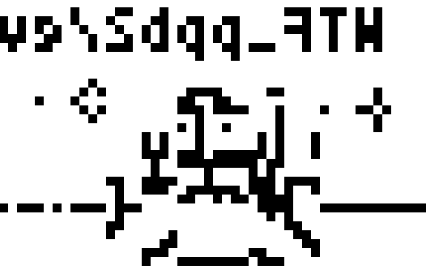
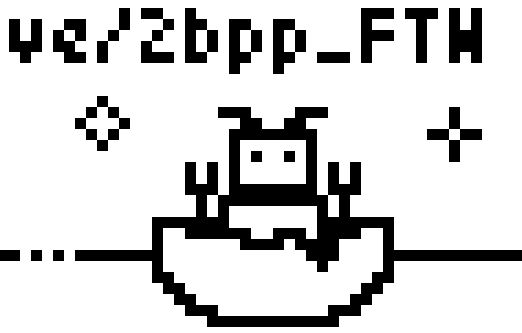
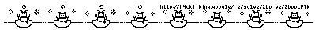

# Episode 5: Challenge 1

## Description

> Piece together the images to get a clearer picture.
> 
> Hint: I wonder if those toys from the 90's are still alive. 

A binary file was attached.

## Solution

Let's take a look at the binary file:

```console
┌──(user@kali)-[/media/…/h4ck1ng.google/EP005/Challenge_01/a]
└─$ file challenge.bin
challenge.bin: data

┌──(user@kali)-[/media/…/h4ck1ng.google/EP005/Challenge_01/a]
└─$ xxd -g 1 challenge.bin | head
00000000: 30 1f 00 00 00 00 00 00 00 00 00 00 00 00 00 00  0...............
00000010: 00 00 00 00 fc 00 00 00 00 00 00 00 00 00 00 03  ................
00000020: 00 00 00 00 00 00 00 00 00 00 00 03 0f 00 00 00  ................
00000030: 00 00 00 00 00 00 00 03 03 00 00 00 00 00 00 00  ................
00000040: 00 00 00 00 fc 00 00 00 00 00 00 00 00 00 00 00  ................
00000050: 00 00 00 00 00 00 00 00 c0 00 00 00 00 00 00 00  ................
00000060: 30 00 00 03 30 00 00 54 01 50 00 03 33 00 00 0c  0...0..T.P..3...
00000070: 0c 00 00 05 05 00 00 00 30 00 00 0c 0c 00 00 15  ........0.......
00000080: 55 40 00 0f cf c0 00 03 30 00 00 10 00 40 00 00  U@......0....@..
00000090: 30 00 00 00 c0 00 00 11 04 40 00 03 33 00 00 00  0........@..3...
```

Not much to work with. No known format. 
The hint talks about a 90's game which might be still alive, and the episode features a hacker named Natalie Silvanovich which loves hacking Tamagotchi devices.
Searching for related info online, we come across the [Egg-Shell repository](https://github.com/natashenka/Egg-Shell), which is maintained by Natalie and contains
some Tamagotchi Development Tools. Specifically, we find a script called [portrait.py](https://github.com/natashenka/Egg-Shell/blob/master/portrait/portrait.py) which
does some conversions between a bitmap and a custom image format. It's not exactly the same, but it seems similar enough to give us an idea about what's going on:

 * The first two bytes are width (`48`) and height (`31`). This gives us `48 * 31 = 1488` pixels. 
 * Each pixel is encoded into 2 bits, so `1488` pixels are encoded into `372` bytes. 
 
And indeed, if we skip `372 + 2` bytes, we arrive to a new header:

```console
┌──(user@kali)-[/media/…/h4ck1ng.google/EP005/Challenge_01/a]
└─$ xxd -g 1 -s 374 challenge.bin  | head
00000176: 30 1f 00 00 00 00 00 00 00 00 00 00 00 00 00 00  0...............
00000186: 00 00 00 00 fc 00 00 00 00 00 00 00 00 00 00 03  ................
00000196: 03 00 00 00 00 00 00 00 00 00 00 03 03 00 00 00  ................
000001a6: 00 00 00 00 00 00 00 03 33 00 00 00 00 00 00 00  ........3.......
000001b6: 00 00 00 00 f0 00 00 00 00 00 00 00 00 00 00 00  ................
000001c6: 00 00 00 00 00 00 00 00 30 00 00 00 00 00 00 03  ........0.......
000001d6: 00 00 00 00 cc 00 00 00 00 00 00 03 00 00 00 03  ................
000001e6: 03 00 00 00 00 00 00 3c f0 00 00 00 cc 00 00 54  .......<.......T
000001f6: 01 50 00 03 00 00 00 00 30 00 00 05 05 00 00 03  .P......0.......
00000206: 00 00 00 00 00 00 00 15 55 40 00 00 00 00 00 00  ........U@......
```

Let's create a quick script to decode the images:

```python
from PIL import Image
from itertools import count

BLACK = (0, 0, 0)
WHITE = (255, 255, 255)

BITS_PER_PIXEL = 2
BITS_PER_BYTE = 8
PIXELS_IN_BYTE = BITS_PER_BYTE // BITS_PER_PIXEL
PIXEL_MASK = ((1 << BITS_PER_PIXEL) - 1)

with open("challenge.bin", "rb") as f:
    for counter in count():
        width = f.read(1)
        if width == b'':
            break
        
        width = ord(width)
        height = ord(f.read(1))

        img = Image.new('RGB', (width, height))

        pixels = []
        for i in range((width * height) // PIXELS_IN_BYTE):
            p = ord(f.read(1))
            for _ in range(PIXELS_IN_BYTE):
                pixels.append( BLACK if (p & PIXEL_MASK != 0) else WHITE)
                p >>= BITS_PER_PIXEL
        
        img.putdata(pixels)
        img.save(f"out_{counter}.png")
```

We run it and receive 8 images, for example:



Wait, what? We must have gotten the order reversed. Let's try again:

```python
        for i in range((width * height) // PIXELS_IN_BYTE):
            data = []
            p = ord(f.read(1))
            for _ in range(PIXELS_IN_BYTE):
                data.append( BLACK if (p & PIXEL_MASK != 0) else WHITE)
                p >>= BITS_PER_PIXEL
            pixels += (data[::-1])
```

Output for the same image is now:



This makes much more sense. And the full images:



The flag: `https://h4ck1ng.google/solve/2bpp_FTW`