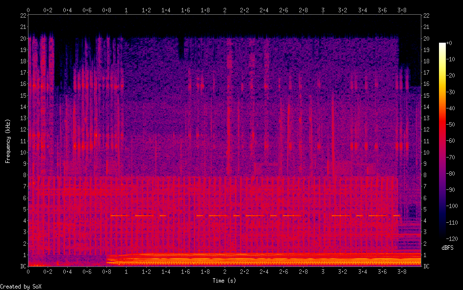

# Episode 5: Challenge 3

## Description

> Look back at all the episodes and piece together a secret message.
> 
> Hint: This code isn't data but it could have prevented Aurora. Introductions are important. 


## Solution

According to the description, there's a secret message hiding in the video introductions. And indeed, at the end of each introduction, we can hear some suspicious beeps.
Let's extract them with the following script:

```bash
#!/bin/bash

[ $# -ne 4 ] && { echo "Usage: $0 youtube_id start_point duration output_file"; exit 1; }

id=$1
start=$2
duration=$3
out=$4.wav

echo "Extracting $duration seconds of audio from $id, starting from $start"

url=$(youtube-dl --youtube-skip-dash-manifest -g "https://www.youtube.com/watch?v=$id" | tail -n 1)

ffmpeg -ss $start -i $url -t $duration -vn -acodec pcm_s16le -ar 44100 -ac 1 -y $out > /dev/null 2>&1
[ $? -ne 0 ] && { echo "Error extracting audio!"; exit 1; }

echo "Saved to $out"
```

We run the script on each episode, providing the exact start time and duration of the beeps:

``console
user@user-VirtualBox:/media/sf_CTFs/h4ck1ng.google/EP005/Challenge_03/audio$ ./extract.sh przDcQe6n5o 2:52 0:04 ep000
Extracting 0:04 seconds of audio from przDcQe6n5o, starting from 2:52
Saved to ep000.wav
user@user-VirtualBox:/media/sf_CTFs/h4ck1ng.google/EP005/Challenge_03/audio$ ./extract.sh N7N4EC20-cM 2:18 0:04 ep001
Extracting 0:04 seconds of audio from N7N4EC20-cM, starting from 2:18
Saved to ep001.wav
user@user-VirtualBox:/media/sf_CTFs/h4ck1ng.google/EP005/Challenge_03/audio$ ./extract.sh QZ0cpBocl3c 1:31 0:04 ep002
Extracting 0:04 seconds of audio from QZ0cpBocl3c, starting from 1:31
Saved to ep002.wav
user@user-VirtualBox:/media/sf_CTFs/h4ck1ng.google/EP005/Challenge_03/audio$ ./extract.sh TusQWn2TQxQ 2:14 0:04 ep003
Extracting 0:04 seconds of audio from TusQWn2TQxQ, starting from 2:14
Saved to ep003.wav
user@user-VirtualBox:/media/sf_CTFs/h4ck1ng.google/EP005/Challenge_03/audio$ ./extract.sh IoXiXlCNoXg 3:21 0:04 ep004
Extracting 0:04 seconds of audio from IoXiXlCNoXg, starting from 3:21
Saved to ep004.wav
user@user-VirtualBox:/media/sf_CTFs/h4ck1ng.google/EP005/Challenge_03/audio$ ./extract.sh My_13FXODdU 2:23 0:05 ep005
Extracting 0:05 seconds of audio from My_13FXODdU, starting from 2:23
Saved to ep005.wav
```

Now, let's check the spectrogram for one of the outputs:

```console
┌──(user@kali)-[/media/…/h4ck1ng.google/EP005/Challenge_03/audio]
└─$ sox ep000.wav -n spectrogram -o ep000.png
```

We get:



This is clearly morse code!

We repeat the process for the rest of the images and get:

```
ep000: --. .-.-.- -.-.
ep001: --- -..-. ....
ep002: --- -..-. ....
ep003: ... .- ..-. . -
ep004: -.-- -..-. ....
ep005: -.. ...- - .-- .-
```

It looks like chapter 1 and chapter 2 have the same sequence for some reason. Let's translate what we got:

```javascript
> const chef = require("/home/user/utils/CyberChef/");
undefined
> chef.fromMorseCode("--. .-.-.- -.-.")
G.C
> chef.fromMorseCode("--- -..-. ....")
O/H
> chef.fromMorseCode("--- -..-. ....")
O/H
> chef.fromMorseCode("... .- ..-. . -")
SAFET
> chef.fromMorseCode("-.-- -..-. ....")
Y/H
> chef.fromMorseCode("-.. ...- - .-- .-")
DVTWA
```

There must be a mistake in chapter 2. Guessing around a bit, we can arrive to `G.CO/HACKTOSAFETY/HDVTWA`, based on the series motto which is "Back to safety"(?). When visiting that url, we get redirect to `https://h4ck1ng.google/solve/1_c4n_h34r_c134r1y_n0w_th3_5h1p_15_90n3`.
