# IAI Challenge 2022 - החידה הטכנולוגית של התעשייה האווירית 2022

## Introduction

The IAI published a technological challenge. It contained two riddles. We'll review the solutions here.

[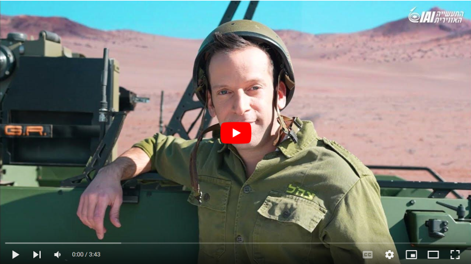](https://www.youtube.com/watch?v=kSQiOpd5CB8)

## Solution

### Riddle #1

The narrator introduces [Celestial Navigation](https://en.wikipedia.org/wiki/Celestial_navigation) and moves on to a "game show" called "*In the Sky*".

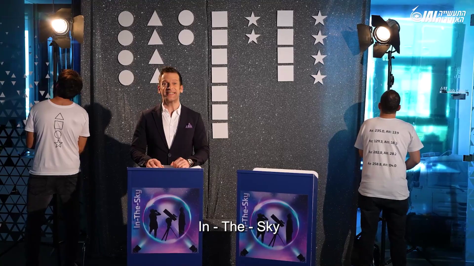

During the game show, the following questions and answers are presented:

 * Complete the sentence: "Stars fell on ..."
    * **Alabama**
 * What did Edison use?
    * **Tasimeter**
 * What did Mark Twain want to do when that moment comes?
    * **Die**
 * Which planet was discovered?
    * **51 Pegasi b**

The "Az" and "Alt" on the back of the shirt probably stand for "azimuth" and "altitude". We have four pairs:

```
Az: 235.0, Alt: 13.9
Az: 129.3, Alt: 18.3
Az: 282.8, Alt: 28.2
Az: 258.8, Alt: 04.0
```

In addition to the four coordinates, we also have four shapes on the back of the other shirt. Notice how we have the same four shapes on the cards the correspond to each question.

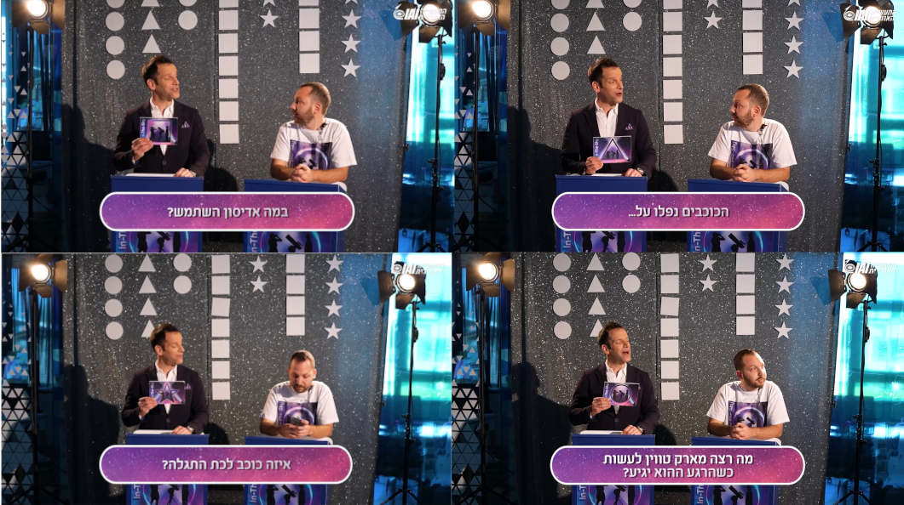

The wall has the same shapes. We'll get to that later.

Researching what we can do with the information that we have, we come across the [Online Planetarium](https://in-the-sky.org/skymap.php) in a website called [In-The-Sky.org](https://in-the-sky.org). This is the name of the game show! The Planetarium allows us to see star locations at a given coordinate on a given time and date. We have a time and location mentioned by the narrator:

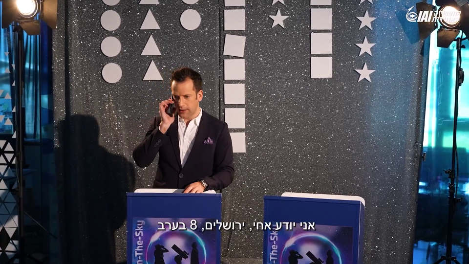

Where do we get the dates from? Well, it turns out that each of the game show questions can be mapped to a given date:

 * △ Stars fell on Alabama: [Jazz Song](https://en.wikipedia.org/wiki/Stars_Fell_on_Alabama) referring to the [Leonid meteor shower](https://en.wikipedia.org/wiki/Leonids) that had been observed in Alabama on [November 12-13 1833](https://blogs.loc.gov/headlinesandheroes/2020/09/how-newspapers-helped-crowdsource-a-scientific-discovery-the-1833-leonid-meteor-storm/)
 * □ Tasimeter: Used to measure minute temperature changes in heat emitted from the Sun's corona during the [July 29 1878 solar eclipse](https://en.wikipedia.org/wiki/Solar_eclipse_of_July_29,_1878)
 * ○ [Mark Twain died](https://en.wikipedia.org/wiki/Mark_Twain) on April 21, 1910
 * ☆ [51 pegasi b](https://en.wikipedia.org/wiki/51_Pegasi_b) was discovered on the 6th of October, 1995

Using the dates, time, location and coordinates, we are led to four planets.

<u>△: Neptune</u>

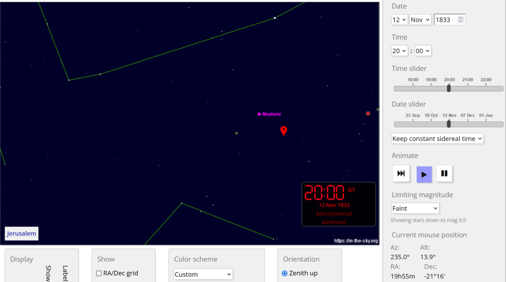

<u>□: Jupiter</u>

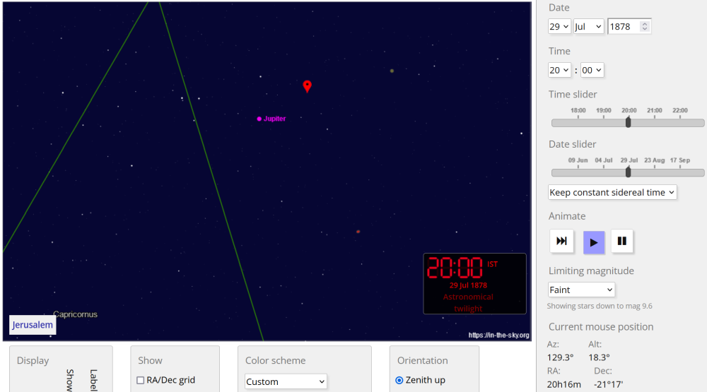

<u>○: Mars</u>

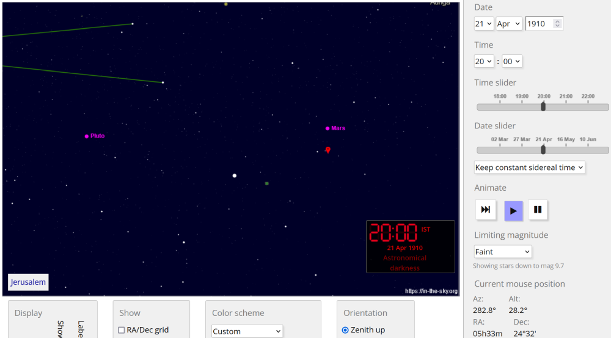

<u>☆: Pluto</u>

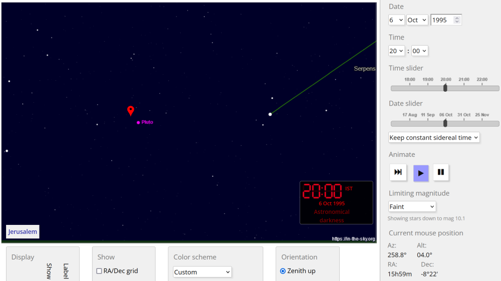

Now that we have the planets, we use the shapes on the wall as indices into the planet names in order to get the solution:

```python
>>> triangle = "Neptune"
>>> square = "Jupiter"
>>> circle = "Mars"
>>> star = "Pluto"
>>> circle[4-1] + triangle[4-1] + circle[2-1] + square[7-1] + star[2-1] + square[4-1] + star[4-1]
'starlit'
```

### Riddle #2

Let's start collecting the pieces for the second riddle. 

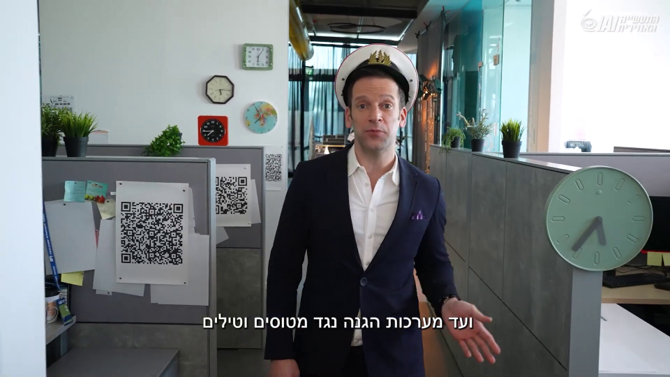

In the frame above, we have:

 * Multiple clocks
 * Three QR codes

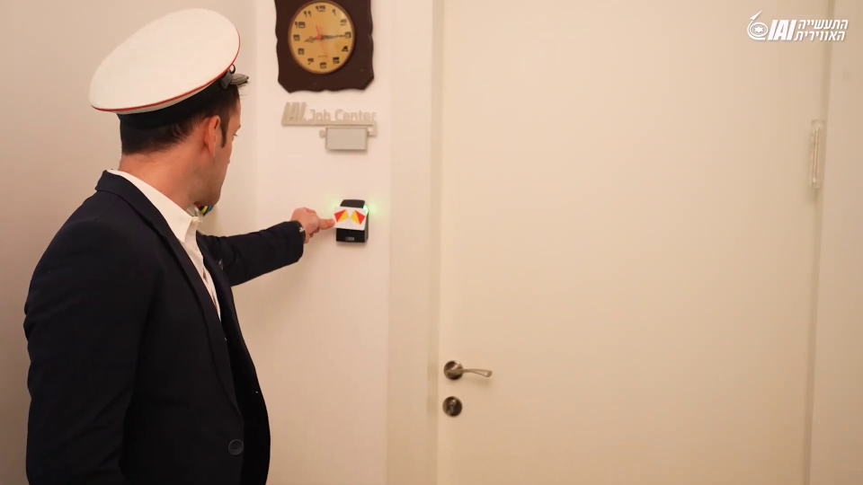

In the frame above, we have:

 * Another clock
 * An access card with an interesting symbol on it

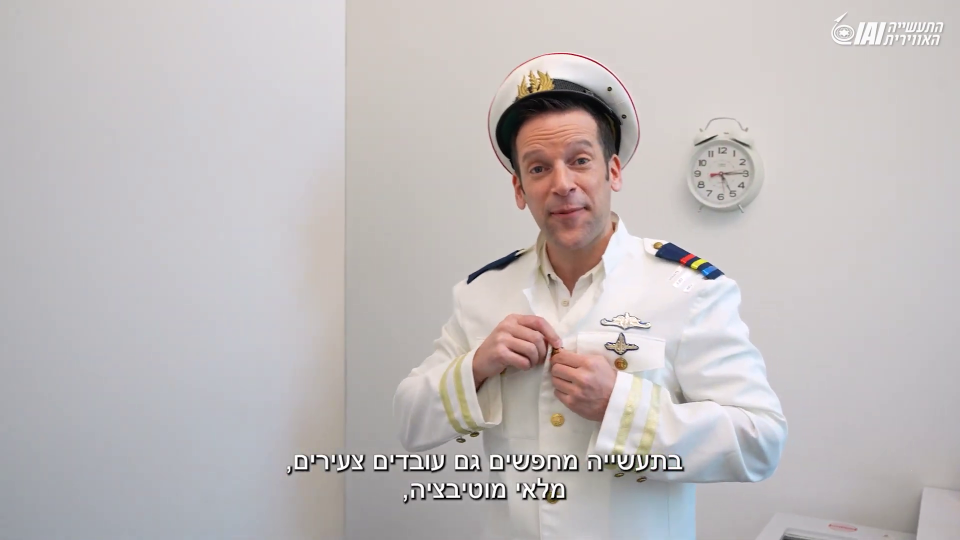

In the frame above, we have another clock.

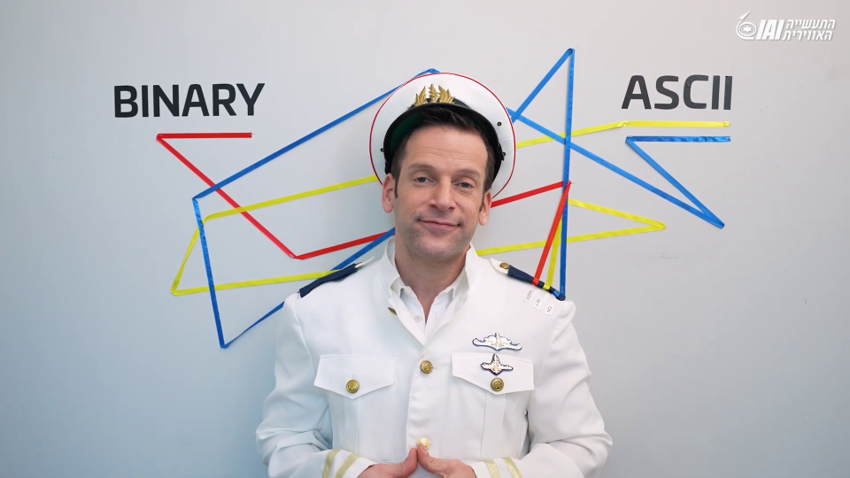

In the frame above, we have the labels "ASCII" and "BINARY" mapped to the labels on the narrators shoulder: "On", "Off" and "Guide".

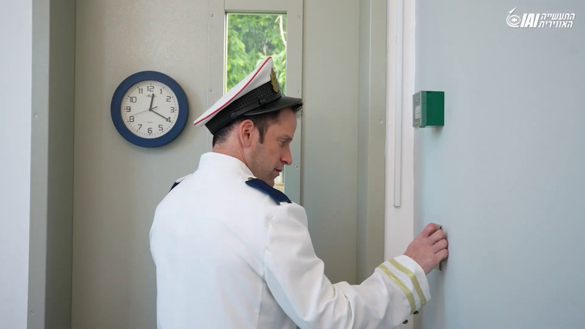

In the frame above, we have one last clock, and we're done.

The most obvious thing to start with is the QR codes:

```console
┌──(user@kali)-[/media/sf_CTFs/iai]
└─$ zbarimg _qr1.png
QR-Code:http://Off: 65746372616173687961636b796c6f6e6b79796f726b68616d64656579756e7474616c72746e656972656d656775746865
scanned 1 barcode symbols from 1 images in 0.04 seconds


┌──(user@kali)-[/media/sf_CTFs/iai]
└─$ zbarimg _qr2.png
QR-Code:http://Guide: 193329B5ACD33
scanned 1 barcode symbols from 1 images in 0.03 seconds


┌──(user@kali)-[/media/sf_CTFs/iai]
└─$ zbarimg _qr3.png
QR-Code:http://On: 696e746f656d746565736868636b6563736265646e6577756e6f726164616d647368696d65796679766f6f696e6e616573
scanned 1 barcode symbols from 1 images in 0.02 seconds
```

Notice how they are labeled "On", "Off" and "Guide" as well. "On" and "Off" were mapped to "ASCII", and "Guide" was mapped to "Binary". Let's give that a shot:

```python
>>> off = "65746372616173687961636b796c6f6e6b79796f726b68616d64656579756e7474616c72746e656972656d656775746865"
>>> on  = "696e746f656d746565736868636b6563736265646e6577756e6f726164616d647368696d65796679766f6f696e6e616573"
>>> guide = "193329B5ACD33"
>>> bytearray.fromhex(off).decode()
'etcraashyackylonkyyorkhamdeeyunttalrtneiremeguthe'
>>> bytearray.fromhex(on).decode()
'intoemteeshhckecsbednewunoradamdshimeyfyvooinnaes'
>>> format(int(guide, 16), 'b')
'1100100110011001010011011010110101100110100110011'
```

So we get three sequences of the same length. It makes sense to try and iterate `guide`, selecting a character from `on` if the value is `1` and a character from `off` otherwise.

```python
>>> guide = "1100100110011001010011011010110101100110100110011"
>>> off   = "etcraashyackylonkyyorkhamdeeyunttalrtneiremeguthe"
>>> on    = "intoemteeshhckecsbednewunoradamdshimeyfyvooinnaes"
>>> "".join([on[i] if g == "1" else off[i] for i, g in enumerate(guide)])
'increaseeachclockbyonehundredandthirtyfiveminutes'
```

We are being told to "increase each clock by one hundred and thirty five minutes". This gives us the following times:

```python
>>> from datetime import date, datetime, time, timedelta
>>> td = timedelta(minutes=135)
>>> 
>>> (datetime.combine(date.today(), time(7, 55)) + td).time()
datetime.time(10, 10)
>>> 
>>> (datetime.combine(date.today(), time(5, 15)) + td).time()
datetime.time(7, 30)
>>> 
>>> (datetime.combine(date.today(), time(6, 5)) + td).time()
datetime.time(8, 20)
>>> 
>>> (datetime.combine(date.today(), time(7, 45)) + td).time()
datetime.time(10, 0)
>>> 
>>> (datetime.combine(date.today(), time(5, 35)) + td).time()
datetime.time(7, 50)
>>> 
>>> (datetime.combine(date.today(), time(8, 15)) + td).time()
datetime.time(10, 30)
>>> 
>>> (datetime.combine(date.today(), time(5, 15)) + td).time()
datetime.time(7, 30)
>>> 
>>> (datetime.combine(date.today(), time(12, 20)) + td).time()
datetime.time(14, 35)
```

What do we do with it? That's where the symbol on the access card comes in: It's the symbol of the [Flag semaphore](https://en.wikipedia.org/wiki/Flag_semaphore) message system.

```
10:10 -> U
07:30 -> A
08:20 -> N
10:00 -> T
07:50 -> I
10:30 -> C
07:30 -> A
14:35 -> L
```

With the help of a Scrabble solver, we can see that the only matching word is "NAUTICAL".

## Additional Links

 * [GeekTime Article](https://www.geektime.co.il/iai-challenge-dec-2022/)