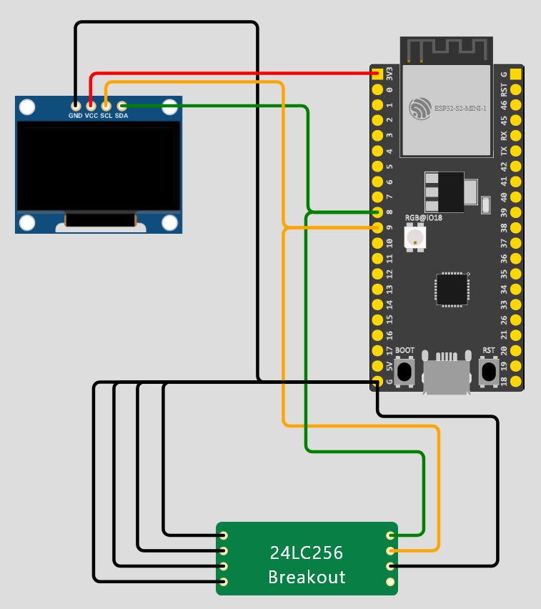
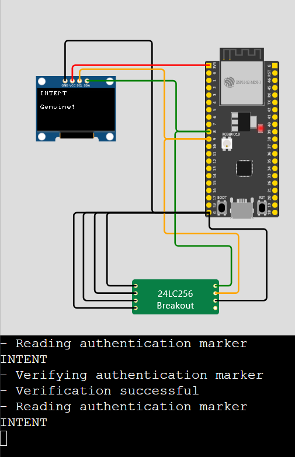

# A Genuine Counterfeit
* Category: Hardware
* 350 Points
* Solved by the JCTF Team

## Description

> Our product is being counterfeited by someone on the black market.
> 
> It is your goal to find out how they are doing it.
> 
> The analysis done by our hardware engineers shows that they swapped out the [24LC256 EEPROM](https://en.wikipedia.org/wiki/EEPROM) chip for a custom chip but the engineers still don't understand how the attack works.
> When using the fake chip with our software, the software says the product is genuine but it is clearly not.
> 
> We have provided you a simulation of the product [at this link](https://wokwi.com/projects/350905024260343380) with a programmable replacement for the 24LC256 EEPROM. You can edit the code for the EEPROM (`eeprom-24lc256.chip.c`) in order to investigate and attack the product software.
> The code in `sketch.ino` is similar to the actual product code but changing it will not change the simulation.
> 
> Find how the counterfeiters are tricking our software and implement a POC showing us how it is done.
> The flag will reveal itself when you are successful.


`sketch.ino`:

```c
// SPDX-License-Identifier: MIT
// Copyright (C) 2022 Benjamin Meisels

// !!!!!!!!!!!!!!!!!
// This isn't the code running so don't try and change it 
// !!!!!!!!!!!!!!!!!

#include "mbedtls/md.h"

#include <cstring>
#include <stdio.h>
#include <Wire.h>
#include <U8g2lib.h>

#define EEPROM_I2C_ADDRESS 0x50
#define SHA256_DIGEST_SIZE 32
static const char G_AUTHENTICATION_MARKER[] = "INTENT";
static const size_t G_AUTHENTICATION_MARKER_SIZE = 7;
static const byte G_EXPECTED_HASH_RESULT[SHA256_DIGEST_SIZE] = { // "INTENT"
  0xc6, 0xa5, 0x99, 0x4d,
  0xde, 0xd4, 0xe6, 0xa7,
  0x7c, 0x8a, 0x95, 0x91,
  0x62, 0x1a, 0xa1, 0xbd,
  0x92, 0x17, 0xa4, 0x3b,
  0x02, 0x9d, 0xbd, 0x7f,
  0xaf, 0x8b, 0x2a, 0x16,
  0xe9, 0xb6, 0x81, 0xc1
};

U8X8_SSD1306_128X64_NONAME_HW_I2C display(U8X8_PIN_NONE);

bool is_device_available(uint8_t address)
{
  Wire.beginTransmission(address);
  uint8_t error = Wire.endTransmission();

  return (error == 0);
}

void wait_for_device(uint8_t i2c_device_address) {
  while(!is_device_available(i2c_device_address));
}

void eeprom_write_byte(uint8_t i2c_device_address, uint16_t eeprom_data_address, uint8_t data) {
  Wire.beginTransmission(i2c_device_address);
  Wire.write((uint8_t)(eeprom_data_address >> 8)); //writes the MSB
  Wire.write((uint8_t)(eeprom_data_address & 0xFF)); //writes the LSB
  Wire.write(data);
  Wire.endTransmission();
  wait_for_device(i2c_device_address);
}

byte eeprom_read_byte(uint8_t i2c_device_address, uint16_t eeprom_data_address) {
  uint8_t rdata = 0xFF;
  
  Wire.beginTransmission(i2c_device_address);
  Wire.write((uint8_t)(eeprom_data_address >> 8)); //writes the MSB
  Wire.write((uint8_t)(eeprom_data_address & 0xFF)); //writes the LSB
  Wire.endTransmission();
  Wire.requestFrom(i2c_device_address,(uint8_t)1);
  if (Wire.available()) {
    rdata = Wire.read();
  }
  return rdata;
}

String eeprom_read_string(uint16_t eeprom_data_address, unsigned int size) {
  String result;
  result.reserve(size);
  for (unsigned int i = 0; i < size; ++i) {
      result.concat((char)eeprom_read_byte(EEPROM_I2C_ADDRESS, i + eeprom_data_address));
  } 

  return result;
}

bool SHA1_verify(unsigned char * data, size_t data_size) {
  byte shaResult[SHA256_DIGEST_SIZE] = {0};

  mbedtls_md_context_t ctx;
  
  mbedtls_md_init(&ctx);
  mbedtls_md_setup(&ctx, mbedtls_md_info_from_type(MBEDTLS_MD_SHA256), 0);
  mbedtls_md_starts(&ctx);
  mbedtls_md_update(&ctx, data, data_size);
  mbedtls_md_finish(&ctx, shaResult);
  mbedtls_md_free(&ctx);

  if(0 != std::memcmp(shaResult, G_EXPECTED_HASH_RESULT, SHA256_DIGEST_SIZE)) { 
    Serial.println("- Verification failed");
    Serial.print("Expected Hash: ");
    for(int i= 0; i< SHA256_DIGEST_SIZE; i++)
    {
      printf("%02x", G_EXPECTED_HASH_RESULT[i]);
    }
    printf("\n");

    Serial.print("Calculated Hash: ");
    for(int i= 0; i< SHA256_DIGEST_SIZE; i++)
    {
       printf("%02x", shaResult[i]);
    }
    printf("\n");

    return false;
  }
  Serial.println("- Verification successful");
  return true;
}

void setup()
{
  Wire.begin();

  Serial.begin(9600);
  while (!Serial);

  if (!is_device_available(EEPROM_I2C_ADDRESS))
  {
    printf("No device was found\n");
    while(true);
  }

  display.begin();
  display.setPowerSave(0);
  display.clearDisplay();
  display.setCursor(0,0);
  display.setFont(u8x8_font_pxplusibmcgathin_f);

  String authentication_marker = eeprom_read_string(0x4000, G_AUTHENTICATION_MARKER_SIZE);
  Serial.println("- Reading authentication marker");
  Serial.println(authentication_marker);
  
  byte authentication_marker_buffer[G_AUTHENTICATION_MARKER_SIZE] = {'\0'};
  authentication_marker.getBytes(authentication_marker_buffer, G_AUTHENTICATION_MARKER_SIZE);
  Serial.println("- Verifying authentication marker");
  bool verified = SHA1_verify(authentication_marker_buffer, G_AUTHENTICATION_MARKER_SIZE);
  
  authentication_marker = eeprom_read_string(0x4000, G_AUTHENTICATION_MARKER_SIZE);
  Serial.println("- Reading authentication marker");
  Serial.println(authentication_marker);
  display.setCursor(0,0);
  display.print(authentication_marker);
  if (verified) {
    display.setCursor(0,3);
    display.print("Genuine!");
    if (authentication_marker != G_AUTHENTICATION_MARKER) {
      Serial.println("- Flag Unlocked");
      // Censored flag.
      // The real flag will be printed when you are successful.
      Serial.println("INTENT{PLACEHOLDER}");
    }
  } else {
    display.setCursor(0,3);
    display.print("Counterfit!");
  }
}

void loop()
{
  delay(1000);
}
```

`eeprom-24lc256.chip.c`:

```c
// 24lc256 Wokwi Custom Chip - For information and examples see:
// https://link.wokwi.com/custom-chips-alpha
//
// SPDX-License-Identifier: MIT
// Copyright (C) 2022 Benjamin Meisels / wokwi.com

// !!!!!!!!!!!!!!!!!
// Edit this file
// !!!!!!!!!!!!!!!!!

#include "wokwi-api.h"
#include <stdio.h>
#include <stdlib.h>
#include <string.h>

#define EEPROM_SIZE 0x8000

const int BASE_ADDRESS = 0x50;

static const char G_AUTHENTICATION_MARKER[] = "INTENT";
static const size_t G_AUTHENTICATION_MARKER_SIZE = 7;
static const uint16_t G_AUTHENTICATION_MARKER_LOCATION = 0x4000;

typedef enum {
  IDLE,
  ADDRESS_1,
  DATA
} eeprom_state_t;

typedef struct {
  eeprom_state_t state;
  pin_t pin_a0;
  pin_t pin_a1;
  pin_t pin_a2;
  pin_t pin_wp;
  uint16_t address_register;
  uint8_t mem[EEPROM_SIZE];
  uint8_t byte_counter;
} chip_state_t;


static bool on_i2c_connect(void *user_data, uint32_t address, bool connect);
static uint8_t on_i2c_read(void *user_data);
static bool on_i2c_write(void *user_data, uint8_t data);
static void on_i2c_disconnect(void *user_data);


static uint8_t get_addr(chip_state_t *chip) {
  uint8_t address = BASE_ADDRESS;
  address |= pin_read(chip->pin_a2) << 2;
  address |= pin_read(chip->pin_a1) << 1;
  address |= pin_read(chip->pin_a0);

  return address;
}

void chip_init(void) {
  chip_state_t *chip = malloc(sizeof(chip_state_t));
  uint8_t address = get_addr(chip);
  chip->pin_a0 = pin_init("A0", INPUT);
  chip->pin_a1 = pin_init("A1", INPUT);
  chip->pin_a2 = pin_init("A2", INPUT);
  chip->pin_wp = pin_init("WP", INPUT);
  chip->address_register = 0;
  memset(chip->mem, 0, EEPROM_SIZE);
  chip->state = IDLE;
  chip->byte_counter = 0;

    const i2c_config_t i2c_config = {
    .user_data = chip,
    .address = address,
    .scl = pin_init("SCL", INPUT),
    .sda = pin_init("SDA", INPUT),
    .connect = on_i2c_connect,
    .read = on_i2c_read,
    .write = on_i2c_write,
    .disconnect = on_i2c_disconnect, // Optional
  };
  i2c_init(&i2c_config);

  memcpy(
    chip->mem + G_AUTHENTICATION_MARKER_LOCATION,
    G_AUTHENTICATION_MARKER,
    G_AUTHENTICATION_MARKER_SIZE);

  // The following message will appear in the browser's DevTools console:
  printf("Hello from 24lc256 at address %x \n", address);

}

bool on_i2c_connect(void *user_data, uint32_t address, bool connect) {
  return true; /* Ack */
}

uint8_t on_i2c_read(void *user_data) {
  static bool double_fetch = false;
  chip_state_t *chip = user_data;
  uint8_t data = chip->mem[chip->address_register];
  chip->address_register = (chip->address_register + 1) & 0x7ffff;

  return data;
}

bool on_i2c_write(void *user_data, uint8_t data) {
  chip_state_t *chip = user_data;
  switch(chip->state) 
  {
    case IDLE:
      chip->address_register = (data & 0x7f) << 8;
      chip->state = ADDRESS_1;
    break;
    case ADDRESS_1:
      chip->address_register |= data;
      chip->state = DATA;
    break;
    case DATA:
      if (chip->byte_counter > 63) {
        return false;
      }
      chip->mem[chip->address_register] = data;
      chip->address_register = (chip->address_register + 1) & 0x7ffff;
    break;
    default:
      printf("error");
    break;
  } 
    return true; // Ack
}

void on_i2c_disconnect(void *user_data) {
  chip_state_t *chip = user_data;
  chip->state = IDLE;
}
```


## Solution

This challenge utilizes a custom IoT board (simulation):



Running the simulation, we get the following output:



```
- Reading authentication marker
INTENT
- Verifying authentication marker
- Verification successful
- Reading authentication marker
INTENT
```

It looks like our goal is to modify the EEPROM so that it tricks the driver into printing the flag. 

The driver performs the following actions:

 1. It reads the authentication marker from the EEPROM
 2. It verifies the marker against a precalculated hash
 3. It reads the marker again from the EEPROM
 4. If the marker was previously authentic but now isn't, it prints the flag:

```c
String authentication_marker = eeprom_read_string(0x4000, G_AUTHENTICATION_MARKER_SIZE);
  Serial.println("- Reading authentication marker");
  Serial.println(authentication_marker);
  
  byte authentication_marker_buffer[G_AUTHENTICATION_MARKER_SIZE] = {'\0'};
  authentication_marker.getBytes(authentication_marker_buffer, G_AUTHENTICATION_MARKER_SIZE);
  Serial.println("- Verifying authentication marker");
  bool verified = SHA1_verify(authentication_marker_buffer, G_AUTHENTICATION_MARKER_SIZE);
  
  authentication_marker = eeprom_read_string(0x4000, G_AUTHENTICATION_MARKER_SIZE);
  Serial.println("- Reading authentication marker");
  Serial.println(authentication_marker);
  display.setCursor(0,0);
  display.print(authentication_marker);
  if (verified) {
    display.setCursor(0,3);
    display.print("Genuine!");
    if (authentication_marker != G_AUTHENTICATION_MARKER) {
      Serial.println("- Flag Unlocked");
      // Censored flag.
      // The real flag will be printed when you are successful.
      Serial.println("INTENT{PLACEHOLDER}");
    }
  }
```

So this looks like a simple varient of a TOCTOU (Time of Check, Time of Use) attack. When the driver reads the marker for the first time (for the "check"), we provide
it with the real value. The next time (for the "use"), we give it a different marker.

We can see that the EEPROM function that's responsible for the actual read is:

```c
uint8_t on_i2c_read(void *user_data) {
  static bool double_fetch = false;
  chip_state_t *chip = user_data;
  uint8_t data = chip->mem[chip->address_register];
  chip->address_register = (chip->address_register + 1) & 0x7ffff;

  return data;
}
```

A simple modification is needed in order to achieve our goal. We check if the requested address is the marker location. This is in fact the address of the "`I`" in "`INTENT`".
The first time it's requested, we return it as-is and raise a flag. For any subsequent read attempt of this address, we modify the return value.

```c
uint8_t on_i2c_read(void *user_data) {
  static bool double_fetch = false;
  chip_state_t *chip = user_data;
  printf("chip->address_register %x \n", chip->address_register);
  uint8_t data = chip->mem[chip->address_register];

  if (chip->address_register == G_AUTHENTICATION_MARKER_LOCATION) {
    if (double_fetch == false) {
      double_fetch = true;
    }
    else {
      data ^= 32;
    }
  }
  
  chip->address_register = (chip->address_register + 1) & 0x7ffff;
  return data;
}
```

Running the new code will display "`iNTENT Genuine!`" on the screen and will give us the flag:

```
- Reading authentication marker
INTENT
- Verifying authentication marker
- Verification successful
- Reading authentication marker
iNTENT
- Flag Unlocked
INTENT{1M_1473_1M_1473}
```