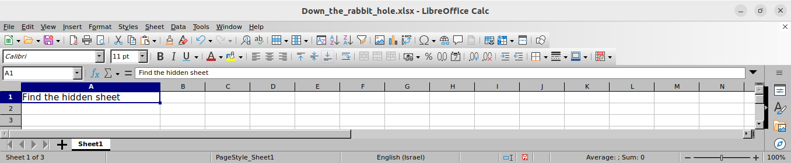
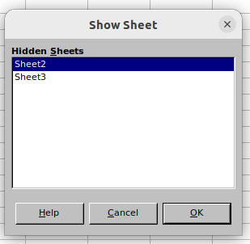

# Down The Rabbit Hole
* Category: Forensics
* 150 Points
* Solved by the JCTF Team

## Description

> Follow the rabbit down the "excellent" hole and see where it leads

An Excel file was attached.

## Solution

Let's start by inspecting the Excel Workbook. If we open it with a dedicated program, we get one sheet named "Sheet1" saying "Find the hidden sheet".



We can right-click and select "Show sheet" to view hidden sheets:



Let's use Python to further explore:

```python
>>> import openpyxl
>>> wb = openpyxl.load_workbook("Down_the_rabbit_hole.xlsx")
>>> wb.sheetnames
['Sheet1', 'Sheet2', 'Sheet3']
```

We can see all three sheets here. As we mentioned, the first cell of the first sheet says:

```python
>>> wb["Sheet1"]['A1'].value
'Find the hidden sheet'
```

Let's dump the full contents of the sheet:

```python
>>> for row in range(0, sheet1.max_row):
...     for col in sheet1.iter_cols(1, sheet1.max_column):
...         if col[row].value is not None:
...             print(f"{col[row].coordinate}: {col[row].value}")
A1: Find the hidden sheet
A101: 35
A102: 56
A103: 76
A104: 78
A105: 70
A106: 73
A107: 97
A108: 65
A109: 86
A110: 60
A111: 108
A112: 67
A113: 95
A114: 69
A115: 78
A116: 89
A117: 69
A118: 82
A119: 103
A120: 113
A121: 96
A122: 76
A123: 97
A124: 83
A125: 57
A126: 68
A127: 106
A128: 125
A129: 54
A130: 73
A131: 92
A132: 81
A133: 91
A134: 81
A135: 62
A136: 92
A137: 93
A138: 73
A139: 70
A140: 73
A141: 83
A142: 85
A143: 67
A144: 75
A145: 83
A146: 96
A147: 54
A148: 49
A149: 72
A150: 84
A151: 91
A152: 100
A153: 99
A154: 64
A155: 58
A156: 82
A157: 44
A158: 132
A159: 77
A160: 94
A161: 55
A162: 30
A163: 59
A164: 39
A165: 86
A166: 93
A167: 85
A168: 97
A169: 93
A170: 88
A171: 93
A172: 40
A173: 38
A174: 50
A175: 86
A176: 64
A177: 72
A178: 83
A179: 97
A180: 83
A181: 77
A182: 85
A183: 92
A184: 85
A185: 72
A186: 77
A187: 82
A188: 81
A189: 52
A190: 43
A191: 108
A192: 149
A193: 56
A194: 39
A195: 49
A196: 63
A197: 39
A198: 69
A199: 29
A200: 44
A857: 1
```

On to sheet #2, which was originally hidden:

```console
>>> sheet2 = wb["Sheet2"]
>>> for row in range(0, sheet2.max_row):
...     for col in sheet2.iter_cols(1, sheet2.max_column):
...         if col[row].value is not None:
...             print(f"{col[row].coordinate}: {col[row].value}")
A1: Find the VERY hidden sheet
A100: 35
A101: 56
A102: 76
A103: 78
A104: 70
A105: 73
A106: 97
A107: 65
A108: 86
A109: 60
A110: 108
A111: 67
A112: 95
A113: 69
A114: 78
A115: 89
A116: 69
A117: 82
A118: 103
A119: 113
A120: 96
A121: 76
A122: 97
A123: 83
A124: 57
A125: 68
A126: 106
A127: 125
A128: 54
A129: 73
A130: 92
A131: 81
A132: 91
A133: 81
A134: 62
A135: 92
A136: 93
A137: 73
A138: 70
A139: 73
A140: 83
A141: 85
A142: 67
A143: 75
A144: 83
A145: 96
A146: 54
A147: 49
A148: 72
A149: 84
A150: 91
A151: 100
A152: 99
A153: 64
A154: 58
A155: 82
A156: 44
A157: 132
A158: 77
A159: 94
A160: 55
A161: 30
A162: 59
A163: 39
A164: 86
A165: 93
A166: 85
A167: 97
A168: 93
A169: 88
A170: 93
A171: 40
A172: 38
A173: 50
A174: 86
A175: 64
A176: 72
A177: 83
A178: 97
A179: 83
A180: 77
A181: 85
A182: 92
A183: 85
A184: 72
A185: 77
A186: 82
A187: 81
A188: 52
A189: 43
A190: 108
A191: 149
A192: 56
A193: 39
A194: 49
A195: 63
A196: 39
A197: 69
A198: 29
A199: 44
```

And for sheet #3, which we can only assume was VERY hidden:

```python
>>> sheet3 = wb["Sheet3"]
>>> for row in range(0, sheet3.max_row):
...     for col in sheet3.iter_cols(1, sheet3.max_column):
...         if col[row].value is not None:
...             print(f"{col[row].coordinate}: {col[row].value}")
A1: Now find the super ZIPper hidden sheet
A100: 35
A101: 56
A102: 76
A103: 78
A104: 70
A105: 73
A106: 97
A107: 65
A108: 86
A109: 60
A110: 108
A111: 67
A112: 95
A113: 69
A114: 78
A115: 89
A116: 69
A117: 82
A118: 103
A119: 113
A120: 96
A121: 76
A122: 97
A123: 83
A124: 57
A125: 68
A126: 106
A127: 125
A128: 54
A129: 73
A130: 92
A131: 81
A132: 91
A133: 81
A134: 62
A135: 92
A136: 93
A137: 73
A138: 70
A139: 73
A140: 83
A141: 85
A142: 67
A143: 75
A144: 83
A145: 96
A146: 54
A147: 49
A148: 72
A149: 84
A150: 91
A151: 100
A152: 99
A153: 64
A154: 58
A155: 82
A156: 44
A157: 132
A158: 77
A159: 94
A160: 55
A161: 30
A162: 59
A163: 39
A164: 86
A165: 93
A166: 85
A167: 97
A168: 93
A169: 88
A170: 93
A171: 40
A172: 38
A173: 50
A174: 86
A175: 64
A176: 72
A177: 83
A178: 97
A179: 83
A180: 77
A181: 85
A182: 92
A183: 85
A184: 72
A185: 77
A186: 82
A187: 81
A188: 52
A189: 43
A190: 108
A191: 149
A192: 56
A193: 39
A194: 49
A195: 63
A196: 39
A197: 69
A198: 29
A199: 44
```

This sheet says "Now find the super ZIPper hidden sheet". Excel files are actually ZIP files, so let's go ahead and extract out file:

```console
┌──(user@kali)-[/media/sf_CTFs/intent/Down_The_Rabbit_Hole]
└─$ unzip Down_the_rabbit_hole.xlsx -d out
Archive:  Down_the_rabbit_hole.xlsx
   creating: out/docProps/
  inflating: out/docProps/app.xml
  inflating: out/docProps/core.xml
   creating: out/xl/
  inflating: out/xl/sharedStrings.xml
  inflating: out/xl/styles.xml
   creating: out/xl/theme/
  inflating: out/xl/theme/theme1.xml
  inflating: out/xl/workbook.xml
   creating: out/xl/worksheets/
  inflating: out/xl/worksheets/sheet1.xml
  inflating: out/xl/worksheets/sheet2.xml
  inflating: out/xl/worksheets/sheet3.xml
 extracting: out/xl/worksheets/sheet4.xml
   creating: out/xl/_rels/
  inflating: out/xl/_rels/workbook.xml.rels
  inflating: out/[Content_Types].xml
   creating: out/_rels/
  inflating: out/_rels/.rels
```

There it is, right next to the first three sheets:

```console
┌──(user@kali)-[/media/sf_CTFs/intent/Down_The_Rabbit_Hole]
└─$ cat out/xl/worksheets/sheet4.xml
Now go back and find the super DUPer hidden rows
```

Duplicate hidden rows? Well, within the Zip archive, Excel stores information in XML files. Let's dive deeper into the XML for the first sheet and look for duplicates.

This is how a sheet looks like as XML:

```xml
<?xml version="1.0" encoding="UTF-8"?>
<worksheet xmlns="http://schemas.openxmlformats.org/spreadsheetml/2006/main" xmlns:mc="http://schemas.openxmlformats.org/markup-compatibility/2006" xmlns:r="http://schemas.openxmlformats.org/officeDocument/2006/relationships" xmlns:x14ac="http://schemas.microsoft.com/office/spreadsheetml/2009/9/ac" mc:Ignorable="x14ac">
   <sheetPr codeName="Sheet1" />
   <dimension ref="A1:A857" />
   <sheetViews>
      <sheetView tabSelected="1" workbookViewId="0" />
   </sheetViews>
   <sheetFormatPr defaultRowHeight="15" x14ac:dyDescent="0.25" />
   <sheetData>
      <row r="1" spans="1:1" x14ac:dyDescent="0.25">
         <c r="A1" t="s">
            <v>0</v>
         </c>
      </row>
      <row r="101" spans="1:1" x14ac:dyDescent="0.25">
         <c r="A101">
            <v>35</v>
         </c>
      </row>

      <!-- ... -->

      <row r="200" spans="1:1" x14ac:dyDescent="0.25">
         <c r="A200">
            <v>44</v>
         </c>
      </row>
      <row r="857" spans="1:1" x14ac:dyDescent="0.25">
         <c r="A857">
            <v>1</v>
         </c>
      </row>
   </sheetData>
   <pageMargins left="0.7" right="0.7" top="0.75" bottom="0.75" header="0.3" footer="0.3" />
</worksheet>
```

Each row is contained within a `<row>` element with the row number as the `r` attribute. Are there duplicates?

```python
import xml.etree.ElementTree as ET
from collections import Counter

namespaces = {
    "t": "http://schemas.openxmlformats.org/spreadsheetml/2006/main"
}

tree = ET.parse('out/xl/worksheets/sheet1.xml')

print(Counter(row.attrib["r"] for row in tree.findall('.//t:row', namespaces)))
```

Output:

```console
┌──(user@kali)-[/media/sf_CTFs/intent/Down_The_Rabbit_Hole]
└─$ python3 solve.py
Counter({'109': 2, '116': 2, '120': 2, '142': 2, '161': 2, '184': 2, '199': 2, '1': 1, '101': 1, '102': 1, '103': 1, '104': 1, '105': 1, '106': 1, '107': 1, '108': 1, '110': 1, '111': 1, '112': 1, '113': 1, '114': 1, '115': 1, '117': 1, '118': 1, '119': 1, '121': 1, '122': 1, '123': 1, '124': 1, '125': 1, '126': 1, '127': 1, '128': 1, '129': 1, '130': 1, '131': 1, '132': 1, '133': 1, '134': 1, '135': 1, '136': 1, '137': 1, '138': 1, '139': 1, '140': 1, '141': 1, '143': 1, '144': 1, '145': 1, '146': 1, '147': 1, '148': 1, '149': 1, '150': 1, '151': 1, '152': 1, '153': 1, '154': 1, '155': 1, '156': 1, '157': 1, '158': 1, '159': 1, '160': 1, '162': 1, '163': 1, '164': 1, '165': 1, '166': 1, '167': 1, '168': 1, '169': 1, '170': 1, '171': 1, '172': 1, '173': 1, '174': 1, '175': 1, '176': 1, '177': 1, '178': 1, '179': 1, '180': 1, '181': 1, '182': 1, '183': 1, '185': 1, '186': 1, '187': 1, '188': 1, '189': 1, '190': 1, '191': 1, '192': 1, '193': 1, '194': 1, '195': 1, '196': 1, '197': 1, '198': 1, '200': 1, '857': 1})
```

Indeed, we have a few rows that appear twice. What's special about them?

```python
import xml.etree.ElementTree as ET
from collections import Counter

namespaces = {
    "t": "http://schemas.openxmlformats.org/spreadsheetml/2006/main"
}

tree = ET.parse('out/xl/worksheets/sheet1.xml')

dups = {}

for row in tree.findall('.//t:row', namespaces):
    row_num = row.attrib["r"]
    row_val = row.find("t:c/t:v", namespaces).text
    
    if row_num in dups:
        print(f"Row {row_num}: Old value: {dups[row_num]}, new value: {row_val}")
    else:
        dups[row_num] = row_val
```

Output:

```console
┌──(user@kali)-[/media/sf_CTFs/intent/Down_The_Rabbit_Hole]
└─$ python3 solve.py
Row 109: Old value: 73, new value: 86
Row 116: Old value: 78, new value: 89
Row 120: Old value: 84, new value: 113
Row 142: Old value: 69, new value: 85
Row 161: Old value: 78, new value: 55
Row 184: Old value: 84, new value: 85
Row 199: Old value: 123, new value: 29
```

That actually looks like the flag format in ASCII codes! Let's clean it up and repeat for all sheets:

```python
import xml.etree.ElementTree as ET
from pathlib import Path

namespaces = {
    "t": "http://schemas.openxmlformats.org/spreadsheetml/2006/main"
}

flag = ""

for sheet in Path('out/xl/worksheets/').glob('sheet*.xml'):
    try:
        tree = ET.parse(sheet)

        dups = {}

        for row in tree.findall('.//t:row', namespaces):
            row_num = row.attrib["r"]
            row_val = row.find("t:c/t:v", namespaces).text
            
            if row_num in dups:
                flag += chr(int(dups[row_num]))
            else:
                dups[row_num] = row_val
    except ET.ParseError:
        pass

print(flag)
```

Output:

```console
┌──(user@kali)-[/media/sf_CTFs/intent/Down_The_Rabbit_Hole]
└─$ python3 solve.py
INTENT{u_f0und_w0nd3rl2nd}
```