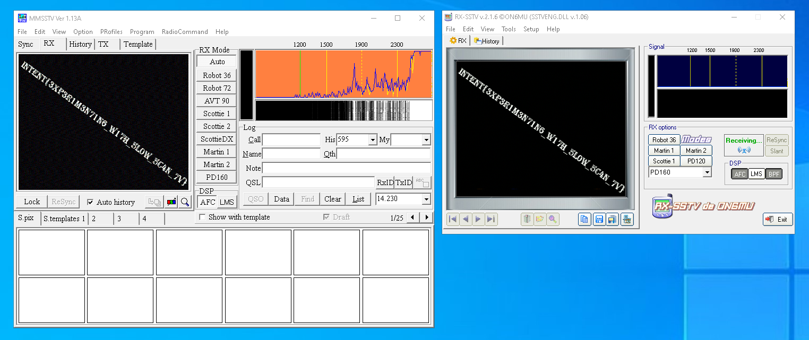

# Science Mission
* Category: Forensics
* 350 Points
* Solved by the JCTF Team

## Description

> One of NASA's radio telescopes, while on a routine mission to search for life in other galaxies, recorded these strange sounds.
> 
> Can you help NASA decipher them?

A zip file was attached.

## Solution

Let's try to unzip the archive:

```console
┌──(user@kali)-[/media/sf_CTFs/intent/Science_Mission]
└─$ 7z x transmission.zip

7-Zip [64] 16.02 : Copyright (c) 1999-2016 Igor Pavlov : 2016-05-21
p7zip Version 16.02 (locale=en_IL,Utf16=on,HugeFiles=on,64 bits,4 CPUs 12th Gen Intel(R) Core(TM) i9-12900K (90672),ASM,AES-NI)

Scanning the drive for archives:
1 file, 15113681 bytes (15 MiB)

Extracting archive: transmission.zip
--
Path = transmission.zip
Type = zip
Physical Size = 15113681


Enter password (will not be echoed):
ERROR: Wrong password : last transmission/.DS_Store
ERROR: Wrong password : last transmission/transmission
ERROR: Wrong password : last transmission/VG5wWlowMTZUV2RPZWtsblRucHJaMDE2VldkTmVtTm5UbnBKWjAxNlFXZE9iVlZuVFhwWlowNTZRV2ROZWxGblRYcFZaMDE2VldkT2VtTm5UWHBCWjA1NlNXZE9hbEZuVFhwRlowMXFSV2RPUkVGblRXcE5QUT09

Sub items Errors: 3

Archives with Errors: 1

Sub items Errors: 3
```

We need a password, and don't have one. But what's that long file name in the archive? It looks like base64:

```console
┌──(user@kali)-[/media/sf_CTFs/intent/Science_Mission]
└─$ echo VG5wWlowMTZUV2RPZWtsblRucHJaMDE2VldkTmVtTm5UbnBKWjAxNlFXZE9iVlZuVFhwWlowNTZRV2ROZWxGblRYcFZaMDE2VldkT2VtTm5UWHBCWjA1NlNXZE9hbEZuVFhwRlowMXFSV2RPUkVGblRXcE5QUT09 | base64 -d
TnpZZ016TWdOeklnTnprZ016VWdNemNnTnpJZ016QWdObVVnTXpZZ056QWdNelFnTXpVZ016VWdOemNnTXpBZ056SWdOalFnTXpFZ01qRWdOREFnTWpNPQ==

┌──(user@kali)-[/media/sf_CTFs/intent/Science_Mission]
└─$ echo VG5wWlowMTZUV2RPZWtsblRucHJaMDE2VldkTmVtTm5UbnBKWjAxNlFXZE9iVlZuVFhwWlowNTZRV2ROZWxGblRYcFZaMDE2VldkT2VtTm5UWHBCWjA1NlNXZE9hbEZuVFhwRlowMXFSV2RPUkVGblRXcE5QUT09 | base64 -d | base64 -d
NzYgMzMgNzIgNzkgMzUgMzcgNzIgMzAgNmUgMzYgNzAgMzQgMzUgMzUgNzcgMzAgNzIgNjQgMzEgMjEgNDAgMjM=

┌──(user@kali)-[/media/sf_CTFs/intent/Science_Mission]
└─$ echo VG5wWlowMTZUV2RPZWtsblRucHJaMDE2VldkTmVtTm5UbnBKWjAxNlFXZE9iVlZuVFhwWlowNTZRV2ROZWxGblRYcFZaMDE2VldkT2VtTm5UWHBCWjA1NlNXZE9hbEZuVFhwRlowMXFSV2RPUkVGblRXcE5QUT09 | base64 -d | base64 -d | base64 -d
76 33 72 79 35 37 72 30 6e 36 70 34 35 35 77 30 72 64 31 21 40 23

┌──(user@kali)-[/media/sf_CTFs/intent/Science_Mission]
└─$ echo VG5wWlowMTZUV2RPZWtsblRucHJaMDE2VldkTmVtTm5UbnBKWjAxNlFXZE9iVlZuVFhwWlowNTZRV2ROZWxGblRYcFZaMDE2VldkT2VtTm5UWHBCWjA1NlNXZE9hbEZuVFhwRlowMXFSV2RPUkVGblRXcE5QUT09 | base64 -d | base64 -d | base64 -d | sed 's/ //g'
76337279353772306e36703435357730726431214023

┌──(user@kali)-[/media/sf_CTFs/intent/Science_Mission]
└─$ echo VG5wWlowMTZUV2RPZWtsblRucHJaMDE2VldkTmVtTm5UbnBKWjAxNlFXZE9iVlZuVFhwWlowNTZRV2ROZWxGblRYcFZaMDE2VldkT2VtTm5UWHBCWjA1NlNXZE9hbEZuVFhwRlowMXFSV2RPUkVGblRXcE5QUT09 | base64 -d | base64 -d | base64 -d | sed 's/ //g' | awk '{ print (length($0) % 2 == 0) ? $0 : 0$0; }' | xxd -p -r
v3ry57r0n6p455w0rd1!@#
```

So this looks like a password, let's try it:

```console
┌──(user@kali)-[/media/sf_CTFs/intent/Science_Mission]
└─$ 7z -p"v3ry57r0n6p455w0rd1\!@#" x transmission.zip

7-Zip [64] 16.02 : Copyright (c) 1999-2016 Igor Pavlov : 2016-05-21
p7zip Version 16.02 (locale=en_IL,Utf16=on,HugeFiles=on,64 bits,4 CPUs 12th Gen Intel(R) Core(TM) i9-12900K (90672),ASM,AES-NI)

Scanning the drive for archives:
1 file, 15113681 bytes (15 MiB)

Extracting archive: transmission.zip
--
Path = transmission.zip
Type = zip
Physical Size = 15113681

Everything is Ok

Folders: 1
Files: 3
Size:       15348252
Compressed: 15113681
```

We got an MP3 file:

```console
┌──(user@kali)-[/media/sf_CTFs/intent/Science_Mission/last transmission]
└─$ file transmission
transmission: Audio file with ID3 version 2.4.0, contains: MPEG ADTS, layer III, v1, 128 kbps, 44.1 kHz, Stereo
```

Listening to it is harmful for human ears, but we can search to see if it has anything hidden within it:

```console
┌──(user@kali)-[/media/sf_CTFs/intent/Science_Mission/last transmission]
└─$ binwalk -e transmission

DECIMAL       HEXADECIMAL     DESCRIPTION
--------------------------------------------------------------------------------
380479        0x5CE3F         Zip archive data, at least v2.0 to extract, compressed size: 1771244, uncompressed size: 1782150, name: 1.mp3
2151758       0x20D54E        Zip archive data, at least v2.0 to extract, compressed size: 1715698, uncompressed size: 1733070, name: 2.mp3
3867491       0x3B0363        Zip archive data, at least v2.0 to extract, compressed size: 711081, uncompressed size: 894226, name: 3.mp3
4578607       0x45DD2F        Zip archive data, at least v2.0 to extract, compressed size: 9030020, uncompressed size: 14765282, name: am.wav
13609012      0xCFA834        End of Zip archive, footer length: 22
```

We got three MP3 files and one WAV file!

`am.wav` contains horrible beeps, while the other files contain irrelevant content. But their metadata, on the other hand, provides us with valuable hints:

```console
┌──(user@kali)-[/media/…/intent/Science_Mission/last transmission/_transmission.extracted]
└─$ exiftool 1.mp3 | tail -n 4
Subtitle                        : HOOOOOOYA
Title                           : Can I get a
Artist URL                      : https://youtu.be/mog9IyT0CPU?t=18
Duration                        : 0:01:29 (approx)

┌──(user@kali)-[/media/…/intent/Science_Mission/last transmission/_transmission.extracted]
└─$ exiftool 3.mp3 | grep Publisher
Publisher                       : zerooneonezeroonezerozerozerospacezerooneoneonezeroonezerozerospacezerooneoneonezeroonezerozerospacezerooneoneonezerozerozerozerospacezerooneoneonezerozerooneonespacezerozerooneoneonezeroonezerospacezerozeroonezerooneoneoneonespacezerozeroonezerooneoneoneonespacezerooneonezerozeroonezeroonespacezerooneoneonezerozerozerozerospacezerooneoneoneonezerozerozerospacezerooneoneoneonezerozerozerospacezerozeroonezerooneoneonezerospacezerooneonezerozerozerooneonespacezerooneonezerooneoneoneonespacezerozeroonezerooneoneoneonespacezerooneonezerozerozerozeroonespacezerooneoneonezerozeroonezerospacezerooneoneonezeroonezerozerospacezerooneonezeroonezerozeroonespacezerooneonezerozerooneoneonespacezerooneonezerooneoneoneonespacezerooneoneonezerozerooneonespacezerozeroonezerooneoneoneonespacezerooneonezerozerozerozeroonespacezerooneonezerooneonezeroonespacezerooneonezerooneonezeroonespacezerooneonezerooneoneoneonespacezerooneonezerozeroonezerozerospacezerooneoneonezeroonezeroonespacezerooneonezerooneonezerozerospacezerooneonezerozerozerozeroonespacezerooneoneonezeroonezerozerospacezerooneonezeroonezerozeroonespacezerooneonezerooneoneoneonespacezerooneonezerooneoneonezerospacezerozeroonezerooneoneonezerospacezerooneonezeroonezerozerozerospacezerooneoneonezeroonezerozerospacezerooneonezerooneonezeroonespacezerooneonezerooneonezerozero
```

The first hint is a link to a YouTube video about a NASA mission, and the second seems like binary:

```console
┌──(user@kali)-[/media/…/intent/Science_Mission/last transmission/_transmission.extracted]
└─$ exiftool 3.mp3 | grep Publisher | awk '{ printf $3 }' | sed 's/zero/0/g' | sed 's/one/1/g' | sed 's/space/ /g'
01101000 01110100 01110100 01110000 01110011 00111010 00101111 00101111 01100101 01110000 01111000 01111000 00101110 01100011 01101111 00101111 01100001 01110010 01110100 01101001 01100111 01101111 01110011 00101111 01100001 01101101 01101101 01101111 01100100 01110101 01101100 01100001 01110100 01101001 01101111 01101110 00101110 01101000 01110100 01101101 01101100

┌──(user@kali)-[/media/…/intent/Science_Mission/last transmission/_transmission.extracted]
└─$ exiftool 3.mp3 | grep Publisher | awk '{ printf $3 }' | sed 's/zero/0/g' | sed 's/one/1/g' | sed 's/space/ /g' | sed 's/\>/P/g;s/^/2i/' | dc
https://epxx.co/artigos/ammodulation.html
```

Well, the link we got talks about AM modulation, and we have a file called `am.wav`, so let's try to demodulate it using the snippet from the link:

```python
import wave, struct

modulated = wave.open("am.wav", "r")

f = demod_am = wave.open("demod_am.wav", "w")
f.setnchannels(1)
f.setsampwidth(2)
f.setframerate(44100)

for n in range(0, modulated.getnframes()):
    signal = struct.unpack('h', modulated.readframes(1))[0] / 32768.0
    signal = abs(signal)
    demod_am.writeframes(struct.pack('h', signal * 32767))
```

What we get is even more beeps. The hints pointed us to NASA, and the moon landing. This could be an [SSTV](https://en.wikipedia.org/wiki/Slow-scan_television) signal:

> Slow-scan television (SSTV) is a picture transmission method, used mainly by amateur radio operators, to transmit and receive static pictures via radio in monochrome or color. 
> 
> The Apollo TV cameras used SSTV to transmit images from inside Apollo 7, Apollo 8, and Apollo 9, as well as the Apollo 11 Lunar Module television from the Moon.


We can use various SSTV applications such as MMSSTV or RX-SSTV (or even a mobile application such as Robot36). For the desktop applications, we need to install some virtual cable in order to redirect the sound from the WAV file into the input of the SSTV application. This can be achieved using [Voicemeeter](https://vb-audio.com/Voicemeeter/) or [VAC](https://vac.muzychenko.net/en/). If we use VLC to play the WAV file, we can redirect the output to our virtual cable by selecting the appropriate cable under "Tools -> Preferences -> Audio -> Output -> DirectX Audio Output" and choosing the appropriate device.


It takes a few attempts, but eventually SSTV applications are able to clearly reconstruct a picture from the WAV file and display the flag:

