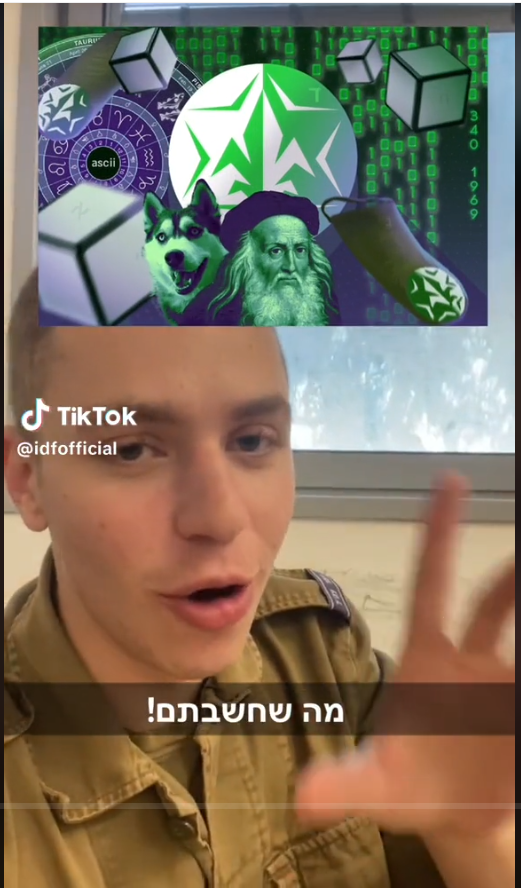
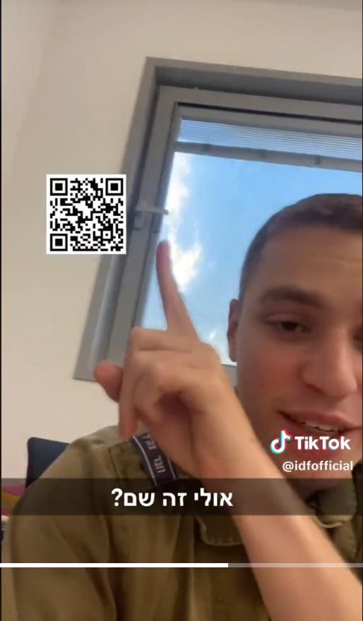
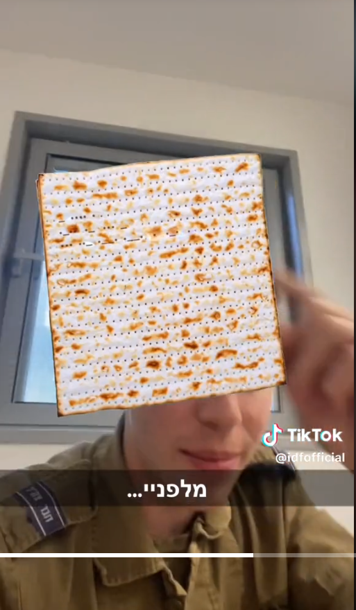
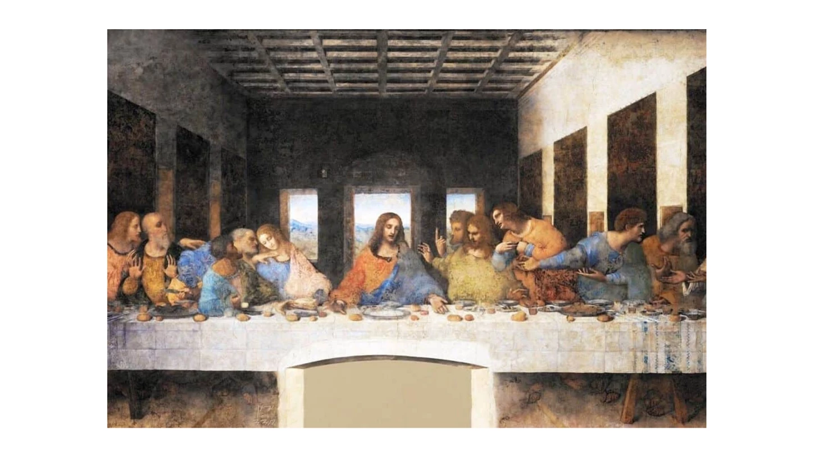
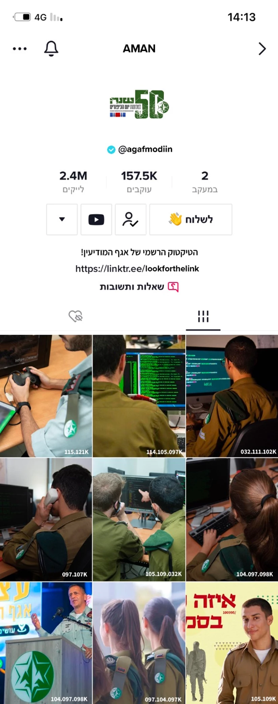
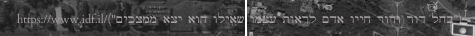
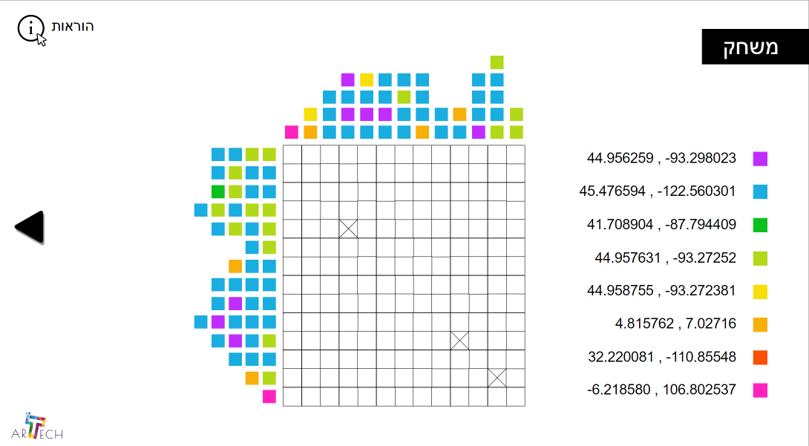
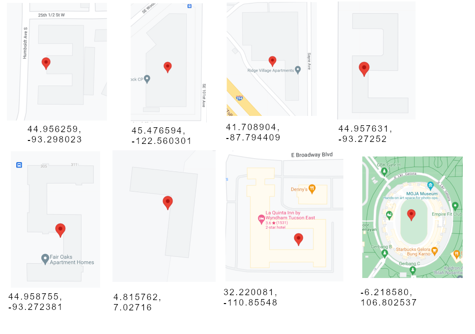
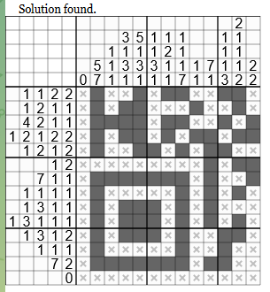
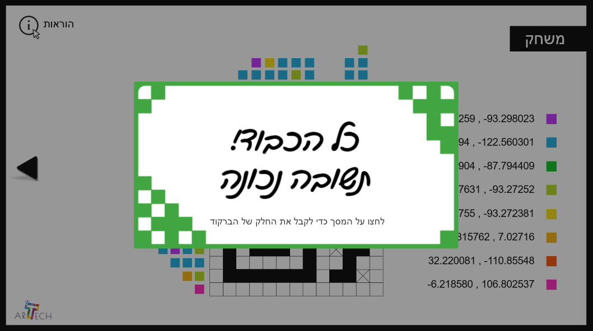

<h1>חידת אמ"ן - פסח התשפ"ג</h1>

לרגל חג הפסח פרסם אגף המודיעין חידה קצרה. נראה כאן את הפתרון שלה. על החידה עבדתי יחד עם דניאל א.

<h2>תיאור</h2>

לאחר שבשנה שעברה יותר ממיליון אנשים נענו לאתגר השנתי של אגף המודיעין ופחות מ-0.1% הצליחו לפתור אותו, חידת אמ"ן חוזרת - ובגדול. מה הקשר בין סרטון טיקטוק, שחור ופתור ושיר אירוויזיוני? ואיך תגיעו בעזרתם לארבעה חלקי קוד סודיים? מקווים שייקח לכם פחות מ-40 שנה לפצח את זה.

עלמה סברוב, דניאל טננבוים, מערכת את"צ  | 04.04.23 

<b>ברוכה הבאה לחידה השנתית של אגף המודיעין</b>

הפעם, תצטרכו לחשוב גדול ורחב יותר מאי פעם - לפרוץ את כל הגבולות ולצאת מהקופסה. עליכם לעזור לאנשי האגף למצוא את ארבעת פיסות המודיעין הנדרשות להצלחת משימה סודית, ולחבר אותם לכדי תמונה שלמה. 
 
בהצלחה

להתחלת החידה <a href="https://vt.tiktok.com/ZS8sVhdtB/?feature=share">לחצו כאן</a> 

<pre dir="ltr" style="text-align: left">
www.idf.il/_____/
</pre>

*את החידה חיבר תחום טכנולוגיות למידה - ArTech במערך ההדרכה של אמ״ן. התחום אחראי על תקשוב ודיגיטציה מתקדמת של הכשרות האגף תוך שילוב לומדות, משחקי מחשב מודיעיניים, סימולטורים ואתרי למידה במטרה להטמיע ידע באופן חוויתי ומשמעותי ולפתח תחושת מסוגלות בקרב הלומדים

<h2>פתרון</h2>

<h3>התמונה בכותרת</h3>

לפני שאנחנו צוללים אל סרטון הטיקטוק, יש לנו המון נתונים בתמונה שבכותרת. נעבור על הכל בזריזות.

<ul>
    <li>תמונה של לאונרדו דה וינצ'י</li>
    <li>גלגל המזלות, ובפנים כיתוב ASCII</li>
    <li>תמונה של כלב האסקי</li>
    <li>אם מסתכלים מקרוב, אפשר לראות אותיות דהויות מוסתרות בתמונה: ח' (על הקוביה הימנית ביותר), ד' (על התג הימני), ג' (על גלגל המזלות), ד' (על סמל המודיעין במרכז), י' (על הכובע של לאונרדו דה וינצ'י) ו-א' (על הקוביה השמאלית). וביחד: "חד גדיא".</li>
</ul>

<h3>הסרטון</h3>

בואו נראה מה הסרטון מכיל. בתחילתו, הקריין מודיע לנו שהתמונה הבאה היא לא מה שחשבנו:

היא דומה לתמונת הכותרת, אבל העצמים סודרו מחדש, ונוסף כיתוב מימין: 340 1969. מה זה? ובכן, חיפוש בגוגל מציע שמדובר ב"צופן 340" של <a href="https://he.wikipedia.org/wiki/%D7%A8%D7%95%D7%A6%D7%97_%D7%94%D7%96%D7%95%D7%93%D7%99%D7%90%D7%A7">רוצח הזודיאק</a>. זודיאק, אגב, הוא שם נוסף לגלגל המזלות, כמו בתמונת הכותרת.

מיד אחר כך, מבזיקה לרגע הכתובת <a href="https://www.youtube.com/watch?v=dQw4w9WgXcQ">https://www.youtube.com/watch?v=dQw4w9WgXcQ</a>. אם זיהיתם, יופי, ואם לא - תבדקו בזריזות מה זה  ותחזרו.

אי שם בהמשך מבזיקה הכתובית "םכילע יתדבע חחחחח הבושתה אל תאז", היפוך של "זאת לא התשובה חחחחח עבדתי עליכם". עוד מסיח הוא:

כתובת ה-QR הזאת מובילה לאתר עם עצות להתמודדות עם כשלונות.

קצת אחרי, מופיעה תמונה של מצה:

חדי העין ישימו לב שעל המצה מופיע מה שנראה כמו כתב מורס: - .... . .-.. .- ... - ... ..- .--. .--. . .-. 
אם נפענח את המסר, נקבל: THELASTSUPPER.

עוד בהמשך, קישור לסרטון על <a href="https://www.youtube.com/watch?v=LMW0o15fXP0">שפצור כומתה<a/>, וסיימנו את הסרטון.

בין כל המסיחים, נראה שהכיוון של THELASTSUPPER הוא ההגיוני ביותר. ננסה לגשת לכתובות שקשורות לסעודה האחרונה ונמצא את הקישור <a href="https://www.idf.il/%D7%94%D7%A1%D7%A2%D7%95%D7%93%D7%94%D7%94%D7%90%D7%97%D7%A8%D7%95%D7%A0%D7%94">הזה</a>, ובתוכו התמונה הבאה:

אמנם הוא טוען שנכשלנו, אבל מי זה שם בתמונה? לאונרדו די קפריו! היה לנו לאונרדו קודם - לאונרדו דה וינצ'י. ושלא במקרה, "הסעודה האחרונה" היא לא רק אירוע בחייו של ישו אלא גם אחת התמונות המפורסמות של לאונרדו דה וינצ'י! לכן, ננסה לגשת ל<a href="https://www.idf.il/%D7%9C%D7%90%D7%95%D7%A0%D7%A8%D7%93%D7%95%D7%93%D7%94%D7%95%D7%99%D7%A0%D7%A6%D7%99">קישור הזה</a> ונמצא את החלק הראשון של החידה.

<h3>חלק ראשון</h3>

הדף שהגענו אליו מכיל את הטקסט הבא:

<table><tr><td>

תושייה וסקרנות - כנראה יש לכם, ואולי גם ידע כללי.  
את השלב הראשון של החידה עברתם בהצלחה - והרווחתם את פיסת המודיעין הראשונה. 
מפה, זה רק ילך ויסתבך אז תקחו נשימה, החידה עוד ארוכה.  
בהצלחה 

לקבלת פיסת המודיעין הראשונה <a href="https://www.idf.il/%D7%90%D7%AA%D7%A8%D7%99-%D7%99%D7%97%D7%99%D7%93%D7%95%D7%AA/%D7%90%D7%92%D7%A3-%D7%94%D7%9E%D7%95%D7%93%D7%99%D7%A2%D7%99%D7%9F/%D7%9B%D7%9C-%D7%94%D7%9B%D7%AA%D7%91%D7%95%D7%AA/%D7%97%D7%99%D7%93%D7%AA-%D7%90%D7%9E-%D7%9F-2023/%D7%A8%D7%91%D7%9E%D7%93-%D7%9E%D7%96%D7%99-%D7%A4%D7%93%D7%9D-%D7%A4%D7%A6%D7%9F/">לחצו כאן</a>

</td></tr></table>

פיסת המודיעין הראשונה היא רבע QR Code, ובתמונה המצורפת אמור להיות הרמז הבא. כשמנסים לשמור את התמונה, השם המוצע על ידי השרת הוא "י-חדד", ואפשר לראות בתחתית התמונה את החתימה "ירון חדד". מי זה?

<h3>חלק שני</h3>

ובכן, <a href="https://he.wikipedia.org/wiki/%D7%99%D7%A8%D7%95%D7%9F_%D7%97%D7%93%D7%93">ירון חדד<a/> הוא שחקן וזמר ישראלי. לפי ויקיפדיה, בקדם אירוויזיון 1992 הופיע עם השיר "זודיאק". השיר הגיע למקום התשיעי בלבד, אך הפך ללהיט. לאחר מכן הוציא ירון חדד את אלבום הבכורה, שהיה אלבומו היחיד ונקרא בשם "זודיאק". להזכירכם, ב"זודיאק" נתקלנו מוקדם יותר.

"צופן 340" של רוצח הזודיאק פוענח לפני מספר שנים. היה נחמד אם השלב הבא היה מבוסס על טקסט שמוצפן באמצעות אותו צופן, אבל בפועל השלב הבא הגיע אחרי ביקור 
ב<a href="https://www.idf.il/3401969/">קישור הזה</a>.

מה יש לנו כאן? תמונה מתוך ערוץ הטיקטוק של אמ"ן. שימו לב לקישור באמצע הטקסט - lookforthelink. נחפש קישור נוסף מוחבא בתמונה ונראה שניתן להרכיב קישור מחלקי טקסט שמוסתרים ב-thumbnails של הסרטונים. <a href="https://www.idf.il/100995/">זה הקישור</a> והוא נותן לנו רבע QR Code נוסף.

<h3>חלק שלישי</h3>

מה הלאה? ובכן, מספר הצפיות בסרטונים נראה מוזר. אם נתייחס למספר הצפיות בתור ASCII (כמו הרמז שקיבלנו מתמונת הכותרת), נקבל טקסט קריא לחלוטין:

<pre dir="ltr" style="text-align: left">
115 121 114 105 97 32 111 102 97 107 105 109 32 104 97 98 104 97 98 97 104 97 105 109

syria ofakim habhabahaim
</pre>

סוריה אופקים הבהאיים?? מה זה? נחפש בגוגל ונגיע ל<a href="https://www.idf.il/%D7%90%D7%AA%D7%A8%D7%99-%D7%99%D7%97%D7%99%D7%93%D7%95%D7%AA/%D7%90%D7%92%D7%A3-%D7%94%D7%9E%D7%95%D7%93%D7%99%D7%A2%D7%99%D7%9F/%D7%9B%D7%9C-%D7%94%D7%9B%D7%AA%D7%91%D7%95%D7%AA/2023/25-%D7%A9%D7%A0%D7%94-%D7%91%D7%97%D7%9C%D7%9C-%D7%9C%D7%95%D7%95%D7%99%D7%A0%D7%99%D7%9D-%D7%99%D7%97%D7%99%D7%93%D7%94-9900-%D7%9E%D7%A8%D7%9B%D7%96-%D7%94%D7%97%D7%9C%D7%9C-%D7%99%D7%97%D7%99%D7%93%D7%94-%D7%9E%D7%95%D7%93%D7%99%D7%A2%D7%99%D7%9F-%D7%90%D7%9E%D7%9F/">כתבה הזאת</a> מתוך אתר צה"ל.

הכתבה מדברת על מפעילות הלווינים של צה"ל, אבל אם נוריד את תמונת הכותרת נראה שהיא מכילה כיתוב נסתר:

לפי הכיתוב, "בחל-דור-ודור-חייו-אדם-לראות-עצמו-שאילו-הוא-יצא-ממצכים". כמובן שיש כאן מספר טעויות. אם נתרכז רק בשגיאות הכתיב, נקבל "ח', ו', ש', כ'", או בקיצור "חושך". נבקר ב<a href="https://www.idf.il/%D7%97%D7%95%D7%A9%D7%9A/">קישור הזה</a> ונקבל:

<table><tr><td>

אם הגעתם לעמוד זה, כנראה שכבר התחלתם להבין את המשחק. הסוד הרי, הוא לשים לב לפרטים הקטנים ומה דווקא נמצא מאחורי התמונה הגדולה אז בבקשה - פיסת המודיעין השלישת.  
אנשי האגף כבר ממהרים ורק אתם יכולים לספק את הפתרון שיאפשר את הצלחת המשימה הסודית -  כדאי שגם אתם תתחילו להעלות את הקצב.  
בהצלחה 

 לפיסת המודיעין השלישית <a href="https://www.idf.il/%D7%90%D7%AA%D7%A8%D7%99-%D7%99%D7%97%D7%99%D7%93%D7%95%D7%AA/%D7%90%D7%92%D7%A3-%D7%94%D7%9E%D7%95%D7%93%D7%99%D7%A2%D7%99%D7%9F/%D7%9B%D7%9C-%D7%94%D7%9B%D7%AA%D7%91%D7%95%D7%AA/%D7%97%D7%99%D7%93%D7%AA-%D7%90%D7%9E-%D7%9F-2023/%D7%94%D7%A0%D7%93%D7%A1%D7%94-401-%D7%A4%D7%99%D7%A6%D7%95%D7%A5-%D7%9E%D7%95%D7%A7%D7%A9%D7%99%D7%9D/">לחץ כאן</a> 
 להמשך החידה <a href="https://hidat-aman-2023.s3.eu-north-1.amazonaws.com/hidat+aman+-+V2/story.html">לחץ כאן</a>

</td></tr></table>

<h3>חלק רביעי</h3>

המשך החידה הוא משחק "שחור ופתור" עם קאץ' - במקום מספרים, יש לנו צבעים, והצבעים ממופים למה שנראה כמו קוארדינטות. 

נחפש ב"גוגל מפות" את הקוארדינטות וננסה למפות אותם בחזרה למספרים:

אם כך, נראה שהמיפוי הוא כזה:

<pre dir="ltr" style="text-align: left">
44.956259, -93.298023       3
45.476594, -122.560301      1
41.708904, -87.794409       4
44.957631, -93.27252        2
44.958755, -93.272381       5
4.815762, 7.02716           7
32.220081, -110.85548       6
-6.218580, 106.802537       0
</pre>

נכניס ל<a href="http://a.teall.info/nonogram/">אתר לפתרון שחור-ופתור</a> ונקבל את הפתרון הבא:

הפתרון שלנו התקבל:

בתגובה אנחנו מקבלים את החלק הרביעי והאחרון של ה-QR Code.

<h3>חלק מסכם</h3>

נחבר את ארבעת הרבעים שמצאנו ונקבל את ה-QR Code השלם:

הוא מוביל אותנו ל<a href="https://www.idf.il/99592">קישור הזה</a>, עם סרטון יוטיוב בו הקול מושמע הפוך. אפשר לשמור את הסאונד של הסרטון באמצעות שלל שירותים שמציעים זאת אונליין, ושירותי אונליין אחרים מאפשרים להפוך את הסאונד של קובץ מדיה כלשהו. לבסוף, נקבל את המסר הבא:

"אם הגעתם לשלב זה, אתם בין האנשים הבודדים שהצליחו לפתור את חידת אמ"ן השנתית. כל הכבוד! נא לשלוח את המילה המסתתרת במעלה החידה למייל הבא: hidataman2023@gmail.com"

המילה (מילה? זוג מילים) היא "חד גדיא". חג שמח!

<h2>קישורים</h2>
<ul>
    <li><a href="https://www.idf.il/%D7%90%D7%AA%D7%A8%D7%99-%D7%99%D7%97%D7%99%D7%93%D7%95%D7%AA/%D7%90%D7%92%D7%A3-%D7%94%D7%9E%D7%95%D7%93%D7%99%D7%A2%D7%99%D7%9F/%D7%9B%D7%9C-%D7%94%D7%9B%D7%AA%D7%91%D7%95%D7%AA/%D7%97%D7%99%D7%93%D7%AA-%D7%90%D7%9E-%D7%9F-2023/%D7%97%D7%99%D7%93%D7%AA-%D7%90%D7%9E-%D7%9F-%D7%A4%D7%A1%D7%97-2023-%D7%90%D7%92%D7%A3-%D7%94%D7%9E%D7%95%D7%93%D7%99%D7%A2%D7%99%D7%9F-%D7%91%D7%A8%D7%A7%D7%95%D7%93%D7%99%D7%9D-%D7%A4%D7%99%D7%A1%D7%95%D7%AA-%D7%9E%D7%95%D7%93%D7%99%D7%A2%D7%99%D7%9F-%D7%98%D7%99%D7%A7%D7%98%D7%95%D7%A7-%D7%9E%D7%99-%D7%99%D7%A4%D7%AA%D7%95%D7%A8-%D7%97%D7%99%D7%93%D7%AA-%D7%90%D7%9E%D7%9F-2023/">החידה באתר צה"ל</a></li>
    <li><a href="https://www.ynet.co.il/news/article/b1xrqlkb3#autoplay">כתבה ב-YNet</a></li>
    <li><a href="https://www.idf.il/%D7%90%D7%AA%D7%A8%D7%99-%D7%99%D7%97%D7%99%D7%93%D7%95%D7%AA/%D7%90%D7%92%D7%A3-%D7%94%D7%9E%D7%95%D7%93%D7%99%D7%A2%D7%99%D7%9F/%D7%9B%D7%9C-%D7%94%D7%9B%D7%AA%D7%91%D7%95%D7%AA/%D7%97%D7%99%D7%93%D7%AA-%D7%90%D7%9E-%D7%9F-2023/%D7%97%D7%99%D7%93%D7%AA-%D7%90%D7%9E-%D7%9F-%D7%90%D7%92%D7%A3-%D7%94%D7%9E%D7%95%D7%93%D7%99%D7%A2%D7%99%D7%9F-2023-%D7%A4%D7%AA%D7%A8%D7%95%D7%9F-%D7%A4%D7%A1%D7%97-%D7%91%D7%A8%D7%A7%D7%95%D7%93%D7%99%D7%9D-%D7%94%D7%9B%D7%99-%D7%97%D7%9B%D7%9E%D7%99%D7%9D-%D7%A4%D7%99%D7%A6%D7%95%D7%97-%D7%A7%D7%95%D7%93/">הפתרון הרשמי</a></li>
</ul>

