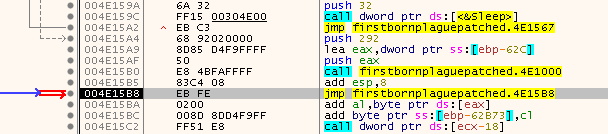
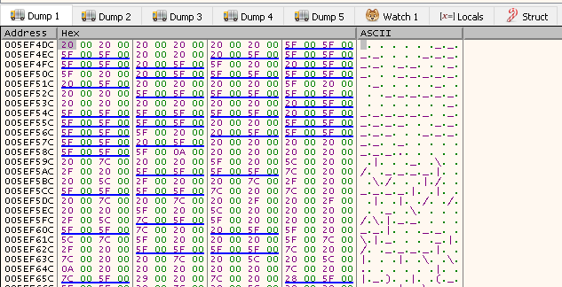

# Death of Firstborn Son

## Description

> > “Then Moses said, ‘Thus says the Lord: “About midnight I will go out into the midst of Egypt; and all the firstborn in the land of Egypt shall die, from the firstborn of Pharaoh who sits on his throne, even to the firstborn of the female servant who is behind the hand mill, and all the firstborn of the animals. Then there shall be a great cry throughout all the land of Egypt, such as was not like it before, nor shall be like it again. But against none of the children of Israel shall a dog move its tongue, against man or beast, that you may know that the Lord does make a difference between the Egyptians and Israel”’” (Exodus 11:4-7).
> 
> You've arrived at the final trial, The one that will ultimately decide whether Pharaoh will grant our people their freedom.
> 
> Good luck and Happy Passover.

An executable was attached.

## Solution

Let's run the executable:

```console
PS E:\CTFs\basmach\Death_of_firstborn_son> & .\firstBornPlague.exe
Welcome!
Before you finish the challenge, find the last flag... goodluck :)

Also, have you painted your doorstep red already?
```

These days, IDA Freeware comes with a basic cloud decompiler for x32/x64 binaries. Let's see what it produces:

```c
int __cdecl main(int argc, const char **argv, const char **envp)
{
  unsigned int i; // [esp+8h] [ebp-630h]
  char v5[1316]; // [esp+Ch] [ebp-62Ch] BYREF
  __int16 v6[130]; // [esp+530h] [ebp-108h] BYREF

  qmemcpy(v5, a06636303060636, sizeof(v5));
  qmemcpy(v6, aWelcomeBeforeY, 0x102u);
  for ( i = 0; i < 0x81; ++i )
  {
    putchar((unsigned __int16)v6[i]);
    Sleep(0x32u);
  }
  sub_401000(v5, 658);
  sub_401000(v5, 658);
  return 0;
}
```

So we can see that the program prints the message we saw earlier, character by character. But what's happening to `v5` which gets sent to `sub_401000` (twice)?

```c
int __cdecl sub_401000(int a1, int a2)
{
  int result; // eax
  float v3; // xmm0_4
  float v4; // xmm0_4
  float v5; // xmm0_4
  float v6; // xmm0_4
  float v7; // xmm0_4
  float v8; // xmm0_4
  float v9; // xmm0_4
  float v10; // xmm0_4
  float v11; // xmm0_4
  float v12; // xmm0_4
  __int16 v13[6]; // [esp+4h] [ebp-22C8h]
  int v14; // [esp+10h] [ebp-22BCh]
  int v15; // [esp+14h] [ebp-22B8h]
  float v16; // [esp+18h] [ebp-22B4h]
  int v17; // [esp+1Ch] [ebp-22B0h]
  int v18; // [esp+20h] [ebp-22ACh]
  int v19; // [esp+24h] [ebp-22A8h]
  int v20; // [esp+28h] [ebp-22A4h]
  int v21; // [esp+2Ch] [ebp-22A0h]
  float v22; // [esp+30h] [ebp-229Ch]
  float v23; // [esp+34h] [ebp-2298h]
  float v24; // [esp+38h] [ebp-2294h]
  float v25; // [esp+3Ch] [ebp-2290h]
  float v26; // [esp+40h] [ebp-228Ch]
  float v27; // [esp+44h] [ebp-2288h]
  float v28; // [esp+48h] [ebp-2284h]
  float v29; // [esp+4Ch] [ebp-2280h]
  float v30; // [esp+50h] [ebp-227Ch]
  float v31; // [esp+54h] [ebp-2278h]
  float j; // [esp+58h] [ebp-2274h]
  float i; // [esp+5Ch] [ebp-2270h]
  unsigned int k; // [esp+60h] [ebp-226Ch]
  float v36[1760]; // [esp+68h] [ebp-2264h] BYREF
  char v37[1760]; // [esp+1BE8h] [ebp-6E4h] BYREF

  v13[0] = 111;
  v13[1] = 114;
  v13[2] = 105;
  v13[3] = 116;
  v13[4] = 97;
  v13[5] = 108;
  v18 = 0;
  v17 = 0;
  memset(v37, 32, sizeof(v37));
  result = (int)memset(v36, 0, sizeof(v36));
  for ( i = 0.0; i < 6.28; i = v3 )
  {
    for ( j = 0.0; j < 6.28; j = v4 )
    {
      v5 = *(double *)libm_sse2_sin_precise().m128_u64;
      v30 = v5;
      v6 = *(double *)libm_sse2_cos_precise().m128_u64;
      v26 = v6;
      v7 = *(double *)libm_sse2_sin_precise().m128_u64;
      v29 = v7;
      v8 = *(double *)libm_sse2_sin_precise().m128_u64;
      v28 = v8;
      v9 = *(double *)libm_sse2_cos_precise().m128_u64;
      v27 = v9;
      v31 = v26 + 2.0;
      v25 = 1.0 / (float)((float)((float)((float)(v30 * (float)(v26 + 2.0)) * v29) + (float)(v28 * v9)) + 5.0);
      v10 = *(double *)libm_sse2_cos_precise().m128_u64;
      v23 = v10;
      v11 = *(double *)libm_sse2_cos_precise().m128_u64;
      v24 = v11;
      v12 = *(double *)libm_sse2_sin_precise().m128_u64;
      v22 = v12;
      v16 = (float)((float)(v30 * (float)(v26 + 2.0)) * v27) - (float)(v28 * v29);
      v20 = (int)(float)((float)((float)(30.0 * v25)
                               * (float)((float)((float)(v23 * v31) * v24)
                                       - (float)((float)((float)((float)(v30 * v31) * v27) - (float)(v28 * v29)) * v12)))
                       + 40.0);
      result = (int)(float)((float)((float)(15.0 * v25)
                                  * (float)((float)((float)(v23 * (float)(v26 + 2.0)) * v12) + (float)(v16 * v24)))
                          + 12.0);
      v21 = result;
      v19 = v20 + 80 * result;
      v15 = (int)(float)((float)((float)((float)((float)((float)((float)(v28 * v29) - (float)((float)(v30 * v26) * v27))
                                                       * v24)
                                               - (float)((float)(v30 * v26) * v29))
                                       - (float)(v28 * v27))
                               - (float)((float)(v23 * v26) * v12))
                       * 8.0);
      if ( result < 22 && v21 > 0 && v20 > 0 && v20 < 80 )
      {
        result = v19;
        if ( v25 > v36[v19] )
        {
          v36[v19] = v25;
          if ( v15 <= 0 )
            v14 = 0;
          else
            v14 = v15;
          result = v19;
          v37[v19] = byte_404644[v14];
        }
      }
      v4 = j + 0.02;
    }
    v3 = i + 0.07000000000000001;
  }
  for ( k = 0; k < a2 - 1; ++k )
  {
    if ( NtCurrentPeb()->BeingDebugged )
      ExitProcess(1u);
    if ( *(_WORD *)(a1 + 2 * k) != 32 )
      *(_WORD *)(a1 + 2 * k) ^= v13[k % 6];
    result = k + 1;
  }
  return result;
}
```

That's a total mess. We also see some anti-debug code close to the end. We'd really like to see what the `v5` buffer contains after the function completes. 
So, what we'll do is patch the program to enter an infinite loop right after the first call to `sub_401000`, attach a debugger and inspect the memory.

Here's the assembly for the two consecutive function calls:

```assembly
.text:004015A4                 push    292h
.text:004015A9                 lea     eax, [ebp+var_62C]
.text:004015AF                 push    eax
.text:004015B0                 call    sub_401000
.text:004015B5                 add     esp, 8
.text:004015B8                 push    292h
.text:004015BD                 lea     ecx, [ebp+var_62C]
.text:004015C3                 push    ecx
.text:004015C4                 call    sub_401000
.text:004015C9                 add     esp, 8
```

We can use `Edit -> Patch Program -> Assemble`, changing the second call to `jmp $`. The result:

```assembly
.text:004015A4                 push    292h
.text:004015A9                 lea     eax, [ebp+var_62C]
.text:004015AF                 push    eax
.text:004015B0                 call    sub_401000
.text:004015B5                 add     esp, 8
.text:004015B8
.text:004015B8 loc_4015B8:                             ; CODE XREF: _main:loc_4015B8↓j
.text:004015B8                 jmp     short loc_4015B8
```

Now we apply the patch using `Edit -> Patch program -> Apply Patches to Input File`.

We run the patched program and observe that it won't exit - this means that it's sitting in our infinite loop and waiting for us to attach the debugger. 
We can use `x32dbg` to debug, by selecting `File -> Attach` and choosing our process. Once we're attached, pause the execution to confirm that we're in our loop:



Now, right click `ss:[ebp-62C]` at `004E15A9` and select `Follow in Dump`. We can see something that looks like ASCII art in the dump window:



We can dump the contents with `savedata "E:\CTFs\basmach\Death_of_firstborn_son\out.bin", 0x5ef4dc, 0x524`. We get:

```
      ____   _____ __  __  _____ _    _   ______       _______ _____  _____  _____ _    ___
     |  _ \ / ____|  \/  |/ ____| |  | | / /  _ \   /\|__   __|  __ \|_   _|/ ____| |  | \ \
     | |_) | (___ | \  / | |    | |__| || || |_) | /  \  | |  | |__) | | | | (___ | |__| || |
     |  _ < \___ \| |\/| | |    |  __  / / |  _ < / /\ \ | |  |  _  /  | |  \___ \|  __  | \ \
     | |_) |____) | |  | | |____| |  | \ \ | |_) / ____ \| |  | | \ \ _| |_ ____) | |  | | / /
     |____/|_____/|_|  |_|\_____|_|  |_|| ||____/_/    \_\_|  |_|  \_\_____|_____/|_|  |_|| |
                                         \_\                                             /_/
```

The flag: `BSMCH{BATRISH}`