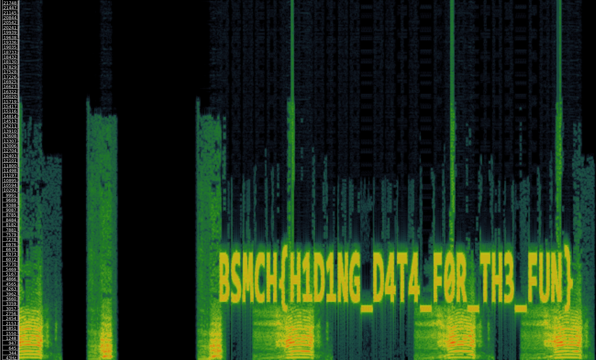

# Plague of Livestock

## Description

> > “‘Let My people go, that they may serve Me. For if you refuse to let them go, and still hold them, behold, the hand of the Lord will be on your cattle in the field, on the horses, on the donkeys, on the camels, on the oxen, and on the sheep—a very severe pestilence. And the Lord will make a difference between the livestock of Israel and the livestock of Egypt’”’” (Exodus 9:1-4).
> 
> You will be exploring the story of the mysterious death of cows that plagued Egypt. Pay close attention to the audio file provided, as hidden clues may be lurking within. Can you uncover the secrets hidden within and solve the challenge?

An MP3 file was attached.

## Solution

Listening to the file, we hear a few "Moo"s here and there, and eventually a weird set of noises close to the end. 

The metadata of the file is full of information, including some amusing paths, but nothing that helps us get the flag:

```console
┌──(user@kali)-[/media/sf_CTFs/basmach/Plague_of_livestock]
└─$ exiftool cattleplauge.mp3 | grep Path
Ingredients File Path           : cows_fucking_flag.wav, edited cow.mp3
Pantry Ingredients File Path    : Moo! Sound Effect [COW].wav
Pantry Windows Atom Unc Project Path: \\?\C:\Users\yarde\Desktop\bsmch.prproj
Windows Atom Unc Project Path   : \\?\C:\Users\yarde\Desktop\bsmch.prproj
```

The flag is revealed when we inspect the spectrogram, for example using [Sonic Visualiser](https://www.sonicvisualiser.org/):



The flag: `BSMCH{H1D1NG_D4T4_F0R_TH3_FUN}`