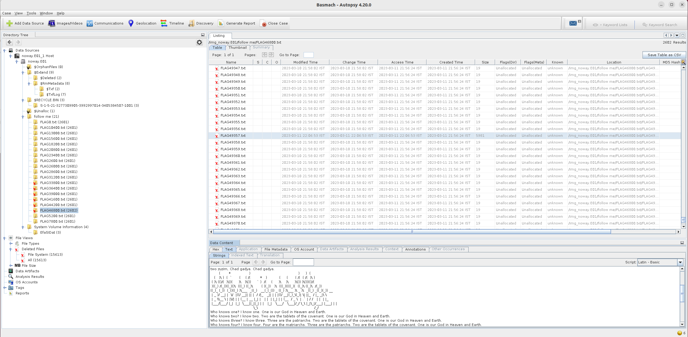

# Three Days of Darkness

## Description

> > “Then the Lord said to Moses, ‘Stretch out your hand toward heaven, that there may be darkness over the land of Egypt, darkness which may even be felt.’ So Moses stretched out his hand toward heaven, and there was thick darkness in all the land of Egypt three days” (Exodus 10:21-22).
> 
> Adjust your eyes for the darkness is here, Don't get lost, may the path will appear. Remember to search for what was vanished. You need to hurry in order to be banished.

An `E01` file was attached.

## Solution

What's an `E01` file?

> The E01 file extension stands for EnCase image file format used by EnCase software. The file is used to store digital evidence including volume images, disk image, memory and logical files.

We can use a tutorial such as [this one](https://dfir.science/2022/05/Linux-Forensics-on-Linux-Cyber5W-CTF-Walkthrough) to mount the image file on Linux and browse the different files, but all we can find is tons of `FLAGx.txt` files with false flag. If we open the image with `autopsy` on the other hand, we get access to additional deleted folders which weren't accessible previously:



The flag file is the only large file among them. The flag is displayed in ASCII art to prevent grepping for it:

```
       (       *               )                                       )     )  (         
   (   )\ )  (  `      (    ( /(        *   )          (     (      ( /(  ( /(  )\ )      
 ( )\ (()/(  )\))(     )\   )\())     ` )  /(    (     )\    )\     )\()) )\())(()/(      
 )((_) /(_))((_)()\  (((_) ((_)\       ( )(_))   )\  (((_)((((_)(  ((_)\ ((_)\  /(_))     
((_)_ (_))  (_()((_) )\___  _((_)   __(_(_()) _ ((_) )\___ )\ _ )\  _((_) _((_)(_)) __    
 | _ )/ __| |  \/  |((/ __|| || |  / /|_   _|| | | |((/ __|(_)_\(_)| \| ||_  / |_ _|\ \   
 | _ \\__ \ | |\/| | | (__ | __ |_| |   | |  | |_| | | (__  / _ \  | .` | / /   | |  | |_ 
 |___/|___/ |_|  |_|  \___||_||_| | |   |_|   \___/   \___|/_/ \_\ |_|\_|/___| |___| | |  
                                   \_\                                              /_/   
```

The flag: `BSMCH{TUCANZI}`