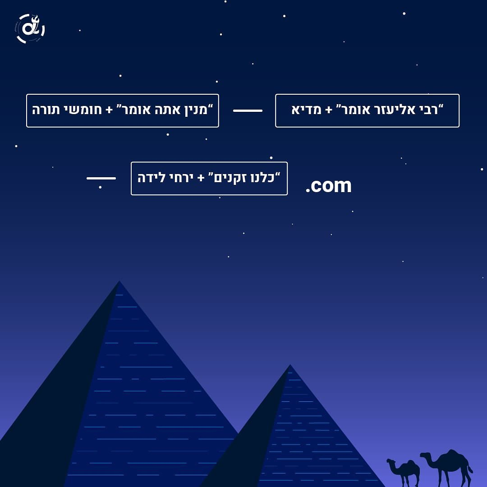

# Bashmach Alpha Passover Challenges - חידת בסמ"ח אלפא לפסח

## Riddle

Basmach Alpha released a nice set of challenges for Passover on their [Instagram channel](https://www.instagram.com/bsmch.alpha/).

In order to find the challenges, one must first solve the following [riddle](https://www.instagram.com/p/Cq0Q3LstINQ/):



Worked on the challenges with zVaz.

## Solution

The phrases in the image are taken from the Haggadah. 
Every part is composed of some opening words from a section in the Haggadah and a term that is related to a number from a known Passover song ([Echad Mi Yodea](https://en.wikipedia.org/wiki/Echad_Mi_Yodea)). 

Here is a wider context for the first part of each section:

```
מנין אתה אומר שלקו המצריים במצרים עשר מכות ועל הים לקו חמישים מכות

רבי אליעזר אומר: מנין שכל מכה ומכה שהביא הקדוש ברוך הוא על המצרים במצרים הייתה של ארבע מכות?

ואפלו כלנו חכמים, כלנו נבונים, כלנו זקנים, כלנו יודעים את התורה, מצוה עלינו לספר ביציאת מצרים
```

And for the second part:

```
שלושה עשר מדיא, <--
שנים עשר שבטיא,
אחד עשר כוכביא, 
עשרה דבריא,
תשעה ירחי לידה, <--
שמונה ימי מילה,
שבעה ימי שבתא, 
שישה סדרי משנה,
חמישה חומשי תורה, <--
ארבע אימהות,
שלושה אבות, 
שני לוחות הברית.
אחד אלוהינו שבשמיים ובארץ.
```

So how do we solve the riddle? We take the sentance from the first part, and advance `n` words based on the second part to get:

```
מנין אתה אומר + 5 = מכות
רבי אליעזר אומר + 13 = של
כלנו זקנים + 9 = מצרים
```

Translate it to English and convert to a domain according to the template in the riddle to get [plagues-of-egypt.com](https://plagues-of-egypt.com/).

The website contained 10 challenges, on for each of the plagues of Egypt.

An official solution for the introduction riddle was later published as [an additional post](https://www.instagram.com/p/Cq27UeGN1YQ/) in the Instagram channel.