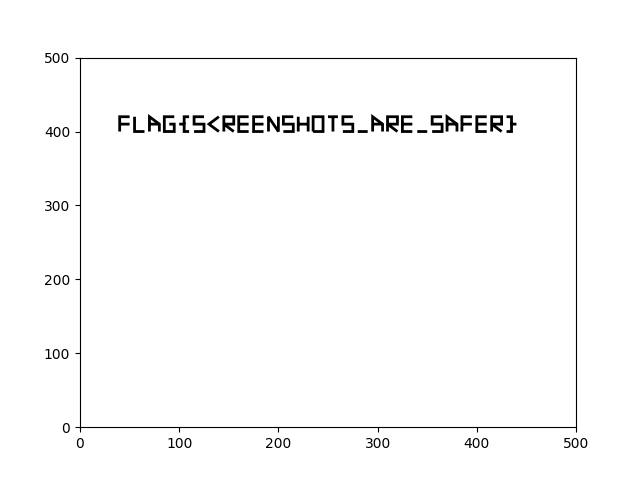

# 1988

## Intro

Ghostscript is a free and open-source software suite for rendering PostScript and PDF files. 
It was originally written by L. Peter Deutsch for the GNU Project, and released under the 
GNU General Public License in 1988.

## Challenge 0

> You got an email with some very important documents attached.
> Unfortunately, the most intriguing parts have been redacted.
> Is it lost for good, or can you still get these secrets?

We can open the document and use `CTRL-A, CTRL-C` to select all text and copy it to the clipboard.
This includes also the "redacted" text.

Alternatively, we can use `pdftotext`:

```console
┌──(user@kali)-[/media/sf_CTFs/google/1988/0]
└─$ pdftotext 1988challenge0.pdf -
The flag is
FLAG{ctr1_c_ctr1_v}
```

## Challenge 1

> Your sources learned their lesson, and redacted the sensitive data properly this time.
> Or did they? 

The previous trick doesn't work anymore:

```console
┌──(user@kali)-[/media/sf_CTFs/google/1988/1]
└─$ pdftotext 1988challenge1.pdf -
The flag is
oh no it didn’t work this time
```

There are programs that allow inspecting the internals of PDF files, such as `qpdf`:

```console
┌──(user@kali)-[/media/sf_CTFs/google/1988/1]
└─$ qpdf --qdf 1988challenge1.pdf -
%PDF-1.7
%����
%QDF-1.0

%% Original object ID: 2 0
1 0 obj
<<
  /Pages 2 0 R
  /Type /Catalog
>>
endobj

%% Original object ID: 1 0
2 0 obj
<<
  /Count 1
  /Kids [
    3 0 R
  ]
  /MediaBox [
    0
    0
    595
    842
  ]
  /Resources <<
    /Font <<
      /F1 <<
        /BaseFont /Courier
        /Subtype /Type1
        /Type /Font
      >>
    >>
    /ProcSet [
      /PDF
      /Text
    ]
  >>
  /Type /Pages
>>
endobj

%% Page 1
%% Original object ID: 7 0
3 0 obj
<<
  /Contents 4 0 R
  /Parent 2 0 R
  /Type /Page
>>
endobj

%% Original object ID: 6 0
4 0 obj
[
  5 0 R
  7 0 R
  9 0 R
]
endobj

%% Contents for page 1
%% Original object ID: 3 0
5 0 obj
<<
  /Length 6 0 R
>>
stream

    BT
        /F1 40 Tf
        20 500 Td
        (The flag is)'
        q 1 g
        10 -100 Td
        /F1 25 Tf
        (oh no it didn't work this time)'
        Q
    ET

endstream
endobj

%QDF: ignore_newline
6 0 obj
181
endobj

%% Contents for page 1
%% Original object ID: 4 0
7 0 obj
<<
  /Length 8 0 R
>>
stream
40 400 m 40 420 l 50 420 l S
40 410 m 50 410 l S
65 400 m 55 400 l 55 420 l S
70 400 m 70 420 l 80 410 l 80 400 l S
70 410 m 80 410 l S
90 410 m 95 410 l 95 400 l 85 400 l 85 420 l 95 420 l S
110 400 m 105 400 l 105 410 l 100 410 l S
105 410 m 105 420 l 110 420 l S
115 400 m 125 400 l 125 410 l 115 410 l 115 420 l 125 420 l S
140 400 m 130 410 l 140 420 l S
145 400 m 145 420 l 155 420 l 155 410 l 145 410 l 155 400 l S
170 400 m 160 400 l 160 420 l 170 420 l S
160 410 m 170 410 l S
185 400 m 175 400 l 175 420 l 185 420 l S
175 410 m 185 410 l S
190 400 m 190 420 l 200 400 l 200 420 l S
205 400 m 215 400 l 215 410 l 205 410 l 205 420 l 215 420 l S
220 400 m 220 420 l S
220 410 m 230 410 l S
230 400 m 230 420 l S
235 400 m 235 420 l 245 420 l 245 400 l 235 400 l S
255 400 m 255 420 l S
250 420 m 260 420 l S
265 400 m 275 400 l 275 410 l 265 410 l 265 420 l 275 420 l S
280 400 m 290 400 l S
295 400 m 295 420 l 305 410 l 305 400 l S
295 410 m 305 410 l S
310 400 m 310 420 l 320 420 l 320 410 l 310 410 l 320 400 l S
335 400 m 325 400 l 325 420 l 335 420 l S
325 410 m 335 410 l S
340 400 m 350 400 l S
355 400 m 365 400 l 365 410 l 355 410 l 355 420 l 365 420 l S
370 400 m 370 420 l 380 410 l 380 400 l S
370 410 m 380 410 l S
385 400 m 385 420 l 395 420 l S
385 410 m 395 410 l S
410 400 m 400 400 l 400 420 l 410 420 l S
400 410 m 410 410 l S
415 400 m 415 420 l 425 420 l 425 410 l 415 410 l 425 400 l S
430 400 m 435 400 l 435 410 l 440 410 l S
435 410 m 435 420 l 430 420 l S
endstream
endobj

%QDF: ignore_newline
8 0 obj
1491
endobj

%% Contents for page 1
%% Original object ID: 5 0
9 0 obj
<<
  /Length 10 0 R
>>
stream
35 385 520 50 re f
endstream
endobj

%QDF: ignore_newline
10 0 obj
18
endobj

xref
0 11
0000000000 65535 f
0000000052 00000 n
0000000133 00000 n
0000000466 00000 n
0000000563 00000 n
0000000657 00000 n
0000000915 00000 n
0000000985 00000 n
0000002553 00000 n
0000002624 00000 n
0000002720 00000 n
trailer <<
  /Root 1 0 R
  /Size 11
  /ID [<d0d4210a345a1a1521d573b6227187cb><d0d4210a345a1a1521d573b6227187cb>]
>>
startxref
2740
%%EOF

```

What's that big stream of numbers in the middle of the output? According to ChatGPT:

> The text you provided appears to be a series of commands that define a path or shape in a 
> vector graphics format. These commands are often used in computer graphics and design 
> software to create shapes and drawings.
> Here's a breakdown of the commands you've provided:
> * "m" stands for "move to" and is used to set the starting point of a path.
> * "l" stands for "line to" and is used to draw straight lines from the current point to a new point.
> * "S" appears to be used as some sort of path completion or shape closure command.
>
> Each line represents a set of coordinates and commands. For example, "40 400 m" means to move 
> to the point (40, 400), and "40 420 l" means to draw a line from the current point to (40, 420), and so on.

ChatGPT can even write a Python script to interpret the coordinates (brought here with some slight corrections):

```python
import matplotlib.pyplot as plt
from matplotlib.path import Path
import matplotlib.patches as patches

# Define the drawing format
drawing_format = """
40 400 m 40 420 l 50 420 l S
40 410 m 50 410 l S
65 400 m 55 400 l 55 420 l S
70 400 m 70 420 l 80 410 l 80 400 l S
70 410 m 80 410 l S
90 410 m 95 410 l 95 400 l 85 400 l 85 420 l 95 420 l S
110 400 m 105 400 l 105 410 l 100 410 l S
105 410 m 105 420 l 110 420 l S
115 400 m 125 400 l 125 410 l 115 410 l 115 420 l 125 420 l S
140 400 m 130 410 l 140 420 l S
145 400 m 145 420 l 155 420 l 155 410 l 145 410 l 155 400 l S
170 400 m 160 400 l 160 420 l 170 420 l S
160 410 m 170 410 l S
185 400 m 175 400 l 175 420 l 185 420 l S
175 410 m 185 410 l S
190 400 m 190 420 l 200 400 l 200 420 l S
205 400 m 215 400 l 215 410 l 205 410 l 205 420 l 215 420 l S
220 400 m 220 420 l S
220 410 m 230 410 l S
230 400 m 230 420 l S
235 400 m 235 420 l 245 420 l 245 400 l 235 400 l S
255 400 m 255 420 l S
250 420 m 260 420 l S
265 400 m 275 400 l 275 410 l 265 410 l 265 420 l 275 420 l S
280 400 m 290 400 l S
295 400 m 295 420 l 305 410 l 305 400 l S
295 410 m 305 410 l S
310 400 m 310 420 l 320 420 l 320 410 l 310 410 l 320 400 l S
335 400 m 325 400 l 325 420 l 335 420 l S
325 410 m 335 410 l S
340 400 m 350 400 l S
355 400 m 365 400 l 365 410 l 355 410 l 355 420 l 365 420 l S
370 400 m 370 420 l 380 410 l 380 400 l S
370 410 m 380 410 l S
385 400 m 385 420 l 395 420 l S
385 410 m 395 410 l S
410 400 m 400 400 l 400 420 l 410 420 l S
400 410 m 410 410 l S
415 400 m 415 420 l 425 420 l 425 410 l 415 410 l 425 400 l S
430 400 m 435 400 l 435 410 l 440 410 l S
435 410 m 435 420 l 430 420 l S
"""

# Parse the drawing format and create a Path
commands = drawing_format.strip().split('\n')
vertices = []
codes = []
for command in commands:
    parts = command.split()
    for i in range(0, len(parts), 3):
        if  parts[i] == 'S':
            break
        x, y = float(parts[i]), float(parts[i + 1])
        vertices.append((x, y))
        if parts[i+2] == 'm':
            codes.append(Path.MOVETO)
        elif parts[i+2] == 'l':
            codes.append(Path.LINETO)

path_data = Path(vertices, codes)
path_patch = patches.PathPatch(path_data, facecolor='none', lw=2)

# Create the plot
fig, ax = plt.subplots()
ax.add_patch(path_patch)
ax.set_xlim(0, 500)
ax.set_ylim(0, 500)
plt.savefig('output.png')
```

The result:



The flag: `FLAG{SCREENSHOTS_ARE_SAFER}`

## Challenge 2

> It's a busy day, and after getting another file, you immediately send it 
> to printer  without even looking inside. After some time you still can hear
> printer humming. You got a lot of paperwork to review.
                                                      
Let's see what we have here:

```console
┌──(user@kali)-[/media/sf_CTFs/google/1988/2]
└─$ pdftotext 1988challenge2.pdf
Syntax Error: Page count (133713) larger than number of objects (33)
Command Line Error: Wrong page range given: the first page (1) can not be after the last page (0).
```

The page count is totally off. Under the hood, a PDF file is represented in text format:

```console
┌──(user@kali)-[/media/sf_CTFs/google/1988/2]
└─$ cat 1988challenge2.pdf | head
%PDF-1.7
1 0 obj
<<
  /Count 133713
  /Kids [ 5 0 R 11 0 R 21 0 R 22 0 R ]
  /MediaBox [ 0 0 595 842 ]
  /Resources <<
    /Font <<
      /F1 <<
        /BaseFont /Courier
```

We can see the incorrect page count. Using a text editor, we can fix it:

```console
┌──(user@kali)-[/media/sf_CTFs/google/1988/2]
└─$ diff 1988challenge2.pdf 1988challenge2_fixed.pdf
4c4
<   /Count 133713
---
>   /Count 33
```

Now the PDF can open correctly, but doesn't really contain much:

```console
┌──(user@kali)-[/media/sf_CTFs/google/1988/2]
└─$ pdftotext 1988challenge2_fixed.pdf - | sed -r 's/^\s*(.*\S)*\s*$/\1/;/^$/d' | sort | uniq -c
     33 intentionally
     33 left blank
     33 This page
```

And `qpdf` still can't parse it nicely due to other errors:

```console
┌──(user@kali)-[/media/sf_CTFs/google/1988/2]
└─$ qpdf --qdf 1988challenge2_fixed.pdf -
WARNING: 1988challenge2_fixed.pdf: file is damaged
WARNING: 1988challenge2_fixed.pdf (offset 4085): xref not found
WARNING: 1988challenge2_fixed.pdf: Attempting to reconstruct cross-reference table
WARNING: 1988challenge2_fixed.pdf, object 7 0 at offset 1166: kid 1 (from 0) appears more than once in the pages tree; creating a new page object as a copy
WARNING: 1988challenge2_fixed.pdf, object 7 0 at offset 1166: kid 2 (from 0) appears more than once in the pages tree; creating a new page object as a copy
WARNING: 1988challenge2_fixed.pdf, object 7 0 at offset 1166: kid 3 (from 0) appears more than once in the pages tree; creating a new page object as a copy
WARNING: 1988challenge2_fixed.pdf, object 7 0 at offset 1166: kid 4 (from 0) appears more than once in the pages tree; creating a new page object as a copy
WARNING: 1988challenge2_fixed.pdf, object 7 0 at offset 1166: kid 5 (from 0) appears more than once in the pages tree; creating a new page object as a copy
WARNING: 1988challenge2_fixed.pdf, object 7 0 at offset 1166: kid 6 (from 0) appears more than once in the pages tree; creating a new page object as a copy
WARNING: 1988challenge2_fixed.pdf, object 7 0 at offset 1166: kid 7 (from 0) appears more than once in the pages tree; creating a new page object as a copy
qpdf: 1988challenge2_fixed.pdf (object 32 0): Loop detected in /Pages structure (getAllPages)
```

A different utility called `peepdf` let's us iterate the raw objects one by one and view their contents. Here's what we get for the forth object:

```console
┌──(user@kali)-[/media/sf_CTFs/google/1988/2]
└─$ python2 ~/utils/forensics/peepdf/peepdf.py -C "object 4" 1988challenge2_fixed.pdf

<< /Length 127
/Filter [ /ASCII85Decode /FlateDecode ] >>
stream
xZ��
    BT
        /F1 20 Tf
        10 400 Td
        (FLAG{m4k3s_j4ck_4_du11_b0y})Tj
    ET��
endstream
```

In theory we could have decoded the raw object manually as well (e.g. using [CyberChef](https://gchq.github.io/CyberChef/#recipe=From_Base85('!-u',true,'z')Zlib_Inflate(0,0,'Adaptive',false,false)&input=R1FAaEshMl1dJis8VmRMNjwiOjcrPFZkTCs8VmRbN1BRI0AwSGE%2BLCQ2VUg2KzxWZEwrPkdQbTFiXlUrPCtIPVkrPFZkTCs8VmRUN1NIKjxIWWtUVDFOUW88MWgxPC4xZ2FkOTBlbSRFMFI4J3E8LClhXys8VmRxPDsrZlRMJg)):

```
4 0 obj
<<
  /Filter [ /ASCII85Decode /FlateDecode ]
  /Length 127
>>
stream
GQ@hK!2]]&+<VdL6<":7+<VdL+<Vd[7PQ#@0Ha>,$6UH6+<VdL+>GPm1b^U+<+H=Y+<VdL+<VdT7SH*<HYkTT1NQo<1h1<.1gad90em$E0R8'q<,)a_+<Vdq<;+fTL&
endstream
endobj
```

## Challenge 3

> WHY HAS MY BROWSER TAB CRASHED!?

We get a PDF containing an object with 50000 Deflate decodes:

```
4 0 obj
<<
  /Filter [ /ASCII85Decode /FlateDecode < ... 49998 more FlateDecodes ... > /FlateDecode ]
  /Length 912572
>>
```

None of the existing scripts can handle it in a reasonable time, but we can write a Python
script to decode it:

```python
import base64
import zlib

buffer = r""" < copy the encoded buffer from the PDF > """.strip()
decoded = base64.a85decode(buffer)

for i in range(50000):
    decoded = zlib.decompress(decoded)

print(decoded.decode('ascii'))
```

Output:

```console
┌──(user@kali)-[/media/sf_CTFs/google/1988/3]
└─$ python3 solve.py

    BT
        /F1 30 Tf
        10 400 Td
        (FLAG{4cc1d3Nt411y_qU4dR471c})Tj
    ET

```

