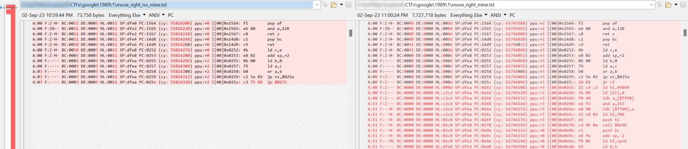

# 1989

## Intro

The Game Boy is an 8-bit, handheld game console from Nintendo that was released in 1989. 
It has a 160x144 pixel monochrome LCD screen, two buttons on the left side (A and B) 
and a directional pad in the center. There is also a power button on top and an audio jack 
on the bottom. Games are stored on cartridges that are inserted into the top of the console.

## Challenge 0

> I'm stuck in this box and could really use your help. I know the flag is out there 
> somewhere, I have a vague memory of seeing it. Can you find it for me please?  
> FLAG FORMAT: "FLAG: example_flag"                     

A GameBoy game was attached.  
There are several emulators which allow running GameBoy games and/or inspecting their
internals, such as their code, memory or VRAM (Video RAM). I used
[bgb](https://bgb.bircd.org/) to inspect the game contents, locating the flag in the VRAM:


The flag: `FLAG: Y4Y_1M_FR33`

## Challenge 1

> We have finally infiltrated into a mainframe. You need to get the dot to the other corner. 
> Unfortunately, the path is riddled with mines. But I figure a Hacker like you can find 
> a way around it?  
> FLAG FORMAT: "FLAG example"

Again, we got a GameBoy game. It was composed of a small figure located in the top-left
corner of the screen, which apparently needs to make it to the bottom right corner of the
screen without stepping on an invisible mine. For this challenge we'll need more than
just inspecting the VRAM.

`bgb` has a reasonable debugger, but the first challenge was to try and find a piece of
code that gets executed as a result of moving the figure, in order to inspect that
specific logic. It's likely that the movement logic will contain some reference to the location
of the mines.

To do that, I search for an emulator that has an instruction trace capability, and found
[this post](https://www.reddit.com/r/EmuDev/comments/5v34ql/is_there_a_decent_gameboy_emulator_that_can/),
leading me to [binjgb](https://github.com/binji/binjgb).

Using a command such as `./binjgb-debugger -t 1989challenge1.gb > trace.log` it was possible
to get a full instruction trace of the game execution. The program started with some initialization
code, and then entered some sort of idle loop, mainly composed of the following instructions 
(but every once in a while, some other code as well):

```asm
A:63 F:---- BC:3300 DE:0063 HL:dff5 SP:dfec PC:2c4d (cy: 753540) ppu:+0 |[00]0x2c4d: 18 00     jr +0          
A:63 F:---- BC:3300 DE:0063 HL:dff5 SP:dfec PC:2c4f (cy: 753552) ppu:+0 |[00]0x2c4f: 18 00     jr +0          
A:63 F:---- BC:3300 DE:0063 HL:dff5 SP:dfec PC:2c51 (cy: 753564) ppu:+0 |[00]0x2c51: 18 00     jr +0          
A:63 F:---- BC:3300 DE:0063 HL:dff5 SP:dfec PC:2c53 (cy: 753576) ppu:+0 |[00]0x2c53: 18 00     jr +0          
A:63 F:---- BC:3300 DE:0063 HL:dff5 SP:dfec PC:2c55 (cy: 753588) ppu:+0 |[00]0x2c55: 18 00     jr +0          
A:63 F:---- BC:3300 DE:0063 HL:dff5 SP:dfec PC:2c57 (cy: 753600) ppu:+0 |[00]0x2c57: 05        dec b          
A:63 F:-N-- BC:3200 DE:0063 HL:dff5 SP:dfec PC:2c58 (cy: 753604) ppu:+0 |[00]0x2c58: c2 4d 2c  jp nz,$2c4d    
```

The next step was to move the figure once and stop the trace. 
Now, if we remove the initialization code and filter the trace for instructions that were run
just once, we can isolate the movement code:

```console
$ cut -c 97- < trace3_end.log | sort | uniq -c | sort -n | grep " 1 " | grep call
      1 call $0200     
      1 call $0592     
      1 call $1470     
      1 call $147f     
      1 call $1498     
      1 call $14ac     
      1 call $14cf     
      1 call $1531     
      1 call $1572   
```

Searching for `call $0200` (for example) within the trace, we can locate a large set of 
instructions that gets executed when the player moves. But how do we identify when
the player is going to step on a mine?

To do that, I captured two traces - one for a right movement onto a blank spot, and one
for a right movement onto a mine. I compared both (isolating the relevant areas by searching for `call $0200` and extracting the code before and after it), and searched for the location where the traces dramatically diverge.



We can see that the dramatic divergence starts at `0x0259: c2 5e 02  jp nz,$025e`:
When there was no mine, we took the jump. When there was a mine, we proceeded.

We can test the theory with `bgb` by setting a breakpoint at `0x0259`. When we arrive
at that line and the `Z` flag (on the top right corner) isn't set, we continue execution to verify that there is no mine.


On the other hand, when we hit the breakpoint with the `Z` flag set, we continue execution and verify that there's a mine.


At this point, we can restart the experiment, and this time make sure we unset
the `Z` flag if it's set at the breakpoint location. Amazingly, the mine doesn't
go off this time. We can proceed with this strategy to guide our figure to the 
destination, or just patch the program, replacing `c2 5e 02  jp nz,$025e` with
`cc 5e 02  jp $025e` to always take the jump.

In both cases, we can safely arrive to the destination and receive our flag:


The flag: `FLAG GOOGLEBOYMINES`