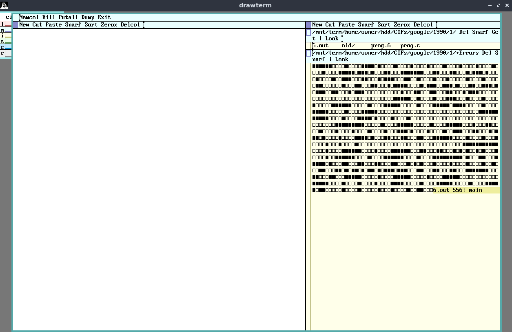

# 1990

## Intro

You've found a QEMU image with a pre-configured installation of 9front, a fork of the Plan9 operating system. 

## Challenge 0

> Hey we've got a disk image for you with this cool new OS called Plan9 installed on it. The shell script 
> provided will help you run it in QEMU and expose the right ports to your host machine.  Once you've got it
> running, you can log into it using drawterm-9front. Use the default Plan9 host owner name and password   
> 'welcome_to_the_machine'.  Remember, Plan9 is about namespaces, files and UTF-8. Now see if there is     
> something interesting on that disk...
> 
> HINT: Does anything stand out to you in your current namespace ('ns' command)?

We follow the instructions and run the attached QEMU with `./run.sh image.qcow2`, then install and run
`drawterm` with `./drawterm  -a localhost -h localhost -u glenda`. We login with the provided
details and get a shell:

```console
cpu% 
```

The hint said we should run `ns`:

```console
cpu% ns
bind  '#c' /dev 
bind  '#d' /fd 
bind -c '#e' /env 
bind  '#p' /proc 
bind -c '#s' /srv 
bind  '#σ' /shr 
bind -a '#¤' /dev 
bind -a '#¶' /dev 
mount -C /srv/boot /root 
mount -a /srv/boot / 
bind  / / 
mount -b /srv/factotum /mnt 
bind  /mnt /mnt 
mount -a /srv/slashn /n 
bind  /n /n 
mount -a /srv/slashmnt /mnt 
mount -a /srv/mntexport /mnt/exportfs 
bind  /mnt/exportfs /mnt/exportfs 
bind  /amd64/bin /bin 
bind  /root/rc /rc 
bind -a /rc/bin /bin 
bind -a '#l' /net 
bind  /net /net 
bind -a '#I' /net 
bind -a '#a' /net 
mount -a /srv/cs /net 
mount -a /srv/dns /net 
bind -c /usr/glenda/tmp /tmp 
mount -a /srv/beginnersquest / 
mount -c /net/tls/0/data /mnt/term 
mount -b '#|/data' /mnt/term/dev 
bind  /mnt/term/dev /mnt/term/dev 
bind -a /usr/glenda/bin/rc /bin 
bind -a /usr/glenda/bin/amd64 /bin 
bind  /mnt/term/dev/cons /dev/cons 
bind  /mnt/term/dev/consctl /dev/consctl 
mount -a '#|/data' /dev 
bind -a /mnt/term/dev /dev 
mount  '#|/data' /mnt/web 
mount  /srv/plumb.glenda.314 /mnt/plumb 
mount  /srv/rio.glenda.317 /mnt/wsys 1
mount -b /srv/rio.glenda.317 /dev 
cd /usr/glenda
```

The line that stands out is `mount -a /srv/beginnersquest / `, let's take a look:

```console
cpu% cd /srv/beginnersquest
Can't cd /srv/beginnersquest: '/srv/beginnersquest' not a directory
cpu% cd /
cpu% ls
/386
/68000
/68020
/acme
/adm
/amd64
/arm
/arm64
/beginnersquest
/bin
/boot
/cfg
/cron
/dev
/dist
/env
/fd
/lib
/mail
/mips
/mnt
/n
/net
/net.alt
/power
/power64
/proc
/rc
/rc
/root
/shr
/sparc
/sparc64
/spim
/srv
/sys
/tmp
/usr
cpu% cd beginnersquest
cpu% ls
ctl
```

What's `ctl`?

```console
cpu% cat ctl
echo begin > ctl ;)
```

Ok, let's do that:

```console
cpu% echo begin > ctl
cpu% ls
ctl
flag
```

Look at that, we got our first flag:

```console
cpu% cat flag
FLAG{h3ll0_n4m35p4c3!}
```

## Challenge 1


> Ok, you seem to have found the flag... but have you tried writing the flag back to ctl?

Let's write it back then:

```console
cpu% cat flag > ctl
cpu% ls
ctl
flag
ƒƚάģ
```

We got another file, let's dump it:

```console
cpu% cat ƒƚάģ
int W = 5, H = 7, o , O[] = {31, 1, 1, 15, 1, 1, 1, 1, 1, 1, 1, 1, 1, 31, 14, 17, 17, 31, 17, 17, 17, 14, 1, 1, 25, 17, 17, 14, 12, 2, 2, 1, 2, 2, 12, 0, 17, 17, 17, 30, 16, 14, 14, 17, 25, 21, 19, 17, 14, 0, 0, 17, 17, 17, 17, 14, 0, 0, 0, 0, 0, 0, 31, 4, 4, 14, 4, 4, 4, 24, 15, 16, 16, 15, 16, 16, 15, 15, 16, 16, 15, 16, 16, 15, 0, 0, 0, 0, 0, 0, 31, 31, 1, 1, 15, 1, 1, 1, 0, 0, 0, 0, 0, 0, 31, 15, 16, 16, 15, 16, 16, 15, 4, 6, 4, 4, 4, 4, 4, 14, 1, 1, 25, 17, 17, 14, 1, 1, 15, 17, 17, 17, 17, 31, 16, 16, 8, 8, 4, 4, 0, 0, 0, 0, 0, 0, 31, 31, 1, 1, 31, 1, 1, 31, 17, 17, 17, 10, 10, 4, 4, 31, 1, 1, 31, 1, 1, 31, 15, 17, 17, 15, 17, 17, 17, 17, 17, 10, 4, 4, 4, 4, 17, 17, 21, 21, 21, 27, 17, 17, 17, 17, 31, 17, 17, 17, 15, 16, 16, 15, 16, 16, 15, 0, 0, 30, 1, 1, 1, 1, 15, 16, 16, 15, 16, 16, 15, 3, 4, 4, 8, 4, 4, 3}, x[] = {1986356271, 1835229487, 791752549, 1869771365, 29554};int main(void) { if((o = open((char*)x, OWRITE)) , 0) return -1; for (int i = 0; i < sizeof(O)/sizeof(O[0]); i += H) for (int ii = 0; ii < H; ++ii) for(int iii = 0; iii < W; ++iii) fprint(o, "%C", (O[i+ii]>>iii)&1?0x25a0:0x25a1); return 0; }
```

Note that you can copy/paste from/to the terminal with the mouse's middle button (use `snarf` to copy, and `paste` to paste). 
That's useful when the filename has UTF, like ours does. An alternative is to use something like `ls | xargs cat` to avoid the UTF.

Anyway, we have a weird program to run:

```c
int W = 5, H = 7, o , 
   O[] = {31, 1, 1, 15, 1, 1, 1, 1, 1, 1, 1, 1, 1, 31, 14, 17, 17, 31, 17, 17, 17, 14, 1, 1, 25, 17, 17, 14, 12, 2, 2, 1, 2, 2, 12, 0, 17, 17, 17, 30, 16, 14, 14, 17, 25, 21, 19, 17, 14, 0, 0, 17, 17, 17, 17, 14, 0, 0, 0, 0, 0, 0, 31, 4, 4, 14, 4, 4, 4, 24, 15, 16, 16, 15, 16, 16, 15, 15, 16, 16, 15, 16, 16, 15, 0, 0, 0, 0, 0, 0, 31, 31, 1, 1, 15, 1, 1, 1, 0, 0, 0, 0, 0, 0, 31, 15, 16, 16, 15, 16, 16, 15, 4, 6, 4, 4, 4, 4, 4, 14, 1, 1, 25, 17, 17, 14, 1, 1, 15, 17, 17, 17, 17, 31, 16, 16, 8, 8, 4, 4, 0, 0, 0, 0, 0, 0, 31, 31, 1, 1, 31, 1, 1, 31, 17, 17, 17, 10, 10, 4, 4, 31, 1, 1, 31, 1, 1, 31, 15, 17, 17, 15, 17, 17, 17, 17, 17, 10, 4, 4, 4, 4, 17, 17, 21, 21, 21, 27, 17, 17, 17, 17, 31, 17, 17, 17, 15, 16, 16, 15, 16, 16, 15, 0, 0, 30, 1, 1, 1, 1, 15, 16, 16, 15, 16, 16, 15, 3, 4, 4, 8, 4, 4, 3}, 
   x[] = {1986356271, 1835229487, 791752549, 1869771365, 29554};

int main(void) { 
   if((o = open((char*)x, OWRITE)) , 0) return -1; 
      for (int i = 0; i < sizeof(O)/sizeof(O[0]); i += H) 
         for (int ii = 0; ii < H; ++ii) 
            for(int iii = 0; iii < W; ++iii) 
               fprint(o, "%C", (O[i+ii]>>iii)&1?0x25a0:0x25a1); 
   return 0; 
}
```

It has weird macros (`OWRITE`) and weird functions (`fprint`). It's possible to "fix" the program and run it using a modern C compiler but it turns
out that this program can be compiled on our Plan 9 environment almost as-is, so let's do that.

Searching for instructions on Plan 9 compilation, we find [this documentation](https://9p.io/sys/doc/comp.html).

> Each CPU architecture supported by Plan 9 is identified by a single, arbitrary, alphanumeric character: `k` for SPARC, `q` for 32-bit Power PC, `v` for MIPS, `0` for little-endian MIPS, `5` for ARM v5 and later 32-bit architectures, `6` for AMD64, `8` for Intel 386, and `9` for 64-bit Power PC. The character labels the support tools and files for that architecture. For instance, for the 386 the compiler is `8c`, the assembler is 8a, the link editor/loader is `8l`, the object files are suffixed `.8`, and the default name for an executable file is `8.out`. Before we can use the compiler we therefore need to know which machine we are compiling for. The next section explains how this decision is made; for the moment assume we are building 386 binaries and make the mental substitution for `8` appropriate to the machine you are actually using.  
To convert source to an executable binary is a two-step process. First run the compiler, `8c`, on the source, say `file.c`, to generate an object file `file.8`. Then run the loader, `8l`, to generate an executable `8.out` that may be run (on a 386 machine):
> 
> `8c file.c`  
> `8l file.8`  
> `8.out`

Which architecture are we using? Well, if we check the output from `ns` again, we'll find:

```
bind  /amd64/bin /bin 
bind -a /usr/glenda/bin/amd64 /bin 
```

So, we'll use `6`.

```console
cpu% 6c ƒƚάģ
<eof> cannot open ƒƚάģ.6 - 'ƒƚάģ.6' permission denied
cpu% echo test > 1.txt
/fd/0:30: > can't create: 1.txt: '1.txt' permission denied
```

It looks like we can't write to the current directory.
Luckily our host root is mounted at `/mnt/term` allowing us to write to the disk.

```console
cpu% cp ƒƚάģ /mnt/term/home/owner/hdd/CTFs/google/1990/1/prog.c
cpu% cd /mnt/term/home/owner/hdd/CTFs/google/1990/1/
cpu% 6c prog.c
prog.c:1 name not declared: OWRITE
prog.c:1 function not declared: fprint
```

We're getting closer. A bit more googling shows that we need to add the following header files to our program:

```c
#include <u.h>
#include <libc.h>
```

Now we are able to compile the program:

```console
cpu% 6c prog.c
cpu% 6l prog.6
cpu% 6.out
cpu% 
```

Well, nothing happens when we run it though. Let's figure out where it's supposed to write to. To do that, we'll evaluate `x` by adding the following line, which writes `x` to STDIO:

```c
fprint(1, "%s\n", (char*)x);
```

Output:

```console
cpu% 6c prog.c
cpu% 6l prog.6
cpu% 6.out
/dev/acme/1/errors
```

Do we have `/dev/acme/1/errors`?

```console
cpu% ls /dev/acme
ls: /dev/acme: '/dev/acme' './dev/acme' file does not exist
```

Some more googling shows that `acme` is a text editor that can run commands, and that `/dev/acme/1/errors` is created by the program when running a command through it. So, let's start `acme` and execute the (original) program through it:



We got lots of black and white squares. We could have guessed that, based on the following line:

```c
fprint(o, "%C", (O[i+ii]>>iii)&1?0x25a0:0x25a1); 
```

Unicode Character `0x25a0` is a [black square](https://unicodemap.org/details/0x25A0/index.html) and Unicode Character `0x25a1` is a [white square](https://unicodemap.org/details/0x25A1/index.html).

We can copy the squares to a modern text editor and replace them with zeroes and ones. Nothing meaningful happens when we try to interpret the output as binary, but what about pixels in a picture?

The output is exactly `1120` squares, a number that can produce multiple valid resolutions. We'll just have to check all:

```python
import math
from PIL import Image
import itertools

arr = """1111110000100001111010000100001000010000100001000010000100001000011111011101000110001111111000110001100010111010000100001001110001100010111000110010000100010000010000100000110000001000110001100010111100001011100111010001100111010111001100010111000000000001000110001100011000101110000000000000000000000000000000111110010000100011100010000100001000001111110000010000111110000010000111110111100000100001111100000100001111100000000000000000000000000000001111111111100001000011110100001000010000000000000000000000000000000000111111111000001000011111000001000011111000100011000010000100001000010000100011101000010000100111000110001011101000010000111101000110001100011000111111000010000100010000100010000100000000000000000000000000000000111111111110000100001111110000100001111110001100011000101010010100010000100111111000010000111111000010000111111111010001100011111010001100011000110001100010101000100001000010000100100011000110101101011010111011100011000110001100011111110001100011000111110000010000111110000010000111110000000000001111100001000010000100001111000001000011111000001000011111011000001000010000010001000010011000"""

MIN_DIMENSION_VAL = 3
BLACK = (0, 0, 0)
WHITE = (0xff, 0xff, 0xff)

# https://stackoverflow.com/questions/44061928/
def multipliers(m):
    yield (m, 1)

    finalVal = int(math.sqrt(m))
    increment = 2 if m % 2 != 0 else 1
    i = 3 if  m % 2 != 0 else 2

    while (i <= finalVal):
        if (m % i == 0):
            yield (m // i, i)

        i += increment

def get_next_color(arr):
    for x in arr:
        if x == "1":
            yield BLACK
        else:
            yield WHITE

for resolution in multipliers(len(arr)):
    if all(x > MIN_DIMENSION_VAL for x in resolution):
        for (width, height) in itertools.permutations(resolution):
            colors = get_next_color(arr)
            img = Image.new( 'RGB', (width, height), "black")
            pixels = img.load() 
            for i in range(img.size[1]):
                for j in range(img.size[0]):
                    pixels[j, i] = next(colors)
            img.save("output_{}_{}.png".format(width, height), "PNG")
```

Running this, we get all the following files:

```console
┌──(user@kali)-[/media/sf_CTFs/google/1990/1]
└─$ ls output_*
output_10_112.png  output_160_7.png  output_280_4.png  output_40_28.png  output_56_20.png  output_8_140.png
output_112_10.png  output_16_70.png  output_28_40.png  output_4_280.png  output_70_16.png
output_140_8.png   output_20_56.png  output_32_35.png  output_5_224.png  output_7_160.png
output_14_80.png   output_224_5.png  output_35_32.png  output_560_2.png  output_80_14.png
```

Here's `output_5_224.png` (enlarged):


That looks like a flag. A few tweaks to the script to separate the characters:

```python
resolution = (5, 224)
colors = get_next_color(arr)
img = Image.new( 'RGB', (resolution[0], resolution[1] + 100), "white")
pixels = img.load() 
j = 0
offset = 0
while j < resolution[1]:
    i = 0
    while i < resolution[0]:
        pixels[i, j + offset] = next(colors)
        i += 1

    j += 1
    if j % 7 == 0:
        offset += 2
img.save("output.png".format(resolution[0], resolution[1]), "PNG")
```

This gives us:


The flag: `FLAG{y0u_t33_F_31Gh7_EVERYWH3r3}`

## Challenge 2

> At this point you probably already know that something interesting will happen if you write the previous flag to ctl ;)

Let's do that:

```console
cpu% cd /beginnersquest
cpu% ls
ctl
flag
ƒƚάģ
cpu% echo FLAG'{y0u_t33_F_31Gh7_EVERYWH3r3}' > ctl
cpu% ls
ctl
distance
dpad
flag
look
ƒƚάģ
```

We got three new files:

```console
cpu% cat distance && echo
94.132885
cpu% cat dpad && echo
↑, ↓, ←, →

cpu% cat look && echo
▪▪▪ ▪▨▨
    ▪▨▨
▪▪▪ ▪▨▨
▪▪▪☺▪▨▨
▪▪▪ ▪▨▨
▪▪▪ ▪▨▨
▪▪▪ ▪▨▨
```

Is this a maze? Let's try moving by writing an arrow into `dpad`:

```console
cpu% echo ↑ > dpad
cpu% cat look && echo
▪▪▪ ▪▨▨
▪▪▪ ▪▨▨
    ▪▨▨
▪▪▪☺▪▨▨
▪▪▪ ▪▨▨
▪▪▪ ▪▨▨
▪▪▪ ▪▨▨
cpu% cat distance && echo
94.085068
```

We moved up! And the distance changed! Now how do we solve the maze?

Given that Plan 9 only supports a horrible shell called `rc` with a horrible and primitive scripting language, 
at first I tried to use a mostly manual approach by creating four files:

```bash
# -----------------------------------

# Filename: 8

#!/bin/rc

echo ↑ > /beginnersquest/dpad

cat /beginnersquest/distance && echo
cat /beginnersquest/look && echo

# -----------------------------------

# Filename: 6

#!/bin/rc

echo → > /beginnersquest/dpad

cat /beginnersquest/distance && echo
cat /beginnersquest/look && echo

# -----------------------------------

# Filename: 4

#!/bin/rc

echo ← > /beginnersquest/dpad

cat /beginnersquest/distance && echo
cat /beginnersquest/look && echo

# -----------------------------------

# Filename: 5

#!/bin/rc

echo ↓ > /beginnersquest/dpad

cat /beginnersquest/distance && echo
cat /beginnersquest/look && echo

# -----------------------------------
```

Using the numpad keys, it was possible to execute these script to move around the maze:

```console
cpu% 8
94.047860
▪▪▪ ▪▨▨
▪▪▪ ▪▨▨
▪▪▪ ▪▨▨
   ☺▪▨▨
▪▪▪ ▪▨▨
▪▪▪ ▪▨▨
▪▪▪ ▪▨▨

cpu% 4
93.048375
▪▪▪▪ ▪▨
▪▪▪▪ ▪▨
▪▪▪▪ ▪▨
   ☺ ▪▨
▪▪▪▪ ▪▨
▪▪▪▪ ▪▨
▪▪▪▪ ▪▨

cpu% 4
92.048900
▪▪▪▪▪ ▪
▪▪▪▪▪ ▪
▪▪▪▪▪ ▪
   ☺  ▪
▪▪▪▪▪ ▪
▪▪▪▪▪ ▪
▪▪▪▪▪ ▪
```

However the maze was too big, and it was impossible to solve manually. 
On the other hand, automating a full maze solver with the available scripting language
was unrealistic. 

I ended up implementing a bare-bones "agent" on the guest, communicating with the host
via files written to the shared mount. On the host, I ran a Python script that read the incoming
files, parsed them and wrote a command to an outgoing file to be executed by the agent.

The agent code:

```bash
#!/bin/rc

cat /beginnersquest/distance && echo
cat /beginnersquest/look && echo

cat /beginnersquest/distance >> log.txt
echo >> log.txt
cat /beginnersquest/look >> log.txt
echo >> log.txt

while() {
    if (test -f direction.txt) {

        dir=`{cat direction.txt}
        echo $dir
        switch($dir){
            case up
                echo ↑ > /beginnersquest/dpad
                rm direction.txt
            case down
                echo ↓ > /beginnersquest/dpad
                rm direction.txt
            case left
                echo ← > /beginnersquest/dpad
                rm direction.txt
            case right
                echo → > /beginnersquest/dpad
                rm direction.txt
            case exit
                echo "Exit!"
                exit
        }

        cat /beginnersquest/distance && echo
        cat /beginnersquest/look && echo

        cat /beginnersquest/distance >> log.txt
        echo >> log.txt
        cat /beginnersquest/look >> log.txt
        echo >> log.txt

    }
    if not
    {
        echo "Waiting for command"
        sleep 1
    }

}
```

The main logic:

```python
import time
from typing import Iterator
from pathlib import Path

CWD = Path(__file__).resolve().parent

# https://stackoverflow.com/questions/12523044/
def follow(file, sleep_sec=0.1) -> Iterator[str]:
    """ Yield each line from a file as they are written.
    `sleep_sec` is the time to sleep after empty reads. """
    line = ''
    while True:
        tmp = file.readline()
        if tmp is not None:
            line += tmp
            if line.endswith("\n"):
                yield line
                line = ''
        elif sleep_sec:
            time.sleep(sleep_sec)

location = [0, 0]
maze = dict()
stack = []
visited = set()

def opposite(move):
    return {
        "up": "down",
        "down": "up",
        "left": "right",
        "right": "left"
    }[move]

def move_to(where):
    print(f"Moving {where}")
    with open(CWD / "direction.txt", 'w') as file:
        file.write(where)

def handle_state(lines):    
    hero = (None, None)
    print(f"Distance: {lines[0]}")
    for row, line in enumerate(lines[1:]):
        for col, tile in enumerate(line):
            r = row + location[0]
            c = col + location[1]

            if tile in ["▪", " ", "▨", "◁"]:
                if (r, c) in maze:
                    assert (maze[(r, c)] == tile)
                else:
                    maze[(r, c)] = tile
            elif tile == "☺":
                hero = (r, c)

    visited.add(hero)
    print(f"Hero is at {hero}")

    moved = False
    for dr, dc, move in [(1, 0, "down"), (-1, 0, "up"), (0, 1, "right"), (0, -1, "left")]:
        new_r, new_c = hero[0] + dr, hero[1] + dc
        if maze[(new_r, new_c)] == " " and (new_r, new_c) not in visited:
            move_to(move)
            stack.append((-1 * dr, -1 * dc, opposite(move)))
            location[0] += dr
            location[1] += dc
            moved = True
            break
        elif maze[(new_r, new_c)] == "◁":
            move_to(move)
            move_to("exit")
            raise StopIteration("Found it!")

    if not moved:
        if len(stack) > 0:
            dr, dc, backtrack = stack.pop()
            move_to(backtrack)
            location[0] += dr
            location[1] += dc
        else:
            raise RuntimeError("Stuck!")

NUM_LINES_PER_STATE = 8

if __name__ == '__main__':
    try:
        with open(CWD / "log.txt", 'r+') as file:
            file.truncate(0)
            log = []
            for line in follow(file):
                line = line.strip("\n")
                if line != "":
                    log.append(line)
                    if len(log) == NUM_LINES_PER_STATE:
                        handle_state(log)
                        log = []
    except StopIteration:
        pass


```

We start by running the python script on the host, then the shell script on the guest.
For some reason we need to hold `PageDown` on the guest console to make it run. It might
take a while, but eventually we get the flag:

```
up
5.385165
▪▪▪ ▪▪▪
▪▪▪ ▪▪▪
▪▪▪ ▪▪▪
▪▪▪☺▪▪▪
▪▪▪ ▪▪▪
▪▪▪ ▪▪▪
▪▪▪ ▪▪▪

up
4.472136
▪▪▪    
▪▪▪ ▪▪▪
▪▪▪ ▪▪▪
▪▪▪☺▪▪▪
▪▪▪ ▪▪▪
▪▪▪ ▪▪▪
▪▪▪ ▪▪▪

up
3.605551
▪▪▪▪▪◁ 
▪▪▪    
▪▪▪ ▪▪▪
▪▪▪☺▪▪▪
▪▪▪ ▪▪▪
▪▪▪ ▪▪▪
▪▪▪ ▪▪▪

up
2.828427
▪▪▪▪▪  
▪▪▪▪▪◁ 
▪▪▪    
▪▪▪☺▪▪▪
▪▪▪ ▪▪▪
▪▪▪ ▪▪▪
▪▪▪ ▪▪▪

up
2.236068
▪▪▪▪▪▪▪
▪▪▪▪▪  
▪▪▪▪▪◁ 
▪▪▪☺   
▪▪▪ ▪▪▪
▪▪▪ ▪▪▪
▪▪▪ ▪▪▪

right
1.414214
▪▪▪▪▪▪▪
▪▪▪▪   
▪▪▪▪◁  
▪▪ ☺   
▪▪ ▪▪▪▪
▪▪ ▪▪▪▪
▪▪ ▪▪▪▪

right
1.000000
▪▪▪▪▪▪▪
▪▪▪   ▪
▪▪▪◁  ▪
▪  ☺  ▪
▪ ▪▪▪▪▪
▪ ▪▪▪▪▪
▪ ▪▪▪▪▪


up
1463.598647
▪▪▪▪▪▪▪
▪▪▪▪▪▪▪
▪▪▪   ▪
▪▪▪☺  ▪
▪     ▪
▪ ▪▪▪▪▪
▪ ▪▪▪▪▪

exit
"Exit!"
```

The flag:

```console
cpu% cat /beginnersquest/ctl
Congratulations!
You've completed all levels of the challenge.
cpu% cat /beginnersquest/flag
FLAG{n07_r0uG3_3n0Ugh_4_n37H4CK}
```